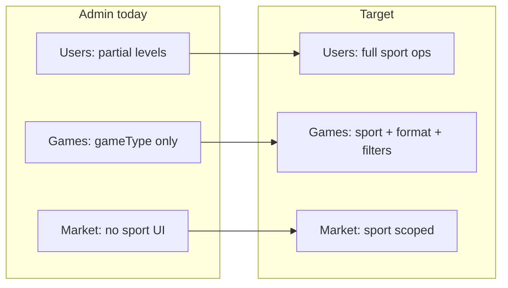

# Admin dashboard — multisport alignment plan

Companion to [`PLAN_MULTISPORT.md`](./PLAN_MULTISPORT.md), [`PLAN_MULTISPORT_QUESTIONNAIRES.md`](./PLAN_MULTISPORT_QUESTIONNAIRES.md) §19, [`PLAN_CASUAL_MULTISPORT_UX.md`](./PLAN_CASUAL_MULTISPORT_UX.md), and [`PLAN_MULTISPORT_RATINGS_FORMATS_IMPLEMENTATION.md`](./PLAN_MULTISPORT_RATINGS_FORMATS_IMPLEMENTATION.md).

**Scope:** Internal **standalone Admin** app (`Admin/` — vanilla HTML/JS served separately from the React frontend). **Out of scope:** in-app **club admin** (`Frontend/src/pages/clubAdmin/`) unless noted as a follow-up.

**North star:** Support and ops can inspect and fix multisport accounts and games without raw DB access. Labels match app semantics (sport-first, no padel-only “level”, social vs match readable at a glance).

**Last updated:** 2026-05-28

**Contents:** [Baseline](#1-current-baseline) · [Principles](#2-principles) · [Gaps](#3-gap-analysis) · [Users](#4-users) · [Games](#5-games) · [Marketplace](#6-market-categories) · [Other pages](#7-other-admin-pages) · [Backend API](#8-backend-api) · [Shared helpers](#9-shared-labels-and-registry) · [Phases](#10-implementation-phases) · [QA](#11-qa) · [Out of scope](#12-out-of-scope) · [Related code](#13-related-code)

---

## 1. Current baseline

| Area | What exists today | Multisport gap |
|------|-------------------|----------------|
| **Users list** | Column “Levels” = `sportProfiles` summary (`PADEL: 3.5, …`) | No `primarySport`, `sportsEnabled`, questionnaire state |
| **User edit** | `renderUserSportProfilesEditor` — level inputs for **existing** profiles only | Cannot add/remove sport; create defaults padel-only; raw enum labels |
| **User detail** | Phone, city, levels summary, games summary | Thin vs support needs |
| **Games list** | Name, organizer, type badge (`gameType` / entity), status, results | **No `sport`**, no `scoringPreset`, no social/match signal |
| **Game modal** | Entity type, `gameType`, `affectsRating`, participants | Missing sport, preset, `playersPerMatch`, timer, generation type; participant **padel** `user.level` only |
| **Invites** | `gameType` badge on linked game | No sport / format summary |
| **Market categories** | Name, order, active | BE has `sport`; **Admin UI omits field** (P6-E-1 incomplete in UI) |
| **Stats / mass notifications** | City filter only | No sport dimension |
| **Leagues** | — | No admin UI; `LeagueSeason.sport` invisible |
| **Branding** | 🎾 “Bandeja” everywhere | Reads padel-only |

Backend already exposes multisport on core models (`Game.sport`, `UserSportProfile`, `User.sportsEnabled`, `User.primarySport`). Admin **under-displays** data the API often already returns.

---

## 2. Principles

| Rule | Meaning |
|------|--------|
| **Sport is primary metadata** | Every game row and detail leads with sport, then format label, then rotation `gameType` if relevant. |
| **Same words as the app** | Preset labels must not confuse ball-budget `POINTS_21` (badminton social) with match `BEST_OF_3_21`. Reuse `gameFormatI18n` rules when `PresetTier` ships. |
| **Per-sport level in game context** | In a badminton game, show the user’s badminton profile level, not legacy `User.level` (padel mirror). |
| **No global sport switcher** | Admin filters per page are fine; no “app mode” toggle ([`PLAN_MULTISPORT.md`](./PLAN_MULTISPORT.md)). |
| **Inspect + support, not recreate Create Game** | Admin does not rebuild `GameFormatWizard`; optional read-only deep fields only. |
| **Questionnaire reset is admin-owned** | Per [`PLAN_MULTISPORT_QUESTIONNAIRES.md`](./PLAN_MULTISPORT_QUESTIONNAIRES.md) §19 — must be callable without impersonating the user. |
| **Registry-driven allowlists** | Sport list, preset names, and “can use Americano” come from `sportRegistry.ts` — do not hardcode divergent lists in `Admin/app.js`. |

---

## 3. Gap analysis (summary)



| Priority | Workstream | Support impact |
|----------|------------|----------------|
| **P0** | Games: display + filter sport & format | Wrong-format tickets, league debugging |
| **P0** | Users: questionnaire reset + full profile panel | Onboarding / rating disputes |
| **P1** | Market categories `sport` field | Marketplace per sport (P6-E) |
| **P1** | Participant per-sport levels in game modal | Fairness / join band disputes |
| **P2** | `primarySport`, `sportsEnabled`, add/remove sport | Account setup mistakes |
| **P2** | Stats & mass notification sport filters | Targeted comms |
| **P3** | Tier/template labels when D0/C0 ships | Social vs match copy parity |
| **P3** | League season read-only admin | Season sport visibility |

---

## 4. Users

### 4.1 Read — user list & detail

**List columns (add / change):**

| Column | Source | Notes |
|--------|--------|-------|
| Primary sport | `user.primarySport` | Human label |
| Levels | `sportProfiles` | Keep compact `Sport: level` |
| Sports enabled | `user.sportsEnabled` | Badge list or count |
| Questionnaire | Derived | e.g. `3/6 complete` or icon per sport |

**User detail modal** — expand to a **sport profiles table**:

| Column | Field |
|--------|--------|
| Sport | `sport` (label) |
| Level | `level` |
| Games | `gamesPlayed` / `gamesWon` |
| Source | `levelSource` |
| Questionnaire | `questionnaireCompletedAt` / `questionnaireSkippedAt` |
| Version | `questionnaireVersion` |
| Reliability | `reliability` (optional column) |

Also show: `primarySport`, `sportsEnabled`, `lastCreatedSport` (read-only), legacy `user.level` with tooltip “Padel mirror / legacy — prefer sport profiles”.

### 4.2 Edit — sport profiles

| Capability | Behavior |
|------------|----------|
| Edit level | Existing inputs; clamp 1.0–7.0; set `levelSource: MANUAL` (BE already on admin update path) |
| Add sport | Dropdown of `Sport` enum minus already present; default level 1.0 |
| Remove sport | Confirm; align with app rules (no remove if games exist — mirror `removeSport` or admin override flag) |
| Set primary | Dropdown `primarySport` ∈ `sportsEnabled` |
| Edit enabled sports | Multi-select `sportsEnabled` |

**Create user:** initial `primarySport`, `sportsEnabled`, and levels for selected sports (not padel-only default row).

### 4.3 Questionnaire reset (required)

Per [`PLAN_MULTISPORT_QUESTIONNAIRES.md`](./PLAN_MULTISPORT_QUESTIONNAIRES.md) §19:

| Action | Effect |
|--------|--------|
| Reset questionnaire (sport X) | Clear `questionnaireCompletedAt`; optional clear `questionnaireSkippedAt` |
| Reset level to 1.0 | Only if `gamesPlayed === 0` (checkbox default on) |
| Reset welcome (padel) | Thin wrapper → reset padel questionnaire (replaces user-only `resetWelcomeScreen` for support) |

**UI:** per-row button “Reset questionnaire” in sport table; confirm dialog with options.

**API (new):** `POST /admin/users/:userId/sports/:sport/questionnaire/reset`  
Body: `{ resetLevelIfNoGames?: boolean }`  
Implementation: delegate to `resetSportQuestionnaire` in `sportQuestionnaire.service.ts` (same as user route, admin auth).

### 4.4 Merge users

| Change | Reason |
|--------|--------|
| Search results show per-sport levels | `userMerge.service` merges profiles by sport — support must preview |
| Post-merge summary | List merged sports + max level rule |

Today `merge-users.js` shows only `user.level` in parentheses.

### 4.5 Online users

Replace single “Level” column with `primarySport` + level or multisport summary (same formatter as users list).

### 4.6 Filters (P2)

- `primarySport`
- Has sport profile / questionnaire incomplete for sport X
- `sportsEnabled` contains sport

---

## 5. Games

### 5.1 List

**New columns:**

| Column | Field | Display |
|--------|-------|---------|
| Sport | `game.sport` | Human label + optional icon |
| Format | `scoringPreset`, `scoringMode`, tier (future) | e.g. “Social · 21 balls” / “Match · Bo3×21” |
| Type | `gameType` | Rotation: AMERICANO, MEXICANO, … |
| Rated | `affectsRating` | Yes / No badge |
| Match size | `playersPerMatch` | 2 or 4 |

**Change:** retire using `getEntityLabel(entityType, gameType)` alone as the “type” column for `entityType === GAME`; keep entity badges for BAR, TRAINING, TOURNAMENT, LEAGUE.

**Filters:**

| Filter | Param |
|--------|--------|
| Sport | `sport` |
| Affects rating | `affectsRating` |
| Scoring preset | `scoringPreset` |
| Game type | `gameType` |
| Entity type | existing `entityType` |
| Status / results / dates | existing |

Extend `AdminGamesService.getAllGames` `where` clause.

### 5.2 Detail modal

Add read-only fields under **Game settings** (or new **Format** section):

| Field | Notes |
|-------|--------|
| `sport` | |
| `scoringPreset` | Raw + human label |
| `scoringMode` | CLASSIC / POINTS |
| `playersPerMatch` | |
| `matchGenerationType` | |
| `matchTimerEnabled`, `matchTimedCapMinutes` | Social track |
| `hasGoldenPoint`, `ballsInGames` | Padel |
| `fixedNumberOfSets`, `maxTotalPointsPerSet` | When preset uses custom caps |
| Future `createTemplateId` | When templates ship (C0) |

**Format summary line** (title or subtitle):

```text
{Sport} · {Tier/format label} · {gameType if rotation}
```

Examples:

- `Badminton · Social · 21 balls · AMERICANO`
- `Padel · Match · Best of 3 sets · CLASSIC`
- `Pickleball · Match · Game to 11, Bo3 · CLASSIC`

### 5.3 Participants

**Bug:** `populateGameModal` uses `p.user.level` (legacy padel).

**Fix:**

1. `AdminGamesService.getGameById` — participant `user` select: `USER_SELECT_WITH_SPORT_PROFILES` (or include `sportProfiles` subset).
2. UI: `levelForSport(user, game.sport)` helper — profile level or “—” if missing.

### 5.4 Invites table

Add columns: game sport, format summary (compact). Reuse list formatters.

### 5.5 Future: casual multisport UX parity

When [`PLAN_CASUAL_MULTISPORT_UX.md`](./PLAN_CASUAL_MULTISPORT_UX.md) ships `PresetTier` + `createTemplates`:

| Admin display | Source |
|---------------|--------|
| Tier badge | `social` / `match` derived from template or preset meta |
| Template id | `createTemplateId` on `Game` (when persisted) |

Do not block P0 on D0 — show raw `scoringPreset` until tier metadata exists.

---

## 6. Market categories

Finish **P6-E-1** in Admin UI ([`PLAN_MULTISPORT.md`](./PLAN_MULTISPORT.md)):

| UI | BE (`AdminMarketCategoryService`) |
|----|-----------------------------------|
| Table column “Sport” | `sport` null = all sports |
| Create/edit dropdown | `sport`: empty → `null`, else `Sport` enum |
| Validation | Already in `parseOptionalSport` |

---

## 7. Other admin pages

### 7.1 Overview / stats

Optional `GET /admin/stats?cityId=` extension:

```ts
bySport?: {
  sport: Sport;
  games: number;
  activeGames: number;
  usersWithProfile: number;
}[];
```

Dashboard cards or sub-table “by sport”.

### 7.2 Mass notifications

| Filter | Query |
|--------|--------|
| City | existing |
| Primary sport | `primarySport` |
| Has sport enabled | `sportsEnabled has sport` |

Requires `AdminMassNotificationService` audience query update + UI controls on `mass-notifications.js`.

### 7.3 Cities / clubs / courts

No schema sport on `Club`/`Court` today — **no change** in this plan.

### 7.4 Leagues (P3 — separate slice)

Read-only list (future):

- `LeagueSeason.sport`, name, status, linked game count
- Link to filtered games list `?leagueSeasonId=`

Validates playoff config vs `rotationFormats` (documentation for support, not an editor).

### 7.5 Branding

- Neutral header mark or multi-sport icon set (not 🎾-only)
- Copy: “Sport level” not “Level” where column is multisport

---

## 8. Backend API

### 8.1 New endpoints

| Method | Path | Purpose |
|--------|------|---------|
| `POST` | `/admin/users/:userId/sports/:sport/questionnaire/reset` | Support questionnaire reset |
| `GET` | `/admin/sport-config` (optional) | Read-only registry labels + enum lists for Admin JS |

### 8.2 Extend existing

| Endpoint | Change |
|----------|--------|
| `GET /admin/games` | Query: `sport`, `affectsRating`, `scoringPreset`, `gameType` |
| `GET /admin/games/:id` | Participant users with `sportProfiles` |
| `PATCH /admin/users/:id` | Body: `primarySport`, `sportsEnabled`, `addSportProfile`, `removeSport` (or explicit sport CRUD) |
| `POST /admin/users` | Body: `primarySport`, `sportsEnabled`, `sportProfileLevels[]` on create |
| `GET /admin/stats` | Optional `bySport` breakdown |
| `POST /admin/mass-notification` | Query/body: sport filters |

Wire routes in `admin.routes.ts` + `admin.controller.ts`; reuse services (`sportQuestionnaire.service`, `userSportProfile.service`, `parseSportParam`).

### 8.3 Authorization

All routes remain behind existing admin auth middleware — no change to public API.

---

## 9. Shared labels and registry

Avoid duplicating sport/preset strings in three places.

| Approach | Pros |
|----------|------|
| **A. `GET /admin/sport-config`** | Single source from `sportRegistry.ts` + preset display names |
| **B. Static `Admin/sport-labels.json`** generated at build | No runtime dep; can drift |
| **C. Copy minimal map in `Admin/sportLabels.js`** | Fastest; manual sync |

**Recommendation:** **A** for v1 admin work, or **C** short-term with comment “sync with `sportRegistry.ts`”.

Human labels for sports:

| Enum | Label |
|------|-------|
| `PADEL` | Padel |
| `TENNIS` | Tennis |
| `PICKLEBALL` | Pickleball |
| `BADMINTON` | Badminton |
| `TABLE_TENNIS` | Table tennis |
| `SQUASH` | Squash |

Preset labels: mirror `Frontend/src/utils/gameFormat/gameFormatI18n.ts` **BySport** keys when tier work lands; until then show `scoringPreset` + sport in parentheses.

---

## 10. Implementation phases

### Phase A0 — Games visibility (P0)

| ID | Task |
|----|------|
| A0-1 | BE: `GET /admin/games` filters `sport`, `affectsRating`, `scoringPreset` |
| A0-2 | Admin: games table columns Sport, Format (preset), Rated |
| A0-3 | Admin: game modal fields sport, scoringPreset, playersPerMatch, matchGenerationType, timer |
| A0-4 | Admin: `formatGameSummary(game)` helper for list + invites |

**Gate:** Open any non-padel game in admin — sport and preset visible without DB.

### Phase A1 — Users sport ops (P0)

| ID | Task |
|----|------|
| A1-1 | BE: `POST /admin/users/:id/sports/:sport/questionnaire/reset` |
| A1-2 | Admin: sport profiles table in user detail |
| A1-3 | Admin: reset questionnaire button + confirm |
| A1-4 | BE: `GET /admin/games/:id` participant `sportProfiles` |
| A1-5 | Admin: participant level for `game.sport` |

**Gate:** Support resets tennis questionnaire without user session.

### Phase A2 — Market + merge + online (P1)

| ID | Task |
|----|------|
| A2-1 | Admin: market category sport column + form field |
| A2-2 | Admin: merge user search shows sport levels |
| A2-3 | Admin: online users multisport level column |

### Phase A3 — Account sport settings (P2)

| ID | Task |
|----|------|
| A3-1 | BE: patch `primarySport`, `sportsEnabled` |
| A3-2 | Admin: add/remove sport profile UI |
| A3-3 | Admin: create user multisport defaults |
| A3-4 | Admin: user list filters by sport |

### Phase A4 — Ops scale (P2–P3)

| ID | Task |
|----|------|
| A4-1 | Stats `bySport` |
| A4-2 | Mass notification sport filters |
| A4-3 | Tier/template labels when D0/C0 in codebase |
| A4-4 | League season read-only page |
| A4-5 | Branding pass |

### Dependency graph

```text
A0 (games) ──┬──> A1 (users + participant levels)
             └──> A2 (market, merge)
A1 ──────────────> A3 (full account sport)
A3, A0 ──────────> A4 (stats, notifications, tiers)
```

Align with [`PLAN_MULTISPORT_RATINGS_FORMATS_IMPLEMENTATION.md`](./PLAN_MULTISPORT_RATINGS_FORMATS_IMPLEMENTATION.md) — Admin tier labels (**A4-3**) follow **D0** (`PresetTier` on registry).

---

## 11. QA

### Manual checklist

| # | Scenario |
|---|----------|
| 1 | List games filtered by `BADMINTON` — only badminton games |
| 2 | Open pickleball `POINTS_21` game — label indicates ball budget, not “3×21” |
| 3 | Game with `affectsRating: false` — “Rated: No” visible |
| 4 | Participant in tennis game shows tennis profile level, not padel `user.level` |
| 5 | Reset questionnaire on completed tennis profile — user prompted again in app |
| 6 | Reset with `gamesPlayed > 0` — level unchanged unless admin forces (document policy) |
| 7 | Market category `sport: PICKLEBALL` — only appears for pickleball marketplace filter in app |
| 8 | Merge two users with different sport profiles — survivor has max levels per sport |

### Automated (optional)

| Script | Scope |
|--------|--------|
| `Backend/scripts/tests/admin-multisport.ts` | Admin API: game filters, questionnaire reset auth, sport on game GET |
| Extend `club-admin` suite | N/A — different surface |

---

## 12. Out of scope

| Item | Reason |
|------|--------|
| Edit `sportRegistry`, `PresetTier`, templates in admin | Dev config, not support |
| Full game create/edit wizard | Hosts use app |
| Global sport switcher | Anti-pattern per multisport plan |
| DUPR / UTR / NTRP bridges in admin | Display bridges in app only ([`PLAN_SPORT_RATING_MODELS.md`](./PLAN_SPORT_RATING_MODELS.md)) |
| Club admin schedule sport | Separate product decision |
| Court/club sport tags | No schema today |
| Rebuild Admin as React | Not required for multisport correctness |

---

## 13. Related code

| Area | Path |
|------|------|
| Admin UI | `Admin/index.html`, `Admin/app.js`, `Admin/modals.js`, `Admin/market-categories.js`, `Admin/merge-users.js`, `Admin/data-table.js` |
| Admin routes | `Backend/src/routes/admin.routes.ts`, `Backend/src/controllers/admin.controller.ts` |
| Admin services | `Backend/src/services/admin/games.service.ts`, `users.service.ts`, `marketCategory.service.ts`, `stats.service.ts`, `massNotification.service.ts` |
| Sport registry | `Backend/src/sport/sportRegistry.ts`, `Backend/src/sport/sportIds.ts` |
| Questionnaire reset | `Backend/src/services/user/sportQuestionnaire.service.ts` |
| User sport profiles | `Backend/src/services/user/userSportProfile.service.ts` |
| Merge | `Backend/src/services/user/userMerge.service.ts` |
| Select fields | `Backend/src/utils/constants.ts` (`USER_SPORT_PROFILE_SELECT`, `PROFILE_SELECT_FIELDS`) |
| Format i18n (FE reference) | `Frontend/src/utils/gameFormat/gameFormatI18n.ts` |
| Casual UX / tiers | `docs/PLAN_CASUAL_MULTISPORT_UX.md` |
| Questionnaires admin §19 | `docs/PLAN_MULTISPORT_QUESTIONNAIRES.md` |

---

## Decision log

| Question | Answer |
|----------|--------|
| Which admin app? | Standalone `Admin/` only in v1 |
| Impersonate user for questionnaire reset? | No — dedicated admin endpoint |
| Show legacy `User.level`? | Yes, with “padel mirror” hint until R2a sunset |
| Admin edit game sport/preset? | No in v1 — read-only; reset results only |
| When tier labels? | After D0 in registry; until then raw preset + sport |
