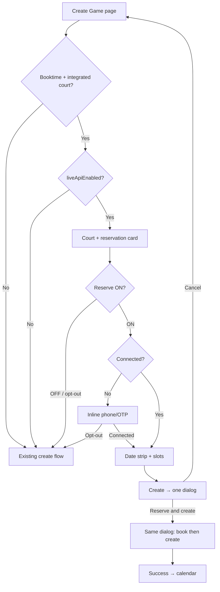

# Plan: Booktime create-game — book court + unified flow

> **Superseded in part** by [PLAN_GAME_BOOKING_MULTI_LINK.md](./PLAN_GAME_BOOKING_MULTI_LINK.md) (2026-06): many-to-many game↔booking links, segmented **Time slots | Bookings** UI (replaces `BooktimeReservationCard` toggle), multi-court confirm, `externalBookingIds[]` + `linkedBookings[]`, dedicated `PATCH /games/:id/bookings`. Sections marked **(superseded)** below defer to the multi-link plan. Single-book `externalBookingId` on `Game` is removed — no shim.

Booktime clubs only. Consolidate court booking into create-game with a toggle, confirm modal, and animated two-step submit.

**Companion:** [PLAN_CLUB_BOOKING_UX.md](./PLAN_CLUB_BOOKING_UX.md) — player booking = game record; grid semantics; “reserve when you create a game” copy.  
**Multi-link:** [PLAN_GAME_BOOKING_MULTI_LINK.md](./PLAN_GAME_BOOKING_MULTI_LINK.md) — target model, API contract, phased rollout.

**Canonical book implementation:** `Frontend/src/integrations/booktime/bookFlow.ts` (`confirmBooktimeBooking`, `BooktimeSlotTakenError`). Do not duplicate booking logic.

---

## Goals / non-goals

### Goals

- Booktime-integrated clubs book a **real slot as part of** create-game — one intentional flow, not club-detail book → navigate → create.
- User sees booking + game summary before committing; animated two-step submit (book → create).
- When “Book court” is on, dates respect club `bookableDays` meta; no arbitrary calendar day.

### Non-goals (v1)

- Edit-game re-booking or changing external booking on edit. **(superseded)** — edit flow in [PLAN_GAME_BOOKING_MULTI_LINK.md](./PLAN_GAME_BOOKING_MULTI_LINK.md) Phase 6.
- Tournament / league / training / bar flows via Booktime API (see entity-type decision). **(superseded)** — create: `GAME` | `TRAINING` | `TOURNAMENT`; edit-only `LEAGUE` via planner; `BAR` / `LEAGUE_SEASON` out of scope. Guard: `supportsClubBookingFlow` in `Frontend/shared/gameBooking/`.
- Standalone “book a court” product or booking wizard outside game flows.
- Multi-court Booktime API booking (`MultipleCourtsSelector` extra courts stay in-app planned only).

### Copy

Align with club UX plan: **“Reserve when you create a game”** — see **§16** for full copy kit and mental model. Never expose “Booktime” in player-facing strings.

---

## Current state

**Two separate paths today:**

1. **Club detail** — `AvailabilitySheet` tap slot → confirm → `confirmBooktimeBooking()` → success → navigate to `/create-game?hasBookedCourt=1&externalBookingId=...`
2. **Create-game** — `useBooktimeTimeOptions` shows free Booktime slots in the grid but does **not** book on click. `hasBookedCourt` toggle is hidden when `courtHasActiveBookingIntegration()` is true.

There is no click-to-book inside create-game yet. Target: one flow when “Book court” is on.

| Area | Location |
|------|----------|
| Slot grid (Booktime slots) | `Frontend/src/hooks/useBooktimeTimeOptions.ts` |
| Occupancy overlay | `Frontend/src/hooks/useBookedCourts.ts`, `GameStartSection.tsx` |
| Club detail book flow | `Frontend/src/components/booktime/AvailabilitySheet.tsx` |
| Snapshot refresh | `Frontend/src/hooks/useBooktimeSnapshotRefresh.ts` (wired in club detail + `useBookedCourts`; **not** in create-game submit today) |
| Book API | `Frontend/src/integrations/booktime/bookFlow.ts` |
| Create submit | `Frontend/src/pages/CreateGame.tsx` |
| Summary chips | `Frontend/src/components/createGame/summaryHeader/useCreateGameSummaryChips.tsx` |
| Confirm dialog pattern | `Frontend/src/components/ConfirmationModal.tsx`, `AvailabilitySheet` Dialog |
| Company meta | `BooktimeCompany.bookableDays` in `client.ts` (unused; `useBooktimeAvailability` hardcodes `BOOKABLE_DAYS = 14`) |
| Club auth | `useBooktimeClubAuth`, `BooktimeAuthStatus` (phone only; `UserClubBooktimeAuth` has no names) |
| Live API gate | `useBooktimeLiveApiEnabled` — connected **or** scout pool |
| Orphan booking UX | `useBooktimeOrphanLink`, `BooktimeOrphanBookingNotice` |

**Product doc conflict:** `PLAN_CLUB_BOOKING_UX.md` says club detail has no “Book a court” CTA; `AvailabilitySheet` exists today. Consolidation should update that doc.

---

## Critical invariant: scout ≠ bookable

`liveApiEnabled` is true when the user is **connected** or the **scout pool** is available (`useBooktimeLiveApiEnabled`). Booking requires a user session (`getBooktimeExternalUserId` in `confirmBooktimeBooking`).

| Capability | Requires |
|------------|----------|
| Show Booktime free slots (`useBooktimeTimeOptions`) | `liveApiEnabled` |
| “Book court” switch enabled + confirm + API book | `connected === true` only |
| Date/time picker when `bookCourtEnabled` | `connected === true` (else inline auth gate — §2b) |

If scout is available but user is not connected and `bookCourtEnabled`: do **not** show date/time — show inline auth (§2b). Never a path that fails at confirm.

---

## 1. Remove click-to-book logic

| Area | Change |
|------|--------|
| `AvailabilitySheet.tsx` | Remove slot-tap → book → navigate to create-game (or browse-only: show slots, CTA “Create game” pre-selects club/court/time without API book). |
| `CreateGameWrapper.tsx` | Stop prefill via `hasBookedCourt` / `externalBookingId` for **new** bookings (keep for `BooktimeBookingRow` / link-existing flows). |
| `BooktimeBookingRow` “Create game” | Keep — existing booking → create-game; **skip book step** in activity modal. |

Create-game time selection stays **select only**; booking runs on Confirm in the activity flow.

---

## 2. “Book court” switch **(superseded)**

> Replaced by segmented **Time slots | Bookings** + court hint (no toggle). See [PLAN_GAME_BOOKING_MULTI_LINK.md § Create Game UX](./PLAN_GAME_BOOKING_MULTI_LINK.md#create-game-ux-target).

**Visibility:**

```ts
const isBooktimeClub =
  club?.integrationType === 'BOOKTIME' &&
  !!club.integrationConfig?.companyId &&
  liveApiEnabled;
const courtIntegrates = courtHasActiveBookingIntegration(club, court);
const showBookCourtSwitch =
  isBooktimeClub && courtIntegrates && entityType === 'GAME'; // v1: GAME only
```

**Placement:** `CreateGameCourtSection.tsx` — **reservation card** (switch + one-line explanation), not a naked toggle. See §16.

**Reservation card (not naked switch):**

```
┌─────────────────────────────────────────┐
│ Reserve court when I create the game    │
│ [======== ON ========]                  │
│ We'll book this court at {club} when    │
│ you create the game.                    │
└─────────────────────────────────────────┘
```

Component: `BooktimeReservationCard.tsx` (or inline in court section). Same `rounded-xl` card style as `LocationSection` / `GameStartSection`.

| State | Switch | Effect |
|-------|--------|--------|
| No court | Hidden/disabled | — |
| Court, not connected, switch ON | Default **ON** | Time section = inline auth (§2b), not date/time |
| Connected | Default **ON** | Date/time + real booking on submit |
| User OFF / opt-out | **OFF** | Planned game only — §2b opt-out |
| `liveApiEnabled` lost | Disable switch, toast | — |
| `liveApiEnabled` false (no scout, not connected) | **No reservation UI** — generic create-game only (see below) |

**Degraded mode (`!liveApiEnabled`):** Reservation card, auth gate, and Booktime slots are all hidden. User gets the normal time grid and overlap behavior. Document in club admin if integration appears “dead.”

**When ON:** `hasBookedCourt` true after success; court required (`!== 'notBooked'`); `useBooktimeClubAuth.connected`; session hydrated.

**When OFF:** Existing overlap gate, `MarkCourtBookedModal`, calendar, in-app occupancy overlay. On integrated courts, show legacy **`hasBookedCourt` toggle** (today hidden by `courtHasActiveBookingIntegration` — must show when `!bookCourtEnabled`).

**Switch visibility:** Shown when integrated court is selected. **ON without connection** → auth gate (§2b), not a dead end. **OFF** ≡ opt-out.

**State:** `bookCourtEnabled` in `CreateGame.tsx`. Persist within session until club/court changes. Opt-out sets `bookCourtEnabled = false` (same as switch OFF).

### State transitions

```
club change           → reset bookCourtEnabled, court, re-evaluate date
court → notBooked     → hide switch; clear book intent
court → integrated    → default ON; if !connected → auth gate (§2b)
toggle OFF → ON       → if !connected → auth gate; else clamp date, clear invalid time
toggle ON → OFF       → re-enable calendar + overlap gate
opt-out (§2b)         → bookCourtEnabled = false; show normal date/time
session expired       → auth gate again or activity error + inline reconnect
```

---

## 2b. Inline Booktime auth gate (no club token)

When the user wants to book a court (`bookCourtEnabled`) but has **no token** for the selected Booktime club, **replace the date/duration/time block** (not court picker) with the same phone/OTP flow as club connect — inline in the time section, not a modal on submit.

### Section order (reorder from today)

**Today** in `GameStartSection`: date → duration → court → time.

**Target** inside the “When” card:

1. **Court picker** (always first for Booktime flow)
2. **Reservation card** (§2)
3. **Either** inline auth **or** date → duration → time

Court must be chosen before reservation intent and auth. Implement reorder in `GameStartSection` / `CreateGame` (P1 — do not ship auth gate without this).

### “No token” detection

Same signal as the rest of the app:

- `useBooktimeClubAuth(clubId)` → `status.connected === false`
- Treat expired session (`hydrateBooktimeSession` fails) as not connected → show gate again

Do **not** use `liveApiEnabled` alone.

### When to show the gate

```ts
const needsBooktimeAuth =
  isBooktimeClub &&
  courtIntegrates &&
  entityType === 'GAME' &&
  bookCourtEnabled &&
  !booktimeAuth?.connected;
```

**If `needsBooktimeAuth` — hide:**

- `DateSelector`, duration picker, time grid, calendar overlay
- `BooktimeAvailabilityBanner` (until connected)
- Do not load Booktime slots for booking intent

**`useBooktimeTimeOptions` enable** (in `CreateGame.tsx`):

```ts
enabled:
  entityType !== 'BAR' &&
  club?.integrationType === 'BOOKTIME' &&
  !needsBooktimeAuth &&
  ( !bookCourtEnabled || booktimeAuth?.connected );
```

When `bookCourtEnabled` is OFF, scout-backed slots may still load if `liveApiEnabled`.

**Show instead:**

- Inline connect UI (phone → signup if new user → OTP) — same steps as `ConnectClubSheet`
- Opt-out control (below)

**Rest of create-game** (club, format, participants, etc.) stays editable while connecting.

### Reuse `ConnectClubSheet` logic

Refactor — do not duplicate the OTP flow:

1. Extract **`BooktimeConnectForm`** — props: `club`, `integrationConfig`, `onConnected`, `variant?: 'inline' | 'dialog'`.
2. **`ConnectClubSheet`** — Dialog shell + `BooktimeConnectForm` (club detail unchanged).
3. **Create-game** — `GameStartSection` card + `BooktimeConnectForm` + opt-out footer.

`onConnected`:

- `persistBooktimeSessionAfterConnect` + `acceptCustomTerms` (existing)
- `refresh()` from `useBooktimeClubAuth`
- Keep `bookCourtEnabled === true`
- Reveal date/time; load company meta + slots; clamp date to `bookableDays`

### Opt-out

**Control:** secondary text link under the form: “I'll book the court myself” (§16). Same effect as switch OFF.

**On opt-out:**

```ts
setBookCourtEnabled(false);
```

**Effect (identical to switch OFF):**

- Show normal date/time (calendar, overlap gate, `MarkCourtBookedModal` path)
- No `bookableDays` strip restriction
- No confirm/activity book step on Create
- **Show `hasBookedCourt` toggle** on integrated courts when `!bookCourtEnabled` (fix `CreateGameCourtSection`):

```ts
const showHasBookedSwitch =
  (selectedCourt !== 'notBooked' || ...) &&
  (!courtHasActiveBookingIntegration(club, court) || !bookCourtEnabled);
```

Sync the **Book court** switch to OFF. User may turn switch ON again → auth gate returns until connect or opt-out.

**Reset:** On club/court change, reset `bookCourtEnabled` to default (ON for integrated court); clear per-session opt-out for the new selection.

### Switch vs gate

- Switch **ON** + not connected → gate replaces date/duration/time (court + reservation card stay visible above).
- Opt-out ≡ switch OFF.
- Switch ON = user wants API reservation; OFF / opt-out = planned game path.

### i18n

See **§16 Copy kit**. Reuse `club.booktime.*` for phone/OTP fields.

### Orchestration (`CreateGame.tsx`)

```tsx
const { status: booktimeAuth, refresh: refreshBooktimeAuth } = useBooktimeClubAuth(
  selectedClub,
  isBooktimeClub && courtIntegrates
);

const needsBooktimeAuth =
  bookCourtEnabled && isBooktimeClub && courtIntegrates && !booktimeAuth?.connected;

// GameStartSection — after court + BooktimeReservationCard
{needsBooktimeAuth ? (
  <BooktimeConnectInline ... onSkip={() => setBookCourtEnabled(false)} />
) : (
  /* date → duration → time grid */
)}
```

### Edge cases (auth gate)

| Case | Behavior |
|------|----------|
| Connect succeeds | Swap gate → date/time; clamp to `bookableDays` |
| Opt-out on integrated court | Normal time UX; scout slots OK if `liveApiEnabled` |
| Court → non-integrated | Hide gate; normal time UI |
| Toggle book court ON again after opt-out | Show gate until connect or opt-out |
| `BooktimeBookingRow` deep link with `externalBookingId` | `bookCourtEnabled` false; banner “Court already reserved”; skip gate + book step (§6) |
| Session expires after connect | Gate on next visit or inline reconnect |

---

## 3. Slot grid when book court ON

`GameStartSection` runs `useBookedCourts` (yellow/red in-app games) **and** may use `useBooktimeTimeOptions` (API-free slots). These can disagree.

**Rules when `bookCourtEnabled`:**

| Concern | Rule |
|---------|------|
| Selectable times | Booktime API (`useBooktimeTimeOptions`) is source of truth |
| Yellow/red occupancy overlay | **Hide** (decision #7) — do not show dual grid |
| `useBookedCourts` fetch | Disable when `bookCourtEnabled` (optional perf; avoid 10s polling noise) |
| Overlap gate (`runBookingOverlapGate`) | **Skip** — rely on `confirmBooktimeBooking` + `BooktimeSlotTakenError` |
| `MarkCourtBookedModal` | Skip |

When `bookCourtEnabled` is OFF at a Booktime club, keep current dual-grid + overlap behavior.

---

## 4. Date restriction (book court ON)

### Shared company meta

Consolidate loading (extend `useClubIntegrationDurations` or new `useBooktimeCompanyMeta`):

- `bookableDays` (default 14)
- `bookingDurations` / `timeInterval`
- `allowedHoursToCancel`
- `currency`

Replace hardcoded `BOOKABLE_DAYS = 14` in `useBooktimeAvailability.ts`.

### DateSelector

New props: `hideCalendar?: boolean`, `fixedDates?: Date[]`.

When `bookCourtEnabled`:

- `allowedDates = today .. today + bookableDays - 1` in club TZ (`clubLocalDateString`, `formatClubDateKey`)
- Pass as `fixedDates`; `hideCalendar={true}`
- Clamp `selectedDate` when toggling ON or when `bookableDays` loads
- No calendar overlay in `GameStartSection`

Reuse `minDateKey` / `maxDateKey` pattern from `useBooktimeAvailability.ts`.

---

## 5. Snapshot refresh (required for book step)

`confirmBooktimeBooking` expects `BooktimeBookFlowContext`: `refreshSnapshot`, `lastFetchedAt`. `AvailabilitySheet` receives this from `ClubDetailPanel` via `useBooktimeSnapshotRefresh`. **Create-game does not wire this today.**

**Implement:**

- Mount `useBooktimeSnapshotRefresh(club, selectedDate, bookCourtEnabled)` in `CreateGame` (or dedicated hook).
- Pass context into activity step 1 (same as `AvailabilitySheet.handleConfirmBook`).
- When book court ON: show `BooktimeAvailabilityBanner`; block confirm if `noSyncToday` / unusable API (product call: hard block vs warn).

---

## 6. Confirm modal (pre-submit)

**New:** `BooktimeCreateGameConfirmModal.tsx` (+ shared shell with activity — §16)  
Base: `Dialog` + `DialogContent`. **Info/affirmative tone** (not `ConfirmationModal` warning triangle). Title: “Ready to create?”

### Booking section

- Date (club TZ, e.g. `formatSheetDate` style)
- Time range (start + duration)
- Club + court (`CourtDisplayName`)
- Price + currency (`getPrice`; loading/error like `AvailabilitySheet`)
- **Booked as:** phone, first name, last name from **club Booktime auth** (not Bandeja profile)
- Cancellation policy: `allowedHoursToCancel` from company meta
- Optional: club `policyText` snippet (already shown in `GameStartSection`)
- Optional: terms line if `termsUrl` in integration config (`acceptCustomTerms` runs after connect)

### Auth identity gap

`BooktimeAuthStatus` / `UserClubBooktimeAuth` have `phoneNumber` only. `ConnectClubSheet` collects names at signup but does not persist them.

**Preferred:** Extend Prisma + `putAuth` + `BooktimeAuthStatus` with `firstName` / `lastName` at connect.  
**Fallback:** `BooktimeClient.getProfile()` if API exists.  
**Short-term:** phone only.

### Game section

Chips from floating summary, excluding `location` and `time`:

```ts
summaryChips.filter((c) => c.key !== 'location' && c.key !== 'time')
```

Read-only chip row (`CreateGameSummaryBar` styling, non-clickable). If empty (user hasn’t scrolled sections), fallback: sport + participants + format.

### Footer

Cancel | **Reserve & create** → morphs into activity (same dialog shell — §16)

### Validation before open

Same as today: club, time, duration, `user.nameIsSet`, court when book court ON, connected + hydrated session, court has `externalCourtId`.

If `needsBooktimeAuth` (§2b): block Create — user must connect or opt-out first.

**Gate in `handleCreateGame`:**

```ts
const skipBookFlow = Boolean(
  initialGameData?.externalBookingId ?? externalBookingIdFromState
);

if (bookCourtEnabled && courtIntegrates && !skipBookFlow) {
  setConfirmModalOpen(true);
  return;
}
await executeCreateGame();
```

**Existing booking (`externalBookingId` prefilled):** `bookCourtEnabled` defaults false; hide reservation card or show read-only “Court already reserved” banner (§16). Confirm modal is **game-only** (no booking block) or skip straight to `executeCreateGame()`.

---

## 7. Activity flow (post-Confirm)

**New:** `BooktimeCreateGameActivityModal.tsx` — prefer **morphing the confirm dialog** into progress/success (one surface, not a second modal — §16).

**State machine:** `idle → booking → booking-done → creating → success → navigate`

| Phase | UI | Action |
|-------|-----|--------|
| `booking` | Step 1 + spinner | `hydrateBooktimeSession` → `confirmBooktimeBooking(ctx)` |
| `booking-done` | Step 1 ✓, min 400–600ms | UX pause for animation |
| `creating` | Step 2 + spinner | `executeCreateGame({ externalBookingId, hasBookedCourt: true })` |
| `success` | Checkmark + copy | ~800ms → `navigateAfterCreate` |

**Animation:** `framer-motion` — step circles, spring checkmark (`CreateGameSummaryBar` / questionnaire patterns).

### Production requirements

| Concern | Spec |
|---------|------|
| Dismissal | No backdrop close during `booking` / `creating` |
| Double submit | Disable Confirm; `inFlight` ref |
| Post-success | Reuse `navigateAfterCreate` (calendar tab + game date) |
| Side effects after game id | Same order as today: avatar upload → invites → `gameCourtsApi.setGameCourts` |
| Session 401 | `expireSession` + connect prompt |
| Accessibility | `aria-live="polite"` on step status; focus trap |

### Errors

| Error | Behavior |
|-------|----------|
| `BooktimeSlotTakenError` | Step 1 error; refresh `useBooktimeTimeOptions`; retry |
| Book OK, game create fails | See rollback policy (§ Backend) |
| Network timeout | Distinct copy for book vs create step |

**Refactor:** `executeCreateGame` accepts optional `externalBookingId` / `hasBookedCourt` overrides.

**Existing booking entry:** `BooktimeBookingRow` → create-game with `externalBookingId` already set — skip step 1; confirm game only or direct `executeCreateGame`.

---

## 8. Backend / persistence **(superseded)**

> Target: `GameExternalBooking` join table, `externalBookingIds[]` on create, `linkedBookings[]` on read, `PATCH /games/:id/bookings`, `timeOverride` column. Hard-remove `Game.externalBookingId`. Contract types: `Frontend/shared/gameBooking/contracts.ts` (FE/BE parity). See [PLAN_GAME_BOOKING_MULTI_LINK.md](./PLAN_GAME_BOOKING_MULTI_LINK.md) Phase 1.

| Topic | Current behavior | Plan |
|-------|------------------|------|
| Create with `externalBookingId` | `hasBookedCourt` forced true (`create.service.ts`) | Activity step 2 passes both |
| Duplicate booking link | Checked on **update** only (`update.service.ts`) | Add create-time check or handle race |
| `externalBookingId` index | Non-unique on `Game` | Document orphan / duplicate-link risk |
| Orphan detection | `useBooktimeOrphanLink` — booking not in user’s Booktime list | Informs rollback UX |

### Rollback policy (recommended)

**Auto-cancel** via `cancelBooktimeBooking` if `gamesApi.create` fails after successful book; show error; user stays on create-game. Alternative (leave booking + orphan notice) is worse UX for the unified flow. **(superseded)** — cancel all IDs from **this create attempt** (`string[]`); see multi-link plan locked decision #1 / #15.

---

## 9. Entry points after consolidation

| Entry | v1 behavior |
|-------|-------------|
| Create game → Booktime club | Primary new flow |
| Club detail `AvailabilitySheet` | Browse-only or removed; no API book → create-game |
| `BooktimeBookingRow` → Create game | Keep URL params; `skipBookFlow`; game-only confirm |
| Deep link `CreateGameWrapper` params | Keep for `BooktimeBookingRow`; do not use for new club-detail book path |

---

## 10. Edge cases

- Slot taken between confirm modal and API (`BooktimeSlotTakenError`)
- User changes date/time/duration while confirm modal open → close modal or stale warning
- Duration change after slots loaded → refetch (`useBooktimeTimeOptions` depends on duration)
- `maxParticipants > 4` + `MultipleCourtsSelector` — Booktime books **primary `courtId` only**
- Booktime live API disabled mid-session
- Offline / timeout on book vs create
- Scout available but user not connected with `bookCourtEnabled` — auth gate, not slots (§2b)
- User opts out then changes duration/club — follow OFF rules
- Game create OK, avatar/invite fail (non-blocking today — unchanged)
- Retry after network blur with same `externalBookingId` (duplicate link if game was created)
- `!liveApiEnabled` at Booktime club: no reservation UI; generic grid only
- Opt-out on integrated court: `hasBookedCourt` manual toggle visible

---

## 11. File map

| File | Change |
|------|--------|
| `CreateGame.tsx` | `bookCourtEnabled`, `needsBooktimeAuth`, snapshot refresh, submit gate, modals |
| `CreateGameCourtSection.tsx` | Court picker + reservation card; `hasBookedCourt` when `!bookCourtEnabled` |
| `GameStartSection.tsx` | Reorder court before date; auth gate vs date/duration/time; disable `useBookedCourts` when booking ON |
| `BooktimeConnectForm.tsx` | New — extracted from `ConnectClubSheet` |
| `BooktimeConnectInline.tsx` | New — inline wrapper + opt-out (or inline variant on form) |
| `ConnectClubSheet.tsx` | Refactor to use `BooktimeConnectForm` |
| `DateSelector.tsx` | `fixedDates`, `hideCalendar` |
| `useBooktimeCompanyMeta.ts` (or extend durations hook) | `bookableDays`, cancel policy, currency |
| `BooktimeReservationCard.tsx` | New — switch + explanation |
| `BooktimeCreateGameConfirmModal.tsx` | New — confirm + morph to activity |
| `BooktimeCreateGameActivityModal.tsx` | New — progress/success phases (or merged into confirm shell) |
| `useCreateGameSummaryChips.tsx` | `excludeKeys` or filter helper |
| `AvailabilitySheet.tsx` | Browse-only / remove book path |
| `Backend/.../create.service.ts` | Optional: duplicate `externalBookingId` on create |
| `Backend/prisma/schema.prisma` | Optional: `firstName`/`lastName` on `UserClubBooktimeAuth` |
| i18n `createGame.json`, `club.json` | New strings |
| `docs/UI_TEST_PLAN.md` | See § Testing |
| `docs/PLAN_CLUB_BOOKING_UX.md` | Align club-detail CTA + grid copy |

---

## 12. Flow



Logical steps inside **one morphing dialog** (§16): review → reserve court → create game → success. Not three separate modals.

---

## 13. Phasing

| Phase | Deliverable |
|-------|-------------|
| P1 | **Reorder court first** + reservation card + auth gate + date restriction + confirm layout (dry run) — **must not feel broken** |
| P2 | Morphing activity + real `confirmBooktimeBooking` + game create — **one continuous action** |
| P3 | AvailabilitySheet browse-only; rollback; backend create uniqueness |
| P4 | Names in confirm; price prefetch; haptics; e2e delight |

---

## 14. Testing

### UI test plan (minimum)

- Book court ON, connected: happy path (confirm → activity → calendar)
- Not connected + switch ON: inline auth replaces date/time; no slot grid until connected
- Opt-out from auth gate: switch OFF; normal date/time + overlap behavior
- Connect inline then pick slot: `bookableDays` enforced
- Slot taken on step 1
- Game fail after book (per rollback policy)
- Book court OFF at Booktime club: overlap + mark-court modal
- Date strip: no calendar; cannot pick day beyond `bookableDays`
- Switch default when connected
- `externalBookingId` deep link: no reservation ON, no book step, banner if shown
- `!liveApiEnabled`: no Booktime-specific UI
- Opt-out on integrated court: `hasBookedCourt` toggle visible
- Court selected before auth gate; section header visible during gate

### E2E

Update `Frontend/e2e/specs/games/create-game-fields.spec.ts` — overlap tests (C-15, C-39) may not apply when book court ON.

### Optional analytics

`booktime_create_confirm`, `booktime_book_success`, `booktime_book_slot_taken`, `booktime_game_create_fail_after_book`.

---

## 15. Decisions

| # | Decision | Recommendation |
|---|----------|----------------|
| 1 | Switch default when connected | **ON** |
| 2 | `AvailabilitySheet` | **Browse-only** (slots visible; CTA to create-game, no API book) |
| 3 | Rollback if game create fails | **Auto-cancel** Booktime booking |
| 4 | Entity types | **GAME only** in v1 **(superseded)** → `GAME` \| `TRAINING` \| `TOURNAMENT` create; `LEAGUE` edit-only (`supportsClubBookingFlow`) |
| 5 | Names in booking section | **Extend `UserClubBooktimeAuth`** at connect |
| 6 | Overlap gate when book court ON | **Skip** |
| 7 | Occupancy overlay when book court ON | **Hide** |
| 8 | Snapshot banner blocks confirm | **Hard block** when no live sync (TBD in impl) |
| 9 | Auth when not connected | **Inline** in time section (not modal on submit) |
| 10 | Opt-out from auth | **`bookCourtEnabled = false`** — same as switch OFF |
| 11 | Confirm + activity | **One morphing dialog** (not two stacked modals) |
| 12 | User-facing integration name | **Club name only** — never “Booktime” in player copy |
| 13 | Create button label | **“Create game & reserve court”** when book court ON |
| 14 | `GameStartSection` field order | **Court → reservation → auth / date / time** (P1) |
| 15 | `hasBookedCourt` on opt-out | **Show** when `!bookCourtEnabled` on integrated courts |
| 16 | `externalBookingId` deep link | **`skipBookFlow`** — game-only confirm, no reservation card ON |

---

## 16. UX / UI

Single mental model for the user: **create your game — we’ll reserve the court for you.** Court booking is a step inside game creation, not a separate product.

### Copy principles

| Avoid | Prefer |
|-------|--------|
| “Book court” (standalone) | “Reserve court with this game” / “Court reserved automatically” |
| “Connect to Booktime” | “Sign in to {club name} to reserve” |
| Generic Create | “Create game & reserve court” when booking is on |
| “Booktime” in UI | Club name only (Booktime is implementation) |

### Full story (acts)

**Act 1 — Setup**  
Avatar → sport → format → club → time. Don’t front-load integration; surface Booktime only after club + integrated court.

**Act 2 — Reservation intent**  
After integrated court selected: show **reservation card** (§2) with switch default ON + one sentence of expectation.

**Act 3 — Auth gate** (not connected, switch ON)  
Replace date/time **body** only — keep section header (“When” / calendar icon).

- Inset sub-panel (`bg-primary-50/50` / dark equivalent), not a blank hole
- Title: “Sign in to see available times”
- Benefit-first copy + club name/avatar
- `AnimatePresence` crossfade (~200ms) when auth completes → date strip appears
- Opt-out: single secondary link — **“I’ll book the court myself”** → `bookCourtEnabled = false` (same as switch OFF)
- Rest of form stays editable; Create disabled with hint: “Sign in above to choose a time”

**Act 4 — Pick time** (connected, book court ON)

- Subtitle under date strip: “You can book up to {n} days ahead at this club.”
- Skeleton grid while slots load (not empty grid)
- Auto-select first day with slots if today empty
- **Connected chip** near duration: “Signed in · {phone}”
- Hide yellow/red in-app overlap grid (§3 — no dual grid)
- Durations from club meta only

**Act 5 — Form + floating summary**

- Optional badge in summary area once time set: “Court reserved on create” (not a scroll chip)
- **Create button:**

| State | Label / behavior |
|-------|------------------|
| Normal | Create game |
| Book court ON | Create game & reserve court |
| Auth gate | Disabled — “Sign in to continue” |
| During activity | Handled inside dialog, not main button |

**Act 6 — Confirm (review)**

Vertical layout in one dialog:

1. Title: “Ready to create?”
2. **Booking card** — left accent border, `CalendarCheck` icon  
   - Primary line: **Wed 12 Jun · 18:00–19:00 · Court 3 · {Club}**  
   - Price (bold), cancel policy (muted), “Reserved as: {name} · {phone}”
3. Divider: “Your game”
4. Read-only chips (exclude location/time)
5. Cancel | **Reserve & create**

Close confirm if date/time/court/duration changes while open. Prefetch price on time select (P4).

**Act 7 — Activity (same dialog morphs)**

Vertical stepper:

```
✓ Reserve court     (done — green check, spring)
○ Create game       (spinner — “Creating your game…”)
```

- Step 1 active: “Reserving your court…”
- Min 400–600ms on step 1 done before step 2
- Success ~800ms: large checkmark, “You’re all set!” + “Court reserved · Game created” → `navigateAfterCreate`
- **Errors in same shell:**

| Error | UX |
|-------|-----|
| Slot taken | Step 1 red; “This slot was just taken”; **Pick another time** → close, focus time |
| Game failed after book | Explain auto-cancel (§8); **Try again** |
| Session expired | Inline reconnect in dialog |

Do not stack a second modal on top of confirm.

### Information architecture

Block order (Booktime clubs):

1. Club (`LocationSection`)
2. **When** (`GameStartSection`) — **reorder required** (today: date → duration → court → time):
   - court picker
   - reservation card
   - auth gate **or** date → duration → time
3. Rest unchanged

Court + reservation + time = one “where & when” cluster. P1 must include reorder.

### Confusion hotspots

| Hotspot | Fix |
|---------|-----|
| Switch vs opt-out | One state `bookCourtEnabled`; identical effect |
| Auth replaces time | Keep header; sub-panel; animation |
| No calendar | `bookableDays` helper line |
| Modal fatigue | Confirm morphs to activity |
| Existing booking deep link | Banner “Court already reserved”; skip book step |
| `MarkCourtBookedModal` | Only when book court OFF |

### Visual system

- Cards: same `rounded-xl border` as existing create-game sections
- Confirm: info/primary tone, not warning orange
- Motion: match `CreateGameSummaryBar` spring constants
- Dark mode: test auth panel + stepper on `gray-900`

### Copy kit (i18n keys → `createGame.booktime.*`)

| Moment | Copy |
|--------|------|
| Switch label | Reserve court when I create the game |
| Switch hint | We'll book {court} at {club} when you tap Create. |
| Auth title | Sign in to see available times |
| Auth opt-out | I'll book the court myself |
| Date hint | Slots up to {n} days ahead |
| Connected chip | Signed in · {phone} |
| Create CTA | Create game & reserve court |
| Confirm primary | Reserve & create |
| Activity step 1 | Reserving court… |
| Activity step 2 | Creating your game… |
| Success | You're all set! |
| Slot taken | This slot was just taken—pick another time |

### UX testing (add to §14)

- Auth gate: section header visible; opt-out reveals date/time with animation
- Reservation card copy visible before auth
- Confirm morphs to activity (no double modal)
- Create button label changes with book court ON
- Slot-taken returns user to time grid
- No “Booktime” string in player-facing UI
