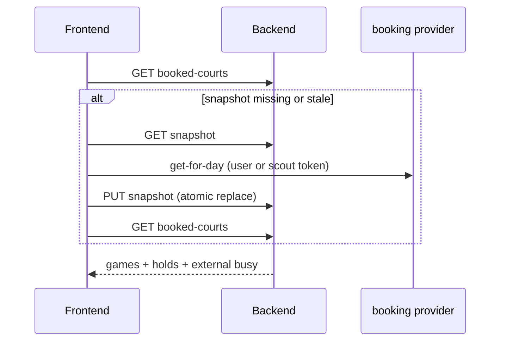
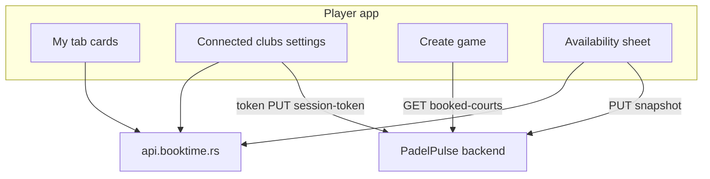

# Plan: Centralized club booking integration (Novi Sad)

Companion specs: [PLAN_CLUB_BOOKING_UX.md](./PLAN_CLUB_BOOKING_UX.md), [PLAN_CLUB_BOOKING_TECH.md](./PLAN_CLUB_BOOKING_TECH.md).

Decompilation reference (Padel City): `../Decomp/PadelCity/FINDINGS.md`, `api.json`, `simulator/`.

Verified against codebase 2026-06. Grill session decisions folded in 2026-06.

---

## Summary

Rebuild external club booking around **external booking provider** (`api.booktime.rs`) for multiple Novi Sad clubs (same API, different `companyId`). Users connect per club via **phone + SMS OTP**, book courts in-app, and see **centralized bookings** across clubs.

| Layer | Responsibility |
|-------|----------------|
| **Frontend** | Phone/OTP, token refresh, slot fetch, price, create/cancel booking — direct to the booking provider API |
| **Backend** | Encrypt/store tokens; **busy snapshots**; scout pool; **merge externals in `getBookedCourts`** |
| **Club record** | `integrationType` + `integrationConfig` per club; `Court.externalCourtId` mapping |

**Player booking traffic:** browser → `api.booktime.rs` (no booking proxy).

**Exceptions (server → booking provider):** platform admin **Import courts** only (`GET /public/company/{id}`).

**No feature flags.** Integration is on wherever platform admin sets `integrationType` on the club row.

---

## Product goals

1. User sees **all their club bookings** in one place (per connected club).
2. User sees **correct reserved slots** on create-game + club admin grids (merged with app games).
3. User can **book** when connected to that club.
4. User **without** club account: availability via scout token + public ranges; **Connect** to book.
5. Snapshot refresh on club/date open, **max once per 60 seconds** (`BOOKTIME_SNAPSHOT_FRESH_MS`); **force refresh** after book/cancel.

After a club booking → **Create game here** (pre-filled; optional soft link). See [PLAN_CLUB_BOOKING_UX.md](./PLAN_CLUB_BOOKING_UX.md) for grid colors.

---

## Per-club integration config (DB)

Replace legacy `integrationScriptName` / CRS scripts.

| Field | Purpose |
|-------|---------|
| `integrationType` | `null` = none; `BOOKTIME` = online booking; future providers |
| `integrationConfig` | Provider JSON — booking provider: `{ "companyId", "termsUrl?", "privacyUrl?", "serviceIds?" }` |

**Rules:**

- Booking UI, snapshots, connect, My bookings **only** when `integrationType` is set.
- other booking providers: later via same fields.
- `Court.externalCourtId` = booking provider `bookingResourceId`.

**P0 migration (single cutover):** add `integrationType`; migrate CRS club → `BOOKTIME` + `companyId`; **drop** `integrationScriptName`, `integrationScriptDateIndependent`, script loader, `crs.js` in same release.

---

## Platform admin (v1)

Extend `Admin/` club edit:

| Control | Behavior |
|---------|----------|
| Integration type | Dropdown: none / online booking |
| `companyId` | Required for online booking |
| **Import courts** | Server `GET /public/company/{companyId}` → match/create courts, set `externalCourtId` |
| Court list | Manual override of `externalCourtId` per court |

Padel City `companyId`: `d4130d78-a7e8-499d-90f0-92773ccc2f9c`.

---

## Occupancy pipeline (create-game + admin schedule)

**Decision (ADR-005):** **A+C hybrid** — Frontend owns snapshot refresh; Backend merges games + holds + externals via `CourtOccupancyService` → `OccupancyBlock[]`. See [ADR-005](./adr/ADR-005-court-occupancy-ac-hybrid.md). Implementation: #123.

**Shipped today:** backend merge in `bookedCourts.service.ts` reads `ClubBooktimeBusySnapshot` and emits `clubBooked` rows (same `GET /games/booked-courts` contract as CRS today).



- **Target (#123):** `useCourtOccupancy` replaces `useBookedCourts` (same public interface) — refresh → GET booked-courts → slot helpers; no client-side snapshot merge for grid.
- Club admin schedule uses same external rows via shared `CourtOccupancyService`.
- **Cold start:** `isLoadingExternalSlots: true` while opener refreshes; auto-fetch provider slots + PUT when snapshot missing/stale; refetch grid after PUT. Banner: “Updating club availability…” / “No sync yet today”.

---

## Snapshot contract

### Content

**Busy slots only.** Each refresh **atomically replaces** all courts for `(clubId, date)`. Freed slots omitted on next fetch.

### Storage

Per-court DB rows (`clubId`, `courtId`, `date`, `busySlots`, `fetchedAt`), but **written in one transaction**:

```http
PUT /clubs/:clubId/booktime/snapshot
{
  "date": "2026-06-10",
  "fetchedAt": "ISO",
  "force": false,
  "courts": [
    { "courtId": "cuid", "externalCourtId": "uuid", "busySlots": [{ "startTime", "endTime" }] },
    { "courtId": null, "externalCourtId": "uuid", "externalCourtName": "…", "busySlots": [...] }
  ]
}
```

Backend: delete all rows for `(clubId, date)` → bulk insert. Empty `busySlots: []` = court free.

### Busy slot shape

```ts
{
  courtId: string | null;      // null if external booking court unmapped
  externalCourtId: string;
  externalCourtName?: string;
  startTime: string;           // ISO, club TZ
  endTime: string;
}
```

**Unmapped courts:** store with `courtId: null`. Admin schedule shows external/unassigned lane; create-game **per-court** view ignores null `courtId`. Admin warning: “N external courts not mapped” → import.

### Build (frontend refresh)

1. `get-for-day` with user token (connected) or scout token.
2. Map `bookingResourceId` → internal court via `externalCourtId`.
3. PUT atomic snapshot.
4. Availability sheet free slots: separate logic (below).

### Write policy

| Rule | Detail |
|------|--------|
| Who may PUT | Any authenticated PadelPulse user for BOOKTIME clubs |
| Scout refreshes | **Count** — unconnected users can refresh via scout token |
| Server dedupe | Reject PUT if snapshot `fetchedAt` &lt; 60 s ago unless `force: true` |
| Per-user limit | Max 1 PUT / user / club / date / 60 s |
| Force | After successful book or cancel |

No cron.

---

## Availability sheet (free slots)

**Decision:** public ranges − snapshot busy; confirm-time re-check.

1. `get-available-slots` (public) → `parseSlots` for duration.
2. Subtract intervals overlapping snapshot busy for that court.
3. Not connected: same grid; book tap → Connect.
4. **On confirm:** if snapshot &gt; 1 min old, optional fresh `get-for-day`; `get-price` + `POST /booking`; slot taken → force snapshot refresh + toast.

Create-game red cells use **snapshot only** (via `getBookedCourts`), not live public ranges.

---

## Scout token pool

For `get-for-day` when user has no club token:

1. `GET /clubs/:id/booktime/scout-token`
2. Pool: `UserClubBooktimeAuth` where `scoutOptIn` (default **on**), token valid.
3. **Never** return requester’s own token.
4. Skip tokens with 401 in last 24h (`scoutInvalidAt` or flag); max 3 retries.
5. Remove from pool on disconnect or opt-out.
6. Empty pool → degraded: stale snapshot + banner; sheet uses public ranges only for free display.

---

## Token lifecycle

```
1. OTP success → frontend PUT tokens to backend (encrypted at rest)
2. Frontend: access + refresh in memory + sessionStorage for tab
3. GET .../auth → { connected, phoneNumber, externalUserId, scoutOptIn } — NO secrets
4. Missing sessionStorage but backend has row → POST .../booktime/session-token → hydrate memory
5. booking provider 401 → refresh-token; fail → reconnect OTP
6. Disconnect → DELETE backend auth; optional provider logout
```

Never log tokens. Rate-limit `session-token`.

---

## Connect / signup UX

| Topic | Decision |
|-------|----------|
| Phone | **Prefill** profile phone if present; user may use any number (club booking account is per club) |
| Store | `UserClubBooktimeAuth.phoneNumber` = verified at connect |
| Terms | Line under OTP: “By continuing you agree to …” + links; after confirm-login/signup call `accept-custom-terms` once; non-blocking on failure |
| New user | Signup form → OTP (same as simulator) |

---

## Game ↔ club booking link

**Soft link v1** — no auto-sync on cancel either side.

```prisma
// Game (new columns)
externalBookingId       String?
externalBookingProvider ClubIntegrationType?
@@index([externalBookingId])
```

- Set when user creates game from **Create game here** (or explicit link).
- Auto `hasBookedCourt: true` when created from booking.
- Cancel club booking: if linked game exists → success banner **“Your game is still on the calendar”** + Open game; do not auto-cancel game.
- Orphan link if user cancels booking elsewhere → game details may show “Court may no longer be reserved”.

---

## My bookings — information architecture

| Surface | Content |
|---------|---------|
| **Profile → Connected clubs & bookings** | Full list: connect/disconnect, scout opt-in, upcoming + past, cancel, create game |
| **My tab** | **E:** if user’s city has ≥1 BOOKTIME club and not connected → connect banner; if connected → up to **3** upcoming cards + “See all”; live `get-upcoming` on tab focus |
| **Club detail** | Connect chip, availability sheet, last sync |
| **City gate** | Unconnected banner on My tab **only** when `user.cityId` has clubs with `integrationType` set |

No new bottom tab.

---

## Cancel booking

- Confirm modal with club cancel policy (`allowedHoursToCancel` from config/company).
- Frontend `PATCH /booking/cancel` with user token.
- Success → force snapshot refresh; remove from list.
- Linked game (Q above) → non-blocking warn banner.

---

## External booking API (Padel City reference)

Base: `https://api.booktime.rs` · Public: `/public/*` · `companyId` in JSON bodies.

| Concern | Endpoint |
|---------|----------|
| Company + courts | `GET /public/company/{companyId}` |
| Available ranges | `POST /public/booking-resources/get-available-slots` |
| Day bookings | `POST /booking-resources/get-for-day` (auth) |
| Auth | login, confirm-login, signup, confirm-signup, send-code, refresh-token |
| Book | get-price, POST /booking, PATCH cancel |
| Lists | get-upcoming, get-previous |
| Terms | PATCH /users/accept-custom-terms |

Slot step 60 min; durations 60/120; 14 bookable days; 12h cancel window.

---

## Architecture



---

## Slot merge (`getBookedCourts`)

Per 30-min cell:

| Source | Result |
|--------|--------|
| Admin hold | Hard block |
| Snapshot busy (mapped court) | Red `clubBooked` |
| Snapshot busy (`courtId: null`) | Admin unassigned lane only |
| App game | Yellow/red per `hasBookedCourt` |
| Else | Free |

Expand 60/120 min busy across overlapping 30-min cells.

---

## Backend

### Prisma (target)

```prisma
enum ClubIntegrationType {
  BOOKTIME
}

model Club {
  integrationType   ClubIntegrationType?
  integrationConfig Json?
  // DROP: integrationScriptName, integrationScriptDateIndependent
}

model Game {
  externalBookingId       String?
  externalBookingProvider ClubIntegrationType?
  @@index([externalBookingId])
}

model UserClubBooktimeAuth {
  id              String    @id @default(cuid())
  userId          String
  clubId          String
  externalUserId  String
  phoneNumber     String?
  accessToken     String    // encrypted
  refreshToken    String    // encrypted
  expiresAt       DateTime?
  scoutOptIn      Boolean   @default(true)
  scoutInvalidAt  DateTime?
  updatedAt       DateTime  @updatedAt
  @@unique([userId, clubId])
}

model ClubBooktimeBusySnapshot {
  id         String   @id @default(cuid())
  clubId     String
  courtId    String?  // null = unmapped external
  date       String
  busySlots  Json
  fetchedAt  DateTime
  @@unique([clubId, courtId, date])
}
```

### API routes

| Method | Path | Purpose |
|--------|------|---------|
| GET | `/clubs/:clubId/booktime/auth` | Status, no secrets |
| PUT | `/clubs/:clubId/booktime/auth` | Store tokens after OTP |
| POST | `/clubs/:clubId/booktime/session-token` | Hydrate frontend session |
| DELETE | `/clubs/:clubId/booktime/auth` | Disconnect |
| GET | `/clubs/:clubId/booktime/snapshot?date=` | Aggregated busy + `fetchedAt` |
| PUT | `/clubs/:clubId/booktime/snapshot` | Atomic replace (see body above) |
| GET | `/clubs/:clubId/booktime/scout-token` | Scout bearer |
| GET | `/booktime/my-clubs` | Connected clubs metadata |
| POST | `/admin/clubs/:id/booktime/import-courts` | Admin import (server → booking provider public) |

`getBookedCourts`: when `integrationType = BOOKTIME`, merge snapshot rows for date range.

---

## Frontend modules (target)

| Module | Role |
|--------|------|
| `integrations/booktime/client.ts` | HTTP |
| `integrations/booktime/slots.ts` | parseSlots, subtract busy, grid overlap |
| `integrations/booktime/session.ts` | memory + sessionStorage + session-token |
| `components/booktime/ConnectClubSheet.tsx` | phone prefill, OTP, signup, terms |
| `components/booktime/AvailabilitySheet.tsx` | B+D slot grid |
| `components/booktime/MyTabBookingsSection.tsx` | city-gated banner + 3 cards |
| `pages/settings/ConnectedClubsBookingsPage.tsx` | full list |

Trigger snapshot refresh from create-game / club detail / availability when stale (frontend); grid reads backend only.

---

## Phased delivery

| Phase | Scope | Status |
|-------|--------|--------|
| **P0** | `integrationType`; drop CRS/script fields; admin import courts; `getBookedCourts` snapshot merge | Pending |
| **P1** | Snapshot API + write policy; cold-start loading; availability sheet (B+D) | Pending |
| **P2** | Connect sheet; token storage; session-token; scout pool | Pending |
| **P3** | Book + cancel (B) + terms (C) + force refresh | Pending |
| **P4** | Settings bookings page + My tab section; Game link columns; create-game bridge | Pending |
| **P5** | i18n; club admin sync/unmapped warnings; UI_TEST_PLAN | Pending |

---

## Resolved decisions

| # | Topic | Decision |
|---|-------|----------|
| 1 | Grid external source | **Backend** merge in `getBookedCourts` |
| 2 | Snapshot content | Busy only; **atomic full replace** per club+date |
| 3 | Snapshot PUT | **Single transaction**; body with `courts[]` |
| 4 | Snapshot writes | Any auth user; **scout OK**; server 60s dedupe + per-user limit |
| 5 | `get-for-day` | Auth only; else **scout token** |
| 6 | Token persistence | **Hybrid:** sessionStorage + `POST session-token` |
| 7 | Game link | **Columns** `externalBookingId` + provider; no cancel sync v1 |
| 8 | My bookings IA | **Settings full list** + **My tab** (3 cards); city-gated connect banner |
| 9 | Availability free slots | **Public ranges − snapshot busy**; confirm re-check (**B+D**) |
| 10 | Phone | **Prefill** profile; any number allowed |
| 11 | Cold start | **Loading** + auto refresh (**D**) |
| 12 | Scout pool | Opt-in default on; **never self**; skip 401 tokens 24h |
| 13 | Unmapped courts | **`courtId: null`** in snapshot; admin only on grid |
| 14 | Cancel booking | club booking cancel + **linked game warning** |
| 15 | Terms | **Implicit copy** + auto `accept-custom-terms` |
| 16 | Admin config | **Type + companyId + import courts** (server public GET only) |
| 17 | Schema migration | **Single cutover** — drop script columns same release |
| 18 | Feature flags | **None** — DB `integrationType` only |
| 19 | other booking | Later via `integrationType` |
| 20 | CORS test panel | **Removed** |

---

## Code anchors

| Area | Path |
|------|------|
| Booking provider client | `Frontend/src/integrations/booktime/client.ts` |
| Occupancy (target) | `Backend/src/services/game/courtOccupancy.service.ts` → `bookedCourts.service.ts` |
| Grid hook (target) | `Frontend/src/hooks/useCourtOccupancy.ts` (replaces `useBookedCourts.ts`) |
| Legacy remove | `clubIntegration.service.ts`, `NoviSad/crs.js` |
| Admin club admin external | `clubAdminSchedule.service.ts`, `ClubSchedulePage` |

---

## Non-goals (v1)

- Payments in PadelPulse
- other booking providers
- Player booking proxy (except admin import)
- Firebase social login to booking provider
- Auto cancel/sync between Game and club booking
- Env feature flags
