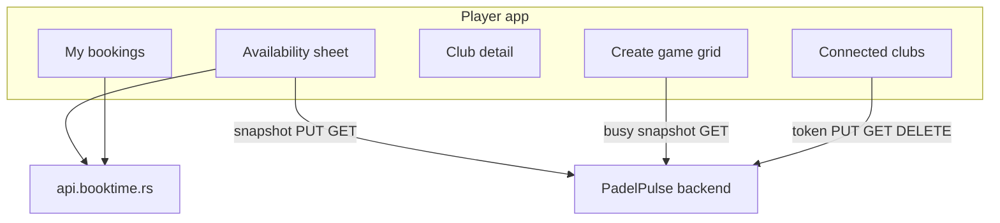

# Plan: Centralized BookTime club booking (Novi Sad)

Companion specs: [PLAN_CLUB_BOOKING_UX.md](./PLAN_CLUB_BOOKING_UX.md), [PLAN_CLUB_BOOKING_TECH.md](./PLAN_CLUB_BOOKING_TECH.md).

Decompilation reference (Padel City): `../Decomp/PadelCity/FINDINGS.md`, `api.json`, `simulator/`.

Verified against codebase 2026-06.

---

## Summary

Rebuild external club booking around **BookTime SaaS** (`api.booktime.rs`) for multiple Novi Sad clubs (same API, different `companyId`). Users connect per club via **phone + SMS OTP**, book courts in-app, and see **centralized bookings** across clubs.

| Layer | Responsibility |
|-------|----------------|
| **Frontend** | Phone/OTP, token refresh, slot fetch, price, create/cancel booking — direct to BookTime |
| **Backend** | Encrypt/store per-user club tokens; store **last busy-slot snapshot**; hand out **scout tokens** — **no BookTime proxy** for booking |
| **Club record** | Per-club **integration config** in DB (type + provider settings); court `externalCourtId` mapping |

**Do not** flood clubs from our backend: all BookTime HTTP from the browser (except token/snapshot persistence).

**No feature flags.** Integration is on wherever platform admin sets it on the club row in DB.

---

## Product goals

1. User sees **all their BookTime bookings** in one place (per connected club).
2. User sees **correct reserved slots** on the grid (merged with app games).
3. User can **book a slot** via BookTime API when connected to that club.
4. User **without** a club account: sees availability via scout token + public API; **Connect account** CTA to book.
5. Slot cache refreshes on club open, **max once per 5 minutes**; **force full re-fetch** after a successful booking.

Coexistence with game-centric model: booking is additive. After BookTime book → offer **Create game at this time** (pre-filled club/court/time). See [PLAN_CLUB_BOOKING_UX.md](./PLAN_CLUB_BOOKING_UX.md) for grid semantics (red = external busy).

---

## Per-club integration config (DB)

Replace legacy `integrationScriptName` / CRS scripts with explicit provider config on `Club`.

| Field | Purpose |
|-------|---------|
| `integrationType` | `null` = no external booking; `BOOKTIME` = BookTime; future: other providers |
| `integrationConfig` | JSON per type — e.g. BookTime: `{ "companyId": "uuid", "serviceIds": { "indoor": "...", "outdoor": "..." } }` |

**Rules:**

- Booking UI, connect flow, snapshots, and My bookings run **only** when `integrationType` is set for that club.
- No env feature flags; no city-wide toggle.
- Non-BookTime providers are **out of scope v1** — schema leaves room for later types in `integrationType` + `integrationConfig`.
- `Court.externalCourtId` maps provider resource id → internal court (BookTime `bookingResourceId`).

**Novi Sad rollout:** platform admin sets `integrationType: BOOKTIME` + `companyId` per club. Padel City example `companyId`: `d4130d78-a7e8-499d-90f0-92773ccc2f9c`.

---

## CORS (pre-requisite)

BookTime must allow browser origins for direct frontend calls. Verify manually (curl / browser devtools) before P1.

If auth CORS fails on web: Capacitor native shell or targeted proxy for token refresh only (last resort).

**Frontend client (started):** `Frontend/src/integrations/booktime/client.ts`, `config.ts`.

---

## Legacy removal (phase 0)

Replace server-side script integration (one club: CRS).

| Remove / replace | Notes |
|------------------|-------|
| `Backend/scripts/club-integrations/NoviSad/crs.js` | Only live legacy script |
| `ClubIntegrationService` script loader + in-memory cache | `Backend/src/services/clubIntegration/clubIntegration.service.ts` |
| `Club.integrationScriptName`, `integrationScriptDateIndependent` | → `integrationType` + `integrationConfig` |
| External branch in `bookedCourts.service.ts` | Occupancy from **snapshot API** |
| Club admin “integration active” from script name | → provider type + last sync time |

**Keep:** `Court.externalCourtId`, existing `integrationConfig` column (repurpose).

---

## BookTime API (Padel City reference)

Base: `https://api.booktime.rs`  
Public prefix: `/public` when unauthenticated.  
`companyId` injected in JSON bodies.

| Concern | Endpoint |
|---------|----------|
| Company + courts | `GET /public/company/{companyId}` |
| Available ranges (public) | `POST /public/booking-resources/get-available-slots` |
| Day bookings | `POST /booking-resources/get-for-day` — **auth required** |
| Login / OTP / signup | `/users/login`, `confirm-login`, `signup`, `confirm-signup` |
| Refresh | `POST /users/refresh-token` |
| Price / create / cancel | `get-price`, `POST /booking`, `PATCH /booking/cancel` |
| Lists | `get-upcoming`, `get-previous` |

Slot step 60 min; durations 60 or 120 min; 14 bookable days; 12h cancel window.

Client slot expansion: `Decomp/PadelCity/simulator/js/app.js` `parseSlots`.

---

## Snapshot contract

### What we store

**Busy slots only** — not a full free grid.

Each refresh **replaces the entire snapshot** for that club + date (all courts). Slots that became free are omitted on the next fetch, so we do not retain stale busy cells.

### Granularity

**Per club + per calendar day + per court** (internal `courtId`).

Normalized busy slot shape (aligns with legacy `ExternalCourtSlot`):

```ts
{
  courtId: string;           // internal Court.id
  externalCourtId: string;   // BookTime bookingResourceId
  startTime: string;         // ISO in club timezone
  endTime: string;
}
```

No multi-day prefetch in v1 — one date at a time when user views that day.

### How busy list is built (frontend on refresh)

1. `POST /booking-resources/get-for-day` with **user token** if connected, else **scout token** from backend pool.
2. Map response → busy intervals per `externalCourtId` → internal `courtId` via `Court.externalCourtId`.
3. Optionally cross-check with public `get-available-slots` for display (free ranges) in availability sheet only; **create-game red cells** use stored **busy snapshot** only.
4. `PUT` full replacement to backend for `(clubId, date)`.

### 5-minute rule

On club detail / availability sheet / create-game for a date:

```
GET snapshot(clubId, date)
if missing OR age > 5 min OR user just booked:
  full re-fetch from BookTime → PUT replace entire snapshot
else:
  use cached busy list
```

No cron. No incremental merge.

---

## Architecture



### Connection states (per club with BOOKTIME integration)

| State | UI | Busy slots source | Book? |
|-------|-----|-------------------|-------|
| Connected | Green chip + phone | User token → `get-for-day` on refresh | Yes |
| Not connected | Amber + Connect | Scout token → `get-for-day` on refresh | No — CTA on slot tap |
| Token expired | Reconnect | Last snapshot until refresh | No until reconnect |
| Scout degraded | “Availability approximate” | Stale snapshot or empty | View only |

### Scout token pool

For users without a club account (and for `get-for-day` when unauthenticated):

1. `GET /clubs/:id/booktime/scout-token` → random pooled token
2. Frontend uses for **`get-for-day` only** — never booking
3. On 401 → next token (max 3)
4. Opt-in when connected: “Help others see availability” (default on)

`get-for-day` is **auth-only** on BookTime; without user token we always use a scout token, not public API.

---

## Slot merge (create-game grid)

For each 30-min cell:

| Source | Result |
|--------|--------|
| Admin hold | Hard block (existing) |
| Snapshot busy interval on that court/time | Red `clubBooked` |
| App game | Yellow / red per `hasBookedCourt` (existing) |
| Otherwise | Free |

Expand each busy interval (typically 60 or 120 min) across all overlapping 30-min grid cells.

---

## Token lifecycle

```
1. After OTP: frontend PUT tokens to backend (encrypted)
2. On session start: GET auth status; load tokens into memory for BookTime calls
3. 401 from BookTime → POST refresh-token with stored refreshToken
4. Refresh fails → reconnect OTP sheet
5. Disconnect: DELETE backend auth; optional BookTime logout from frontend
```

Never return raw tokens from `GET .../auth`. Never log tokens.

---

## Backend (minimal)

### Prisma (target)

```prisma
enum ClubIntegrationType {
  BOOKTIME
  // future providers
}

// Club
integrationType    ClubIntegrationType?
integrationConfig  Json?   // BOOKTIME: { companyId, serviceIds?, ... }

model UserClubBooktimeAuth {
  id             String   @id @default(cuid())
  userId         String
  clubId         String
  externalUserId String
  phoneNumber    String?
  accessToken    String   // encrypted
  refreshToken   String   // encrypted
  expiresAt      DateTime?
  scoutOptIn     Boolean  @default(true)
  updatedAt      DateTime @updatedAt
  @@unique([userId, clubId])
}

model ClubBooktimeBusySnapshot {
  id        String   @id @default(cuid())
  clubId    String
  courtId   String
  date      String   // yyyy-MM-dd club TZ
  busySlots Json     // [{ startTime, endTime, externalCourtId? }]
  fetchedAt DateTime
  @@unique([clubId, courtId, date])
}
```

### API routes

| Method | Path | Purpose |
|--------|------|---------|
| GET | `/clubs/:clubId/booktime/auth` | Connected? phone? (no secrets) |
| PUT | `/clubs/:clubId/booktime/auth` | Store tokens after OTP |
| DELETE | `/clubs/:clubId/booktime/auth` | Disconnect |
| GET | `/clubs/:clubId/booktime/snapshot?date=` | All courts’ busy slots + `fetchedAt` |
| PUT | `/clubs/:clubId/booktime/snapshot` | Full replace for `date` (array of per-court rows) |
| GET | `/clubs/:clubId/booktime/scout-token` | Scout bearer for `get-for-day` |
| GET | `/booktime/my-clubs` | User’s connected BookTime clubs |

Only clubs with `integrationType = BOOKTIME` expose these routes.

---

## Frontend modules (target)

| Module | Role |
|--------|------|
| `integrations/booktime/client.ts` | BookTime HTTP |
| `integrations/booktime/slots.ts` | `parseSlots`, busy merge, grid overlap |
| `integrations/booktime/session.ts` | Memory token + refresh |
| `components/booktime/ConnectClubSheet.tsx` | Phone → OTP → signup |
| `components/booktime/AvailabilitySheet.tsx` | Date, duration, courts, book |
| `components/booktime/MyBookingsSection.tsx` | Aggregated upcoming/past |

Wire snapshot into `useBookedCourts` / `GameStartSection`.

Show booking entry points **only** when `club.integrationType === 'BOOKTIME'`.

---

## UX surfaces

### My bookings

- Parallel `get-upcoming` / `get-previous` per connected BookTime club
- Cancel, **Create game here**
- Clubs without integration: no BookTime row

### Club detail

- No integration → no book CTA (unchanged today)
- BOOKTIME → Connect / availability sheet / last updated

### Availability sheet

Simulator UX: date strip, duration, courts, slots, confirm + price. Not connected → Connect on book tap.

### Create-game grid

Red from busy snapshot. Optional **Book court now** when connected.

---

## Phased delivery

| Phase | Scope | Status |
|-------|--------|--------|
| **P0** | Remove CRS + script integration; `integrationType` / `integrationConfig`; remove My-tab test panel | Pending |
| **P1** | Busy snapshot API; create-game red from snapshot; availability view | Pending |
| **P2** | Connect sheet; token storage; scout pool | Pending |
| **P3** | Book + cancel + force snapshot refresh | Pending |
| **P4** | My bookings aggregate; create-game bridge | Pending |
| **P5** | i18n; club admin sync status; UI_TEST_PLAN rows | Pending |

---

## Resolved decisions

| # | Topic | Decision |
|---|-------|----------|
| 1 | Snapshot content | **Busy slots only**; each refresh **full replace** so freed slots disappear |
| 2 | Snapshot granularity | **Per club + day + court**; no multi-day prefetch |
| 3 | `get-for-day` | **Auth only**; unauthenticated → **scout token** (random from pool) |
| 4 | Feature flags | **None** — integration enabled only where set in DB on club |
| 5 | CORS test panel | **Removed** — do not ship on My tab |
| 6 | Non-BookTime clubs | **Later** — `integrationType` + `integrationConfig` per club for future providers |
| 7 | BookTime traffic | Frontend direct; backend tokens + snapshot only |
| 8 | Standalone booking | My bookings + book sheet; bridge to create-game |

---

## Code anchors

| Area | Path |
|------|------|
| BookTime client | `Frontend/src/integrations/booktime/client.ts` |
| Simulator reference | `Decomp/PadelCity/simulator/` |
| Legacy slot type | `Backend/src/services/clubIntegration/types.ts` `ExternalCourtSlot` |
| Legacy to remove | `Backend/scripts/club-integrations/NoviSad/crs.js`, `clubIntegration.service.ts` |
| Occupancy | `bookedCourts.service.ts`, `useBookedCourts.ts`, `GameStartSection.tsx` |

---

## Non-goals (v1)

- Payments in PadelPulse
- Non-BookTime provider implementations
- Server-side BookTime proxy for all requests
- Firebase social login to BookTime
- Env-based feature flags
