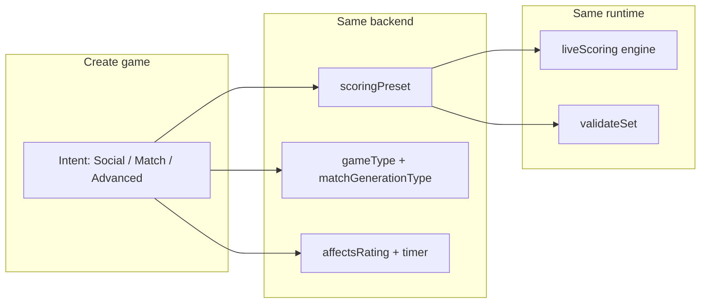

# Multisport formats — casual + official (product & implementation)

Companion to [PLAN_SPORT_SCORING_FORMATS.md](./PLAN_SPORT_SCORING_FORMATS.md) (presets, engines, validation), [PLAN_MULTISPORT.md](./PLAN_MULTISPORT.md), [PLAN_MULTISPORT_DEFERRED.md](./PLAN_MULTISPORT_DEFERRED.md), [PLAN_MULTISPORT_QUESTIONNAIRES.md](./PLAN_MULTISPORT_QUESTIONNAIRES.md), and [PLAN_SPORT_RATING_MODELS.md](./PLAN_SPORT_RATING_MODELS.md) (canonical 1–7 vs DUPR/UTR/SquashLevels display). **Unified execution hub** → [PLAN_MULTISPORT_RATINGS_FORMATS_IMPLEMENTATION.md](./PLAN_MULTISPORT_RATINGS_FORMATS_IMPLEMENTATION.md).

**North star:** One app, **one rulebook**, many named presets. Users choose **intent** (social club night vs match under standard rules), not a different product per sport.

**Multisport UX:** Sport is metadata on relationship-first flows — no global “sport mode” switcher ([PLAN_MULTISPORT.md](./PLAN_MULTISPORT.md)).

---

## Dual track: social vs match

| Track | User intent | Typical knobs | Today in code |
|-------|-------------|---------------|---------------|
| **Social** (“casual”) | Meet people, finish on time, low stakes | `POINTS_*` or short rally; `AMERICANO` / `MEXICANO`; `affectsRating: false`; timer | `ScoringMode.POINTS`, `matchGenerationType: RANDOM` |
| **Match** (“official rules”) | Real match structure, league, rating | `CLASSIC_*` / `BEST_OF_*_*`; `gameType: CLASSIC`; `affectsRating: true` | `ScoringMode.CLASSIC`, `validateSet.ts` |
| **Advanced** | Power hosts | Full `GameFormatWizard` | `CreateGame` + wizard today |

**Rule:** Same live scoring, results entry, and Watch pipeline for both tracks — only **defaults, labels, allowlists, and optional strict validation** differ.

---

## Three layers (do not conflate)

| Layer | Social track | Match track | Implementation |
|-------|--------------|-------------|----------------|
| **A. Score math** | Ball budget, timed cap, FAST4 social | Bo3×21, Bo5×11, classic sets | `scoringPreset` → `rulebook.ts` / `isLegalSetScore` |
| **B. Event shape** | Americano, Mexicano, KOTC (future) | Fixed teams, league fixture, bracket | `gameType` / `matchGenerationType` |
| **C. Officiating** | Hints, honor buttons, skip serve coach | Stricter coach; future caps/faults | Mostly deferred — [PLAN_MULTISPORT_DEFERRED.md](./PLAN_MULTISPORT_DEFERRED.md) |

Ship **A + B** for every sport on both tracks. Grow **C** per sport only when product asks for “strict” mode — never block social on full kitchen enforcement.



---

## Create flow: intent first, details second

Extend today’s `ScoringMode` split (`Frontend/src/utils/gameFormat/scoringCompatibility.ts`: `CLASSIC` vs `POINTS`).

### Step 1 — What kind of session?

```text
○ Social / club night     → templates, rotation OK, rating off by default
○ Match (standard rules)  → structured presets, classic pairing, rating on optional
○ Advanced format         → existing GameFormatWizard (unchanged)
```

### Step 2 — Sport-filtered choices

| Branch | Show | Hide or demote |
|--------|------|----------------|
| **Social** | Templates + `PresetTier: social` | Full classic ladder unless padel host expands |
| **Match** | Templates + `PresetTier: match` | Raw `POINTS_*` unless labeled “social only” |
| **Advanced** | All `allowedScoringPresets` for sport | — |

### Step 3 — Optional knobs (both tracks)

Host can override defaults: `affectsRating`, timer, `playersPerMatch`, level band, public/join rules.

---

## Preset metadata (`PresetTier`)

Add to **sport registry** (BE + FE) — metadata only, **no duplicate engines**:

```ts
type PresetTier = 'social' | 'match' | 'both';

type SportPresetMeta = {
  preset: ScoringPreset;
  tier: PresetTier;
  labelKey: string;              // i18n: plain language
  defaultFor?: 'social' | 'match';
  strictValidation?: StrictValidationId;  // optional official caps
};

type StrictValidationId =
  | 'NONE'
  | 'BWF_21'           // 30-point game cap at 20-20
  | 'PICKLEBALL_RALLY_11'
  | 'CLASSIC_TENNIS';  // future FAST4 branch
```

### Example matrix (per sport)

| Preset | Tier | Social label | Match label |
|--------|------|--------------|-------------|
| `POINTS_24` | social | Padel: Americano (24 balls) | — |
| `CLASSIC_BEST_OF_3` | match | — | Padel / tennis: Best of 3 sets |
| `BEST_OF_3_21` | match | — | Badminton: Official 3×21 |
| `BEST_OF_3_15` | both | Badminton: Club 3×15 | Badminton: Official 3×15 (BWF 2027) |
| `POINTS_21` (badminton) | social | 21 balls total (rotation) | — |
| `BEST_OF_3_11` (pickleball) | match | — | Game to 11, best of 3 |
| `POINTS_21` (pickleball) | social | Ball budget (open play) | — |
| `BEST_OF_5_11` | match | — | Squash: Bo5 to 11 |

**i18n:** Use `gameFormat.scoring.{preset}.sport.{SPORT}` and `gameFormat.scoringShort.{preset}BySport.{SPORT}` ([gameFormatI18n.ts](../Frontend/src/utils/gameFormat/gameFormatI18n.ts)) so the same enum never sounds “official” when it is a ball budget.

---

## Create templates (bundle knobs)

Templates reference `templateId` + full payload — not just preset:

```ts
type CreateTemplateId =
  | 'PADEL_AMERICANO_24'
  | 'PADEL_MEXICANO_24'
  | 'PICKLEBALL_SOCIAL_21'
  | 'PICKLEBALL_MATCH_BO3_11'
  | 'BADMINTON_CLUB_3X15'
  | 'BADMINTON_MATCH_3X21'
  | 'TT_BOX_BO3_11'
  | 'TENNIS_FAST4_SOCIAL'
  | 'TENNIS_CLASSIC_BO3'
  | 'SQUASH_QUICK_BO3_11';

type CreateTemplate = {
  id: CreateTemplateId;
  sport: Sport;
  tier: 'social' | 'match';
  scoringPreset: ScoringPreset;
  gameType: GameType;
  matchGenerationType: MatchGenerationType;
  playersPerMatch: 2 | 4;
  suggestedMaxParticipants: number;
  suggestedCourts: number;
  affectsRating: boolean;
  matchTimerEnabled?: boolean;
  matchTimedCapMinutes?: number;
  expectedDurationLabelKey?: string;
};
```

| Template (examples) | Tier | Sport |
|---------------------|------|-------|
| Americano (24 pts) / Mexicano | social | Padel |
| Open play — 21 balls / Best of 3 to 11 | social / match | Pickleball |
| Club 3×15 / Official 3×21 | both / match | Badminton |
| Box night Bo3×11 | social | Table tennis |
| FAST4 social / Classic Bo3 | social / match | Tennis |
| Quick Bo3×11 / PAR 15 | match | Squash |

**Registry:** `createTemplates: CreateTemplateId[]` on `SportConfig` — which templates appear in create UI per sport.

---

## Orthogonal knobs (combine any tier)

| Knob | Social default | Match default | Code |
|------|----------------|---------------|------|
| `affectsRating` | `false` | `true` (host can flip) | `Game.affectsRating` |
| `matchGenerationType` | `RANDOM` / `RATING` | `AUTOMATIC` / `HANDMADE` / `FIXED` | `roundGenerator.ts` |
| `gameType` | `AMERICANO`, `MEXICANO`, … | `CLASSIC` | `deriveGameType()` |
| `matchTimerEnabled` | often `true` | optional | `matchTimer.service` |
| `hasGoldenPoint` | padel social classic | padel competitive | `getRules()` |
| Level band on create | wide (2–5) | narrow | `minLevel` / `maxLevel` |
| Find filter | “Social”, no rating | “Match”, sport level | Find (proposed) |

---

## Validation: shared core + strict branch

**Shared:** `isLegalSetScore` in `Frontend/src/utils/scoring/validateSet.ts` (mirrored BE live) — win-by-2, set kinds, tie-break races.

**Match-only extensions** via `strictValidation` on preset meta:

| ID | Behavior |
|----|----------|
| `NONE` | Current validators |
| `BWF_21` | Game capped at 30 when score reaches 29–29 |
| `PICKLEBALL_RALLY_11` | Rally game to 11 win-by-2 (`isRallyPointsRules`), not ball-budget `POINTS_*` |
| `CLASSIC_TIMED_RELAXED` | Already: incomplete games at buzzer |

**Social:** `NONE` + relaxed timed (`allowIncompleteRegularSetGames`). Do not apply BWF cap to `POINTS_21` ball budget.

---

## Live scoring & Watch

| | Social | Match |
|--|--------|--------|
| Tap / engine | Same `liveScoring` plugins | Same |
| Serve coach | Off for pure `POINTS_*` Americano; opt-in for rally | On by default for classic / `BEST_OF_*` |
| Officiating | Hints + honor (pickleball kitchen button) | Same + future `officiatingLevel: strict` |

Proposed game-level flag (future):

```ts
officiatingLevel?: 'none' | 'hints' | 'strict';
```

Default: `none` for social templates, `hints` for match templates. See [PLAN_WATCH_SERVE_GUIDE_UX.md](./PLAN_WATCH_SERVE_GUIDE_UX.md).

---

## Rotation formats (`rotationFormats`)

Social track only — gate `AMERICANO` / `MEXICANO` / `WINNER_COURT` / `LADDER` per sport ([PLAN_SPORT_SCORING_FORMATS.md](./PLAN_SPORT_SCORING_FORMATS.md)).

```ts
type RotationPolicy = {
  americano: boolean;
  mexicano: boolean;
  winnersCourt: boolean;
  ladder: boolean;
  minRotationRoster?: number;
  defaultAmericanoPreset?: ScoringPreset;
};
```

| Sport | americano | mexicano | winnersCourt | ladder | Match-track note |
|-------|-----------|----------|--------------|--------|------------------|
| Padel | ✓ | ✓ | ✓ | ✓ | Also classic league |
| Tennis | ✗ | ✗ | ✗ | ✗ | FAST4 / classic only |
| Pickleball | ✓ (4p) | ✓ | ✓ | opt | + `BEST_OF_3_11` match template |
| Badminton | ✓ (4p) | ✓ | ✓ | opt | + `BEST_OF_3_15` / `BEST_OF_3_21` |
| Table tennis | ✓ (4p) | ✓ | opt | opt | + `BEST_OF_3_11` |
| Squash | ✗ | ✗ | opt* | ✓ | Bo3/Bo5 match; box ladder |

\*WC as ladder metaphor, not 4-player padel-style WC.

**Singles blocker:** `random.ts` builds `teamA`/`teamB` as two IDs — fix before 1v1 social rotation ([PLAN_SPORT_SCORING_FORMATS.md](./PLAN_SPORT_SCORING_FORMATS.md) Track 2).

---

## Americano on other sports

| Layer | Verdict |
|-------|---------|
| Engine | Sport-blind |
| Policy | Blocked outside padel today (`allowedGameTypes`) |
| Doubles | Works when allowed + `POINTS_*` |
| Singles | Broken until generator fix |

| Sport | Social (rotation) | Match (no rotation) |
|-------|-------------------|---------------------|
| Padel | Excellent | Classic Bo3, leagues |
| Pickleball | Doubles nights | Game to 11, Bo3 |
| Badminton / TT | After singles fix | `BEST_OF_*` |
| Tennis | Avoid as default | FAST4, classic |
| Squash | Poor | Box ladder, Bo3/Bo5 |

---

## Casual jobs-to-be-done

| Job | Success feels like |
|-----|-------------------|
| **Show up** | Find game at my level |
| **Belong** | Rotate partners; not stuck with one weak link |
| **Finish on time** | ~2h, timer trusted |
| **Low stakes** | Rating off / social badge |
| **Low admin** | Template, not wizard |
| **Come back** | Play again / series |

---

## Match-track jobs-to-be-done

| Job | Success feels like |
|-----|-------------------|
| **Fair result** | Score lines validate like real sport |
| **Rating trust** | `affectsRating` + per-sport level |
| **League integrity** | Fixed teams, classic fixtures |
| **Clear rules** | “3×21 badminton” not “21 balls” |

---

## What Bandeja already ships

| Area | Social | Match |
|------|--------|-------|
| Formats | Americano, Mexicano, WC, Ladder | CLASSIC, league fixtures, bracket |
| Scoring | `POINTS_*`, `TIMED` | `CLASSIC_*`, `BEST_OF_*` (partial per sport) |
| Rating | `affectsRating: false` | `affectsRating: true` |
| Discovery | Find + level | Same + league |
| Multisport | Questionnaires per sport | Same |
| Watch | Live + serve coach | Same |

**Gaps:** templates, `PresetTier`, strict validation flags, singles rotation, pickleball match presets, FAST4, Find tier filters, KOTC, timer parity on weak rally presets.

---

## Seven product pillars (both tracks)

### 1. Templates + tier labels (C0)

Highest leverage — implements dual track in UI without new engines.

### 2. Time promise (C4)

Round timer, duration on card, rally timer freeze — social track critical.

### 3. Psychological safety (social)

`affectsRating` off, wide levels, “no rating” Find filter, multisport level copy.

### 4. In-play guidance (both)

Hints for all; strict enforcement deferred.

| Sport | Social | Match |
|-------|--------|-------|
| Padel | Serve coach | + golden point |
| Tennis | Timed / FAST4 copy | Classic + FAST4 engine |
| Pickleball | Ball budget label | Game to 11 |
| Badminton | 21-ball social | 3×15 / 3×21 |
| TT | Bo3 social | Bo3/Bo5 |
| Squash | — | PAR 11/15 |

### 5. Discovery

Find: **tier** (social / match), `gameType`, no-rating, spots open. Card: **“Social · Americano · ~2h”** vs **“Match · 3×21”**.

### 6. Scheduling formats

KOTC, challenger pool, Swiss, RR — mostly **social** track engineering.

### 7. After game

Share card, light stats (social), play again — both tracks.

---

## Per-sport playbook

### Padel
| Social | Match |
|--------|-------|
| Americano 24, Mexicano, WC | Classic Bo3, golden point |
| KOTC, `POINTS_12` | League + bracket |

### Tennis
| Social | Match |
|--------|-------|
| FAST4, timed hit, rating off | `CLASSIC_BEST_OF_3`, league |
| No Americano default | No session Americano in league |

### Pickleball
| Social | Match |
|--------|-------|
| `POINTS_21` (labeled ball budget), Americano 4p | `BEST_OF_3_11`, rally to 11 |
| Side-out explainer once | USAPA-style structure (validation) |

### Badminton
| Social | Match |
|--------|-------|
| `POINTS_15` / `POINTS_21` | `BEST_OF_3_15`, `BEST_OF_3_21` + `BWF_21` strict |
| Americano after singles fix | League classic |

### Table tennis
| Social | Match |
|--------|-------|
| Americano, Bo3 social | `BEST_OF_3_11`, `BEST_OF_5_11` |
| Swiss / KOTC later | Club competition |

### Squash
| Social | Match |
|--------|-------|
| Box ladder | `BEST_OF_3_11`, `BEST_OF_5_11`, PAR 15 opt |
| No Americano | Singles only |

---

## Leagues & tournaments

```text
                         Social track              Match track
                         ────────────              ───────────
Ad-hoc game              Template tier=social      Template tier=match

Regular league           Short, wide levels,       CLASSIC fixtures,
                         affectsRating optional    affectsRating on

Session playoff          Americano / WC            Same where rotationFormats
                         (sport-gated)             + match presets for finals

Bracket                  Rare; points evening      CLASSIC Bo3 (all sports)
```

**Rules:**
1. `LeagueSeason.sport` drives allowlists — wired.
2. Playoff `AMERICANO` only if `rotationFormats.americano`.
3. Bracket always CLASSIC — [PLAN_LEAGUE_BRACKET_PLAYOFF.md](./PLAN_LEAGUE_BRACKET_PLAYOFF.md).
4. “Casual league” = season template with social defaults, not new engine.

---

## Implementation order (unified)

| Phase | Work | Track |
|-------|------|-------|
| **D0** | `PresetTier` + `createTemplates` on registry; i18n BySport labels | Both |
| **D1** | Create: Social / Match / Advanced branches | Both |
| **C0** | Templates ship with knob bundles | Both |
| **C1** | New presets (`BEST_OF_3_15`, pickleball 11, squash Bo3) | Match (+ both tier) |
| **C2** | `strictValidation` hooks in `validateSet` | Match |
| **C3** | Singles rotation + `rotationFormats` | Social |
| **C4** | Find/card tier badges; no-rating filter | Both |
| **C5** | Timer / round timer / rally freeze | Social |
| **C6** | KOTC, challenger pool | Social |
| **C7** | FAST4; ROUND_ROBIN or Americano fallback | Match / social |
| **C8** | Share, play again, stats | Both |

Aligns with preset/rotation tracks in [PLAN_SPORT_SCORING_FORMATS.md](./PLAN_SPORT_SCORING_FORMATS.md). Full unified schedule (ratings + formats + rotation): [PLAN_MULTISPORT_RATINGS_FORMATS_IMPLEMENTATION.md](./PLAN_MULTISPORT_RATINGS_FORMATS_IMPLEMENTATION.md#implementation-order-d0c8--formats).

---

## Do not build

- Two scoring engines or “casual app” fork.
- Global sport switcher.
- Same `GAME_TYPES` on every sport.
- Full officiating blocking social launch.
- `CUSTOM` on social create without templates.
- DUPR/UTR/NTRP before internal bands work ([PLAN_SPORT_RATING_MODELS.md](./PLAN_SPORT_RATING_MODELS.md)).

---

## Decision log

| Question | Answer |
|----------|--------|
| Casual + official together? | Yes — **tier + templates + strict flags**, one rulebook. |
| How user picks? | Social / Match / Advanced at create; templates inside first two. |
| Same preset, two uses? | `tier: both` (e.g. `BEST_OF_3_15`) with clear labels. |
| Americano on all sports? | Social track only where `rotationFormats`; fix singles first. |
| Officiating vs scoring? | Scoring in v1; officiating `hints` now, `strict` later. |
| `POINTS_21` badminton? | **Social only** in UI; match uses `BEST_OF_3_*`. |

---

## Related code

| Area | Path |
|------|------|
| Scoring mode split | `Frontend/src/utils/gameFormat/scoringCompatibility.ts` |
| Rulebook | `Frontend/src/utils/scoring/rulebook.ts`, BE `liveScoringEngine/rulebook.ts` |
| Validation | `Frontend/src/utils/scoring/validateSet.ts` |
| Live plugins | `Frontend/src/liveScoring/registry.ts` |
| Round gen | `Backend/src/services/results/generation/` |
| Sport gate | `Backend/src/sport/sportRegistry.ts`, `validateGameForSport.ts` |
| Create | `Frontend/src/pages/CreateGame.tsx`, `GameFormatWizard.tsx` |
| Leagues | `Backend/src/services/league/gameCreation.util.ts` |
| i18n | `Frontend/src/utils/gameFormat/gameFormatI18n.ts` |
