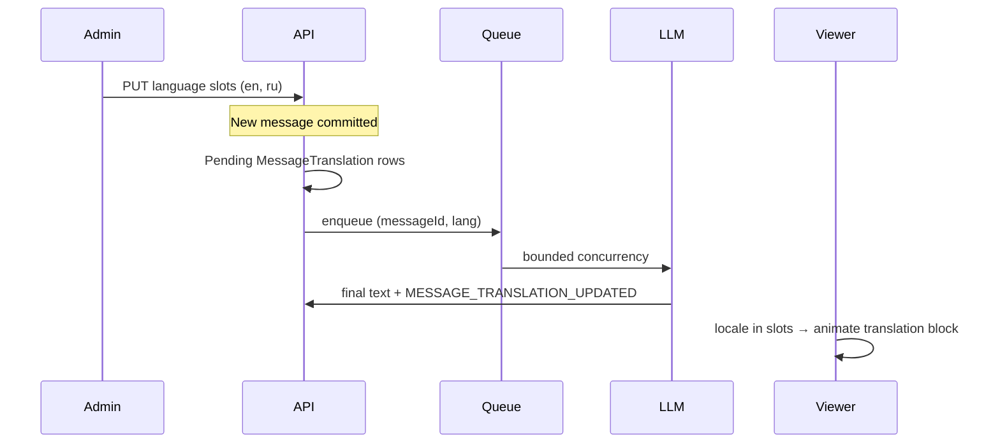

# Plan: Chat auto-translation (shared language slots)

## Implementation status (2026-05-15)

| Phase | Status |
|-------|--------|
| A — Config + UI | [x] |
| B — Queue + background | [x] |
| C — Live UI + motion | [x] |
| D — Polish (voice backfill, metrics) | [x] |

**Shipped:** `ChatAutoTranslateConfig`, `TranslationJob`, global queue worker, GET/PUT `/api/chat/auto-translate-config`, enqueue on message create/edit, socket `chat:message-translation` + `chat:auto-translate-config`, slots UI in group settings + sheet in `GameChat`, animated translation reveal when viewer locale matches, backfill on new slot languages (`TRANSLATION_BACKFILL_MESSAGE_LIMIT`), voice enqueue after transcription, admin translation queue dashboard (`GET /admin/translation-queue/stats`).

---

## How it works (30-second overview)

1. **Admin** (or both users in a DM) fills **language slots** for the chat (e.g. EN, RU).
2. On every **new or edited** text message, the server creates **pending** `MessageTranslation` rows and adds jobs to a **global queue** (bounded LLM concurrency).
3. A **worker** translates each `(messageId, languageCode)` and emits `MESSAGE_TRANSLATION_UPDATED`.
4. A **viewer** only gets the dual-block UI (original + translation) when their **app locale** matches one of the configured slot languages and the translation row is ready.
5. **Compose “translate before send”** stays a separate, per-user feature — not this plan.



## Glossary

| Term | Meaning |
|------|---------|
| **Slots** | Shared chat config: ordered target languages set by editors (`ChatAutoTranslateConfig`) |
| **Compose translate** | Per-user draft translation (`ChatTranslationPreference`, `TranslateToButton`) — unchanged |
| **Pending row** | `MessageTranslation.translation === MESSAGE_TRANSLATION_PENDING` until worker finishes |

## Goals

- Up to **2** slot languages when participant count &lt; 3; **3** when ≥ 3.
- **Background** translate on new message + text edit via **global queue** (no AI provider flood).
- **Slots UI** (three fixed positions, not a list).
- **Animated** in-thread reveal when translation arrives and viewer locale matches.

## Non-goals (v1)

- Replacing compose “translate before send” (`ChatTranslationPreference`).
- Auto-translating thread list previews or push notification bodies.
- Voice auto-translate until transcription exists (Phase D).
- BullMQ or a separate job runner (v1 uses DB + in-process worker; **Redis** optional for wake/locks/cache only).
- Backfill of old messages when slots are first saved (Phase D optional).

## Decisions locked

| Topic | Choice |
|-------|--------|
| Queue storage (v1) | **DB table `TranslationJob`** + worker in API process; optional **Redis** wake pub/sub, claim locks (multi-instance), config cache (no BullMQ) |
| GAME scope | **Separate config per `chatType`** (`PUBLIC` / `PRIVATE` / `ADMINS`) — same key as `chatSyncTailKey` |
| Manual “Translate” in menu | **Enqueue high priority**; sync wait for menu UX |
| Who sees dual-block UI | User locale in slots (or manual translate for user locale) + non-pending translation |
| Language allowlist | `TRANSLATE_TO_LANGUAGE_CODES` in `Backend/src/services/chat/translation.service.ts`; UI: `Frontend/src/utils/translationLanguages.ts` |

## Code anchors

**Backend:** `chatAutoTranslate.service.ts`, `translationQueue.service.ts`, `chatAutoTranslateEnqueue.service.ts`, `translation.service.ts`, `message.service.ts`, `chat.controller.ts`, `socket.service.ts`, `server.ts`

**Frontend:** `chatAutoTranslate.ts`, `useChatAutoTranslateConfig.ts`, `ChatAutoTranslateSlots.tsx`, `useGameChatAutoTranslate.ts`, `useGameChatTranslationLive.ts`, `ChatAutoTranslateContext.tsx`, `MessageItem.tsx`, `MessageBubble.tsx`, `GroupChannelSettings.tsx`, `GameChat.tsx`

## API contract

```http
GET /api/chat/auto-translate-config?chatContextType=GROUP&contextId={id}
GET /api/chat/auto-translate-config?chatContextType=GAME&contextId={gameId}&chatType=PUBLIC

200 OK → { "languageCodes": ["en","ru"], "maxSlots": 2, "canEdit": true }
```

```http
PUT /api/chat/auto-translate-config
{ "chatContextType", "contextId", "chatType?", "languageCodes": [] }
```

## Env (Backend)

- `TRANSLATION_QUEUE_CONCURRENCY` (default 3)
- `TRANSLATION_QUEUE_MIN_INTERVAL_MS` (default 300)
- `TRANSLATION_QUEUE_POLL_INTERVAL_MS` (default 500)
- `TRANSLATION_QUEUE_MAX_ATTEMPTS` (default 3)
- `TRANSLATION_QUEUE_STALE_RUNNING_MS` (default 120000)
- `TRANSLATION_BACKFILL_MESSAGE_LIMIT` (default 100)
- `REDIS_URL` (optional; same as Socket.IO — wake channel, distributed claim locks, auto-translate config cache)

## Testing checklist

- [ ] USER DM: both edit; max 2 slots; third disabled
- [ ] Group: 2 → max 2; 5 → max 3
- [ ] Non-admin PUT → 403
- [ ] New message → queue → translations
- [ ] Matching locale → animated block
- [ ] Edit → translation cleared → replaced
- [ ] Manual menu translate + compose button unchanged
- [ ] GAME tab switch → correct config per `chatType`
