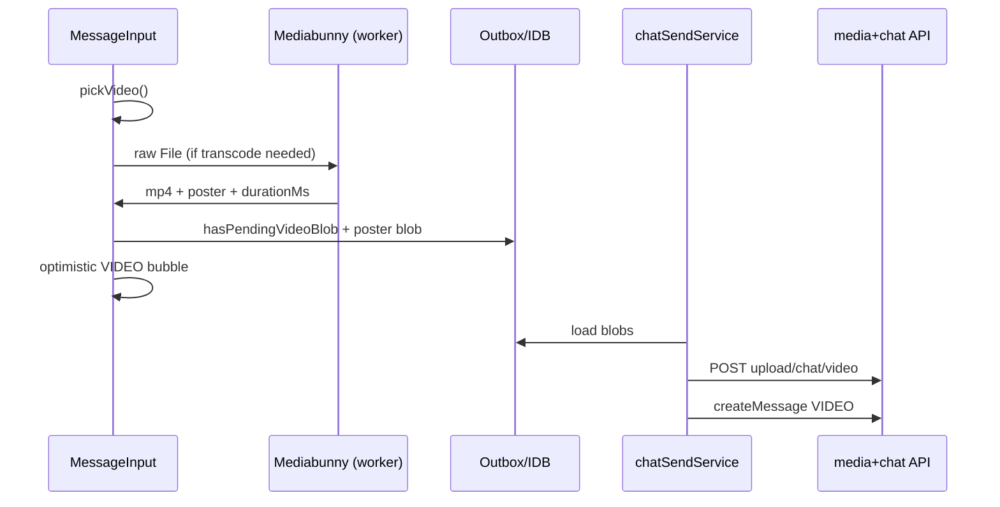

# Plan: Chat video attachments (Telegram-style)

## Context

`GameChat.tsx` orchestrates threads; media lives in **MessageInput → outbox → `chatSendService` → `MessageBubble`**. Images use client JPEG compression + `thumbnailUrls`; voice is a separate `messageType` with its own bubble. **`VIDEO` is implemented** (May 2026): dedicated bubble, explicit `messageType` on create, Mediabunny transcode, outbox blobs, upload + fullscreen playback.

Video attach is **always enabled** (no feature flag). Picking uses `pickVideo()` (`videoCapture.ts`) — system `accept="video/*"` on web and Capacitor (no `READ_MEDIA_VIDEO`).

**Verification:** static review + Vitest (`test:chat-outbox`); **device E2E not run**. See [§12](#12-verification-findings-may-2026-updated) and [§13](#13-next-steps).

## Non-goals (initial slice)

- Round video notes (Telegram circles) — rectangular only in v1
- HLS / adaptive streaming — progressive MP4 first
- `ffmpeg.wasm` in the browser bundle — prefer Mediabunny + WebCodecs
- Autoplay inline in the message list
- Replacing Dexie/outbox architecture
- Edit-message for video in v1 (align with voice: no edit in `UnifiedMessageMenu`)
- Mixing video + images in one message (single asset like voice)
- Incrementing game `photosCount` for video (`PHOTOS` tab is image-only)

## Code anchors (existing)

| Concern | Location |
|---------|----------|
| Thread UI | `Frontend/src/pages/GameChat.tsx` |
| Attach menu | `Frontend/src/components/chat/MessageInputAttachMenu.tsx` |
| Image compress/upload | `chatOutboxImageCompress.ts`, `chatImageUploadRetry.ts` |
| Voice send | `useMessageInputVoiceSend.ts`, `AudioMessageBubble.tsx` |
| Voice send in coordinator | `chatSendService.ts` (~L144–166) |
| Image batch upload | `messageInputImageUpload.ts` |
| Media grid | `MessageMediaGrid.tsx`, `ChatMediaImage.tsx` |
| Fullscreen images | `FullscreenImageViewer.tsx` |
| Media cache / CDN resolve | `chatMediaCache.ts`, `audioWaveformUtils.resolveChatMediaUrl` |
| Outbox blobs | `chatOutboxMediaBlobs.ts`, `chatLocalDb.ts` (`kind: 'image' \| 'voice' \| 'video'`) |
| Upload progress (send) | `videoUploadProgressStore.ts` → `ChatVideoBubble` overlay |
| Outbox list hint | `chatListSort.ts`, `ChatListOutboxLine.tsx` — `previewKind: 'video'` |
| Outbox persist | `chatOutboxPersist.ts` |
| Optimistic messages | `useGameChatOptimistic.ts` |
| Send coordinator | `chatSendService.ts`, `chatSendMessageCreate.ts`, `chatSendCoordinator.ts` |
| Upload phase timeout | `SEND_UPLOAD_PHASE_MS = 30_000` (too low for video — see §3) |
| Backend upload | `Backend/src/routes/media.routes.ts`, `media.controller.ts` |
| Controller passes `messageType` | `chat.controller.ts` — `VOICE` + **`VIDEO`** + `thumbnailUrls` + `videoDurationMs` |
| Message type resolution | `resolveOutgoingChatMessageType.ts` + `message.service.ts` — POLL → VOICE → **VIDEO** → IMAGE → TEXT |
| Thumbnail auto-gen | VIDEO skips `generateThumbnailUrls`; uses client poster URLs |
| Video URL allowlist | `isAllowedChatVideoMediaUrl()` + `isAllowedChatVideoThumbnailUrl()` |
| Video pick (Capacitor) | `Frontend/src/utils/videoCapture.ts` (`pickVideo`) |
| Transcode | `chatVideoTranscode.ts` → `chatVideoTranscodeWorkerClient.ts` + `chatVideoTranscode.worker.ts` + `chatVideoTranscodeCore.ts` (dynamic `mediabunny`) |
| Last-message preview | `[TYPE:VIDEO]m:ss` in `lastMessagePreview.service.ts` |
| Push body | `🎬 Video (m:ss)` in `notification-base.ts` |
| Prisma | `MessageType` includes **`VIDEO`**; migration `20260515133459_add_chat_video_message_type` |
| Multer limits | Images **32 MB**, audio **15 MB**, video **100 MB** (`uploadChatVideoMulter`) |

### Read-first implementation references

1. Voice: `useMessageInputVoiceSend.ts` + `chatSendService` voice branch
2. Images: `messageInputImageUpload.ts` + `chatImageUploadRetry.ts`
3. Fullscreen: `FullscreenImageViewer.tsx`
4. Cache: `ChatMediaImage.tsx` + `chatMediaCache.ts`

---

## 1. Product model (Telegram-aligned)

| Aspect | Recommendation |
|--------|----------------|
| Shape | Rectangular inline video (not round video notes in v1) |
| Bubble | Poster + play + duration; upload/send overlay when pending |
| Tap | Fullscreen player (like `FullscreenImageViewer`) |
| Playback | One active inline/fullscreen video at a time (mirror `audioPlaybackStore`) |
| PiP | `HTMLVideoElement.requestPictureInPicture()` where supported |
| Limits | See `Frontend/src/constants/chatVideo.ts` (e.g. **3 min**, **720p**, **~50 MB** after encode) |
| Format | **H.264 + AAC in MP4** (progressive download, broad mobile support) |

Reuse patterns from voice (dedicated `messageType`, single `mediaUrls[0]`) and images (`thumbnailUrls[0]` poster).

### `MessageBubble` routing

| `messageType` | Renderer |
|---------------|----------|
| `VOICE` | `AudioMessageBubble` |
| `VIDEO` | `ChatVideoBubble` |
| else + `mediaUrls` | `MessageMediaGrid` |

---

## 2. Data model

### Prisma / API

```prisma
enum MessageType {
  TEXT
  IMAGE
  VOICE
  VIDEO   // new
  POLL
}

model ChatMessage {
  // ...existing...
  videoDurationMs Int?
  videoWidth      Int?   // optional
  videoHeight     Int?   // optional
}
```

### API contract (copy-paste)

```ts
// POST /media/upload/chat/video
interface ChatVideoUploadResponse {
  videoUrl: string;
  thumbnailUrl: string;
  durationMs: number;
  width: number;
  height: number;
}

// POST createMessage (body additions)
{
  messageType: 'VIDEO';
  mediaUrls: [videoUrl];
  thumbnailUrls: [posterUrl];   // required in practice — do not rely on server auto-gen
  videoDurationMs: number;
  // optional: videoWidth, videoHeight
}
```

Extend `CreateMessageRequest`, `OptimisticMessagePayload`, and `ChatMessage` in `Frontend/src/api/chat.ts`.

### Critical: explicit `messageType` on create (like voice, unlike images)

**Implemented.** Controller accepts `VIDEO`, `videoDurationMs`, `videoWidth`/`videoHeight`, and `thumbnailUrls`. Clients must still send `messageType: 'VIDEO'` — URLs alone would resolve to `IMAGE`.

Legacy clients or bugs that omit `messageType` will still store video URLs as `IMAGE` and render in `MessageMediaGrid`.

### Thumbnail policy (trap)

`generateThumbnailUrls(mediaUrls)` only rewrites paths under `/uploads/chat/originals/`. Video lives under `/uploads/chat/videos/`.

For `VIDEO`:

- **Use client-supplied `thumbnailUrls`** from upload (recommended), and in `MessageService` set  
  `thumbnailUrls = resolvedMessageType === VIDEO ? clientThumbnails : …`  
  **without** running `generateThumbnailUrls` on the video URL, **or**
- Extend `generateThumbnailUrls` with a `videos/` → `thumbnails/` rule.

Voice forces `thumbnailUrls: []`; video **must keep** poster URLs end-to-end.

### S3 key layout

```
uploads/chat/videos/{uuid}.mp4
uploads/chat/thumbnails/{uuid}_poster.jpg   // same thumbnails prefix as chat images
```

Add `isAllowedChatVideoMediaUrl()` mirroring voice: `^uploads/chat/videos/[a-zA-Z0-9._-]+$` + CloudFront host check.

### Outbox (IndexedDB)

- `OutboxMediaBlobRow.kind`: `'image' | 'voice' | 'video'`
- `ChatOutboxRow`: `hasPendingVideoBlob` (single blob like voice)
- `chatOutboxMediaBlobs.ts`: `videoRowId`, `loadOutboxVideoBlob`, delete helpers
- `messageQueueStorage.ts`: `commitPendingVideoUploaded`
- Dexie: bump `chatLocalDb` version if schema/row shape changes (follow v10→v15 pattern)
- **`chatOutboxPersist.ts`**: compress poster JPEG only — **never** run image compress on MP4 blob

### Outbox state machine

```
pick (pickVideo) → probe → transcode (Mediabunny in worker; main-thread fallback) → poster JPEG (main thread)
  → persist: { hasPendingVideoBlob, video + video-poster blobs, videoDurationMs, videoTranscodeMs }
  → send: upload video + poster → commitPendingVideoUploaded
  → createMessage(VIDEO, mediaUrls, thumbnailUrls, videoDurationMs)
```

`useGameChatOptimistic.ts`: `pendingVideoBlob` + `pendingVideoPosterBlob`; Dexie **v16**. `ChatOutboxRow.videoTranscodeMs` feeds `chat_send_succeeded` metrics.

---

## 3. Compression & upload architecture

### Recommended stack (2025–2026)

| Layer | Choice | Why |
|-------|--------|-----|
| **Client transcode** | **[Mediabunny](https://mediabunny.dev/)** | Tree-shakable, WebCodecs-based, MP4/H.264; no ~25MB WASM like `@ffmpeg/ffmpeg` |
| **Poster frame** | Mediabunny sample **or** `<video>` + canvas at t≈0.5s | Telegram-style thumb |
| **Worker** | `chatVideoTranscode.worker.ts` | **Implemented** — Mediabunny in module worker; falls back to main thread if `Worker` unavailable |
| **Upload** | `axios` `onUploadProgress` | Wired in `mediaApi.uploadChatVideo` → `chatSendService` → `videoUploadProgressStore` → bubble bar |
| **Server fallback (phase E)** | `fluent-ffmpeg` on Node | If WebCodecs unavailable or client encode fails |
| **Bundle** | Dynamic `import()` of transcode module | Avoid bloating initial chat chunk |

**Avoid** `ffmpeg.wasm` in v1 unless Mediabunny fails on a target browser.

### Constants (`Frontend/src/constants/chatVideo.ts` + backend mirror)

- `MAX_VIDEO_DURATION_MS`
- `MAX_VIDEO_BYTES_AFTER_ENCODE`
- `MAX_VIDEO_WIDTH` / `MAX_VIDEO_HEIGHT`
- `TARGET_VIDEO_BITRATE`
- `SEND_VIDEO_UPLOAD_PHASE_MS` (e.g. **120_000–180_000**)

### Encode profile (Telegram-like)

- Container: MP4
- Video: H.264, max **1280×720**, **~2–4 Mbps**, **30 fps** cap
- Audio: AAC **128 kbps** (strip if silent)

### Multer & timeouts

| Endpoint | Today | Video proposal |
|----------|-------|----------------|
| Chat image | 32 MB | — |
| Chat audio | 15 MB | — |
| Chat video | — | Dedicated `uploadChatVideoMulter`, e.g. **64–100 MB** if accepting pre-compressed MP4; lower if client always transcodes first |

`SEND_UPLOAD_PHASE_MS` (30s) is insufficient for transcode + upload — use `SEND_VIDEO_UPLOAD_PHASE_MS` in `chatSendCoordinator` for video sends.

### Feature detection matrix

| Environment | v1 behavior |
|-------------|-------------|
| WebCodecs + Mediabunny OK | Client transcode → upload MP4 |
| No `VideoEncoder` | Block with toast **or** Phase E server transcode |
| Capacitor | Same WebView path; Android manifest removed `READ_MEDIA_VIDEO` — use system picker / Capacitor APIs without broad storage permission |

### Send flow

1. User picks file (`<input accept="video/*">`; Capacitor picker).
2. Probe duration/size; reject over limits before encode.
3. Transcode in worker → `File` (`chat-video-{id}.mp4`).
4. Generate poster JPEG (`chatOutboxImageCompress` patterns, max ~512px).
5. Optimistic message: blob URLs for poster + optional local MP4 preview.
6. `POST /media/upload/chat/video` (multipart: `video`, optional `poster`).
7. `createMessage` with `messageType: 'VIDEO'`, URLs, `videoDurationMs`.

Mirror: `chatImageUploadRetry.ts` → `chatVideoUploadRetry.ts`.

### Backend endpoint

- `POST /media/upload/chat/video` — dedicated multer + mime whitelist (`video/mp4`, `video/quicktime` if server transcodes)
- `processChatVideo()`: upload MP4; poster from client or ffmpeg frame → `uploads/chat/thumbnails/`
- `mediaApi.uploadChatVideo()` — same context fields as `uploadChatImage` (`gameId` / `userChatId` / etc.)

### `PHOTOS` game channel

Only `MessageType.IMAGE` increments `photosCount` (~L674 `message.service.ts`). **`VIDEO` must not.**

---

## 4. Download + visible progress

Images use Cache API **without progress UI**. Video needs explicit state.

### `chatMediaDownloadManager.ts` **(implemented)**

- Per-URL: `idle | downloading | cached | error`, `progress 0–1`
- `fetch` + `ReadableStream`; on complete → `writeCachedMediaResponse` (`bandeja-chat-media-v1`)
- Cache hit short-circuits download via `readCachedMediaResponse`
- Hook: `useChatMediaDownload(src)`
- LRU: evict full videos before posters (`chatMediaCache.ts`)

### UI

- **Bubble**: progress over poster; play when cached or `readyState >= 2`
- **Fullscreen**: progress + retry; glass overlay like `FullscreenImageViewer`

Optional phase 2: HTTP Range + partial cache.

---

## 5. Playback UI

### Inline: `ChatVideoBubble.tsx`

- Poster via `ChatMediaImage` / shared thumb
- Duration: `formatDurationClock` (`audioWaveformUtils`)
- Upload/download overlays

```tsx
{message.messageType === 'VIDEO' && message.mediaUrls?.[0] && (
  <ChatVideoBubble ... />
)}
{message.mediaUrls?.length > 0 && !isVoice && message.messageType !== 'VIDEO' && (
  <MessageMediaGrid ... />
)}
```

### Fullscreen: `FullscreenVideoViewer.tsx` **(implemented)**

- `<video controls playsInline>`; cached blob URL when available
- PiP (`requestPictureInPicture`); Capacitor share/save + web download

### `videoPlaybackStore.ts`

One `activeMessageId`; pause others (like `audioPlaybackStore`).

### Player library

Native `<video>` default. No plyr/video.js/hls.js in v1.

---

## 6. Complete touchpoint checklist

### Input & send

| File | Change |
|------|--------|
| `MessageInputAttachMenu.tsx` | Video item; `accept="video/*"` |
| `messageInputDraftUtils.ts` | `isValidVideo` |
| `MessageInput.tsx` | Video preview strip |
| `useMessageInputSubmit.ts` | Video branch (`messageType: 'VIDEO'`) |
| `useGameChatOptimistic.ts` | `pendingVideoBlob`, `videoDurationMs` |
| `chatOutboxPersist.ts` | Poster only compress |
| `chatOutboxMediaBlobs.ts` | Video blob load/delete |
| `chatSendService.ts` | Video branch **before** voice/images |
| `messageQueueStorage.ts` | `hasPendingVideoBlob`, `commitPendingVideoUploaded` |
| `applyQueuedMessagesToState.ts` | Hydrate video blobs |
| `chatOutboxListOutboxCompute.ts` | `previewKind: 'video'` + `ChatListOutbox` / `ChatListOutboxLine` |
| `chatOutboxRetry.ts` | If media-type aware |

### Display & UX

| File | Change |
|------|--------|
| `MessageBubble.tsx` / `MessageItem.tsx` | Route `VIDEO` |
| `ReplyPreview.tsx` | "Video message" label |
| `UnifiedMessageMenu.tsx` | No edit for video (like voice) |
| `chatForwardClipboard.ts` | Video label |
| `GroupChannelCard.tsx` / `UserChatCard.tsx` | Video preview |
| `ChatListPreviewContent.tsx` / `messagePreview.ts` | `[TYPE:VIDEO]` |
| `useGameChatDisplay.tsx` | If branches on type |
| `GameCard.tsx` / `useChatListModel.tsx` | If inspects `messageType` |

### Backend & sync

| File | Change |
|------|--------|
| `chat.controller.ts` | Pass `VIDEO`, `videoDurationMs` |
| `message.service.ts` | Resolve `VIDEO`, validate URL, thumbnail policy |
| `lastMessagePreview.service.ts` | `[TYPE:VIDEO]m:ss` |
| `notification-base.ts` | e.g. `🎬 Video (m:ss)` |
| `mediaCleanup.service.ts` | Delete video + poster keys |
| `getMessageInclude()` | `replyTo` includes `videoDurationMs` |
| `chatLocalMessageSearchText.ts` | VIDEO duration search tokens (`video message m:ss`) |
| `chatMediaThumbPrefetch.ts` | Poster only |
| `chatDiagnostics.ts` | `kind: 'video'` blob mismatch |

### i18n (`en`, `cs`, `es`, `ru`, `sr` `chat.json`)

- `videoMessage`, `compressingVideo`, `videoTooLong`, `attachVideo`, etc.

### Metrics (`chatSendMetrics`)

- [x] `hasVideo`, `uploadBytes` on send started/succeeded
- [x] `transcodeMs` on `chat_send_succeeded` (from outbox `videoTranscodeMs` / `prepareChatVideoForSend`)
- Failure reasons via `failSendAttempt` reason strings: `video_blob_missing`, `video_upload_failed`, etc.

`GameChat.tsx`: no direct media logic.

---

## 7. Phased implementation

### Phase A — Contract (1 PR)

- [x] Prisma `VIDEO` + `videoDurationMs` (+ optional dimensions)
- [x] `npx prisma migrate dev`
- [x] Controller + `MessageService` VIDEO branch + URL allowlist
- [x] Upload route (can stub transcode)
- [x] Frontend types + `mediaApi.uploadChatVideo`
- [x] `constants/chatVideo.ts`

### Phase B — Send + inline bubble

- [x] Mediabunny transcode + WebCodecs feature detect (MP4 passthrough when within limits; MOV/HEVC → H.264 MP4)
- [x] Outbox video blob + `chatSendService` branch
- [x] Extended upload timeout (`SEND_VIDEO_UPLOAD_PHASE_MS`)
- [x] `onUploadProgress` — bubble progress bar via `videoUploadProgressStore`
- [x] Transcode progress — toast with `compressingVideoPercent` (`useMessageInputVideoSend`)
- [x] `ChatVideoBubble` + `[TYPE:VIDEO]` previews
- [x] i18n keys

**Order:** schema/API → manual upload test → outbox/send → bubble stub → transcode → attach menu

### Phase C — Download progress + cache

- [x] `chatMediaDownloadManager` + bubble/fullscreen progress UI
- [x] Play when ready; retry in fullscreen
- [x] Persist downloads via `chatMediaCache` / `writeCachedMediaResponse` in `ensureChatMediaDownloaded`
- [x] LRU evict videos before posters (`chatMediaCache.ts` — `isVideoMediaCacheKey`)

### Phase D — Fullscreen + PiP

- [x] `FullscreenVideoViewer` + `videoPlaybackStore`
- [x] `requestPictureInPicture()` in `FullscreenVideoViewer`
- [x] Capacitor share/save + web download in `FullscreenVideoViewer`
- [x] Fullscreen playback uses cached blob URL when available

### Phase D2 — Transcode worker + quality (May 2026)

- [x] `chatVideoTranscode.worker.ts` + `chatVideoTranscodeWorkerClient.ts` + `chatVideoTranscodeCore.ts`
- [x] Vitest: outbox commit, upload retry, worker fallback, backend message-type script
- [x] `transcodeMs` metric; `chatLocalMessageSearchText` VIDEO tokens
- [x] `resolveOutgoingChatMessageType` extracted for testability

### Phase E — Optional

- [ ] Server ffmpeg fallback when WebCodecs unavailable
- [ ] HLS / adaptive streaming
- [ ] Background upload while user keeps chatting

---

## 8. Testing & compatibility

- [x] **Vitest**: `shouldTranscodeChatVideo` — `chatVideoTranscode.test.ts`
- [x] **Vitest**: `commitPendingVideoUploaded` — `chatMessageQueueStorage.video.test.ts`
- [x] **Vitest**: upload retry — `chatVideoUploadRetry.test.ts`
- [x] **Vitest**: worker client fallback — `chatVideoTranscodeWorkerClient.test.ts`
- [x] **Backend script**: `resolveOutgoingChatMessageType` — `Backend/scripts/tests/chat-video-message-type.ts` (run via `test:chat-outbox`)
- [ ] **Manual E2E** (required before calling v1 done):
  - iOS Safari + Capacitor: gallery **MOV** → compress → send → peer bubble
  - Android Capacitor: same via system picker
  - Desktop Chrome: MP4 passthrough + long video trim
  - Regression: voice, multi-image, PHOTOS tab image-only
- [x] `npm run test:chat-outbox` includes all video Vitest suites + backend message-type script

---

## 9. Risks & mitigations

| Risk | Mitigation |
|------|------------|
| Stored as `IMAGE` | Explicit `messageType: VIDEO` on create |
| Wrong thumbnail URL | Never `generateThumbnailUrls` on video path; client poster |
| Encode CPU/battery | Worker + max duration + "Compressing…" |
| Large IndexedDB | Transcode before persist; cap blob size |
| iOS autoplay | User gesture to play |
| Cache quota | Evict videos before posters |
| Wrong renderer | `MessageBubble` routing table |
| iPhone MOV / HEVC | Mediabunny → H.264 MP4 |
| Upload timeout | `SEND_VIDEO_UPLOAD_PHASE_MS` |
| Multer 413 | Dedicated video size limit |

---

## 10. File map

### New (implemented)

- `Frontend/src/constants/chatVideo.ts`
- `Frontend/src/utils/videoCapture.ts` — `pickVideo()` for web + Capacitor
- `Frontend/src/services/chat/chatVideoTranscode.ts`
- `Frontend/src/services/chat/chatVideoTranscodeCore.ts` — shared Mediabunny encode
- `Frontend/src/services/chat/chatVideoTranscode.worker.ts` — off-main-thread transcode
- `Frontend/src/services/chat/chatVideoTranscodeWorkerClient.ts` — worker lifecycle + fallback
- `Frontend/src/services/chat/chatVideoTranscodeMediabunny.ts` — re-exports worker client
- `Frontend/src/services/chat/chatVideoUploadRetry.ts`
- `Frontend/src/services/chat/chatMediaDownloadManager.ts`
- `Frontend/src/hooks/useChatMediaDownload.ts`
- `Frontend/src/components/chat/useMessageInputVideoSend.ts`
- `Frontend/src/components/MessageItem/ChatVideoBubble.tsx`
- `Frontend/src/components/FullscreenVideoViewer.tsx`
- `Frontend/src/store/videoPlaybackStore.ts`
- `Frontend/src/store/videoUploadProgressStore.ts`
- `Frontend/src/services/chat/chatVideoTranscode.test.ts`
- `Frontend/src/services/chat/chatVideoTranscodeWorkerClient.test.ts`
- `Frontend/src/services/chat/chatVideoUploadRetry.test.ts`
- `Frontend/src/services/chatMessageQueueStorage.video.test.ts`
- `Backend/src/utils/videoProcessor.ts`
- `Backend/src/constants/chatVideo.ts`
- `Backend/src/services/chat/resolveOutgoingChatMessageType.ts`
- `Backend/scripts/tests/chat-video-message-type.ts`
- `Frontend/package.json` — dependency `mediabunny`

### Changed

- `MessageInputAttachMenu`, `MessageBubble`, `MessageItem`, `mediaApi`, `chatSendService`, `chatSendMetrics`, `chatLocalDb`, `chatOutboxMediaBlobs`, `chatOutboxPersist`, `useGameChatOptimistic`, `messageQueueStorage`, `chatListSort`, `ChatListOutboxLine`, `chatOutboxListOutboxCompute`, `chatMediaCache`, `chatMediaDownloadManager`, `FullscreenVideoViewer`, `useMessageInputVideoSend`
- `chat.controller`, `message.service`, `media.controller`, `media.routes`
- `lastMessagePreview.service`, `messagePreview.ts`, `notification-base.ts`, `ReplyPreview.tsx`, `UnifiedMessageMenu.tsx`
- Prisma schema; i18n `chat.json` (all locales)

---

## 11. Sequence (send path)



---

## 12. Verification findings (May 2026, updated)

Static review + follow-up implementation pass. **Not a substitute for device testing.**

### Done and wired

| Area | Status |
|------|--------|
| Prisma + migration `VIDEO`, `videoDurationMs`, dimensions | OK |
| `POST /media/upload/chat/video`, `VideoProcessor`, S3 paths | OK |
| `createMessage` with `VIDEO`, thumbnails, duration, allowlists | OK |
| `MessageService` resolution + no `photosCount` for VIDEO | OK |
| Frontend send: outbox video + poster, `chatSendService` video-first, 180s upload timeout | OK |
| `prepareChatVideoForSend` + Mediabunny; MP4 passthrough when within limits | OK |
| `pickVideo()` — web + Capacitor (`accept="video/*"`) | OK |
| `ChatVideoBubble`, `FullscreenVideoViewer`, `videoPlaybackStore` | OK |
| Download cache + LRU (videos evicted before posters) | OK |
| Upload + transcode progress UI | OK |
| Outbox list `previewKind: 'video'` + `listOutboxVideo` i18n | OK |
| PiP, fullscreen download/share (Capacitor + web) | OK |
| `chatSendMetrics`: `hasVideo`, `uploadBytes`, `transcodeMs` | OK |
| Transcode worker + main-thread fallback | OK |
| Vitest: transcode rules, outbox commit, upload retry, worker fallback | OK |
| Backend: `resolveOutgoingChatMessageType` script (VIDEO ≠ IMAGE) | OK |
| `chatLocalMessageSearchText` VIDEO duration tokens | OK |
| Previews: `[TYPE:VIDEO]`, push, reply, forward, no edit in menu | OK |
| i18n (`en`, `cs`, `es`, `ru`, `sr`) | OK |
| Feature flag removed | OK |

### Remaining gaps

| Item | Severity | Notes |
|------|----------|--------|
| **Manual E2E** | High | Required before calling v1 done — see matrix below |
| **Server ffmpeg fallback** | Low | Phase E; WebCodecs-less browsers get toast only |
| **Deploy** | Ops | Run migration on all envs before release |

### Manual E2E matrix (required)

1. iPhone: gallery MOV → compress → send → poster + play on second device.
2. Android Capacitor: same via system picker.
3. Desktop: small MP4 passthrough (no transcode).
4. Video &gt; 3 min: should **trim** via Mediabunny, not only fail.
5. No WebCodecs (if testable): clear error, no silent IMAGE fallback.
6. Regression: voice, image batch, PHOTOS channel still images only.

### Failure triage

| Symptom | Likely cause |
|---------|----------------|
| Bubble shows broken image grid | `messageType` not `VIDEO` on server |
| 400 on create | Missing/invalid poster URL or video URL allowlist |
| 413 on upload | File over 100 MB pre-transcode |
| "Encoding not supported" | No WebCodecs in WebView |
| Gray poster only | Poster capture failed; server placeholder used |

---

## 13. Next steps

Priority order for closing v1.

### P0 — Ship confidence

1. **Manual E2E** on iOS Safari, Android Capacitor, desktop Chrome (matrix above).
2. **Confirm migration** applied on staging/production (`20260515133459_add_chat_video_message_type`).

### P1 — Quality and regressions ✅

3. ~~**Vitest**~~ — done (`test:chat-outbox`).
4. ~~**`transcodeMs` metric**~~ — done.

### P2 — UX / perf ✅

5. ~~**Transcode worker**~~ — done (`chatVideoTranscode.worker.ts`).

### P3 — Phase E (optional)

6. Server-side transcode fallback when WebCodecs unavailable.
7. HLS / background upload while chatting.

---

## Summary

**Shipped:** VIDEO end-to-end — pick → transcode (Mediabunny in worker, main-thread fallback) → outbox → upload with progress → `createMessage` → `ChatVideoBubble` + cached fullscreen (PiP, download/share). Vitest + `transcodeMs` metrics + local search tokens. **Remaining for v1:** device E2E, migration deploy, optional server ffmpeg fallback (Phase E).

Treat video like **voice** (typed message, single URL, dedicated bubble, **explicit `messageType` on create**) plus **images** (poster in `thumbnailUrls`, JPEG compress for poster only).
