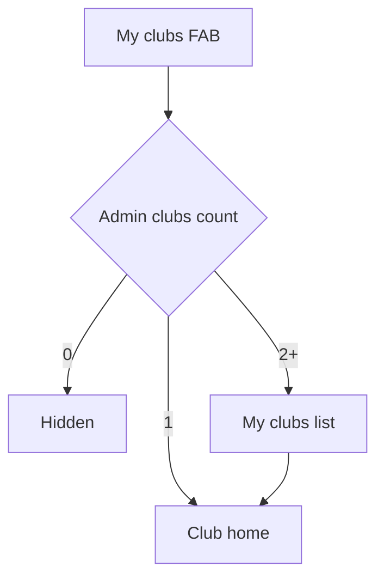

# Plan: Club admin & court scheduling UX

## Context

PadelPulse already has **clubs/courts** in Prisma, **platform admin** club CRUD (`Admin/`), and **read-only occupancy** via `getBookedCourts` (app games + external integration slots). The create/edit game flow uses **`GameStartSection`** + **`useBookedCourts`** for a 30-minute time grid (free / in-app planned / external booked).

There is **no club-admin role** or dedicated booking entity yet.

**Companion (implementation):** [PLAN_CLUB_BOOKING_TECH.md](./PLAN_CLUB_BOOKING_TECH.md) — schema, APIs, phases. Verified against codebase 2026-05.

## Product constraints

1. **Club admins** are assigned to one or more clubs by **platform admin** (off-app / `Admin/`). They cannot create or delete clubs or assign themselves to new clubs.
2. **Normal users book courts only via create-game / tournament / league / training / bar flows** — no standalone “Book a court” product, no separate booking wizard, no “My bookings” list outside games.
3. A **court slot** for players is claimed by a **`Game`** with `clubId`, `courtId`, `timeIsSet`, and optional **`hasBookedCourt`** (confirmed vs planned only).
4. **Club admin cancel** must **notify** the affected user(s) (in-app message + push); no silent cancel.

## Code anchors (existing)

| Area | Location |
|------|----------|
| Tab bar | `Frontend/src/components/navigation/BottomTabBar.tsx` |
| Slot grid & colors | `Frontend/src/components/createGame/GameStartSection.tsx` |
| Occupancy hook | `Frontend/src/hooks/useBookedCourts.ts` |
| Booked courts API | `Backend/src/services/game/bookedCourts.service.ts`, `GET /games/booked-courts` |
| Club read UI | `Frontend/src/components/ClubDetailPanel.tsx` |
| Game location/time edit | `Frontend/src/components/GameDetails/editGameInfo/WhereTab.tsx` |
| Routing | `Frontend/src/utils/urlSchema.ts` (no `my-clubs` yet) |
| Global admin clubs | `Backend/src/services/admin/locations.service.ts`, `Admin/` |

### Slot semantics — create-game grid (**shipped today**)

| Visual | Meaning |
|--------|---------|
| Gray | Free |
| Yellow (light) | App game, court not confirmed (`!hasBookedCourt`) |
| Yellow (strong) | App game, court confirmed (`hasBookedCourt`, not external) |
| Red | External / club system (`clubBooked`) |
| Primary highlight | Selected duration range |

**Today:** booked cells are still **clickable** (styling only); no save-time overlap warning yet.

### Slot semantics — create-game grid (**target, P3**)

| Visual | Meaning |
|--------|---------|
| Gray | Selectable |
| Yellow | Soft conflict — warn; may allow proceed |
| Red (+ admin holds) | Hard unavailable — not selectable |
| Admin hold | Same as red on player grid (busy, no PII) |

### Slot semantics — club admin schedule (**new UI**)

| Visual | Meaning |
|--------|---------|
| Gray | Free |
| Green / primary solid | App game, confirmed |
| Yellow | App game, planned only |
| Red | External integration |
| Purple / stripe | Admin third-party hold |
| Hatch | Inactive court or maintenance hold |

---

## Personas & permissions

| Persona | Can see | Cannot do |
|--------|---------|-----------|
| **Regular player** | Create/edit games with club + court + time grid; public club info | Manage club schedule; cancel others’ slots |
| **Club admin** (1+ assigned clubs) | “My clubs” FAB, club dashboard, schedule, courts, blocks, cancel + notify | Create/delete clubs; add self to clubs |
| **Platform admin** | Full lifecycle in `Admin/`; may use club-admin APIs for support | — |

**Assignment:** `User ↔ Club` via `ClubAdmin` join (see TECH doc). Role `ADMIN` (optional `STAFF` later). No in-app “request admin”.

**FAB routing:**

| Admin clubs | FAB tap destination |
|-------------|---------------------|
| 0 | Hidden |
| 1 | Club home (skip list) |
| 2+ | My clubs list → club home |

---

## Global entry: “My clubs” FAB

- **Placement:** Floating control **above** `BottomTabBar` (same z-layer family as chat overlays); visible only when user has ≥1 admin club.
- **Label:** Building icon + “My clubs”.
- **Mode:** Admin stack overlay; does not replace a bottom tab.
- **Deep links (proposed):** `/my-clubs`, `/my-clubs/:clubId`, `/my-clubs/:clubId/schedule`, `/my-clubs/:clubId/courts`, `/my-clubs/:clubId/courts/:courtId`, `/my-clubs/:clubId/settings`.
- **Exit:** Back to player app; FAB remains if still admin.



---

## Player UX — courts only via game flows

### Entry points

| Entry | Behavior |
|-------|----------|
| Create game / tournament / league / training | Club → court → date → time grid |
| Edit game | `WhereTab` + time; re-validate occupancy |
| Find → join game | No booking |
| Club detail | `AvailabilitySheet` is **browse-only**: shows free slots; tap navigates to create-game with club/court/time prefilled — **no API book** on club detail |
| Booktime booking row → create game | Existing booking deep link (`externalBookingId`); skip reserve step in create-game |

Copy: **“Reserve when you create a game”**, not “Book a court”. Club detail grid hint: tap a time to create a game — court is reserved when you publish the game.

### What “booking” means

- **`hasBookedCourt: true`** — player confirms real reservation (club or external).
- **`hasBookedCourt: false`** — planned on calendar only (yellow on grid).
- The **game** is the reservation record; no separate booking ID for players.

### Grid rules

**Today:** visual hints only; user can still tap yellow/red slots.

**Target (P3):**

- **Red / holds:** not selectable.
- **Yellow:** soft conflict — inline warn; may allow proceed.
- **Gray:** selectable.
- Warn on save if `hasBookedCourt: false` but selection overlaps red/hold.
- Post-create nudge to mark court booked.
- Link to club phone/site from game details (partially available via club panel).
- Club `policyText` / `cancellationNoticeHours` shown in create-game time step when set (P4.1).

---

## Club admin screen map

1. **My clubs list** (only if N ≥ 2)
2. **Club home** (hub)
3. **Today / Schedule** — multi-court day view (default)
4. **Courts** — list + per-court detail
5. **Club settings** — info, hours, amenities, photos
6. **Court settings** — per court
7. **Slot detail sheet** — occupied or selected free slot
8. **Actions** — block third-party, cancel game + notify, open game
9. **Activity / audit** (v2)

---

## My clubs list (N ≥ 2)

- Cards: avatar, name, city, “open now”, secondary metrics (courts count, bookings today).
- **No** add/delete club.
- Search only if many clubs.
- Revoked access → toast + exit stack; FAB hidden on next profile fetch.

---

## Club home

- Header: avatar, name, city → **Settings** for edits.
- CTAs: **Today’s schedule** (default), **All courts**, **Settings**.
- Today snapshot: date strip + mini multi-court grid or summary counts.
- Alerts: integration down, overlaps, unconfirmed vs external conflicts.
- Optional “View as player” → public club panel.

---

## Club settings (admin-editable)

| Section | Content |
|---------|---------|
| Profile | Name, description, phone, email, website, address |
| Media | Avatar, photos |
| Hours | Opening/closing; weekly hours v2 |
| Amenities | Toggle chips |
| Pricing defaults | Slot duration, currency, cancellation window (for copy in game flows) |
| Integrations | Read-only sync status |
| Policies | Cancel notice, no-show text |

**Not editable by club admin:** `isActive`, delete club, `integrationScriptName`, city change (platform admin).

---

## Schedule views (admin)

Patterns from Playtomic Manager / CourtReserve: **day-first**, courts as columns, 30-min steps (club-configurable).

### Day view (default)

- Y-axis: time; X-axis: courts (horizontal scroll).
- Sticky date + court headers; “now” line on today.
- Pull to refresh; auto-refresh ~10s (align with `useBookedCourts`).

### Slot visual language

| State | Style | Source |
|-------|-------|--------|
| Free | Gray | — |
| App game confirmed | Solid primary/green | `hasBookedCourt: true` |
| App game planned | Yellow | `hasBookedCourt: false` |
| External / integration | Red | `clubBooked` |
| Admin third-party block | Purple/stripe | New admin hold |
| Maintenance / inactive court | Hatch | `isActive: false` or block |
| Past | Muted | Read-only |

Collapsible legend on first visit.

### v2

- Week view; chronological list for front desk.

---

## Per-court detail

- Entry: courts list or column header in grid.
- Single-court day grid (full width on mobile).
- Settings: name, type, surface, price/hour, active toggle, external ID read-only.
- **Club admin may add/edit/deactivate courts** for assigned clubs (not delete club). See TECH doc.

---

## Slot detail sheet (admin)

Bottom sheet (mobile) / side panel (desktop).

### A) Free

- **Block as third-party** (walk-in / phone / academy / other + note).
- v2: manual booking for a user; maintenance range.

### B) App game

- Game title, host, participants, link **Open game**.
- Badges: confirmed vs planned.
- **Cancel & notify** (see below); message host.

### C) External (integration)

- “From club system”; view-only or override per policy.

### D) Admin block

- Label + note; **Edit** / **Release**.

---

## Cancel + automatic message (required)

1. Admin taps **Cancel** on user slot/game.
2. **Reason:** presets + optional note.
3. **Preview** (editable within limits):

   > Hi {name}, your court at {club} on {date} {time} was cancelled by the club. Reason: {reason}. {note}

4. Channels: **in-app DM** to host/booker + **push**; email/SMS v2.
5. Confirm: **Cancel & notify**.
6. Success: slot freed; activity log entry.

Rules:

- No cancel on past slots (view only).
- Wording: cancels **game slot** for {user}, not “refund booking”.
- If only planned game: offer **cancel game** (full delete) vs **clear court/time** (game remains, slot freed) — see TECH defaults.
- **Full cancel:** existing game-cancelled push to non-owner participants **plus** custom DM to host (see TECH — avoid duplicate generic + custom text for same event where possible).
- **Clear court:** DM to host (and optionally all participants); no game-delete notification.

---

## Third-party / walk-in block

- Occupancy without a public game.
- v1: duration chips (1 / 1.5 / 2 h) + label → admin hold on calendar.
- Create-game grid must treat hold as **busy** (merge into `getBookedCourts` or equivalent).
- Distinct visual from user games (no “message user”).

---

## Admin grid vs player games

| Content | Admin actions |
|---------|----------------|
| Planned game | Open game, cancel game, message host |
| Confirmed game | Open game, **cancel & notify** |
| External | View; optional override TBD |
| Third-party block | Edit / release |
| Free | Block |

**Cancel user slot** = cancel or reschedule underlying **game** (or strip court/time) + notify participants.

---

## Desktop vs mobile

- **Mobile:** Bottom sheets, FAB above tab bar.
- **Desktop:** Wider grid; slot detail in sticky right rail on `lg+` (`SlotDetailSheet` `layout="rail"`); bottom sheet below `lg`. FAB above centered tab pill.
- **v3:** Front-desk / TV full-screen schedule route.

---

## Edge cases

| Case | UX |
|------|-----|
| Integration loading | Skeleton + “Updating availability…” |
| Integration down | Banner; app games only; admin blocks still allowed |
| Double booking | Highlight conflicts; force resolution |
| Timezone | “Club time” label (existing) |
| Game without court | Club-level aggregate on grid |
| Inactive court | Gray column |
| Access revoked mid-session | 403 → exit admin stack |

---

## Onboarding & empty states

- First admin visit: 3 coach marks (schedule, tap slot, settings).
- Empty day: “No games on courts yet”.
- No courts: “Contact support” or in-app add court (per policy).
- N ≥ 2 clubs: list only; no create club.

---

## Information architecture

```
Players
  Create game / tournament / league / …
    → Location (club, court)
    → Start (date, duration, time grid)   ← only booking UI
  Game details / Edit game

Club admins (FAB)
  My clubs? (if N > 1)
  Club home
    ├─ Schedule (day grid)     ← default
    ├─ Courts → Court detail
    ├─ Settings
    └─ Slot sheet → block / cancel + notify / open game

Platform admin (unchanged)
  Admin/ → clubs, courts, assign ClubAdmin rows
```

---

## Notifications

| Event | Recipient | Channel |
|-------|-----------|---------|
| Admin cancels slot/game | Host / booker | DM + push |
| Player creates game at club | Club admins | Push (v2 digest) |
| Player cancels game | Club admins | Push (v2) |
| Integration conflict | Club admins | Banner on club home |
| Reminders | Players | Push (v2) |

Reuse chat DM + `notification.service` patterns.

---

## Phased delivery

| Phase | Deliverable |
|-------|-------------|
| **P0** | FAB; 1 vs N routing; club home; day grid; slot sheet — **done** (2026-05-15) |
| **P1** | Third-party block + release; court list — **done** |
| **P2** | Club settings; cancel game + notify (DM); editable preview — **done** (2026-05-15, preview in P4) |
| **P3** | Hard-block red/hold on create-game; admin conflicts banner; GameCourt on grid; coach marks; yellow save warn; post-create mark-court nudge — **done** (2026-05-15) |
| **P3.1** | v1 polish: unassigned column, legend, now-line, refresh, hold edit, settings amenities/media, my-clubs metrics — **done** (2026-05-15) |
| **P4** | v1 completion + hardening — **done** (2026-05-15) |
| **P4.1** | Post–v1 backlog: DM templates, suite tests, desktop rail, create-game policy copy — **done** (2026-05-15) |
| ~~Player book funnel~~ | **Out of scope** — games only |

### P3.1 v1 polish (2026-05-15)

- [x] Unassigned games column on admin schedule grid
- [x] Collapsible schedule legend (localStorage)
- [x] “Now” indicator on today’s grid
- [x] Schedule refresh control
- [x] Past slots view-only in slot sheet
- [x] Edit third-party hold (label + note)
- [x] My clubs: open now, bookings today, search (6+ clubs)
- [x] Club settings: avatar, amenities, policy, slot defaults, integration status
- [x] Club home today summary + conflict banner
- [x] View as player (`ClubViewAsPlayerModal` on club home)
- [x] Pull-to-refresh on schedule + court detail

### P4 — v1 completion (2026-05-15)

- [x] View as player — `ClubViewAsPlayerModal`, club home CTA
- [x] Pull-to-refresh — `ClubSchedulePage`, `ClubCourtDetailPage`
- [x] Clear court in slot sheet — planned games (`!hasBookedCourt`)
- [x] Cancel message preview — `cancelMessage.ts` + `CancelGameSheet`
- [x] Message host — slot sheet → `/user-chat/:id`
- [x] Per-court settings — `ClubCourtDetailPage` + `ClubAdminCourtForm`
- [x] Court CRUD polish — `ClubCourtsPage` form (no `prompt`)
- [x] Club photos — upload + remove in `ClubSettingsPage`
- [x] Wire `defaultSlotMinutes` — `useGameTimeDuration`, admin `CourtScheduleGrid`
- [x] Integration-down banner — `externalSlotsFailed` on schedule + club home
- [x] i18n — `clubAdmin.json` en, ru, cs, es, sr

### P4.1 — post–v1 backlog (2026-05-15)

- [x] Server DM templates — `clubAdmin.dm.*` in `translations.ts` + `clubAdminDmMessage.ts`; host language from profile
- [x] Client cancel preview — `cancelMessage.ts` uses same i18n keys as server
- [x] `club-admin.suite.ts` — DM templates, auth 403, hold permissions, clear-court (+ `run-all.ts`)
- [x] Desktop slot detail right rail — `SlotDetailPanel`, `SlotDetailSheet` `layout="rail"` on `lg+`
- [x] Create-game policy copy — `GameStartSection` shows `policyText` + `cancellationNoticeHours`

---

## Remaining backlog

Verified against codebase 2026-05-15. **P0–P4.1 shipped; no open post–v1 items.**

### v2

| Area | Deliverable |
|------|-------------|
| Schedule | Week view; front-desk chronological list |
| Slots | Manual booking for a user on free slot; maintenance **range** holds |
| Hours | Weekly hours JSON on `Club` |
| Audit | Activity / audit screen (hold `createdByUserId` exists; no UI) |
| Notifications | Club admins: push when player creates/cancels game; player reminders |
| Cancel | Email/SMS; optional push to all participants on **clear court** |
| Real-time | Socket `club-admin:{clubId}` instead of 10s poll |
| Roles | `ClubAdminRole.STAFF` |
| Player | BAR / entity-specific schedule filtering |
| External | Override policy (v1 **view-only**) |

### v3

- Front-desk / TV full-screen schedule route.
- Further desktop-first layout refinements (slot rail shipped in P4.1).

### Resolved (no backlog action)

- `bookedCourts` status filter (`ANNOUNCED`, `STARTED`).
- Legacy `/courts` mutations: `authenticate` + `assertClubMutationAllowed` in controller.
- Unassigned column, legend, now-line, hold edit, create-game hard-block / yellow warn / mark-court nudge.
- DM templates (T3), `club-admin.suite.ts` (T4), desktop slot rail (T5), create-game policy copy.

---

## Data model (summary)

Aligned with [PLAN_CLUB_BOOKING_TECH.md](./PLAN_CLUB_BOOKING_TECH.md):

- **No player `CourtBooking` table** — `CourtSlotHold` for admin blocks only.
- Player occupancy stays **`Game`-centric** (+ `GameCourt` for multi-court).
- Admin cancel → club-admin game APIs + DM; not a separate booking cancel.
- Holds merged into `getBookedCourts` for create-game; enriched schedule for admins.

---

## Resolved decisions

Canonical detail in TECH doc § “Resolved product defaults”.

| Topic | Decision |
|-------|----------|
| Cancel scope | Two actions: **cancel game** (delete) and **clear court** (strip court/time flags, keep game) |
| Remove from grid without delete | **clear court** |
| External slot override | v1 **view-only** |
| Tournament/league multi-court | Admin schedule includes **GameCourt** rows |
| BAR | Same grid component; filtering later |
| Multi-admin audit | `createdByUserId` on holds; `cancelledByUserId` on `CancelledGame` |
| Court CRUD | **Club admin** create/update/deactivate for assigned clubs |

---

## Non-goals (this UX plan)

- Standalone player court booking/checkout.
- Club admin creating or deleting clubs.
- Payments for court slots (unless later tied to games).
- Replacing platform `Admin/` for club lifecycle.
