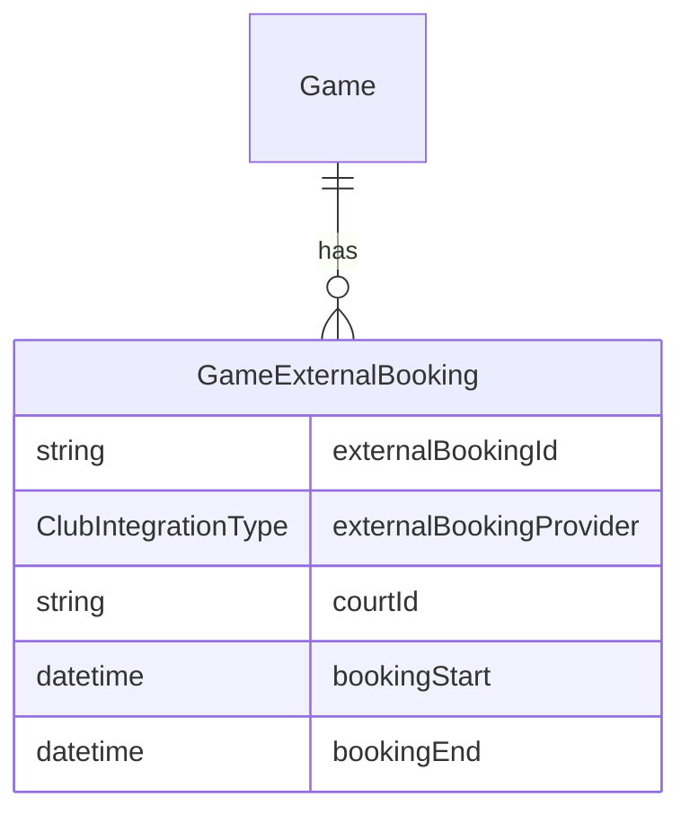
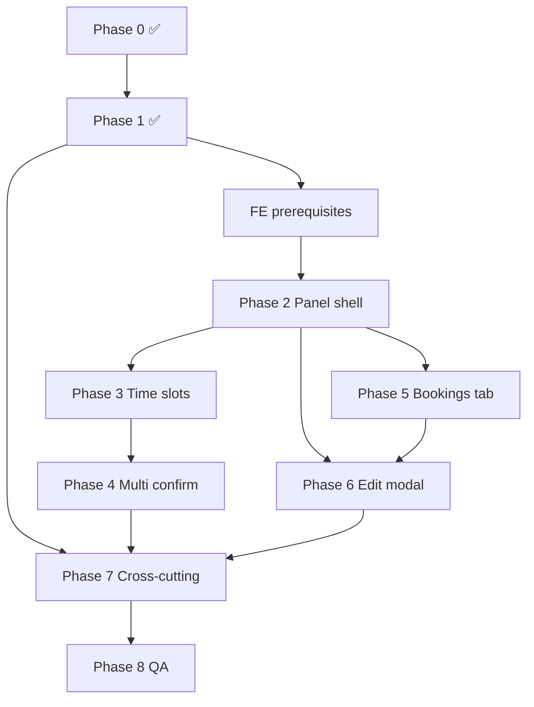

# Plan: Game ↔ Booking multi-to-multi link

Companion specs: [PLAN_BOOKTIME_INTEGRATION.md](./PLAN_BOOKTIME_INTEGRATION.md), [PLAN_BOOKTIME_CREATE_GAME.md](./PLAN_BOOKTIME_CREATE_GAME.md), [PLAN_CLUB_BOOKING_UX.md](./PLAN_CLUB_BOOKING_UX.md).

Verified against codebase 2026-06. **Phase 0 ✅ Phase 1 ✅ — ready for Phase 2 FE.**

---

## Summary

Rebuild the game–booking relationship as **many-to-many**: one external booking can link to multiple games; one game can link to multiple bookings.

**Why**

1. Club sale slots — user books one 2h block and runs several shorter games with different friends.
2. Mini/big tournaments — one game spans many court bookings.

**Scope (entity types)**

| Entity type | Booking / location-time UI |
|-------------|----------------------------|
| `GAME` | Full create + edit flow |
| `TRAINING` | Full create + edit flow |
| `TOURNAMENT` | Full create + edit flow |
| `LEAGUE` | **Edit-only** — league planner → Game Details edit modal (not Create Game wrapper) |
| `BAR` | **Out of scope** — legacy time + court only |
| `LEAGUE_SEASON` | **Out of scope** |

---

## Locked decisions

| # | Topic | Decision |
|---|--------|----------|
| 1 | Partial multi-book failure | **Cancel all** booked slots on game-create failure + toast; extend rollback service for `string[]` |
| 2 | Same booking on multiple games | **Allow**; show already-linked games on booking card; no hard block |
| 3 | Entity types | `GAME`, `TRAINING`, `LEAGUE`, `TOURNAMENT` (create: no `LEAGUE`; edit: yes via planner) |
| 4 | Primary court with N bookings | `Game.courtId` = first linked booking’s court; `GameCourt` = union of all booking courts |
| 5 | `Game.externalBookingId` | **Drop columns** — no backfill, no computed shim; hard-remove from API |
| 6 | Time override storage | Dedicated `Game.timeOverride` column (`Boolean`, default `false`) |
| 7 | Override toggled off | Re-derive `startTime` / `endTime` from linked booking snapshots automatically |
| 8 | Booking link API | Dedicated `PATCH /games/:id/bookings` with `{ add, remove }` — **bare UUIDs only** |
| 9 | Booking ownership | **Trust FE** — no server-side Booktime ownership verification |
| 10 | `hasBookedCourt` | Auto `true` when any link exists; owner **cannot** set `false` while links exist; auto-clear when all links removed |
| 11 | Permissions (link/unlink) | Game **owner** OR **parent-game owner** (league round → season hub owner) |
| 12 | `GET linked-games` | Return **all** games linked to that booking (not filtered to caller) |
| 13 | Child / parent games | Each game links bookings **independently**; join rows cascade on game delete |
| 14 | Client `startTime` / `endTime` on create | **Client values win**; `timeOverride` not required when they differ from booking union |
| 15 | Rollback scope | Cancel **all** IDs created in **this** create attempt only |
| 16 | Cross-date multi-select (Bookings tab) | **Allow**; summary shows date span when bookings span days |
| 17 | Selection min/max | Shared `computeBookingSelectionLimits()` — see § Selection limits |
| 18 | Deep link from booking row | `locationTimeMode=bookings&bookingIds=uuid[,uuid…]` — land on Bookings tab pre-selected; **remove** `externalBookingId` query |
| 19 | Edit time-slots subtab | Can **book new** courts (multi-step confirm); Bookings subtab is **link-only** |
| 20 | Override default on create | `timeOverride: false` until user expands adjust; client sends derived or override times |
| 21 | Tab switch mid-form | Confirm discard if dirty selections on active tab; switching tabs clears the other tab's draft |

**Time derivation**

- Default (`timeOverride = false`): `startTime = min(bookingStart)`, `endTime = max(bookingEnd)` from join-row snapshots, `timeIsSet = true`.
- Override (`timeOverride = true`): persist user window on `Game.startTime` / `Game.endTime`.
- Toggle override **off** (edit): clear `timeOverride`, re-derive from snapshots.

**Partial multi-book rollback**

- Book courts **sequentially** in confirm modal.
- If game create fails after any book step: cancel every booking ID collected **in this attempt** (server + client best-effort).

**Snapshot refresh (FE-owned)**

- Join-row snapshots (`courtId`, `bookingStart`, `bookingEnd`) written by **FE at link time**.
- FE **must** force-refresh snapshots:
  1. At the **start** of the game-creation procedure (before POST create).
  2. Immediately **before** creating new Booktime bookings on the time-slots path in **edit**, if club/court/time changed since last snapshot.
- BE stores whatever FE sends on snapshot upsert; does not call Booktime to validate.

---

## Current state

| Area | Today |
|------|--------|
| **DB** | ~~`Game.externalBookingId`~~ → `GameExternalBooking` join table + `Game.timeOverride` (Phase 1 ✅) |
| **Courts** | `GameCourt` supports multiple courts per game (`courtIds` on create) |
| **Create Game** | `bookCourtEnabled` + `BooktimeReservationCard` toggle; single-court confirm modal; singular `externalBookingId` in types/API client |
| **My bookings** | `GET /booktime/linked-games/:id` ✅ BE; FE still uses `getLinkedGame` singular |
| **Edit modal** | Separate Where / When tabs; no booking picker |
| **Link utils** | `booktimeGameLinkUtils.ts` sets single `externalBookingId` on PATCH |
| **Shared FE** | `contracts.ts`, `deriveGameTimeFromBookings`, `supportsClubBookingFlow` ✅ Phase 0 |

Key files:

| Layer | Path |
|-------|------|
| Schema | `Backend/prisma/schema.prisma` |
| Create | `Backend/src/services/game/create.service.ts` |
| Update | `Backend/src/services/game/update.service.ts` |
| Link lookup | `Backend/src/services/booktime/booktimeGameLink.service.ts` |
| Rollback | `Backend/src/services/booktime/booktimeBookingRollback.service.ts` |
| Create UI | `Frontend/src/pages/CreateGame.tsx` |
| Book switch | `Frontend/src/components/createGame/BooktimeReservationCard.tsx` |
| Confirm modal | `Frontend/src/components/createGame/BooktimeCreateGameConfirmModal.tsx` |
| Booking row | `Frontend/src/components/booktime/BooktimeBookingRow.tsx` |
| Edit modal | `Frontend/src/components/GameDetails/EditGameInfoModal.tsx` |
| Types | `Frontend/src/types/index.ts` |

---

## Target model



### Prisma (target)

```prisma
model Game {
  // ... existing fields ...
  timeOverride             Boolean             @default(false)
  externalBookings         GameExternalBooking[]
  // REMOVE: externalBookingId, externalBookingProvider
}

model GameExternalBooking {
  id                      String              @id @default(cuid())
  gameId                  String
  externalBookingId       String
  externalBookingProvider ClubIntegrationType @default(BOOKTIME)
  courtId                 String?
  bookingStart            DateTime?
  bookingEnd              DateTime?
  createdAt               DateTime            @default(now())
  updatedAt               DateTime            @updatedAt

  game  Game   @relation(fields: [gameId], references: [id], onDelete: Cascade)
  court Court? @relation(fields: [courtId], references: [id], onDelete: SetNull)

  @@unique([gameId, externalBookingId])
  @@index([externalBookingId])
  @@index([gameId])
}
```

**Remove from `Game`:** `externalBookingId`, `externalBookingProvider`, index `Game_externalBookingId_idx`.

**Add to `Game`:** `timeOverride Boolean @default(false)`.

**Rules**

- Same `externalBookingId` may appear on many games (no cross-game uniqueness).
- Same booking twice on one game → rejected (`@@unique([gameId, externalBookingId])`).
- `hasBookedCourt`: auto `true` when `linkedBookings.length > 0`; manual toggle only when **no** links (non-integration path).
- PATCH cannot set `hasBookedCourt: false` while any join row exists.
- Removing all links auto-clears `hasBookedCourt`.
- Booking metadata on join row — FE-authored; used for display, orphan checks, and time re-derivation.
- Child games (`LEAGUE` round, tournament match, etc.) link bookings **independently** of parent; cascade delete with game.

---

## API contract

### Breaking change

- **`externalBookingId` / `externalBookingProvider` removed** from all request and response bodies — no shim, no computed fallback.
- Clients sending singular `externalBookingId` → **400** with upgrade message.

### Create game

```json
{
  "externalBookingIds": ["uuid-1", "uuid-2"],
  "externalBookingProvider": "BOOKTIME",
  "startTime": "ISO",
  "endTime": "ISO",
  "timeOverride": false,
  "rollbackBooktimeBooking": true,
  "bookingSnapshots": [
    {
      "externalBookingId": "uuid-1",
      "courtId": "cuid",
      "bookingStart": "ISO",
      "bookingEnd": "ISO"
    }
  ]
}
```

- `externalBookingIds`: bare UUIDs; **trust FE** (no Booktime ownership check).
- `bookingSnapshots`: FE-provided; upserted on join rows in same transaction as create. FE must refresh immediately before POST (see Snapshot refresh).
- **`startTime` / `endTime` on request win** over derived union; BE does not require `timeOverride: true` when they differ from booking window.
- `rollbackBooktimeBooking`: cancel only IDs **created in this attempt** (not pre-existing linked bookings).

### Link / unlink (dedicated endpoint)

```http
PATCH /games/:id/bookings
Content-Type: application/json

{
  "add": ["uuid-1", "uuid-2"],
  "remove": ["uuid-3"]
}
```

- **`add` / `remove`: bare UUIDs only** — no snapshot fields on this endpoint.
- Snapshots updated separately:

```http
PUT /games/:id/booking-snapshots
Content-Type: application/json

{
  "snapshots": [
    {
      "externalBookingId": "uuid-1",
      "courtId": "cuid",
      "bookingStart": "ISO",
      "bookingEnd": "ISO"
    }
  ]
}
```

- Caller must be game owner or parent-game owner.
- Do **not** accept booking link changes via generic `PATCH /games/:id` body.

### Game response

```ts
timeOverride: boolean;
linkedBookings: Array<{
  id: string;
  externalBookingId: string;
  externalBookingProvider: 'BOOKTIME';
  courtId?: string;
  bookingStart?: string;
  bookingEnd?: string;
}>;
```

### Booktime routes

| Old | New |
|-----|-----|
| `GET /booktime/linked-game/:externalBookingId` | `GET /booktime/linked-games/:externalBookingId` → **all** linked `Game[]` (public to authenticated users) |

### Permissions summary

| Action | Who |
|--------|-----|
| `PATCH /games/:id/bookings` | Game owner **or** parent-game owner (league hub owner for round games) |
| `PUT /games/:id/booking-snapshots` | Same |
| `GET /booktime/linked-games/:id` | Any authenticated user; returns all linked games |

---

## Selection limits matrix

| Context | Min | Max |
|---------|-----|-----|
| Bookings tab, 2v2 (`playersPerMatch === 4`), N participants | `ceil(N / 4)` | same |
| Bookings tab, 1v1 (`playersPerMatch === 2`), N participants | `ceil(N / 2)` | same |
| Time slots, multi-court book | `selectedCourtIds.length` | existing `multiCourtMode` cap (`maxParticipants > 4`) |

### `computeBookingSelectionLimits()` (Phase 2 shared helper)

Location: `Frontend/shared/gameBooking/computeBookingSelectionLimits.ts` (+ parity test in BE if mirrored).

```ts
interface BookingSelectionLimits {
  min: number;
  max: number;
  playersPerCourt: number; // 4 for 2v2, 2 for 1v1
}

function computeBookingSelectionLimits(
  maxParticipants: number,
  playersPerMatch: number,
): BookingSelectionLimits {
  const playersPerCourt = playersPerMatch === 2 ? 2 : 4;
  const required = Math.ceil(maxParticipants / playersPerCourt);
  return { min: required, max: required, playersPerCourt };
}
```

UI shows live counter: `Select {{min}}–{{max}} reservations ({{maxParticipants}} players, {{format}})`.

When `selected.length === max`: dim unselected rows (`opacity-50`, no tap). When `selected.length === min`: disable deselect on selected rows.

### `buildBookingSnapshots()` (Phase 2 shared helper)

Location: `Frontend/shared/gameBooking/buildBookingSnapshots.ts`.

```ts
function buildBookingSnapshots(
  bookings: Array<{ uuid: string; bookingStart: string; bookingEnd: string; bookingResource?: { id?: string } }>,
  courts: Court[],
  club: Club,
): BookingSnapshotInput[] {
  return bookings.map((b) => {
    const courtInfo = resolveCourtForBooking(b, club, courts);
    return {
      externalBookingId: b.uuid,
      courtId: courtInfo.courtId,
      bookingStart: b.bookingStart,
      bookingEnd: b.bookingEnd,
    };
  });
}
```

Reuse `resolveCourtForBooking` from `booktimeBookingUtils.ts`. Called immediately before create POST and on edit snapshot PUT.

---

## UX mental model & copy

**One sentence (all player-facing copy):** *Your game time comes from your court reservation(s).*

| Path | User action | Outcome |
|------|-------------|---------|
| **Time slots** | Pick slot + integrated court(s) | App books court(s) on Create → game links to new booking IDs |
| **Bookings** | Pick existing reservation(s) | Game links to IDs → no API book step |

Never expose "Booktime" in player strings — use club / reservation language ([PLAN_CLUB_BOOKING_UX.md](./PLAN_CLUB_BOOKING_UX.md)).

### Tab labels (i18n)

| Internal id | Label key | Default EN | Subtitle (one line under switch) |
|-------------|-----------|------------|----------------------------------|
| `timeSlots` | `locationTime.tabTimeSlots` | Pick a time | Book court when you create the game |
| `bookings` | `locationTime.tabBookings` | Use a reservation | Link court(s) you already booked |

Icons: `CalendarClock` / `CalendarCheck`. Reuse `SegmentedSwitch` with unique `layoutId` per surface.

### Motion tokens (match existing create-game patterns)

| Element | Treatment |
|---------|-----------|
| Tab switch | `layoutId` pill + panel `AnimatePresence mode="wait"` 200–250ms `easeOut` |
| Booking row select | `whileTap scale(0.98)`; checkmark spring in |
| Summary time change | Horizontal slide — reuse `SelectedTimeSummary` direction logic |
| Override expand | `AnimatePresence` height + opacity; chevron rotate |
| Summary chips | `AnimatePresence popLayout` on add/remove |
| Confirm modal steps | Stagger children 50ms; active step pulsing ring |
| Success | Check + 800ms hold (existing confirm modal) |

**Soft vision:** `primary-50/40`, `rounded-xl`, light gradients (`SelectedTimeSummary` style). Disabled = `opacity-50`. `aria-live="polite"` on summary strip and stepper.

---

## Create Game UX (target)

### Club without active integration

- **Time slots only** (current interface): court list + “I have booked court” switch + date/time.
- No segmented switch, no Bookings tab.

### Club with active integration (`integrationType` set)

After club selection → **SegmentedSwitch**: **Pick a time** | **Use a reservation** (only one active; active tab drives submit path).

Context line under switch (i18n `locationTime.tabSubtitle`): repeats active tab subtitle from table above.

Applies to `GAME`, `TRAINING`, `TOURNAMENT` on **Create Game**. `LEAGUE` round games use **edit-only** flow from league planner.

```mermaid
flowchart TD
  A[Club selected] --> B{Integration?}
  B -->|No| C[Time slots only — legacy]
  B -->|Yes| D[Segmented: Time slots | Bookings]
  D --> E{Active tab}
  E -->|Time slots| F{Courts selected?}
  F -->|notBooked| G[Slim time UI — no book]
  F -->|1+ integrated courts| H[Hint card: courts reserved on Create]
  E -->|Bookings| I[Multi-select list + derived window]
```

#### Time slots tab

| Court selection | Behavior |
|-----------------|----------|
| `notBooked` | Lightweight time UI; no reservation hint; CTA **Create game** |
| One or more integrated courts selected | **Remove** `BooktimeReservationCard` switch; show **`BooktimeBookingHint`** listing courts; CTA **Create game & reserve court** |
| Multi-court | Union snapshot busy slots + booked courts; multi-step book in confirm modal |

**Remove:** separate “Book court when creating game” toggle (`BooktimeReservationCard`).

**Keep:** Booktime auth gate when user chose courts that require API book and is not connected (`BooktimeConnectInline` — block date/time until connected).

#### Bookings tab

- Load user's upcoming bookings for selected club (`useBooktimeUpcomingBookings`).
- Multi-select with `computeBookingSelectionLimits()` counter (live, not toast-on-submit).
- Reuse `BooktimeBookingRow` (`selectable` variant); show games already linked to each booking as soft pills — **informational, not blocking** (decision #2).
- **Empty state:** illustration + "No upcoming reservations at this club" + CTA switches to Time slots tab.
- **Summary strip:** selected count + derived window `min(start)–max(end)`; if cross-date, show date span.
- **Override time** toggle → animated expand → time range within booking union bounds; default = derived window; helper: "Game time can be shorter than your reservation".
- Turning override **off:** animate back to derived window; brief toast "Time reset to reservations".
- Submit: link booking IDs + snapshots + create game (**no** confirm modal — existing reservations).

### Confirm modal (time slots + book)

Extend `BooktimeCreateGameConfirmModal` → multi-court steps:

```
Review → Book court 1 ✓ → Book court 2 ✓ → … → Creating game ✓ → Success
```

- Scrollable per-court summary cards on Review step; running price total.
- On step *k* failure: highlight failed step; toast if rollback ran on prior IDs.
- Primary recovery: "Change time" → close modal, scroll to grid.

Collect all `bookingId`s → `executeCreateGame({ externalBookingIds: [...], bookingSnapshots: [...] })`.

### Deep link (from My bookings / booking row)

Replace `buildCreateGameSearchParams` singular `externalBookingId`:

```
/create-game?clubId=…&locationTimeMode=bookings&bookingIds=uuid1[,uuid2…]&courtId=…&startTime=…&endTime=…
```

`CreateGameWrapper` parses → Bookings tab active, row(s) pre-selected, banner `locationTime.preselectedBanner` ("Reservation pre-selected"). Confirm modal **skips book step**.

---

## Edit Game Info modal (target)

- Merge **Where** + **When** → **Location & time** tab.
- Reuse shared `GameLocationTimePanel` from create flow.

| Game state | UI |
|------------|-----|
| Has linked bookings | Bookings list only; add/remove links; **no** Time slots tab; **no** segmented switch |
| No linked bookings + integrated club | Both subtabs: Time slots \| Bookings |
| No linked bookings + no integration | Time slots (legacy hasBookedCourt switch) |
| Time slots + integration + no links | Same as Create Game (incl. multi-court book) |

| Game state | UI |
|------------|-----|
| Has linked bookings | Bookings list only; add/remove links; **no** Time slots tab; derived time labeled "From your reservations" |
| No linked bookings + integrated club | Both subtabs: Time slots \| Bookings |
| No linked bookings + no integration | Time slots (legacy hasBookedCourt switch) |
| Time slots + integration + no links | Same as Create Game (incl. multi-court book) |

**Save (single Save button):** orchestrate PATCH game fields → `PATCH /bookings` → `PUT /booking-snapshots` → court rows. Disable tabs while saving.

**Unlink last booking:** animate transition to dual-subtab state; `hasBookedCourt` auto-clears (BE).

`GameInfo.tsx`: show multiple linked bookings; Multiple Courts selector unchanged when enabled.

---

## FE prerequisites (before Phase 2 coding)

Phase 0 ✅ and Phase 1 ✅. Complete this checklist in Phase 2 opening PR (can ship incrementally with panel shell).

| # | Item | Target path / action |
|---|------|---------------------|
| 1 | `Game` type: add `linkedBookings[]`, `timeOverride`; remove `externalBookingId` | `Frontend/src/types/index.ts` |
| 2 | API: `gamesApi.patchBookings(id, { add?, remove? })` | `Frontend/src/api/games.ts` |
| 3 | API: `gamesApi.putBookingSnapshots(id, { snapshots })` | `Frontend/src/api/games.ts` |
| 4 | API: create payload uses `externalBookingIds[]`, `bookingSnapshots[]` | `CreateGame.tsx` executeCreateGame |
| 5 | API: `booktimeApi.getLinkedGames(id)` plural endpoint | `Frontend/src/api/booktime.ts` — replace `getLinkedGame` |
| 6 | Hook: `useBooktimeLinkedGames` | `Frontend/src/hooks/useBooktimeLinkedGames.ts` |
| 7 | Helper: `buildBookingSnapshots(selected)` | `Frontend/shared/gameBooking/buildBookingSnapshots.ts` |
| 8 | Helper: `computeBookingSelectionLimits` | `Frontend/shared/gameBooking/computeBookingSelectionLimits.ts` |
| 9 | Util: `gameHasLinkedExternalBooking` → `linkedBookings.length > 0` | `gameHasConfirmedClubBooking.ts` |
| 10 | Deep link parser in `CreateGameWrapper` | `locationTimeMode`, `bookingIds` |
| 11 | i18n keys (all locales) | See § i18n key list |
| 12 | Snapshot refresh call sites wired | create POST start; edit pre-book |

---

## i18n key list (Phase 2–7)

Namespace: `createGame.locationTime.*` (create + shared panel), `editGame.locationTime.*` (edit-only), extend `createGame.booktime.*` for multi-step.

| Key | Default EN | Phase |
|-----|------------|-------|
| `locationTime.tabTimeSlots` | Pick a time | 2 |
| `locationTime.tabBookings` | Use a reservation | 2 |
| `locationTime.tabSubtitleTimeSlots` | Book court when you create the game | 2 |
| `locationTime.tabSubtitleBookings` | Link court(s) you already booked | 2 |
| `locationTime.hintTitle` | Courts reserved when you create | 3 |
| `locationTime.hintCourts` | {{courts}} at {{club}} | 3 |
| `locationTime.summaryFromBookings` | From your {{count}} reservations | 5 |
| `locationTime.summaryWindow` | {{start}} – {{end}} | 5 |
| `locationTime.summaryCrossDate` | {{startDate}} {{start}} – {{endDate}} {{end}} | 5 |
| `locationTime.selectionCounter` | Select {{min}}–{{max}} reservations ({{players}} players) | 5 |
| `locationTime.emptyBookings` | No upcoming reservations at this club | 5 |
| `locationTime.emptyBookingsCta` | Pick a time instead | 5 |
| `locationTime.alsoUsedIn` | Also used in: {{games}} | 5 |
| `locationTime.overrideToggle` | Adjust game time | 5 |
| `locationTime.overrideHint` | Game time can be shorter than your reservation | 5 |
| `locationTime.overrideResetToast` | Time reset to reservations | 5 |
| `locationTime.preselectedBanner` | Reservation pre-selected | 7 |
| `locationTime.tabSwitchDiscardTitle` | Discard changes? | 2 |
| `locationTime.tabSwitchDiscardBody` | Switching tabs will clear your current selection. | 2 |
| `locationTime.linkedOnlyLabel` | From your reservations | 6 |
| `locationTime.unlinkConfirm` | Remove this reservation link? | 6 |
| `locationTime.unlinkLastConfirm` | Removing the last reservation will unlock time editing. | 6 |
| `booktime.activityStepBookCourt` | Reserving {{court}} ({{current}} of {{total}})… | 4 |
| `booktime.multiBookFailed` | Could not reserve {{court}}. Previous reservations were released. | 4 |
| `editGame.locationTime.tabLabel` | Location & time | 6 |

Add matching keys to `cs`, `es`, `ru`, `sr` locale files.

---

## Component tree & props (Phase 2)

```
Frontend/src/components/gameLocationTime/
  LocationTimeMode.ts                 # 'timeSlots' | 'bookings'
  GameLocationTimePanel.tsx           # shell: club/courts + switch + animated body
  TimeSlotsPanel.tsx                  # wraps GameStartSection slots subset
  BookingsPickerPanel.tsx             # list + counter + summary + override
  BooktimeBookingHint.tsx             # replaces BooktimeReservationCard
  LocationTimeSummaryBar.tsx          # sticky derived-time strip
  BookingTimeOverrideSection.tsx      # toggle + expand time pickers
  LinkedBookingsList.tsx              # edit mode: linked cards + unlink
  useGameLocationTimeState.ts         # unified state hook
  useSaveGameLocationTime.ts          # edit save orchestration (Phase 6)
  supportsClubBookingFlow.ts          # re-export from shared (Phase 0 ✅)

Frontend/shared/gameBooking/
  computeBookingSelectionLimits.ts    # NEW
  buildBookingSnapshots.ts            # NEW
  deriveGameTimeFromBookings.ts       # Phase 0 ✅
  contracts.ts                        # Phase 0 ✅
```

### `GameLocationTimePanel` props

```ts
type GameLocationTimePanelProps = {
  mode: 'create' | 'edit';
  entityType: EntityType;
  club: Club | undefined;
  clubs: Club[];
  courts: Court[];
  game?: Game; // edit only — supplies linkedBookings, timeOverride
  // controlled state from useGameLocationTimeState or parent
  locationTimeMode: LocationTimeMode;
  onLocationTimeModeChange: (mode: LocationTimeMode) => void;
  // time slots
  selectedCourtIds: string[];
  onSelectedCourtIdsChange: (ids: string[]) => void;
  selectedDate: Date;
  selectedTime: string;
  duration: number;
  // bookings
  selectedBookingIds: string[];
  onSelectedBookingIdsChange: (ids: string[]) => void;
  timeOverride: boolean;
  onTimeOverrideChange: (v: boolean) => void;
  overrideStartTime?: string;
  overrideEndTime?: string;
  onOverrideTimesChange?: (start: string, end: string) => void;
  // slots panel passthrough (createGame time grid hooks)
  timeSlotsChildren?: ReactNode;
  authGateSection?: ReactNode;
  needsBooktimeAuth?: boolean;
};
```

### `useGameLocationTimeState` return shape

```ts
{
  locationTimeMode, setLocationTimeMode,
  showSegmentedSwitch, showBookingsOnly, // edit rules
  willBookOnCreate,                      // integrated courts selected, time slots tab
  derivedTime: { startTime, endTime } | null,
  selectedBookingIds, setSelectedBookingIds,
  timeOverride, setTimeOverride,
  bookingSelectionLimits,
  buildCreatePayload: () => CreateGameBookingFields & { courtIds, startTime, endTime },
  dirtyFlags: { bookings, timeSlots, snapshotsStale },
}
```

### Mode logic (implementation)

```
if (!supportsClubBookingFlow(entityType, mode)) → legacy / BAR path
if (!clubHasIntegration)                       → TimeSlotsPanel only
if (clubHasIntegration && !editHasLinks)       → SegmentedSwitch
if (hasLinkedBookings && editMode)              → LinkedBookingsList + add picker only
```

---

## Phase 0 — Design & contracts ✅ done (2026-06-12)

### Decisions (locked)

| Topic | Decision |
|-------|----------|
| Time override storage | Dedicated `Game.timeOverride` column |
| Override toggled off | Re-derive `startTime` / `endTime` from join-row snapshots automatically |
| Link API | `PATCH /games/:id/bookings` — `{ add: uuid[], remove: uuid[] }` only |
| Snapshot API | `PUT /games/:id/booking-snapshots` — FE sends full snapshot rows |
| Create payload | Bare UUIDs in `externalBookingIds`; snapshots in `bookingSnapshots` |
| Booking ownership | Trust FE — no server Booktime verification |
| `hasBookedCourt` | Auto true when links exist; cannot manually false while linked; auto-clear when empty |
| Breaking API | Hard-remove `externalBookingId` everywhere |

### Deliverables

| # | Item | Status | Artifact |
|---|------|--------|----------|
| 1 | `Game.timeOverride` column | Spec locked | Prisma target in § Target model (Phase 1 migration) |
| 2 | FE/BE API contract sign-off | Done | `Frontend/shared/gameBooking/contracts.ts` ↔ `Backend/src/shared/gameBooking/contracts.ts` (parity test) |
| 3 | `supportsClubBookingFlow(entityType, mode)` | Done | `Frontend/shared/gameBooking/supportsClubBookingFlow.ts`; re-export `Frontend/src/components/gameLocationTime/supportsClubBookingFlow.ts` |
| 4 | Parent-owner booking link auth | Done | `Backend/src/shared/gameBooking/bookingLinkAuthorization.ts` (`canMutateGameBookings` → `hasParentGamePermission`); FE ref `Frontend/shared/gameBooking/bookingLinkAuthorization.md` |
| 5 | Cross-link legacy create-game plan | Done | [PLAN_BOOKTIME_CREATE_GAME.md](./PLAN_BOOKTIME_CREATE_GAME.md) — superseded banner + §2, §8, decision #4 |

### Phase 0 implementation notes

- **Time derivation helper:** `deriveGameTimeFromBookings` in `Frontend/shared/gameBooking/` (min start / max end); used by FE edit/create panels in Phase 2+; BE re-derive on `timeOverride → false` in Phase 1.
- **Legacy field rejection copy:** `LEGACY_EXTERNAL_BOOKING_ID_REJECTED` constant in contracts (400 body text for Phase 1 routes).
- **Entity guard matrix:**

| `entityType` | `create` | `edit` |
|--------------|----------|--------|
| `GAME`, `TRAINING`, `TOURNAMENT` | yes | yes |
| `LEAGUE` | no (planner creates rounds) | yes (Game Details edit from planner) |
| `BAR`, `LEAGUE_SEASON` | no | no |

- **Tests:** `supportsClubBookingFlow.test.ts`, `deriveGameTimeFromBookings.test.ts`, extended `sharedModuleParity.test.ts` (FE vitest + BE script).
- **Not in Phase 0:** DB migration, route handlers, UI — Phase 1+.

---

## Phase 1 — Database & backend core ✅ done (2026-06-12)

### 1.1 Migration ✅

Migration: `Backend/prisma/migrations/20260612152024_game_external_booking_m2m/`

- Added `GameExternalBooking` + `Game.timeOverride`
- Dropped `Game.externalBookingId`, `Game.externalBookingProvider`, index

### 1.2 Services ✅

| File | Status |
|------|--------|
| `create.service.ts` | `externalBookingIds[]` + `bookingSnapshots[]`; join rows in `$transaction`; legacy `externalBookingId` → 400 |
| `update.service.ts` | Legacy fields rejected; `hasBookedCourt: false` blocked when links exist; `timeOverride → false` re-derives |
| `gameExternalBooking.service.ts` | add/remove, snapshots, serialize, legacy guards |
| `booktimeGameLink.service.ts` | `findLinkedGamesForBooking` (all games) |
| `booktimeBookingRollback.service.ts` | `rollbackBooktimeBookingsOnCreateFailure` (`string[]`) |
| `read.service.ts` / `gamePrismaIncludes.ts` | `linkedBookings[]`, `timeOverride` on all game reads |

### 1.3 Routes ✅

| Method | Path | Notes |
|--------|------|-------|
| `PATCH` | `/games/:id/bookings` | `canEditGame` (parent-owner) |
| `PUT` | `/games/:id/booking-snapshots` | same |
| `GET` | `/booktime/linked-games/:externalBookingId` | replaces `/linked-game/` |

### 1.4 Atomicity & transactions

**Create game (single `$transaction`)**

1. Insert `Game` row (with client `startTime`, `endTime`, `timeOverride`, `hasBookedCourt` derived from link count).
2. Insert `GameExternalBooking` rows for each UUID + upsert snapshots from `bookingSnapshots`.
3. Insert `GameCourt` rows if `courtIds` provided.
4. Insert owner participant, readiness, etc. (existing create body).

On **any** Prisma failure inside tx → full DB rollback (no orphaned game).

**Post-tx external rollback (Booktime API)**

- If tx succeeds but caller requested `rollbackBooktimeBooking` due to downstream error, or if a follow-up step fails: cancel Booktime IDs from **this attempt only** (not pre-existing bookings user linked via Bookings tab).
- Booktime cancel is **outside** DB tx — document eventual consistency; log partial cancel failures.

**PATCH bookings + PUT snapshots (single `$transaction` per request)**

- `PATCH /bookings`: add/remove join rows; update `hasBookedCourt`; if `timeOverride === false`, re-derive game times from remaining snapshots.
- `PUT /booking-snapshots`: upsert snapshot fields on existing join rows (404 if UUID not linked).
- Generic game update that changes club/court/time should not mutate links — links only via dedicated endpoints.

**Delete game**

- Join rows cascade via `onDelete: Cascade` on `GameExternalBooking.gameId`.

**Edge cases to implement**

- `remove` last link → `hasBookedCourt = false`; re-derive or clear times per `timeIsSet` rules.
- `add` while `hasBookedCourt` was false → set `true`; optionally re-derive if `!timeOverride`.
- Reject `hasBookedCourt: false` in PATCH when links exist.
- League round: authorize via `parentId` → walk to hub owner participant.

### 1.5 LEAGUE & child games

- **No** booking UI on Create Game for `LEAGUE` (`CreateGameWrapper` unchanged).
- League round games link bookings via **Game Details edit** (Phase 6) opened from league planner.
- Child games link **independently** of parent tournament/league season container.

### 1.6 Tests ✅

`Backend/scripts/tests/game-external-booking.ts` (in `test:automated`):

- Legacy `externalBookingId` on create → 400
- Create 0 / 1 / N links; same booking on 2 games
- Duplicate on same game rejected
- PATCH add/remove; PUT snapshots re-derives when `!timeOverride`
- `hasBookedCourt: false` rejected while linked
- `findLinkedGamesForBooking` returns all games

**Deferred to Phase 8:** parent-owner PATCH league round; tx rollback on join insert fail; rollback `string[]` integration with Booktime API

---

## Phase 2 — Shared FE module: location & time (4–6 days)

**Goal:** Extract location/time from `CreateGame.tsx` (~1800 lines) into reusable panel. **Mandatory before Phase 3** — do not add segmented switch inline in CreateGame.

### 2.1 File deliverables

| File | Responsibility |
|------|----------------|
| `GameLocationTimePanel.tsx` | Shell: club section, `SegmentedSwitch`, `AnimatePresence` body, `LocationTimeSummaryBar` |
| `TimeSlotsPanel.tsx` | Court grid slot + composes existing `GameStartSection` time UI (slim when `notBooked`) |
| `BookingsPickerPanel.tsx` | Skeleton only in P2; full behavior in Phase 5 |
| `BooktimeBookingHint.tsx` | Hint card replacing `BooktimeReservationCard` |
| `LocationTimeSummaryBar.tsx` | Derived time / reservation count strip |
| `useGameLocationTimeState.ts` | Unified state — see § Component tree |
| `computeBookingSelectionLimits.ts` | Shared helper + unit test |
| `buildBookingSnapshots.ts` | Map `BooktimeBookingRecord[]` → `BookingSnapshotInput[]` + test |

Re-export `supportsClubBookingFlow`, `deriveGameTimeFromBookings` from `Frontend/shared/gameBooking/`.

### 2.2 Panel layout (top → bottom)

1. Club + courts (`CreateGameClubSection` / court grid — unchanged)
2. `SegmentedSwitch` when `showSegmentedSwitch` (integration + `supportsClubBookingFlow`)
3. Context subtitle under switch
4. `AnimatePresence mode="wait"` panel body (220ms `easeOut`)
5. `LocationTimeSummaryBar` sticky at section bottom

### 2.3 Tab switch guard

When `dirtyFlags` on active tab → `ConfirmationModal` before switching (`locationTime.tabSwitchDiscard*`).

### 2.4 CreateGame integration (minimal in P2)

- Replace inline location/time JSX with `<GameLocationTimePanel mode="create" … />`.
- Keep `executeCreateGame` in `CreateGame.tsx` for now; panel exposes `buildCreatePayload()`.
- **Do not remove** `bookCourtEnabled` / `BooktimeReservationCard` until Phase 3 — wire panel behind feature flag or parallel mount if needed.

### 2.5 Tests

| Test | File |
|------|------|
| `computeBookingSelectionLimits` 2v2/1v1 edge cases | `Frontend/shared/gameBooking/computeBookingSelectionLimits.test.ts` |
| `buildBookingSnapshots` maps court + ISO times | `Frontend/shared/gameBooking/buildBookingSnapshots.test.ts` |
| Panel mode logic unit (pure fn) | optional `gameLocationTime/resolveLocationTimeUiMode.test.ts` |

### 2.6 Acceptance criteria

- [ ] Panel renders for integrated + non-integrated clubs without regression
- [ ] Segmented switch animates; subtitle updates
- [ ] `LocationTimeSummaryBar` hidden when no time/reservations
- [ ] FE prerequisites #7–8 shipped
- [ ] CreateGame.tsx line count reduced ≥200 lines

---

## Phase 3 — Create Game: segmented switch & time slots (3–4 days)

### 3.1 State refactor (`CreateGame.tsx`)

Remove:

- `bookCourtEnabled` / `setBookCourtEnabled`
- `BooktimeReservationCard` import and render
- `skipBookFlow` / singular `externalBookingId` state

Add (from `useGameLocationTimeState` or lifted):

- `locationTimeMode: 'timeSlots' | 'bookings'`
- `willBookOnCreate` = integrated court(s) selected on time slots tab
- Deep link init from `CreateGameWrapper`: `locationTimeMode`, `bookingIds[]`

### 3.2 SegmentedSwitch visibility

```ts
const showBookingTabs =
  supportsClubBookingFlow(entityType, 'create') &&
  courtHasActiveBookingIntegration(club) &&
  liveApiEnabled;
```

After club pick only — hide until club selected.

### 3.3 Time slots path

| State | UI | CTA label |
|-------|-----|-----------|
| `notBooked` | Slim time grid; no hint | `createGame.createButton` |
| 1+ integrated courts | `BooktimeBookingHint` checklist | `createGame.booktime.createCta` |
| Multi-court | Same hint + multi confirm (Phase 4) | `createGame.booktime.createCta` |

Auth: if `needsBooktimeAuth` → scroll to gate on submit (existing).

### 3.4 Validation & CTA

| Mode | Create action |
|------|----------------|
| Time slots, `notBooked` | `executeCreateGame()` direct |
| Time slots, N integrated courts | open multi-book confirm |
| Bookings tab | `executeCreateGame({ externalBookingIds, bookingSnapshots, … })` direct |

Validation errors scroll to `locationTimeSectionRef` (existing).

### 3.5 Summary chips (`useCreateGameSummaryChips.tsx`)

Single location/time chip rules:

| State | Chip content |
|-------|--------------|
| Time slots, no book | Club · court · date · time |
| Time slots, will book | Same + `CalendarCheck` suffix icon |
| Bookings tab | Club · `N reservations` · derived window |

### 3.6 Acceptance criteria

- [ ] Toggle removed; hint card appears when integrated courts selected
- [ ] Non-integration clubs unchanged (legacy hasBookedCourt switch)
- [ ] CTA label switches between create / create & reserve
- [ ] Deep link lands on correct tab (Phase 7 can finish parser if stubbed here)

---

## Phase 4 — Multi-court booking confirm (3–4 days)

### 4.1 Modal props (breaking extend)

```ts
type BooktimeCreateGameConfirmModalProps = {
  // existing fields …
  bookings: Array<{
    court: Court;
    date: Date;
    startTime: string;
    durationMinutes: number;
  }>;
  onExecuteCreateGame: (overrides: {
    externalBookingIds: string[];
    bookingSnapshots: BookingSnapshotInput[];
    hasBookedCourt: true;
    rollbackBooktimeBooking: true;
  }) => Promise<void>;
};
```

Remove singular `existingExternalBookingId` / `skipBookStep` — use `bookings.length === 0` for game-only path.

### 4.2 Phase state machine

```
confirm → booking_0 → booking_0_done → … → booking_N_done → creating → success | error
```

Dynamic `ActivityStep` rows: N × `booktime.activityStepBookCourt` + `activityStep2`.

### 4.3 Sequential book + rollback

- Loop `confirmBooktimeBooking` per court entry.
- Collect IDs in `bookedIdsRef: string[]`.
- On failure at index *k*: call `rollbackBooktimeBookingsOnCreateFailure(bookedIdsRef)` (client best-effort via cancel API); toast `booktime.multiBookFailed`.
- On create failure after books: same rollback array.

### 4.4 Review step UI

- Stack of per-court cards (court name, time slice, price).
- Footer: **Total** price (sum when all loaded).
- `summaryChips` unchanged below.

### 4.5 Single-court backward compat

`bookings.length === 1` → same UX as today with one book step.

### 4.6 Acceptance criteria

- [ ] 2-court happy path books sequentially then creates
- [ ] Failure on court 2 rolls back court 1 ID
- [ ] Game create failure rolls back all attempt IDs
- [ ] Price total shown when 2+ courts

---

## Phase 5 — Create Game: Bookings tab (4–5 days)

### 5.1 `BookingsPickerPanel` complete

| Feature | Implementation |
|---------|----------------|
| Data | `useBooktimeUpcomingBookings(selectedClub)` |
| Row | `BooktimeBookingRow` + `selectable` + `selected` + `onToggle` |
| Linked games | `useBooktimeLinkedGames(booking.uuid)` → pills `locationTime.alsoUsedIn` |
| Counter | `locationTime.selectionCounter` — animate number on change |
| Empty | Illustration + CTA switches to `timeSlots` tab |
| Summary | `LocationTimeSummaryBar` + `deriveGameTimeFromBookings` |
| Override | `BookingTimeOverrideSection` — sets `timeOverride: true` on create payload |

### 5.2 Submit payload

```ts
const snapshots = buildBookingSnapshots(selectedBookings, courts);
const { startTime, endTime } = timeOverride
  ? { startTime: overrideStart, endTime: overrideEnd }
  : deriveGameTimeFromBookings(snapshots);

await executeCreateGame({
  externalBookingIds: selected.map(b => b.uuid),
  externalBookingProvider: 'BOOKTIME',
  bookingSnapshots: snapshots,
  courtIds: [...unique courtIds from snapshots],
  startTime, endTime,
  timeOverride,
  hasBookedCourt: true,
});
```

Snapshot refresh: call `useBooktimeSnapshotRefresh` at start of `executeCreateGame` (all paths).

### 5.3 Cross-date display

If `min(start).date !== max(end).date` → use `locationTime.summaryCrossDate` format.

### 5.4 Acceptance criteria

- [ ] Min/max selection enforced in UI
- [ ] Same booking on 2 games shows pill, still selectable
- [ ] Override expand/collapse animated; reset toast on toggle off
- [ ] Derived window updates live on select/deselect
- [ ] Create succeeds with 1 and N bookings

---

## Phase 6 — Edit Game Info modal (4–6 days)

### 6.1 Tab restructure

| Before | After |
|--------|-------|
| `general \| where \| when \| price` | `general \| locationTime \| price` |

- Remove `WhereTab.tsx`, `WhenTab.tsx` from modal (delete or keep unused until cleanup PR).
- New `LocationTimeTab.tsx` wraps `GameLocationTimePanel mode="edit"`.
- Tab icon: `CalendarClock` or combined MapPin+Clock.
- i18n: `editGame.locationTime.tabLabel`.

### 6.2 Edit mode panel rules

| Game state | Panel config |
|------------|--------------|
| `linkedBookings.length > 0` | `LinkedBookingsList` + inline add; **no** segmented switch; time read-only unless override (existing `timeOverride` on game) |
| No links + integrated | Full panel with both subtabs |
| No links + no integration | `TimeSlotsPanel` legacy |

League round: same panel; authorize via parent owner ([bookingLinkAuthorization.md](../Frontend/shared/gameBooking/bookingLinkAuthorization.md)).

### 6.3 `useSaveGameLocationTime`

```ts
async function saveLocationTime(gameId, draft, initial) {
  // 1. PATCH /games/:id — clubId, courtId, startTime, endTime, timeOverride, hasBookedCourt (if allowed)
  // 2. PATCH /games/:id/bookings — { add, remove } diff from initial.linkedBookings
  // 3. PUT /games/:id/booking-snapshots — if snapshotsStale or club/court/time changed on time-slots book path
  // 4. Update gameCourts if courtIds changed
}
```

Order matters: bookings patch before snapshots upsert for new links.

### 6.4 Unlink UX

- Single unlink: confirm `locationTime.unlinkConfirm`
- Last unlink: confirm `locationTime.unlinkLastConfirm` → animate to dual-subtab layout

### 6.5 E2E

Update `Frontend/e2e/pages/game-details.page.ts`:

- Tab id `locationTime` replaces `where` / `when`
- Selectors for linked booking card, unlink, override toggle

### 6.6 Acceptance criteria

- [ ] Merged tab saves club + time + links atomically (toast on partial failure)
- [ ] Linked game shows bookings-only UI
- [ ] Add link from Bookings subtab works
- [ ] Time-slots subtab can trigger multi-book confirm when booking new courts

---

## Phase 7 — Cross-cutting (2–3 days)

### 7.1 File changes

| Area | Work |
|------|------|
| `BooktimeBookingRow.tsx` | `selectable`, `selected`, `linkedGames[]` pills; compact selectable variant |
| `BooktimeLinkGameModal.tsx` | Append link via `PATCH /bookings`; remove `externalBookingId` filter on candidates |
| `booktimeGameLinkUtils.ts` | `buildPatchBookingsBody(add, remove)`; drop singular PATCH fields |
| `gameHasConfirmedClubBooking.ts` | `gameHasLinkedExternalBooking` → `linkedBookings?.length > 0` |
| Game card badge (F-39) | Any linked booking → green check; update condition in card component |
| `useBooktimeOrphanLink.ts` | Check **all** `linkedBookings[].externalBookingId` against live list |
| `Frontend/src/types/index.ts` | `linkedBookings[]`, `timeOverride`; remove `externalBookingId` |
| `useBooktimeLinkedGame.ts` | Delete → `useBooktimeLinkedGames.ts` |
| `booktime.ts` API | `getLinkedGames` → `/booktime/linked-games/:id` |
| `buildCreateGameSearchParams` | Deep link contract (§ Deep link) |
| `CreateGameWrapper.tsx` | Parse `locationTimeMode`, `bookingIds` |
| `GameInfo.tsx` | Stack linked reservation cards |
| `BooktimeOrphanBookingNotice.tsx` | Per missing ID or aggregate count |
| i18n | All locales — § i18n key list |

### 7.2 UI test plan rows (`docs/UI_TEST_PLAN.md`)

| ID | Test | Expected |
|----|------|----------|
| C-17 | Segmented switch on integrated club create | Time slots \| Use a reservation visible after club pick |
| C-18 | Time slots + integrated court, no toggle | Hint card lists courts; CTA "Create game & reserve court" |
| C-19 | Bookings tab multi-select | Derived window min–max; counter shows min–max |
| C-20 | Override time on Bookings tab | Expand animates; game created with shorter window |
| C-21 | Multi-court confirm 2 steps | Stepper shows 2 reserve steps + create; rollback on fail |
| C-22 | Deep link `bookingIds` | Lands Bookings tab, row selected, preselected banner |
| C-23 | Tab switch discard confirm | Dirty selection → confirm before switch |
| GD-22 | Edit Location & time tab | Single tab replaces Where+When |
| GD-23 | Edit with linked bookings | Bookings list only; no time slots switch |
| GD-24 | Edit unlink last booking | Unlocks dual subtab; hasBookedCourt clears |
| F-40 | Booking row "also used in" pill | Second game linking same booking shows pill |
| F-41 | Game card badge multi-link | Green check when any `linkedBookings` entry |

Update C-14f, C-13n, C-13p rows to reference `linkedBookings` / plural endpoint.

### 7.3 Acceptance criteria

- [ ] No remaining `externalBookingId` in FE create/edit/submit paths
- [ ] My bookings → create game deep link works
- [ ] Orphan notice works for multi-link
- [ ] All UI_TEST_PLAN rows added

---

## Phase 8 — QA & rollout (2 days)

### Manual matrix

1. Non-integration club: legacy flow unchanged
2. Integration + time slots + `notBooked`: create without booking
3. Integration + time slots + 2 courts: hint only, 2-step book+create
4. Integration + bookings tab: 2 bookings → union time
5. Override time on bookings tab
6. Edit with links: bookings only
7. Edit without links: both subtabs
8. Same booking on 2 games
9. Cancel booking linked to 2 games
10. Rollback: game fails after 2/3 books
11. `TRAINING`, `TOURNAMENT` create flow; `LEAGUE` edit-only via planner
12. `BAR`, `LEAGUE_SEASON`: no booking tabs

13. Tab switch discard confirm
14. `TRAINING`, `TOURNAMENT` entity types on create
15. `LEAGUE` edit-only via planner
16. `BAR`, `LEAGUE_SEASON`: no booking tabs

### Automated

- Backend `test:automated` — `game-external-booking.ts` ✅
- Frontend unit: `computeBookingSelectionLimits`, `buildBookingSnapshots`, `deriveGameTimeFromBookings`
- Frontend e2e: game-details edit `locationTime` tab; create-game segmented switch (optional P8)

---

## Confusion traps & mitigations

| Trap | Mitigation |
|------|------------|
| User picks time in Bookings but game spans full reservation block | Always show derived window + "From your reservations" label |
| Toggle removed — user thinks court won't be reserved | `BooktimeBookingHint` only when integrated courts selected; CTA "Create & reserve" |
| Same booking linked to two games | Soft pills on row; no block |
| Edit can't change time slots when linked | Explain via `linkedOnlyLabel`; unlink path |
| Multi-court partial book failure | Stepper highlights failed court; explicit rollback toast |
| Deep link lands on wrong tab | `locationTimeMode=bookings` in URL |
| Override vs derived time unclear | Separate toggle + helper copy; reset toast on toggle off |

---

## Resolved questions (formerly open)

All items below were deferred in initial draft — **locked for implementation** (see also decisions #16–21):

| Topic | Resolution |
|-------|------------|
| Cross-date bookings on Bookings tab | **Allow**; use `summaryCrossDate` when dates differ |
| Selection min/max formula | `computeBookingSelectionLimits()` — § Selection limits |
| Deep links | `locationTimeMode` + `bookingIds` query; remove `externalBookingId` |
| Edit: book new vs link-only | Time slots subtab books new; Bookings subtab link-only |
| Override default | `timeOverride: false` until user expands adjust |
| Tab switch mid-form | Confirm discard modal when dirty |

---

## Execution order



**Start here:** § FE prerequisites → Phase 2.

**Parallel after P2 skeleton:** P3 and P5; P4 after P3; P6 after P2 + P5 booking panel; P7 last.

---

## Risks (remaining)

| Risk | Mitigation |
|------|------------|
| Orphan bookings after rollback failure | Server rollback primary; client best-effort; log + support path |
| Stale join row times vs live Booktime | FE force-refresh at create start + pre-book on edit; orphan hook compares IDs |
| CreateGame.tsx size | Phase 2 extraction **mandatory** before Phase 3 — see § Phase 2 |
| UX confusion (two paths) | Single mental model copy; contextual subtitle; summary strip always visible |
| Tab switch data loss | Discard confirm modal (decision #21) |
| Old clients sending `externalBookingId` | 400 — hard-remove, no shim |
| Booktime cancel outside DB tx | Log partial failures; client best-effort duplicate cancel OK |
| Migration safety | Prisma CLI only; never drop tables/DB |

---

## File checklist

### Backend ✅ (Phase 1)

`schema.prisma`, `create.service.ts`, `update.service.ts`, `gameExternalBooking.service.ts`, `booktimeGameLink.service.ts`, `booktimeBookingRollback.service.ts`, `booktime.routes.ts`, `booktimeMyClubs.controller.ts`, games routes for `PATCH .../bookings` + `PUT .../booking-snapshots`

### Frontend — Phase 2 (new)

`Frontend/src/components/gameLocationTime/GameLocationTimePanel.tsx`, `TimeSlotsPanel.tsx`, `BookingsPickerPanel.tsx`, `BooktimeBookingHint.tsx`, `LocationTimeSummaryBar.tsx`, `BookingTimeOverrideSection.tsx`, `LinkedBookingsList.tsx`, `LocationTimeMode.ts`, `useGameLocationTimeState.ts`, `useSaveGameLocationTime.ts` (P6)

`Frontend/shared/gameBooking/computeBookingSelectionLimits.ts`, `buildBookingSnapshots.ts` (+ tests)

### Frontend — Phase 3–5 (modify)

`CreateGame.tsx`, `CreateGameWrapper.tsx`, `GameStartSection.tsx`, `BooktimeCreateGameConfirmModal.tsx`, `useCreateGameSummaryChips.tsx`, `CreateGameCourtSection.tsx` / `CourtSelectionGrid.tsx`

**Remove from create flow:** `BooktimeReservationCard.tsx` (delete or archive after P3)

### Frontend — Phase 6 (edit)

`EditGameInfoModal.tsx`, `editGameInfo/LocationTimeTab.tsx` (new), `GameInfo.tsx`

**Remove after merge:** `editGameInfo/WhereTab.tsx`, `editGameInfo/WhenTab.tsx`

### Frontend — Phase 7 (bookings cross-cut)

`BooktimeBookingRow.tsx`, `BooktimeLinkGameModal.tsx`, `booktimeGameLinkUtils.ts`, `booktimeBookingUtils.ts` (`buildCreateGameSearchParams`), `useBooktimeLinkedGames.ts`, `useBooktimeOrphanLink.ts`, `gameHasConfirmedClubBooking.ts`, `Frontend/src/types/index.ts`, `Frontend/src/api/games.ts`, `Frontend/src/api/booktime.ts`, game card badge component, `docs/UI_TEST_PLAN.md`

### i18n (all locales)

`createGame.json` (`locationTime.*`, extended `booktime.*`), `editGame.json` or `gameDetails.json` (`locationTime.tabLabel`)
