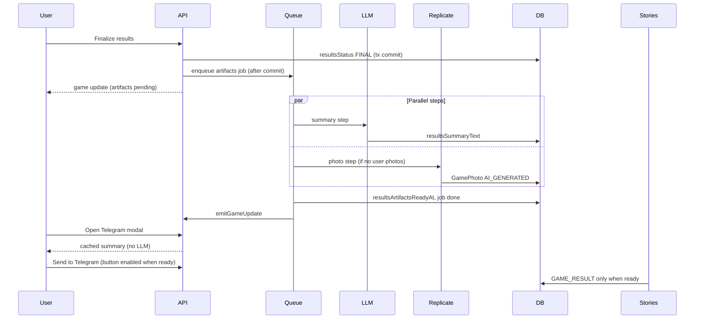

# Plan: Post-results AI artifacts (summary + photo, queue, Telegram, stories)

## Problem framing

This is **not** a “queue feature.” It is a **durable post-finalize artifact pipeline** with three consumers:

| Consumer | Needs |
|----------|--------|
| **Telegram UI** | Cached editable text; send only when safe |
| **Game photos** | Optional AI image; never override user uploads |
| **Stories feed** | Same artifacts; segments visible only when pipeline is ready |

**Separate artifact generation from Telegram delivery.** Today they are tangled: `telegramResultsSummary` is only set after send, and the modal always calls the LLM on open.

### Goals

When a game is finished and results are generated:

1. Generate an LLM summary (same style as Telegram results summary).
2. Generate a participant-based photo via Replicate (FLUX.2 max API).
3. Expose cached summary in the Telegram send UI (**no LLM on first open**).
4. Enable “Send results to Telegram” only when the pipeline completes.
5. Auto-insert AI photo and set as main **only if the user did not upload photos** (race-safe).
6. Show `GAME_RESULT` stories only after auto-generation finishes.

---

## Current state (baseline)

| Area | Today |
|------|--------|
| **LLM summary** | `ResultsTelegramService.generateResultsSummary` — only on demand via `prepareTelegramSummary` or send fallback (`game.controller.ts` ~397–440). |
| **Persistence** | `Game.telegramResultsSummary` is written **only after** Telegram send (`results-telegram.service.ts` ~436–442). |
| **UI** | `GameResultsEntryEmbedded.openTelegramSummaryModal` always calls `prepareTelegramSummary` → LLM on every first open (~214–233). |
| **Stories `GAME_RESULT`** | Shown when `resultsStatus === 'FINAL'` (`story.permissions.ts`). Summary only if **already sent** to Telegram (`story.feed.service.ts` ~280–283). |
| **Photos** | User uploads via `GamePhotoCreateService`; first upload sets `mainPhotoId` if empty. No Replicate, no `source` on `GamePhoto`. |
| **Background work** | `TranslationQueueService` (Prisma jobs + optional Redis wake + in-process worker in `server.ts`). No BullMQ/pg-boss. |
| **Finalize hook** | `recalculateGameOutcomes` → `setImmediate` → `resultsSenderService.sendGameFinished` (push/Telegram DMs, not group post). |

---

## Architecture principles

For this stack (Node API, Prisma, Postgres, optional Redis), “modern” means:

1. **Durable work** — survives process restarts (not `setImmediate` alone).
2. **Idempotent steps** — safe retries per checkpoint.
3. **Explicit product state** — UI and stories read one readiness contract.
4. **Provider boundaries** — LLM and Replicate behind small interfaces.
5. **Observable partial failure** — summary can succeed while photo fails.

### Job infrastructure options

| Approach | Fit |
|----------|-----|
| `setImmediate` only | **Wrong** — lost on crash/restart |
| Extend `TranslationQueueService` pattern | **Good phase 1** — already in codebase |
| Postgres queue (pg-boss, Graphile Worker) | Strong if you want reliability without Redis |
| BullMQ + Redis | Standard at higher volume |
| Inngest / Temporal | Overkill until multi-step sagas are needed |
| **Dedicated worker process** | **Right medium-term** — API enqueues, `npm run worker` executes |

**Recommendation:** Postgres job row + in-process worker (phase 1) → same code in dedicated worker process (phase 2). Avoid new orchestration vendors until necessary.

### Anti-patterns to avoid

| Anti-pattern | Why |
|--------------|-----|
| LLM on every modal open | Cost, latency, inconsistent copy |
| Story summary tied to `resultsSentToTelegram` | Wrong semantics |
| Replace `mainPhotoId` without enqueue snapshot | Race with user upload |
| One long blocking job polling Replicate 60s+ | Kills worker concurrency |
| `setImmediate` without persisted job | Lost work |
| Re-generate everything after Telegram already sent | Surprises users |

---

## Target behavior



---

## Core pattern: workflow with checkpoints

Do **not** use one opaque `runJob()` that does everything sequentially without persisted step state.

```
enqueue → summary step → photo step → finalize
```

Each step:

- **Idempotent** — e.g. skip if `summaryStatus === done`
- **Resumable** — store `replicatePredictionId` for async Replicate completion
- **Independently skippable** — photo skipped when user had photos at enqueue

**Parallelism (recommended):** run summary and photo steps concurrently after claim (photo prompt uses structured game facts, not the LLM paragraph). Cuts ~30s latency vs strict sequential.

---

## Readiness contract (single source of truth)

Implement one pure function (unit-tested), used by stories, Telegram button, and API:

```ts
function isResultsArtifactsReady(job: {
  summaryStatus: StepStatus;
  photoStatus: StepStatus;
}): boolean {
  const summaryOk =
    job.summaryStatus === 'done' || job.summaryStatus === 'skipped';
  const photoOk =
    job.photoStatus === 'done' || job.photoStatus === 'skipped';
  return summaryOk && photoOk;
}
```

**Product rules:**

| Surface | Rule |
|---------|------|
| **Stories `GAME_RESULT`** | `game.resultsArtifactsReadyAt != null` (set in `finalize` when `isResultsArtifactsReady`) |
| **Story summary text** | `resultsSummaryText` when present — **not** gated on `resultsSentToTelegram` |
| **Telegram send button** | `resultsArtifactsReadyAt != null` + city has `telegramGroupId` + not already sent |
| **Telegram send (photo)** | `photosCount > 0 \|\| mainPhotoId` after pipeline (AI or user photo) |

**Partial failure:** if summary succeeds and photo fails → job can still be `failed` globally, or `done` with `photoStatus = failed` and readiness = summary-only (decide: **recommend** `done` + ready when summary ok and photo skipped/failed, but Telegram send still requires a photo via relaxed “allow text-only send” or keep photo required — default: ready for stories on summary; Telegram needs photo OR user had photos).

---

## Phase 1 — Data model

### Do not overload `telegramResultsSummary`

| Field | Purpose |
|-------|---------|
| `resultsSummaryText` | AI-generated draft (modal + stories) |
| `resultsSummaryGeneratedAt` | Audit |
| `resultsArtifactsReadyAt` | Gate for UI + stories |
| `resultsArtifactsVersion` | Bumped on re-finalize; invalidates stale client state |
| `telegramResultsSummary` | Optional: copy-on-send snapshot, or deprecate in favor of `resultsSummaryText` |

### `GameResultsArtifactJob`

```prisma
enum GameResultsArtifactJobStatus { pending running done failed }
enum GameResultsArtifactStepStatus { pending running done skipped failed }
enum GamePhotoSource { USER AI_GENERATED }

model GameResultsArtifactJob {
  id        String   @id @default(cuid())
  gameId    String   @unique
  status    GameResultsArtifactJobStatus @default(pending)
  runAfter  DateTime @default(now())
  attempts  Int      @default(0)
  lastError String?

  generationVersion Int @default(1)

  summaryStatus GameResultsArtifactStepStatus @default(pending)
  summaryError  String?
  photoStatus   GameResultsArtifactStepStatus @default(pending)
  photoError    String?

  replicatePredictionId String?

  // snapshot at enqueue (race-safe main photo)
  userPhotoCountAtEnqueue Int     @default(0)
  mainPhotoIdAtEnqueue    String?
  hadUserPhotosAtEnqueue  Boolean @default(false)
  languageCode            String  @db.VarChar(10)

  createdAt DateTime @default(now())
  updatedAt DateTime @updatedAt

  @@index([status, runAfter])
}
```

**On `GamePhoto`:** `source GamePhotoSource @default(USER)`, `uploaderId` nullable for AI.

Migration: `npx prisma migrate dev` (not hand-written SQL).

---

## Phase 2 — Queue + worker

Module: `Backend/src/services/gameResultsArtifact/`

| File | Role |
|------|------|
| `gameResultsArtifactQueue.service.ts` | enqueue, claim, retry, stale reset, `startWorker()` |
| `gameResultsArtifactRedis.service.ts` | optional wake channel (copy translation queue) |
| `gameResultsArtifact.service.ts` | step runners + finalize |
| `gameResultsArtifact.readiness.ts` | `isResultsArtifactsReady` |
| `providers/summary.provider.ts` | wraps LLM |
| `providers/photo.provider.ts` | wraps Replicate |

### Enqueue (transactional boundary)

1. Transaction commits: `resultsStatus = FINAL`.
2. **After commit** in `recalculateGameOutcomes` when `previousResultsStatus !== 'FINAL'`:

```ts
void GameResultsArtifactQueueService.enqueue(gameId).catch(...)
```

**Idempotent upsert:**

- `ON CONFLICT (gameId) DO UPDATE` reset steps, bump `generationVersion`, clear `resultsArtifactsReadyAt` / `resultsSummaryText`
- **Do not re-enqueue** if `resultsSentToTelegram === true` (unless explicit admin/regenerate flow)

Optional upgrade: outbox table written in same tx as FINAL — only if enqueue throws often.

### Worker

- Register in `server.ts` next to `TranslationQueueService.startWorker()`.
- **Phase 2 deploy:** run `npm run worker` as separate process (same queue code).
- Cron/sweeper: reset `running` older than N minutes → `pending` (mirror translation queue).

### Config (`env.ts` + `env.sample`)

- `RESULTS_ARTIFACTS_ENABLED` (feature flag)
- `REPLICATE_API_TOKEN`, `REPLICATE_MODEL=black-forest-labs/flux-2-max`
- Queue: concurrency, max attempts, poll interval, stale running ms

---

## Phase 3 — Summary step (LLM)

1. Extract `buildResultsSummaryPrompt(game)` + `generateResultsSummary(...)` from `ResultsTelegramService`.
2. Worker: `LLM_REASON.RESULTS_ARTIFACTS`, language = `city.telegramPinnedLanguage || 'en-GB'`.
3. On success: `game.update({ resultsSummaryText, resultsSummaryGeneratedAt })`.
4. On AI not configured: `summaryStatus = skipped` (pipeline can still complete).

### HTTP: `prepareTelegramSummary`

| Condition | Response |
|-----------|----------|
| `resultsSummaryText` present, `regenerate !== true` | 200 cached text, **no LLM** |
| job `pending` / `running` | 409 `{ status: 'generating' }` |
| job failed, no text | fallback generate OR 503 |
| `?regenerate=true` | force LLM (“Write new version” only) |

### `sendResultsToTelegram`

- Use body `summaryText` or `resultsSummaryText`; no silent regeneration when artifacts pipeline exists.

---

## Phase 4 — Photo step (Replicate)

**Model:** [FLUX.2 max](https://replicate.com/black-forest-labs/flux-2-max) via official `replicate` npm package.

**Async-by-nature (do not block worker 60s on poll in one tick):**

1. `predictions.create` → save `replicatePredictionId`, `photoStatus = running`.
2. **Production:** Replicate webhook `POST /webhooks/replicate` completes step.
3. **Dev / fallback:** re-queue job with `runAfter` + short poll until terminal state.

**Inputs:**

- `prompt`: sport, venue, winner, informal group-photo tone.
- `input_images`: up to 8 public HTTPS avatar URLs (CloudFront / `frontendUrl` prefix).
- If no usable avatars: text-only prompt or `photoStatus = skipped`.
- `aspect_ratio: '4:5'`, `resolution: '1 MP'`, `output_format: 'webp'`.

**Skip when** `hadUserPhotosAtEnqueue === true` (`userPhotoCountAtEnqueue > 0` or any `GamePhoto` with `source = USER`).

**On success:**

1. Download output → `ImageProcessor.processChatImage(buffer, 'ai-results.webp')`.
2. `GamePhotoCreateService.createFromGeneratedBuffer` (internal; bypass participant upload guards).
3. **Main photo (transaction + snapshot):**

```ts
if (
  game.photosCount === snapshot.userPhotoCountAtEnqueue &&
  game.mainPhotoId === snapshot.mainPhotoIdAtEnqueue &&
  snapshot.userPhotoCountAtEnqueue === 0
) {
  set mainPhotoId = aiPhotoId;
}
```

4. `emitGamePhotoAdded` + `emitGameUpdate`.

---

## Phase 5 — API + realtime

Expose on game DTO and socket payload:

```ts
resultsArtifacts: {
  status: 'none' | 'pending' | 'running' | 'done' | 'failed';
  version: number;
  summaryReady: boolean;
  photoReady: boolean; // done or skipped
  readyAt: string | null;
}
```

- Set `resultsArtifactsReadyAt` in `finalize` when `isResultsArtifactsReady(job)`.
- Emit `socketService.emitGameUpdate` when readiness flips.
- Optional: `game:artifacts_updated` with small payload.
- Optional: `GET /games/:id/results-artifacts-status` for polling fallback.

---

## Phase 6 — Frontend

**`GameResultsEntryEmbedded`**

- Telegram button: enabled when `resultsArtifacts.readyAt != null` (and existing city/send guards).
- While `pending` / `running`: disabled + “Preparing results…” (i18n).
- `openTelegramSummaryModal`: use `game.resultsSummaryText` if present — **no** `prepareTelegramSummary` unless missing.
- `TelegramSummaryModal` “Write new version”: `prepareTelegramSummary?id&regenerate=true` only.

**No-photos confirm:** can remove once AI photo covers empty games.

**Types:** `Game`, `games.ts` API mapping, socket handler.

---

## Phase 7 — Stories

**`story.feed.service.ts`**

- Filter `GAME_RESULT`: `game.resultsArtifactsReadyAt != null`.
- **`toGameSummary`:** expose `resultsSummaryText` (or map to existing `telegramResultsSummary` field in API for minimal FE churn) **without** requiring `resultsSentToTelegram`.

**`GameResultStorySlide`:** reads summary from game payload.

**Push timing:** `sendGameFinished` may fire before stories appear — acceptable; optional delayed push when `readyAt` set.

---

## Phase 8 — Telegram validation

`validateGameForTelegram`: require photo when `photosCount > 0 || mainPhotoId` (satisfied by AI or user after pipeline).

Keep `generateResultsImage` for results card; main photo = user or AI.

---

## Phase 9 — Edge cases

| Case | Policy |
|------|--------|
| City without Telegram group | Still run pipeline (stories); hide send button |
| AI down | `summaryStatus = failed`; manual prepare fallback; stories policy per readiness table |
| Replicate down | `photoStatus = failed`; summary still usable |
| User uploads during job | Main unchanged (snapshot); summary still saved |
| `resetTelegramResultsSent` | Re-enqueue artifacts job; clear send flag only |
| Re-finalize after edit | Bump version, reset job, clear `readyAt` + summary (if not sent) |
| League / bar games | Same FINAL hook unless product excludes |
| Cost | One job per finalize; log LLM + Replicate prediction id |

---

## Phase 10 — Observability

- Structured logs: `gameId`, `generationVersion`, `step`, `durationMs`, `provider`.
- Admin: stuck/failed jobs list (like translation queue stats).
- Feature flag: `RESULTS_ARTIFACTS_ENABLED`.
- Sweeper cron for stale `running` jobs.

---

## Phase 11 — Tests

- Unit: `isResultsArtifactsReady`, main-photo snapshot guard, enqueue idempotency.
- Fake `SummaryProvider` / `PhotoProvider` in integration tests.
- Script: finalize → job done → DTO fields → story feed excludes until ready.
- `game-photos.ts`: `AI_GENERATED` source.
- FE: button enabled only when `readyAt` set.

---

## Orchestration

Verified against codebase 2026-05-25. Single table (replaces duplicate orchestration sections).

| Phase | Owner | Scope (verified) | Status |
|-------|-------|------------------|--------|
| 1 — Data model | backend-foundation | `Game` artifact fields, `GameResultsArtifactJob`, `GamePhotoSource`, migration `20260525174320` | [x] |
| 2 — Queue + worker | backend-foundation | `gameResultsArtifact/*` queue, Redis wake, `outcomes.service` enqueue, `startQueueWorkers` in API + `npm run worker` | [x] |
| 3 — Summary step (LLM) | backend | `SummaryProvider`, cached `prepareTelegramSummary`, `LLM_REASON.RESULTS_ARTIFACTS` | [x] |
| 4 — Photo step (Replicate) | backend | `PhotoProvider`, webhook route, deferred poll, `createFromGeneratedBuffer`, main-photo snapshot | [x] |
| 5 — API + realtime | backend | `buildResultsArtifactsDto`, `read.service`, `getResultsArtifactsStatus`, socket via `emitGameUpdateAfterArtifactsChange` | [x] |
| 6 — Frontend | frontend | `GameResultsEntryEmbedded` ready/preparing gates, cached summary, `TelegramSummaryModal` regenerate, i18n | [x] |
| 7 — Stories | backend | `story.feed.service` / `story.permissions` gate on `resultsArtifactsReadyAt`; summary from `resultsSummaryText` | [x] |
| 8 — Telegram validation | backend | `validateGameForTelegram` photo guard; send uses cached summary | [x] |
| 9 — Edge cases | backend | `shouldSkipArtifactReenqueue` when sent; `resetTelegramResultsSent` re-enqueues; re-finalize via `shouldEnqueueArtifactsOnRecalculate` | [x] |
| 10 — Observability | backend | `logResultsArtifact` JSON logs; `GET /admin/game-results-artifacts-queue/stats`; sweeper in queue worker + stats | [x] |
| 11 — Tests | qa | `npm run test:game-results-artifacts` (unit + DB integration/script; integration skips without `DB_URL`) | [x] |

### Implementation order

| Step | Scope | Status |
|------|--------|--------|
| 1 | Schema + readiness + enqueue on first FINAL / re-edit | [x] |
| 2 | API + socket `resultsArtifacts` blob; FE cached summary + disabled Telegram button | [x] |
| 3 | Story gating; summary from `resultsSummaryText` (not send flag) | [x] |
| 4 | Replicate step + `GamePhoto.source` + main-photo snapshot | [x] |
| 5 | Parallel summary + photo after claim; `regenerate=true` on prepare | [x] |
| 6 | `npm run worker`, admin queue stats, stale-running sweeper | [x] |

**Remaining gaps (non-blocking):** Admin UI for artifact queue stats (API only); explicit FE unit test for Telegram button gating.

---

## Key files

| Layer | Files |
|-------|--------|
| Trigger | `outcomes.service.ts` |
| LLM | `results-telegram.service.ts`, `llmReasons.ts`, `game.controller.ts` |
| Queue | `gameResultsArtifact/*`, `server.ts`, `worker.ts`, `workers/startQueueWorkers.ts`, `env.ts` |
| Replicate | `replicate/replicateImage.service.ts`, webhook route |
| Photos | `gamePhoto.create.service.ts`, `schema.prisma` |
| Stories | `story.feed.service.ts` |
| UI | `GameResultsEntryEmbedded.tsx`, `TelegramSummaryModal.tsx`, `games.ts`, i18n `gameResults.json` |
| Admin | `GET /api/admin/game-results-artifacts-queue/stats` |
