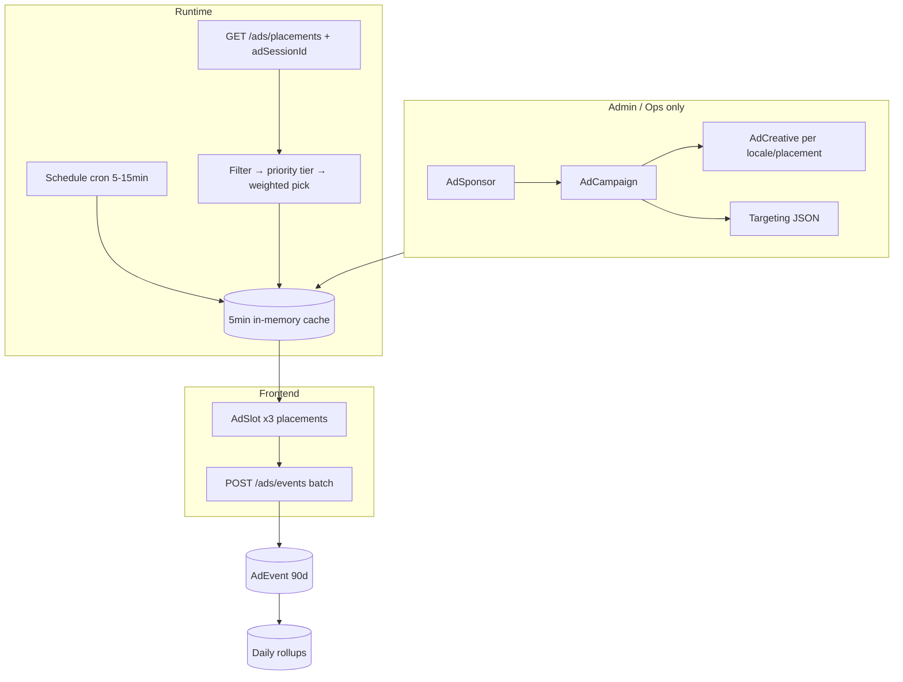

# Internal sponsorship ad platform

Server-driven **Sponsor → Campaign → Creative → Placement → Targeting → Events** model for in-app sponsor banners. Not an ad network — lightweight internal ad ops owned end-to-end.

**Last updated:** 2026-06-06 · **Phase A: DONE** · **Phase B: DONE**

**Contents:** [Mental model](#1-mental-model) · [Decisions](#2-decisions-grill-2026-06-05) · [Data model](#3-data-model-prisma) · [Targeting & delivery](#4-targeting--delivery) · [Delivery API](#5-delivery-api) · [Frontend](#6-frontend-integration) · [Admin](#7-admin--ops-suite) · [Analytics](#8-analytics--sponsor-reporting) · [Anti-patterns](#9-what-to-avoid) · [Phases](#10-phased-rollout) · [Codebase fit](#11-fit-with-existing-codebase) · [API summary](#12-api-surface-summary) · [Phase A checklist](#13-phase-a-checklist)

---

## 1. Mental model



| Entity | Role |
|--------|------|
| **Sponsor** | First-class brand; reports grouped by sponsor across campaigns |
| **Campaign** | Schedule, priority, weight, caps, snooze, URL trust, targeting |
| **Creative** | Card assets keyed by locale + optional placement override |
| **Placement** | `home_hero`, `find_top`, `leaderboard_banner` |
| **Events** | Viewable impressions, clicks, snoozes — idempotent batch writes |

**Phase A operator:** internal ops via `Admin/` only (`isAdmin`). Club admins do not self-serve until a later phase.

**Phase A content:** clubs, external sponsors, and Bandeja-internal promos — all supported from day one via `clickAction` variants.

---

## 2. Decisions (grill 2026-06-05)

| # | Topic | Decision |
|---|--------|----------|
| 1 | Who runs campaigns | Internal ops only (`Admin/`) in Phase A |
| 2 | Sponsor types | Clubs + external + Bandeja internal — all from day one |
| 3 | Creative format | Card: image + optional title/subtitle/CTA; whole card tappable |
| 4 | `home_hero` position | After `StoriesRail`; **hidden** while `CityPromptBanner` or blocking questionnaire shows |
| 5 | Multiple campaigns | **Allowed** per city + placement; **weighted random** among matches (revised from one-active rule) |
| 6 | Phase A targeting | **City + sport** only (`cityIds`, optional `sports`; empty sports = all) |
| 7 | Dismiss | Snooze, not permanent — per-campaign `dismissSnoozeDays`; `AdUserState.snoozedUntil` |
| 8 | External URLs | In-app browser; `clickUrlTrusted` default **true** (no interstitial); **false** → “Leaving Bandeja” |
| 9 | Locales | **Full locale variants** from start — separate image + text per locale |
| 10 | Placements Phase A | **All three:** `home_hero`, `find_top`, `leaderboard_banner` |
| 11 | Analytics Phase A | Totals + unique reach + breakdown by placement/city/locale/date + **CSV + PDF** |
| 12 | Creatives per placement | **Optional override** per placement; fallback to campaign default creative |
| 13 | Impression | **Viewability:** ≥50% visible for ≥1s (Intersection Observer) |
| 14 | Dark mode | Optional `imageUrlDark`; fallback to light image |
| 15 | Disclosure | Default label (`ads.sponsored` or custom `disclosureLabel`); **`hideDisclosure`** can hide tag |
| 16 | `AdSponsor` | First-class; **PDF/stats grouped by sponsor** |
| 17 | Publish conflicts | **No Admin hard block** — ops manages overlapping campaigns manually |
| 18 | Rotation stickiness | **Session-stable** server pick + **frequency cap** |
| 19 | Default frequency cap | **3 impressions / 7 days**; ops can change or set `null` to disable |
| 20 | Locale resolution | User locale → campaign `defaultLocale` → any available creative |
| 21 | Priority vs weight | **Highest priority tier only** enters pool; then **weighted random** |
| 22 | Fetch cadence | **Once per app launch** + refetch on **city** or **sport context** change |
| 23 | Event retention | **Daily rollups** + raw `AdEvent` kept **90 days** then purge |
| 24 | Sport per placement | `home_hero` → primary sport; `find_top` → Find filter sport; `leaderboard_banner` → leaderboard picker sport |
| 25 | Random pick location | **Server-side** with client `adSessionId` (UUID per launch) |
| 26 | Preview | **Admin preview panel** + **`testUserIds`** on DRAFT campaigns |
| 27 | Scheduling | **Background cron** (5–15 min) flips `SCHEDULED` ↔ `ACTIVE` ↔ `ENDED` |
| 28 | Offline | **Hide all ad slots** — no cached display |
| 29 | In-campaign A/B | `variantKey` in schema; Phase A Admin UI = **one creative per locale** only; use two campaigns for A/B tests |
| 30 | Doc | Inline spec + this appendix + Phase A checklist |

---

## 3. Data model (Prisma)

```prisma
model AdSponsor {
  id           String   @id @default(cuid())
  name         String
  contactEmail String?
  notes        String?
  clubId       String?
  createdAt    DateTime @default(now())
  campaigns    AdCampaign[]
}

model AdCampaign {
  id                String   @id @default(cuid())
  sponsorId         String
  name              String
  status            AdCampaignStatus @default(DRAFT)
  priority          Int      @default(0)
  weight            Int      @default(100)
  startsAt          DateTime?
  endsAt            DateTime?
  defaultLocale     String   @default("en")  // locale fallback anchor
  frequencyCap      Json?    // { maxImpressions: 3, windowDays: 7 } | null = disabled
  dismissible       Boolean  @default(true)
  dismissSnoozeDays Int?     // e.g. 2, 3, 7; null if not dismissible
  clickUrlTrusted   Boolean  @default(true)   // false → show "Leaving Bandeja"
  disclosureLabel   String?  // override "Sponsored"
  hideDisclosure    Boolean  @default(false)
  targeting         Json     // Phase A: cityIds, sports (optional)
  testUserIds       String[] @default([])
  sponsor           AdSponsor @relation(...)
  creatives         AdCreative[]
  placements        AdCampaignPlacement[]
}

model AdCreative {
  id           String          @id @default(cuid())
  campaignId   String
  placement    AdPlacementKey? // null = default for all placements
  locale       String          // required per locale variant
  variantKey   String          @default("A") // schema only in Phase A UI
  imageUrl     String
  imageUrlDark String?
  title        String?
  subtitle     String?
  ctaLabel     String?
  clickUrl     String
  clickAction  AdClickAction   @default(OPEN_URL)
  metadata     Json?
  @@unique([campaignId, placement, locale, variantKey])
}

model AdCampaignPlacement {
  campaignId String
  placement  AdPlacementKey
  @@unique([campaignId, placement])
}

model AdEvent {
  id         String        @id @default(cuid())
  eventId    String        @unique
  type       AdEventType   // IMPRESSION | CLICK | DISMISS
  campaignId String
  creativeId String
  placement  AdPlacementKey
  userId     String?
  adSessionId String?
  platform   String?
  cityId     String?
  sport      Sport?
  locale     String?
  createdAt  DateTime      @default(now())
  @@index([campaignId, type, createdAt])
  @@index([placement, createdAt])
  @@index([createdAt])
}

model AdUserState {
  userId       String
  campaignId   String
  impressions  Int       @default(0)
  capWindowStart DateTime?
  lastSeenAt   DateTime?
  snoozedUntil DateTime?
  @@unique([userId, campaignId])
}

model AdCampaignDailyStats {
  id           String   @id @default(cuid())
  campaignId   String
  sponsorId    String
  date         DateTime @db.Date
  placement    AdPlacementKey
  cityId       String?
  locale       String?
  impressions  Int      @default(0)
  uniqueUsers  Int      @default(0)
  clicks       Int      @default(0)
  dismisses    Int      @default(0)
  @@unique([campaignId, date, placement, cityId, locale])
  @@index([sponsorId, date])
}

model AdSessionPick {
  adSessionId  String
  userId       String
  placement    AdPlacementKey
  contextKey   String   // hash of cityId + sport for that placement
  campaignId   String
  creativeId   String
  createdAt    DateTime @default(now())
  @@unique([adSessionId, userId, placement, contextKey])
}
```

**Creative lookup:** `(campaignId, placement, locale)` → `(campaignId, null, locale)` → `(campaignId, placement, defaultLocale)` → `(campaignId, null, defaultLocale)` → any locale for campaign.

---

## 4. Targeting & delivery

### Phase A targeting JSON

```json
{
  "cityIds": ["city_abc"],
  "sports": ["PADEL"]
}
```

- `cityIds` required for non–`testUserIds` delivery
- `sports` empty or omitted = all sports
- Deferred to later phases: country, language, level, rollout %, include/exclude lists

### Evaluation order

1. `status` + schedule window (cron keeps status in sync)
2. Placement enabled on campaign
3. `testUserIds` bypass for DRAFT/QA
4. City + sport match (sport context varies by placement — see §6)
5. Exclude if `snoozedUntil > now`
6. Exclude if frequency cap exceeded (`AdUserState` + campaign `frequencyCap`)
7. Filter to **highest `priority`** among remaining
8. **Weighted random** among that tier (server-side, session-stable — see §5)
9. Resolve creative by locale + placement fallback chain

### Frequency cap default

`{ "maxImpressions": 3, "windowDays": 7 }` on new campaigns; ops sets `null` to disable.

### Dismiss / snooze

On dismiss: set `snoozedUntil = now + dismissSnoozeDays`. Campaign eligible again after snooze expires.

---

## 5. Delivery API

### Resolve placements

```
GET /api/ads/placements?keys=home_hero,find_top,leaderboard_banner&adSessionId={uuid}
Authorization: Bearer …
```

Optional body or query `context` (or derived server-side from user + request hints):

```json
{
  "cityId": "…",
  "sportsByPlacement": {
    "home_hero": "PADEL",
    "find_top": "TENNIS",
    "leaderboard_banner": "PADEL"
  }
}
```

**Session-stable pick:** server stores/resolves via `AdSessionPick` keyed by `(adSessionId, userId, placement, contextKey)`. Same session + context → same campaign/creative. New `adSessionId` on app launch; new pick when `cityId` or sport for that placement changes.

Response includes resolved card fields + `dismissible`, `dismissSnoozeDays`, `clickUrlTrusted`, `disclosureLabel`, `hideDisclosure`.

**Fetch cadence (client):** one call after auth ready with new `adSessionId`; repeat only on city change or sport-context change for a placement.

**Offline:** do not call API; hide slots.

**Cache:** in-memory campaign cache (~5 min TTL), invalidate on admin writes + cron status flips.

### Record events

```
POST /api/ads/events
{
  "adSessionId": "…",
  "events": [{
    "eventId": "uuid",
    "type": "IMPRESSION",
    "campaignId": "…",
    "creativeId": "…",
    "placement": "HOME_HERO"
  }]
}
```

- Batch ≤20; idempotent on `eventId`
- `IMPRESSION`: increment `AdUserState.impressions`; update cap window
- `DISMISS`: set `snoozedUntil` from campaign `dismissSnoozeDays`
- Async write; non-blocking for UI

### Admin preview

```
GET /admin/ads/preview?campaignId=&userId=&placement=&locale=
```

Simulates full evaluation without requiring `ACTIVE` status when `testUserIds` includes user.

---

## 6. Frontend integration

### Placement registry

```ts
export const AD_PLACEMENTS = {
  HOME_HERO: 'home_hero',
  FIND_TOP: 'find_top',
  LEADERBOARD_BANNER: 'leaderboard_banner',
} as const;
```

### `AdSlot` component

- Card UI: hero image (`imageUrl` / `imageUrlDark`), optional title/subtitle/CTA
- Disclosure chip unless `hideDisclosure`; text from `disclosureLabel` or i18n `ads.sponsored`
- Dismiss X when `dismissible`
- Impression via Intersection Observer (50% / 1s)
- Click: `IN_APP_ROUTE` / `CLUB_PAGE` / `MARKET_ITEM` → in-app nav; external → in-app browser; if `!clickUrlTrusted` → “Leaving Bandeja” confirm first

### Mount points

| Placement | Location | Visibility |
|-----------|----------|------------|
| `home_hero` | `MyTab` after `StoriesRail` | Hidden if `CityPromptBanner` or blocking `SportQuestionnairePrompt` |
| `find_top` | `FindTab` above `AvailableGamesSection` | Always when online + resolved |
| `leaderboard_banner` | `ProfileLeaderboard` top | Always when online + resolved |

### Sport context for refetch

| Placement | Sport input |
|-----------|-------------|
| `home_hero` | `getUserPrimarySport(user)` |
| `find_top` | Find filter sport (`findSportFilterToApiParam`) |
| `leaderboard_banner` | Leaderboard picker sport |

---

## 7. Admin / ops suite

Extend `Admin/` (same auth as mass notifications, app versions).

### Pages

1. **Sponsors** — CRUD, optional `clubId`; sponsor-level stats export
2. **Campaigns** — targeting (city + sport), schedule, priority, weight, caps, snooze, URL trust, disclosure
3. **Creatives** — upload per locale; optional per-placement override; light + dark image
4. **Placements** — checkboxes (`home_hero`, `find_top`, `leaderboard_banner`)
5. **Analytics** — campaign + **sponsor** views; filters by placement, city, locale, date range
6. **Preview** — simulate user/placement/locale; **`testUserIds`** for on-device QA

### Creative upload

`S3Service` prefix `uploads/ads/{campaignId}/{creativeId}.webp`; Sharp resize; suggested hero ratio 3:1 (placement overrides may differ).

### Workflow

```
DRAFT → (preview + testUserIds QA) → SCHEDULED → ACTIVE → PAUSED / ENDED
         ↑ cron auto-transitions by startsAt/endsAt
```

No hard block when multiple campaigns target same city + placement.

---

## 8. Analytics & sponsor reporting

### Phase A metrics

| Metric | Source |
|--------|--------|
| Impressions | Viewable `AdEvent` IMPRESSION |
| Unique reach | Distinct `userId` per campaign/placement/city/locale |
| Clicks / CTR | CLICK / impressions |
| Dismiss / snooze rate | DISMISS / impressions |
| By sponsor | Roll up all campaigns under `AdSponsor` |

### Rollups

Nightly job aggregates into `AdCampaignDailyStats` (includes `sponsorId`). Admin charts read rollups; recent drill-down reads raw events (≤90 days).

### Export

- **CSV** — campaign or sponsor, date range, dimensional breakdown
- **PDF** — sponsor-facing summary (logo optional later); grouped by sponsor

---

## 9. What to avoid

- Env feature flags for ad content — use DB + Admin
- Targeting logic on client beyond sport/city context passthrough
- Full rule DSL in Phase A — JSON + Zod is enough
- Showing ads offline or counting mount-only impressions
- In-campaign A/B UI before ops asks for it — two weighted campaigns suffice
- Club admin self-serve in Phase A

---

## 10. Phased rollout

### Phase A (this spec) — **DONE**

Everything in [§2 Decisions](#2-decisions-grill-2026-06-05) — full vertical slice: 3 placements, rotation, caps, snooze, locales, analytics CSV/PDF, sponsor entity, Admin preview, schedule cron. See [§13 checklist](#13-phase-a-checklist).

### Phase B — **DONE**

- Extended targeting: language, level bands (sport-scoped), rollout %, include/exclude user IDs
- In-campaign A/B UI (`variantKey` + `metadata.variantWeight` / campaign `variantWeights`)
- Segment presets (`AdTargetingPreset` + Admin built-ins; “Belgrade padel 3+” auto-seeded)
- Optional Redis campaign cache (`REDIS_URL` + `ADS_REDIS_CACHE`)

### Phase C

- Club admin self-serve with approval queue
- Contract/billing hooks on campaign end
- Sponsor portal read-only (optional)

### Phase D (optional)

- Webhooks, advanced takeover rules, Redis-backed session picks at scale

---

## 11. Fit with existing codebase

| Existing | Reuse |
|----------|--------|
| `AppVersionService` | Campaign cache + TTL |
| `StoryView` / upsert patterns | `AdUserState`, event idempotency |
| `AdminMassNotificationService` | City targeting seed |
| `S3Service` + Sharp | Creative hosting |
| `Admin/` | CRUD + preview + exports |
| `MyTab` / `FindTab` / `ProfileLeaderboard` | Mount points + sport context |
| Schedule cron pattern (if exists) or new job | `SCHEDULED` ↔ `ACTIVE` ↔ `ENDED` |

---

## 12. API surface summary

```
GET  /api/ads/placements?keys=…&adSessionId=…
POST /api/ads/events

GET    /admin/ads/sponsors
POST   /admin/ads/sponsors
GET    /admin/ads/sponsors/:id/stats
GET    /admin/ads/sponsors/:id/export?format=csv|pdf

POST   /admin/ads/campaigns
PATCH  /admin/ads/campaigns/:id
POST   /admin/ads/campaigns/:id/creatives/upload
GET    /admin/ads/campaigns/:id/stats
GET    /admin/ads/preview?campaignId=&userId=&placement=&locale=
GET    /admin/ads/targeting-presets
POST   /admin/ads/targeting-presets
DELETE /admin/ads/targeting-presets/:id
POST   /admin/ads/targeting-presets/:id/apply
POST   /admin/ads/campaigns/:id/apply-preset/:presetId
```

---

## 13. Phase A checklist — **FULLY DONE**

### Backend — schema & jobs

- [x] Prisma models: `AdSponsor`, `AdCampaign`, `AdCreative`, `AdCampaignPlacement`, `AdEvent`, `AdUserState`, `AdSessionPick`, `AdCampaignDailyStats`
- [x] Enums: `AdCampaignStatus`, `AdPlacementKey`, `AdClickAction`, `AdEventType`
- [x] Migration via `npx prisma migrate dev`
- [x] Zod schemas: targeting (city + sport), frequencyCap, campaign write DTOs
- [x] `AdDeliveryService`: filter → priority tier → weighted pick → locale/placement creative resolve
- [x] `AdSessionPick` read/write for session-stable selection
- [x] In-memory campaign cache (invalidate on admin PATCH + cron)
- [x] Schedule cron: flip `SCHEDULED`/`ACTIVE`/`ENDED` by `startsAt`/`endsAt`
- [x] Nightly rollup job → `AdCampaignDailyStats`; purge raw `AdEvent` > 90 days
- [x] `POST /api/ads/events` batch + idempotency
- [x] `GET /api/ads/placements` with `adSessionId` + sport/city context

### Backend — admin

- [x] Sponsor CRUD
- [x] Campaign CRUD (all Phase A fields including snooze, URL trust, disclosure)
- [x] Creative upload to S3 (locale + optional placement override + dark variant)
- [x] Preview endpoint
- [x] Stats queries (campaign + sponsor; dimensional breakdown)
- [x] CSV + PDF export endpoints
- [x] Wire routes in `admin.routes.ts`

### Frontend

- [x] `shared/adPlacements.ts`
- [x] `api/ads.ts` — placements fetch, events batch
- [x] `useAdPlacements` hook — `adSessionId` per launch; refetch on city/sport change
- [x] `AdSlot` + `AdCard` components (viewability, dismiss, disclosure, dark image)
- [x] Click handler — in-app routes, in-app browser, conditional “Leaving Bandeja”
- [x] Mount: `MyTab` (with system-prompt hide rule), `FindTab`, `ProfileLeaderboard`
- [x] Hide slots when offline
- [x] i18n: `ads.sponsored`, `ads.leavingBandeja`, etc. (en, ru, es, sr, cs)

### Admin app

- [x] Nav + sponsors page
- [x] Campaigns list/create/edit
- [x] Creative upload UI (locale matrix + placement override toggles)
- [x] Preview panel (user + placement + locale)
- [x] Analytics dashboard + export buttons
- [x] `testUserIds` field on campaign form

### QA

- [x] Automated test: targeting filter (city, sport)
- [x] Automated test: priority tier + weighted pick determinism with fixed seed/session
- [x] Automated test: frequency cap + snooze expiry
- [x] Automated test: locale fallback chain
- [x] Automated test: event idempotency + impression increments
- [x] `testUserIds` DRAFT preview (`AdDeliveryService.preview` + unit filter)
- [x] `clickUrlTrusted` confirm gating (`adClickHandler.test.ts`)
- [x] All three placements + city/sport context (`ads.ts` integration)

## 14. Phase B checklist — **FULLY DONE**

### Backend

- [x] Targeting schema: `languages`, `levelBands` (optional `sport`), `rolloutPercent`, `includeUserIds`, `excludeUserIds`, `variantWeights`
- [x] `matchesExtendedTargeting` in delivery filter (after city/sport/cap/snooze)
- [x] In-campaign A/B: weighted `variantKey` pick via `resolveCreative` + `metadata.variantWeight`
- [x] `AdTargetingPreset` model + migrate
- [x] Admin APIs: `GET/POST/DELETE /admin/ads/targeting-presets`, `POST …/apply`, `POST /campaigns/:id/apply-preset/:presetId`
- [x] Redis campaign cache layer with in-memory fallback (`ad.cache.redis.ts`)
- [x] Unit tests: language, level band, sport-scoped band, rollout %, include/exclude, force-include bypass, variant weight pick, variantKey pin
- [x] `includeUserIds` force delivery bypasses city/sport/language/level/rollout (exclude still wins)
- [x] Preview accepts `variantKey` query param

### Admin app

- [x] Campaign form: languages, level bands, rollout %, include/exclude user IDs
- [x] Campaign-level `variantWeights` fallback inputs (creatives tab)
- [x] Segment presets: apply/manage/save-as-preset (`ads-presets.js`); built-ins with `allCities` resolve all cities
- [x] In-campaign A/B: variant tabs A–D, weight input, variant matrix, preview variant selector
- [x] API wired to `/admin/ads/targeting-presets`
