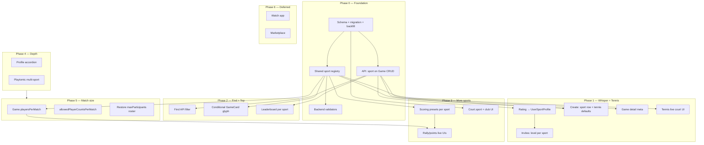

# Multisport feature plan

Plan for evolving Bandeja from a padel-first app into a multisport platform: padel, tennis, pickleball, badminton, ping-pong (table tennis), and squash.

**North star:** Sport is **metadata**, not a **mode**. Padel-only users should barely notice multisport exists.

**Related:** Per-sport questionnaires & level model → [`PLAN_MULTISPORT_QUESTIONNAIRES.md`](./PLAN_MULTISPORT_QUESTIONNAIRES.md). Deferred live/officiating → [`PLAN_MULTISPORT_DEFERRED.md`](./PLAN_MULTISPORT_DEFERRED.md).

---

## UX thesis (read this first)

Users open Bandeja for *their games, friends, and chats*—not to “be in tennis mode.” Multisport must not feel like a second app inside the app.

> **One life in Bandeja. Each game knows what it is. The UI surfaces sport only when it prevents a mistake or answers a question.**

**Do not** ship a persistent header “sport switcher” (Playtomic-style). Bandeja is relationship-first (My, chats, invites). A global mode creates false filtering, stale state on deep links, and header chrome we don’t have (`GameModeToggle` is unused; header already hosts Find subtabs, create, notifications).

---

## What we have today

Sport is **implicit**, not modeled:

- No `Sport` on `Game`, `Court`, `Club`, or `User` in Prisma.
- `User.level` (1–7) and `User.socialLevel` are **global**; `socialLevel` is already a second axis (bar/social events), not sport.
- Scoring is largely **tennis-shaped** (`ScoringRules`, classic sets/games/deuce, Americano points) and works for padel + much of tennis.
- Live scoring is **padel-specific** in UI: `ServeCourtSchema` uses FIP court dimensions, service boxes, doubles serve rotation (`serveGuide.ts`).
- Game creation defaults to **4 players** (doubles padel).
- Playtomic import maps registry `playtomicSportId` values (`PADEL`, `TENNIS`, `PICKLEBALL`, `TABLE_TENNIS`, …) via `playtomicSport.ts`; unsupported Playtomic sports (e.g. `BASKETBALL`) are skipped with logs.
- `appModeStore` (`PADEL` | `SOCIAL`) is **not sport** and appears unused in UI—do not repurpose it as a sport switcher.

**Existing UX patterns to extend (not fight):**

- **My** tab = unified inbox (no entity-type filter)—keep sport out of home filtering.
- **Find** = discovery; entity chips (game / training / tournament / leagues) + `**FiltersPanel`** (clubs, time, level)—sport belongs **in the filter panel**, not the header or bottom tabs.
- `**GameCard`** is already dense (entity, gender, rating flags)—sport glyph only when needed.
- **Create** = `CreateMenuModal` → `/create-game`; no extra top-level step without strong reason.

---

## Product principle: two axes, not one toggle


| Axis              | Meaning                         | Example                                |
| ----------------- | ------------------------------- | -------------------------------------- |
| **Sport**         | Rules, court, rating, discovery | Padel vs tennis                        |
| **Activity type** | What we already call entities   | `GAME`, `BAR`, `TRAINING`, tournaments |


Keep **BAR / social events** orthogonal to sport. A bar night is not “pickleball mode.” `sport` is null / N/A for non-court events.

---

## Three layers of sport UX

### Layer 1 — Silent (default ~80%: padel-primary)

- No sport chip on cards.
- No sport filter on Find (API still sends `PADEL`).
- Create game: no sport UI; `sport = PADEL` only in API.
- Level: one number in UI (backed by `UserSportProfile` internally).
- Copy unchanged (“court”, “game”).

**Padel-only before/after screenshots should be hard to tell apart.**

### Layer 2 — Contextual (multi-sport, no global mode)


| Moment            | Pattern                                                                      |
| ----------------- | ---------------------------------------------------------------------------- |
| **Create**        | Compact row inside **Game Format** card—not a new screen (see below).        |
| **Join / invite** | Level = **that game’s sport**; no extra label when context is obvious.       |
| **Game detail**   | Meta row: small icon + “Tennis · doubles”—same weight as club, not a banner. |
| **Find**          | Sport in **Filters panel**; default = primary sport (invisible).             |
| **Leaderboard**   | Default primary sport; change inside Top tab—not a 6th bottom tab.           |


**GameCard rule:** show sport glyph only when `game.sport !== viewer.primarySport` **or** Find filter is “All sports.”

### Layer 3 — Explicit (only when ambiguity hurts)

- No primary sport set (rare new account).
- Live scoring would be wrong without clarity (first pickleball board).
- Cross-sport invite: “You’re 3.8 in padel; this tennis game uses tennis level 4.1.”

Inline clarification—not a mode switch.

---

## Tab asymmetry (critical)


| Tab             | Filter by sport?            | Why                                                                                     |
| --------------- | --------------------------- | --------------------------------------------------------------------------------------- |
| **My**          | **Never**                   | Commitments are one chronological life. Mixed-sport players must see all invites/games. |
| **Find**        | **Optional** (filter panel) | Discovery is where narrowing helps. Default = primary sport.                            |
| **Chats**       | **Never**                   | Context is in the game/chat preview.                                                    |
| **Leaderboard** | **Per-sport ranking**       | Scoped inside Top; default primary.                                                     |


**Don’t uniform-filter the whole app.**

---

## Create flow (highest-risk surface)

**Do not** add “Step 0: Choose sport” before format/club.

### Patterns (ranked)

**A. Sport row inside Game Format card (recommended)**

```
Format: Americano                    [change]
Sport:  Padel  ›                      ← visible only if user has 2+ sports enabled
```

Default collapsed/hidden for single-sport users. Default value = last used or primary.

**B. Long-press “Game” in create menu** — power path to sport picker; zero UI for others.

**C. Infer from club/court** — pick tennis court → sport auto-set; row shows “Tennis” with subtle edit.

**D. Duplicate last game** — “create again” copies sport.

**Never:** blocking “What are you playing?” on every create.

After sport is set: filter **match format** (1v1 / 2v2), game types, and scoring presets via registry (progressive disclosure—not 40 greyed fields). **Event roster size** (`maxParticipants`) uses the global range (2…user cap, **never 3**), not sport `allowedPlayerCountsPerMatch`.

---

## Ratings (data split, quiet UI)

Mirror `level` vs `socialLevel`: **split in data, not in chrome.**

1. **In a game context** — digits only; sport implied by game.
2. **Profile** — primary sport prominent; “Other sports” **collapsed accordion**.
3. **Welcome questionnaire** — keep padel level; optional footer: “Also play other sports? Add in profile.” **No** six-sport wall at onboarding.
4. **Invite modal** — filter by **game’s sport level**; padel level on expand only.

Avoid `Padel 3.4 | Tennis 4.1 | …` on every list row.

---

## Find discovery

Extend `**FiltersPanel`** / `gameFiltersStorage` (like level, clubs)—**not** header, **not** entity chip row (already full).

- Default: primary sport (behaves like “no filter”).
- Panel: “All sports” + per-sport toggles.
- Filter icon dot when sport ≠ default (existing pattern for level/clubs).
- Empty state mentions sport only when filter is narrow: “No tennis games this week.”

---

## Game details & live scoring

- **Details:** sport in metadata strip with time/club/level—not hero banner.
- **Live scoring:** padel UI unchanged for padel. Tennis = same engine, different court SVG. Rally sports = simpler board; serve diagram opt-in (“Show serve help”). **No** full-screen sport intro before scoring.

---

## Copy & notifications

Parameterized i18n: `t('game.court', { sport })` → “court” vs “table”. Defaults stay padel-flavored for padel-only users.

- Padel-only: “Your game starts at 18:00” (unchanged).
- Multi-sport: prefix sport only when `game.sport !== primary`.

---

## Progressive disclosure (user model)

Unlock UI with behavior, not feature flags for everyone:

```
sportsEnabled: ['PADEL']                    → no sport UI
sportsEnabled: ['PADEL','TENNIS']           → sport row on create
sportsPlayed: { TENNIS: 3+ }                → optional Find filter affordances
```

Track `User.primarySport`, `User.sportsEnabled[]`, `lastCreatedSport` (client + server).

---

## Anti-patterns


| Obtrusive                | Unobtrusive                          |
| ------------------------ | ------------------------------------ |
| Sport in bottom nav      | Sport in Find filters only           |
| Filter **My** by sport   | Unified My feed                      |
| Header sport switcher    | Implicit default + Find filter       |
| Sport chip on every card | Glyph when ≠ primary or “All sports” |
| Onboarding sport wall    | Profile → add sport                  |
| Six levels on avatar     | One level; context on game           |
| App color/icon per sport | Subtle glyph                         |


---

## Sport capability matrix (engineering phasing)


| Sport          | Default match | Allowed per match | Default event roster | Scoring today                        | Live scoring effort                        |
| -------------- | ------------- | ----------------- | -------------------- | ------------------------------------ | ------------------------------------------ |
| **Padel**      | 2v2 (4)       | 1v1 (2), 2v2 (4)  | 4                    | Classic + Americano ✓                | Done (reference)                           |
| **Tennis**     | 1v1 (2)       | 1v1 (2), 2v2 (4)  | 4                    | Classic ✓ (~same rulebook)           | Medium (court diagram, serve rules differ) |
| **Pickleball** | 1v1 (2)       | 1v1 (2), 2v2 (4)  | 4                    | Points presets ✓ (P3)                | Rally board ✓; **kitchen/NVZ deferred**    |
| **Badminton**  | 1v1 (2)       | 1v1 (2), 2v2 (4)  | 4                    | POINTS_21 fits; rally rules          | Medium–high                                |
| **Ping-pong**  | 1v1 (2)       | 1v1 (2), 2v2 (4)  | 4                    | POINTS_11 preset (add)               | Medium (table UI, serve every 2)           |
| **Squash**     | 1v1 (2)       | 1v1 (2) only      | 2                    | `BEST_OF_5_11` (PAR to 11, win-by-2) | **Done** — box court UI, no serve guide v1 |


**Event roster** = `Game.maxParticipants` (2…user cap, exclude **3** only). **Match size** = `Game.playersPerMatch` (2 = 1v1, 4 = 2v2). Registry field: `allowedPlayerCountsPerMatch` + `defaultPlayersPerMatch` (padel default **4**, all other implemented sports default **2**).

**Game types** (Americano, Mexicano, Winner Court, etc.) stay shared where “rotate partners + points.” Restrict presets/types via sport registry, not `if padel`. Large events (6, 8, 10, 12 players) are valid for any sport; each **match** still uses `playersPerMatch`.

---

## Technical architecture

### A. `Sport` enum + registry (single source of truth)

```ts
enum Sport {
  PADEL, TENNIS, PICKLEBALL, BADMINTON, TABLE_TENNIS, SQUASH
}

type SportConfig = {
  id: Sport;
  defaultPlayersPerMatch: 2 | 4;       // padel → 4; other sports → 2
  allowedPlayerCountsPerMatch: number[]; // e.g. [2, 4] or [2] (squash)
  defaultEventRoster: number;          // create default for maxParticipants (typically 4)
  allowedGameTypes: GameType[];
  allowedScoringPresets: ScoringPreset[];
  defaultScoringPreset: ScoringPreset;
  liveScoring: 'padel_doubles' | 'tennis' | 'rally_points' | 'none';
  courtLabelKey: string;
  playtomicSportId?: string;
};
```

Frontend: create, filters, validators read registry. Backend: `validateGameForSport(sport, body)` checks `**playersPerMatch**`, presets, and game types—not event `maxParticipants`.

### B. Database (incremental)


| Model / field                   | Purpose                                                                                          |
| ------------------------------- | ------------------------------------------------------------------------------------------------ |
| `Game.sport`                    | Required; default `PADEL` for backfill                                                           |
| `Game.playersPerMatch`          | Players per match (2 = 1v1, 4 = 2v2); default from sport; stored per game (**Phase 5**)          |
| `Game.maxParticipants`          | Event roster size; **not** sport-limited to match counts (**Phase 5** restores 2…cap, exclude 3) |
| `Court.sport`                   | Filter courts; infer create-game sport                                                           |
| `Club.sports`                   | `Sport[]` or junction `ClubSport`                                                                |
| `UserSportProfile`              | `userId`, `sport`, `level`, `reliability`, `gamesPlayed`, …                                      |
| `User.primarySport`             | Default for Find filter & create—not a global UI mode                                            |
| `User.sportsEnabled`            | Drives progressive UI unlock                                                                     |
| `GameOutcome` / rating pipeline | Level from `UserSportProfile` for `game.sport`                                                   |


**Migration:** existing → `PADEL`; copy `User.level` → `UserSportProfile(PADEL)`. Keep `User.level` during transition (display primary sport for padel-only users).

### C. API & queries

- **My / chats / invites:** no sport filter (return all).
- **Find / public discovery:** `?sport=` default primary when omitted; `?sport=all` explicit.
- **Rankings:** per sport; default primary.
- **Create:** reject incompatible `playersPerMatch` / `scoringPreset` / `gameType`; validate `maxParticipants` separately (2…user cap, never 3).
- **Courts:** filter by `game.sport` when club selected.

### D. Live scoring: plugin per sport

```
liveScoring/
  engines/
  sports/
  registry.ts   # game.sport + playersPerMatch + scoringPreset → engine + UI
```

Tennis: classic engine + tennis court component. Rally sports: `mode: 'rally'` or points-only UI. Hide serve guide when not applicable. **Match** layout uses `playersPerMatch`, not `maxParticipants` (Phase 5).

### E. Scoring presets

Add e.g. `TABLE_TENNIS_BEST_OF_5_11`, `BADMINTON_21`, `SQUASH_PAR_11` mapped into `ScoringRules` where possible.

### F. Playtomic / clubs

- Import multi-sport; map `TABLE_TENNIS` correctly.
- Club courts: sport tabs **only if** club has 2+ sports.

### G. Watch / native

`PadelGameState.swift` → generic live state + `sport`; padel first on watch.

---

## Phased rollout (UX-first)

### Phase UX-0 — Invisible (2–3 weeks)

- `Sport` enum, `Game.sport`, `UserSportProfile`, backfill PADEL.
- Registry + backend validation.
- **No visible UI change** for padel-primary users.

### Phase UX-1 — Whisper (3–4 weeks)

- Sport row on create (multi-sport profiles only).
- Game detail meta line; invite/rating uses game’s sport.
- Tennis: match 1v1/2v2 defaults, classic live + tennis court SVG (**P5** stores `playersPerMatch` per game).
- Infer sport from court when available.

### Phase UX-2 — Find (2 weeks)

- Sport in `FiltersPanel` + storage; conditional card glyph.
- Leaderboard default primary; switch inside Top.

### Phase UX-3 — Breadth (4–6 weeks)

- Badminton, table tennis, pickleball points live UI + presets.
- Pickleball: points rally live board (P3 ✓); **kitchen / non-volley zone rules deferred** to a later phase.
- Squash singles + `BEST_OF_5_11` preset + box court live UI.

### Phase UX-4 — Opt-in depth

- Profile accordion for other sports; per-sport notifications copy.
- Multi-sport Playtomic/clubs; marketplace categories if needed.

### Phase UX-5 — Match size vs event roster

- Split **event roster** (`maxParticipants`, old 2…12 minus 3) from **match format** (`playersPerMatch`: 1v1 / 2v2).
- Participants UI: match switch when sport allows `[2, 4]`; full roster grid unchanged for padel Americano.
- Padel default 2v2; other sports default 1v1.

---

## Implementation phases & parallelization

Engineering breakdown aligned with UX phases above. **Dependencies** and **parallel tracks** called out explicitly.

### Overview




### Phase 0 — Foundation (invisible) · 2–3 weeks

**Goal:** Data model + contracts; padel users see zero UI change.


| Track               | Work                                                                                                                                                                                                   |
| ------------------- | ------------------------------------------------------------------------------------------------------------------------------------------------------------------------------------------------------ |
| **0A — Data**       | `Sport` enum; `Game.sport` (default PADEL); `UserSportProfile`; `User.primarySport`, `User.sportsEnabled`; optional `Court.sport`; migration + backfill; copy `User.level` → `UserSportProfile(PADEL)` |
| **0B — Registry**   | Shared `SportConfig` (players, game types, presets, liveScoring kind, i18n keys) — single package or FE/BE with contract tests                                                                         |
| **0C — API**        | Expose `sport` on Game create/update/read/list; socket payloads if games sync live                                                                                                                     |
| **0D — Validation** | `validateGameForSport()` on create/update; default `PADEL` when omitted (old clients)                                                                                                                  |
| **0E — Types**      | FE `Game` type + API pass-through; no user-facing UI                                                                                                                                                   |


**Parallel:** 0A + 0B same day (lock enum values first). 0C after 0A. 0D needs 0B + 0C. 0E parallel with 0D once API shape is frozen.

**Exit:** All games `sport=PADEL`; create without `sport` still works; validator tests for padel defaults.

---

### Phase 1 — Whisper + tennis · 3–4 weeks

**Goal:** Per-sport rating; tennis creatable; UI only for multi-sport users.


| Track                | Work                                                                                                                     | Depends on   |
| -------------------- | ------------------------------------------------------------------------------------------------------------------------ | ------------ |
| **1A — Rating**      | Outcomes → `UserSportProfile` by `game.sport`; PADEL fallback from `User.level` during transition                        | P0           |
| **1B — Create UX**   | Sport row in Game Format card (`sportsEnabled.length > 1`); tennis match 1v1/2v2; superseded by **P5** `playersPerMatch` | P0, registry |
| **1C — Court infer** | Pick court with `Court.sport` → set game sport (editable)                                                                | P0           |
| **1D — Game detail** | Meta: icon + label; parameterized court/table copy                                                                       | P0           |
| **1E — Invites**     | Invite filters + displayed level for game’s sport                                                                        | 1A           |
| **1F — Tennis live** | Registry → classic engine; tennis court SVG; serve guide tennis or simplified                                            | P0, registry |
| **1G — i18n**        | `sport.*` keys (minimal EN + existing locales)                                                                           | 1B, 1D       |
| **1H — QA**          | Extend `qa-matchLiveScoring` / create paths with `TENNIS`                                                                | 1A, 1F       |


**Parallel:**


| Together     | Notes                                             |
| ------------ | ------------------------------------------------- |
| 1A + 1F      | Agree `game.sport` in match metadata first        |
| 1B + 1D + 1G | FE; shared registry hook                          |
| 1C           | Parallel if `Court.sport` in P0                   |
| 1E           | After 1A returns per-sport levels in game context |


**Gate:** 1A before any rated tennis game in production.

**Exit:** Multi-sport user creates tennis game; tennis rating isolated; padel-only UI unchanged.

---

### Phase 2 — Find + Top · ~2 weeks


| Track                  | Work                                                                                  | Depends on   |
| ---------------------- | ------------------------------------------------------------------------------------- | ------------ |
| **2A — Find API**      | `?sport=` on public games; default primary; `all` explicit; **never** filter My/chats | P0           |
| **2B — FiltersPanel**  | Sport in panel + `gameFiltersStorage`; dot on filter icon                             | 2A, registry |
| **2C — GameCard**      | Glyph if `game.sport !== primary` OR filter is all                                    | 2B           |
| **2D — Leaderboard**   | API + sport control inside Top tab                                                    | P0, 1A       |
| **2E — Primary sport** | Set/display in profile/settings                                                       | P0           |


**Parallel:** 2A ∥ 2E. 2B after 2A. 2C after 2B (or stub for dev). 2D when leaderboard API accepts `sport`.

**Exit:** Find defaults to primary; All shows mixed; My shows all sports together.

---

### Phase 3 — Breadth (sports 3–6) · 4–6 weeks

Each sport = **mini-bundle** (parallelizable after shared infra):


| Bundle       | Presets                 | Match (1v1 / 2v2)      | Live UI                                 |
| ------------ | ----------------------- | ---------------------- | --------------------------------------- |
| Table tennis | POINTS_11, best-of-N    | `[2, 4]` default 1v1   | Table, serve every 2                    |
| Badminton    | POINTS_21               | `[2, 4]` default 1v1   | Rally board                             |
| Pickleball   | Points doubles ✓        | `[2, 4]` default 1v1 ✓ | Rally board ✓; **kitchen/NVZ deferred** |
| Squash       | `BEST_OF_5_11`, singles | `[2]` only             | Simplified box court (**done**)         |


**Shared (once, then parallel sports):**

- **3S** — presets in `scoringPresets.json` + `rulebook.ts` + backend `SCORING_PRESETS`
- **3L** — `liveScoring/registry.ts` → `sport + preset → component`
- **3C** — `Court.sport` + club court tabs (2+ sports only)

**Parallel:** 3S → then four sport bundles in parallel. **3C** ∥ entire phase (needs P0 `Court.sport` only).

**Sequential:** Squash after singles-only match size in registry (`allowedPlayerCountsPerMatch: [2]`). **P5** corrects mistaken use of `allowedPlayerCounts` on event roster.

**Pickleball (P3 bundle)**

- Registry: `POINTS_16` / `21` / `24` / `32`, `TIMED`, `CUSTOM`; match **1v1 or 2v2**; `liveScoring: rally_points`.
- Live: `rally-points` + `pickleball-board` (`PickleballCourt` SVG, no kitchen/NVZ lines); no serve setup.
- **Deferred:** kitchen / NVZ enforcement, two-bounce rule, official serve-sequence UI.

---

### Phase 4 — Depth · **met on dev**


| Track                  | Work                                               | Parallel?                                                                                        |
| ---------------------- | -------------------------------------------------- | ------------------------------------------------------------------------------------------------ |
| **4A — Profile**       | Other sports accordion, add sport, per-sport level | ∥ 4B                                                                                             |
| **4B — Notifications** | Sport in copy when `game.sport !== primary`        | ∥ 4A                                                                                             |
| **4C — Playtomic**     | Multi-sport import; drop PADEL-only filter         | **done** (P4-C-1..3)                                                                             |
| **4F — Leagues**       | `sport` on season; no cross-sport                  | **Done** — `LeagueSeason.sport`, validators, create league sport, `multisport-phase4-leagues.ts` |


---

### Phase 5 — Match size vs event roster · `MULTISPORT_MATCH_SIZE` · **next**

**Goal:** Fix P0–P4 regression: `allowedPlayerCounts` was applied to `**maxParticipants`**, blocking padel 6+ player events. **Event roster** and **match format** are separate fields.


| Concept          | Field                                     | Meaning                                                                                          |
| ---------------- | ----------------------------------------- | ------------------------------------------------------------------------------------------------ |
| Event roster     | `Game.maxParticipants`                    | People in the game (Americano 8, …). Valid: `2…userCap`, **never `3`**. Same for all sports.     |
| Match format     | `Game.playersPerMatch`                    | Players per match: **2** = 1v1, **4** = 2v2. Drives live court, serve guide, match pairing size. |
| Sport capability | `SportConfig.allowedPlayerCountsPerMatch` | Allowed match sizes for this sport (registry).                                                   |
| Sport default    | `SportConfig.defaultPlayersPerMatch`      | **Padel → 4.** **All other implemented sports → 2.**                                             |


**Product / UX**

- **Max participants** grid: restore `gameOrLeagueParticipantOptions(user)` (exclude 3 only)—**do not** intersect with `allowedPlayerCountsPerMatch`.
- If `allowedPlayerCountsPerMatch.length === 1` → hide switch; set `playersPerMatch` to that value.
- If `allowedPlayerCountsPerMatch === [2, 4]` → segmented control **1v1 (2)** / **2v2 (4)** in Participants section (create + edit).
- Changing sport on create: reset `playersPerMatch` to sport default if current ∉ allowed; **do not** clamp `maxParticipants` to 2/4.
- Game detail meta: show match format when useful (e.g. “2v2” alongside sport).

**Schema & API**

- Prisma: `Game.playersPerMatch Int @default(4)` (backfill: PADEL → 4; other sports → 2 or infer from legacy `maxParticipants` where 2/4).
- Rename registry: `allowedPlayerCounts` → `allowedPlayerCountsPerMatch`; add `defaultPlayersPerMatch`, `defaultEventRoster`.
- `validateGameForSport`: validate `playersPerMatch` ∈ allowed; **remove** `maxParticipants` from sport validator.
- Add `validateMaxParticipants(n)`: `n >= 2`, `n !== 3`, `n <= userCap`.
- Expose `playersPerMatch` on create/update/read/socket.


| Track                         | Work                                                                                             |
| ----------------------------- | ------------------------------------------------------------------------------------------------ |
| **5A — Data**                 | `Game.playersPerMatch`; migration + backfill                                                     |
| **5B — Registry**             | Rename fields; padel default 4 / others 2; squash `[2]` only                                     |
| **5C — Validation**           | Split sport vs roster validators; undo `allowedPlayerCounts` on `maxParticipants`                |
| **5D — Create / edit FE**     | Match switch; restore full roster grid; remove sport filter on `allowedParticipantOptions`       |
| **5E — Live scoring**         | Engines/registry use `playersPerMatch`, not `maxParticipants`, for court layout                  |
| **5F — Generation / results** | Roster thresholds use `maxParticipants`; team size in a match uses `playersPerMatch`             |
| **5G — Leagues**              | Season games inherit sport `defaultPlayersPerMatch`                                              |
| **5H — QA**                   | `multisport-phase5-match-size.ts`: padel 8 + `playersPerMatch=4`; squash reject 4; tennis switch |


**Parallel:** 5A+5B day 1 → 5C → 5D ∥ 5E ∥ 5F → 5H.

**Exit:** Padel 8-player Americano creatable with 2v2 matches; `validateGameForSport({ sport: PADEL, maxParticipants: 8 })` passes; live doubles court when `playersPerMatch=4` regardless of roster size.

**Undo from P0–P4 (checklist):**

- `CreateGame.tsx` `allowedParticipantOptions` sport ∩ roster cap.
- `validateGameForSport` `maxParticipants` branch.
- Both `sportRegistry.ts`: `allowedPlayerCounts: [2, 4]` blocking padel 6+.
- Tests that expect `maxParticipants: 8` to fail for padel.

**ADR-002:** `maxParticipants` = event size; `playersPerMatch` = match size (2 or 4). Registry publishes match allowances only.

---

### Phase 6 — Deferred depth


| Track                | Work                                             |
| -------------------- | ------------------------------------------------ |
| **6D — Watch**       | Generic live state + `sport` + `playersPerMatch` |
| **6E — Marketplace** | Categories by sport                              |


*(Former Phase 4 tracks 4D / 4E.)*

---

### 2–3 dev allocation (example)


| Week | Dev A           | Dev B                    | Dev C                      |
| ---- | --------------- | ------------------------ | -------------------------- |
| 1–2  | P0 schema       | P0 registry + validators | P0 types + FE types        |
| 3    | P1 rating       | P1 tennis live           | P1 create + detail         |
| 4    | P1 invites + QA | P1 i18n + court infer    | P1 integration tests       |
| 5    | P2 Find API     | P2 FiltersPanel + cards  | P2 Leaderboard             |
| 6–8  | Bundle TT       | Bundle badminton         | Bundle pickleball / squash |
| 9+   | P4 profile      | P4 Playtomic             | P5 match size              |
| 10+  | P6 watch        | —                        | P6 marketplace             |


---

### Critical path

```
Schema (P0) → Rating by sport (P1A) → Create + tennis (P1B) → Find (P2) → More sports (P3) → Depth (P4) → Match size (P5)
```

- **Marketing “multisport”:** P0 + P1 (+ P2 recommended).
- **All six sports creatable:** P0 + P1 + P3 (+ P2 for discovery).
- **Padel social / Americano roster regression:** **P5** before broad prod if 6+ player games matter.

---

### Do not parallel blindly


| Risk                                                       | Why                                               |
| ---------------------------------------------------------- | ------------------------------------------------- |
| FE create + BE rating without frozen `Game.sport` contract | Broken rated tennis                               |
| Sport filter on **My** tab                                 | Violates plan; hides invites                      |
| Six live UIs before registry plugin                        | Unmaintainable duplication                        |
| Playtomic before `Court.sport`                             | Bad court–sport mapping                           |
| Global header sport switcher                               | Conflicts with unobtrusive UX                     |
| `allowedPlayerCounts` on `maxParticipants`                 | Blocks padel 6+; conflates roster with match size |


---

### Feature flags / milestones


| Flag                    | Phases  | User-visible                                                                  |
| ----------------------- | ------- | ----------------------------------------------------------------------------- |
| `MULTISPORT_DATA`       | P0      | No                                                                            |
| `MULTISPORT_TENNIS`     | P0 + P1 | Multi-sport + tennis creators only                                            |
| `MULTISPORT_FIND`       | + P2    | Filter + card glyphs                                                          |
| `MULTISPORT_6_SPORTS`   | + P3    | All six sports creatable + live registry (**dev complete**; staging flag TBD) |
| `MULTISPORT_POLISH`     | + P4    | Profile, clubs, notifications                                                 |
| `MULTISPORT_MATCH_SIZE` | + P5    | Padel 6+ roster restored; 1v1/2v2 switch per sport                            |


---

## UX sketches

**Create (multi-sport user only)**

```
┌─ Game format ─────────────────────┐
│ Americano                         │
│ Sport: Tennis ›                   │
│ Players: 4 · Level 3.0–4.5        │
└───────────────────────────────────┘
```

**Create — participants (Phase 5)**

```
┌─ Participants ────────────────────┐
│ Event size:  [2][4][5][6][8]…      │  ← maxParticipants (no 3)
│ Match format: ( ) 1v1  (•) 2v2    │  ← playersPerMatch; only if sport allows [2,4]
│ [avatars …]                        │
└────────────────────────────────────┘
```

**Find — filter panel (not header)**

```
[Filter ▾]  ← dot when sport ≠ primary
  ...
  Sport:  ( ) Padel  ( ) Tennis  ( ) All
  Level:  [====|====]
  Clubs:  ...
```

**Profile**

```
Padel  3.4  (primary, visible)

▸ Other sports
    Tennis 4.1 · 12 games
    [+ Add sport]
```

**Game card**

- Padel-primary viewer + padel game → **no** sport glyph (today’s card).
- Same viewer + tennis game → small tennis icon in meta corner.

---

## What stays shared

- Chats, invites, wallets, leagues, Americano/Mexicano generators, bets.
- `Team` / `TeamPlayer` (flexible roster).
- Results engine when `ScoringRules` + sport config align.

---

## Risks & decisions

1. **Level scale** — 1–7 per sport for v1; same UX, separate numbers.
2. **Singles vs doubles** — **Decided (P5):** `Game.playersPerMatch` (2 = 1v1, 4 = 2v2), not `maxParticipants`. Registry: `allowedPlayerCountsPerMatch` + `defaultPlayersPerMatch`. See **ADR-002**.
3. **Cross-sport tournaments** — out of scope v1.
4. **Branding** — Bandeja benefits from generic positioning.
5. `**appModeStore`** — delete or rename; never use for sport.

---

## Success metrics

- Padel-primary users: no drop in create-game completion; no increase in support “where did my game go.”
- Multi-sport: % games with `sport ≠ PADEL` without extra create steps (infer + defaults).
- Rating integrity: no cross-sport writes to one level field.
- Find: filter panel sport usage vs accidental empty My tab (should be ~0).

---

## Suggested v1 scope

**UX-0 + UX-1 + tennis** before marketing “multisport.”

Ship padel + tennis + (optional) table tennis/badminton on points/classic **without** full officiating (kitchen, lets, etc.).

**Unobtrusive discovery + per-sport rating** beat perfect live scoring for all six sports.

---

## Team plan & assignments

### Orchestrator status

**Last updated:** 2026-05-19

**Current phase:** Phases **0–6 code complete on dev** (`multisport-phase6.ts` green). **Open (ops/QA):** staging `MULTISPORT_6_SPORTS` flag + manual 6-sport / Watch on-device smoke (P6-D-1, P0-INT-1); notification copy per locale (P4-B-4).

#### Step 0 kickoff

- P0-ARCH-ADR — encoded in schema + `sportRegistry` (Game.sport, UserSportProfile, no My filter, PADEL dual-write)
- P0-ARCH-API — Game `sport`; user `primarySport` / `sportsEnabled` / `sportProfiles` on profile GET
- P0-ARCH-REG — `Backend/src/sport/sportRegistry.ts`, `Frontend/src/sport/sportRegistry.ts`
- P0-EM-FLAGS — milestone `MULTISPORT_DATA` (schema + API; no prod flag UI)
- P0-DATA-PLAN — migration SQL + `db push` on dev; backfill PADEL profiles
- P0-QA-MATRIX — covered by `scripts/tests/multisport-phase0.ts` + QA standing checks

#### Phase 0 tasks

- P0-DB-1 — `Sport` enum; `Game.sport`; `UserSportProfile`; `User.primarySport`; `User.sportsEnabled`; `Court.sport`
- P0-DB-2 — backfill games→PADEL; `User.level` → `UserSportProfile(PADEL)`
- P0-REG-1 — BE registry (padel + tennis; others stub)
- P0-REG-2 — contract test registry ↔ Prisma enum
- P0-API-1 — Game CRUD `sport`; default PADEL when omitted
- P0-API-2 — Profile: `primarySport`, `sportsEnabled`, `sportProfiles`
- P0-VAL-1 — `validateGameForSport()`
- P0-VAL-2 — unit tests (tennis vs padel preset/player count)
- P0-FE-1 — FE `Game` / `User` types; API pass-through
- P0-FE-2 — FE registry + `useSportConfig`
- P0-SOCK-1 — sport on game payloads via existing `getGameInclude` / emit paths
- P0-Q-AUDIT — My / invites / chats: no sport filter (source audit in CI test)
- P0-QA-1 — create without `sport` in body succeeds
- P0-QA-2 — no UI changes (padel-only unchanged)
- P0-INT-1 — staging seed multi-sport users (deferred to Phase 1 deploy)
- P0-EXIT — exit criteria met on dev DB

#### Phase 1 frontend UX track

- P1-CRE-1 — Sport row in `GameFormatCard` if `sportsEnabled.length > 1`
- P1-CRE-2 — Tennis create constraints/defaults from FE sport registry
- P1-DET-1 — Game detail meta includes sport icon + label
- P1-INV-2 — `getInvitablePlayers` + `PlayerListModal` use game sport-level context
- P1-INF-1 — Create: infer sport from selected `Court.sport` (editable via sport row)
- P1-I18N-1 — `sport.`* keys added in EN + sr/ru/es/cs for Phase 1 FE surfaces

#### Gates


| Gate | Status   | Notes                                                                                                                                 |
| ---- | -------- | ------------------------------------------------------------------------------------------------------------------------------------- |
| G0   | **Pass** | ADR decisions in code + plan                                                                                                          |
| G1   | **Pass** | Schema live; My never filtered by sport                                                                                               |
| G5   | **Pass** | `Frontend/src/liveScoring/registry.ts` frozen for 6 sports; rally + padel/tennis serve routes; `test:live-scoring` 39/39              |
| G7   | **Pass** | ADR-002: roster vs `playersPerMatch`; `multisport-phase5-match-size.ts`; padel 8 + 2v2 passes                                      |
| G6   | **Pass** | PADEL, TENNIS, TABLE_TENNIS, BADMINTON, PICKLEBALL, SQUASH creatable via BE validators + FE registries; `multisport-phase3*.ts` green |


#### Phase 1 orchestrator (backend + live + QA track)

- P1-RAT-1 — rating/outcomes calculators read+write sport-isolated stats via `UserSportProfile` by `game.sport`
- P1-RAT-2 — PADEL transition dual-write preserved (`UserSportProfile(PADEL)` + legacy `User.level` path)
- P1-RAT-3 — game participant payloads project per-sport level in game sport context
- P1-INV-1 — invite payloads use game sport context level (sender/participants)
- P1-LIV-1 — `Frontend/src/liveScoring/registry.ts` skeleton (`sport + preset -> engine/ui`)
- P1-LIV-2 — tennis court integration via `TennisServeCourtSchema` + live registry wiring
- P1-LIV-3 — Phase 1 tennis serve guide simplification via registry engine adapter (padel unchanged)
- P1-QA-1 — `Backend/scripts/qa-matchLiveScoring.ts` includes TENNIS validation + padel regression guard
- P1-QA-2 — manual QA: padel rating unchanged; tennis rating isolation

#### Phase 2 orchestrator (Find + Top — 2026-05-19)


| Track | Status | Deliverable                                                                                       |
| ----- | ------ | ------------------------------------------------------------------------------------------------- |
| P2-A  | [x]    | `GET /games/available?sport=`; `resolvePublicGamesSportFilter`; default primary; `all` unfiltered |
| P2-B  | [x]    | `FiltersPanel` sport chips; `gameFiltersStorage.filterSport`; `findSportFilter.ts`                |
| P2-C  | [x]    | `shouldShowGameCardSportGlyph` + GameCard sport glyph rules                                       |
| P2-D  | [x]    | Leaderboard `?sport=` via `resolveLeaderboardSportMode`; FE `rankingApi`                          |
| P2-E  | [x]    | `PUT /users/primary-sport` (profile/settings); primary drives Find default                        |
| P2-QA | [x]    | `multisport-phase2.ts` in `test:automated`; FE `findSportFilter.test.ts`                          |


- P2-QA-1 — My mixed; Find default primary; `sport=all` shows both (source + DB integration)
- P2-QA-2 — Invites/chats: no sport filter (source audit)
- **Gate G4** — Find filters by sport; My / invites / chats do not

#### Phase 3 orchestrator (integration 2026-05-19)

All parallel tracks **done**. Exit smoke: `npm run test:automated` (15/15 suites) + `npm run test:live-scoring` (29/29) + BE/FE lint clean.


| Track   | Status | Deliverable                                                                                                                                                                |
| ------- | ------ | -------------------------------------------------------------------------------------------------------------------------------------------------------------------------- |
| P3-S-1  | [x]    | `POINTS_11`, `BEST_OF_3_11`, `BEST_OF_5_11`, `PAR_11` in Prisma + `gameFormat` + `scoringPresets.json` + rulebooks; BE/FE registries for TT, badminton, pickleball, squash |
| P3-L-1  | [x]    | `liveScoring/registry.ts`: 6 sports → engine + UI (`RallyScoreBoard`, per-sport courts, TT serve coach); serve guide off for `rally_points`                                |
| P3-TT   | [x]    | `TABLE_TENNIS`: 2/4 players, `POINTS_11` + best-of-11; `TableTennisCourt` + 2-point serve rotation; `multisport-phase3-table-tennis.ts`                                    |
| P3-BD   | [x]    | `BADMINTON`: `POINTS_21`, 2/4, `BadmintonCourt` rally board; validator in `multisport-phase3.ts`                                                                           |
| P3-PB   | [x]    | `PICKLEBALL`: points presets, `PickleballCourt` (no kitchen v1); `multisport-phase3-pickleball.ts`                                                                         |
| P3-SQ   | [x]    | `SQUASH`: singles match size (`allowedPlayerCountsPerMatch: [2]`); `BEST_OF_5_11`, box court                                                                               |
| P3-C-1  | [x]    | Club court tabs + `?sport=` filter; `courtSport.ts` + `multisport-phase3-courts.ts`                                                                                        |
| P3-QA-0 | [x]    | `multisport-phase3*.ts` wired in `run-all.ts`; `qa-matchLiveScoring` padel regression + tennis                                                                             |


**Milestone `MULTISPORT_POLISH`:** **Met on dev** — P4-A–F + **P6-E** marketplace sport categories + **P6-D** Watch payload fields; orchestrator `multisport-phase6.ts` green on dev.

**Milestone `MULTISPORT_6_SPORTS`:** **Met on dev** — six sports creatable with validators, live registry, and court filtering. Staging/prod flag enable + manual 6-sport smoke still EM-owned (week 14 checklist).

**Integration smoke 2026-05-19:** `test:automated` **23/23** (incl. `multisport-phase5-match-size.ts`, `multisport-phase6.ts`); FE `test:live-scoring` **39/39**.

#### Phase 4 orchestrator (complete on dev — 2026-05-19)


| Track | Status | Deliverable                                                                                                            |
| ----- | ------ | ---------------------------------------------------------------------------------------------------------------------- |
| P4-A  | [x]    | Profile accordion, add sport, per-sport level; `sportProfile` APIs; `multisport-phase4-profile.ts`                     |
| P4-B  | [x]    | Push/Telegram sport prefix when `game.sport !== primary`; `notificationSport.ts`; `multisport-phase4-notifications.ts` |
| P4-C  | [x]    | Playtomic multi-sport import; `multisport-phase4-playtomic.ts`                                                         |
| P4-D  | → P6   | Watch — moved to **Phase 6** (P6-D); see Phase 6 orchestrator                                                        |
| P4-E  | → P6   | Marketplace — moved to **Phase 6** (P6-E); see Phase 6 orchestrator                                                  |
| P4-F  | [x]    | League season `sport`; `validateLeagueSeasonSport`; `multisport-phase4-leagues.ts`                                     |
| P4-QA | [x]    | `multisport-phase4.ts` cross-track orchestrator in `test:automated`                                                    |


- P4-B-1 — `shouldPrefixSport` + `formatSportPrefix` / `withOptionalSportPrefix` (BE `sport.`* i18n)
- P4-B-2 — game reminders (push + Telegram), invites, league round start, league game assigned
- P4-B-3 — `multisport-phase4-notifications.ts` in `run-all.ts`
- P4-B-4 — manual QA: notification copy per locale (EM/QA)
- P4-A-BE-1 — `POST /users/sports`, `PUT /users/primary-sport`, `PUT /users/sport-profiles/:sport/level`
- P4-A-BE-2 — registry `implemented` validation; PADEL level dual-write to `User.level`
- P4-A-FE-1 — primary sport level on avatar badge; “Other sports” accordion; add-sport picker
- P4-A-FE-2 — padel-only users: no accordion (unchanged)
- P4-A-QA-1 — `multisport-phase4-profile.ts` + FE `profileSports.test.ts`

#### Phase 5 orchestrator (complete on dev — 2026-05-19)


| Track | Status | Deliverable                                                       |
| ----- | ------ | ----------------------------------------------------------------- |
| P5-A  | [x]    | `Game.playersPerMatch` + migration/backfill                       |
| P5-B  | [x]    | Registry: `allowedPlayerCountsPerMatch`, `defaultPlayersPerMatch` |
| P5-C  | [x]    | Validators split; roster 2…cap exclude 3                          |
| P5-D  | [x]    | Create/edit: match switch + full roster grid (`MatchFormatControl`) |
| P5-E  | [x]    | Live scoring uses `playersPerMatch` (`liveScoring/registry.ts`)   |
| P5-F  | [x]    | Generators / fixed teams use match vs roster (`playersPerMatchOf`) |
| P5-G  | [x]    | League games inherit sport match default                          |
| P5-H  | [x]    | `multisport-phase5-match-size.ts` in `test:automated`             |


- P5-ARCH-ADR — **ADR-002** done: `allowedPlayerCountsPerMatch` / `defaultPlayersPerMatch`; `validateMaxParticipants`; sport validator uses `playersPerMatch` only
- **Gate G7** — **Pass** (`multisport-phase5-match-size.ts`: padel 8 roster + 2v2; squash rejects 4; tennis 1v1/2v2; roster rejects 3)

#### Phase 6 orchestrator (Watch + marketplace — 2026-05-19)


| Track  | Status | Deliverable                                                                                                      |
| ------ | ------ | ---------------------------------------------------------------------------------------------------------------- |
| P6-D   | [x]    | `WatchGame.swift`: optional `sport` + `playersPerMatch`; BE `Game` fields on detail API                          |
| P6-E   | [x]    | `MarketItemCategory.sport`; `GET /market-items/categories?sport=`; FE `marketplaceSport.ts` + `MarketplaceList`  |
| P6-QA  | [x]    | `multisport-phase6.ts` orchestrator (+ `multisport-phase6-marketplace.ts`) in `test:automated`                   |


- P6-D-1 — Watch decodes multisport fields from game JSON (manual on-device scoring smoke still QA-owned)
- P6-E-1 — Categories scoped to primary sport + generic (`sport: null`); admin CRUD `sport` on category
- P6-E-2 — `multisport-phase6-marketplace.ts` DB integration (listActive filter)

#### Blockers

- Prisma `migrate dev` blocked locally by modified historical migration (`20260517155346_game_invite_outcome_table`); applied via `db push` + committed `prisma/migrations/20260519120000_multisport_phase0/migration.sql` for other envs.

---

Step-by-step roster and tasks for execution. Full program ~18 FTE-equivalent; **v1 (P0+P1+P2)** ~10 people.

### Standing roster


| Role             | Count | Responsibility                                    |
| ---------------- | ----- | ------------------------------------------------- |
| EM / Tech lead   | 1     | Phases, gates, feature flags, scope               |
| Product / UX     | 1     | Unobtrusive rules, acceptance, no header switcher |
| Architect        | 1     | ADR, API, registry, rating, live plugin contracts |
| Backend dev      | 3     | Prisma, APIs, rating, validators, Find/Top        |
| Frontend dev     | 3     | Create, cards, filters, profile, live UI          |
| Full-stack dev   | 2     | Registry, court infer, integration                |
| QA               | 2     | Padel regression + multisport matrix              |
| QA automation    | 1     | `qa-matchLiveScoring`, create-game scripts        |
| i18n             | 1     | `sport.`* keys, all locales                       |
| Data / migration | 1     | Backfill, rollback                                |
| iOS / Watch      | 1     | Phase 6 (deferred)                                |
| DevOps           | 0.5   | Flags, staging seeds                              |


### Step 0 — Kickoff (2–3 days)

**Gate:** ADR signed → start Phase 0. No feature coding before enum + API sketch approved.


| Who       | Task         | Deliverable                                                                                                                                     |
| --------- | ------------ | ----------------------------------------------------------------------------------------------------------------------------------------------- |
| Architect | P0-ARCH-ADR  | **ADR-001 Multisport**: enum, `Game.sport`, `UserSportProfile`, My/Find rules, no My filter, `User.level` dual-write                            |
| Architect | P5-ARCH-ADR  | **ADR-002 Match size**: `Game.playersPerMatch`, `allowedPlayerCountsPerMatch`, roster vs match (see Phase 5)                                    |
| Architect | P0-ARCH-API  | OpenAPI delta: `sport` on Game; user `primarySport` / `sportsEnabled`; optional `Court.sport`                                                   |
| Architect | P0-ARCH-REG  | `SportConfig` registry location (BE + FE or shared package)                                                                                     |
| UX        | P0-UX-AC     | Acceptance checklist: padel-only UI unchanged; sport row hidden for 1 sport; Find filter in panel only                                          |
| EM        | P0-EM-FLAGS  | Milestones: `MULTISPORT_DATA`, `MULTISPORT_TENNIS`, `MULTISPORT_FIND`, `MULTISPORT_6_SPORTS`, `MULTISPORT_POLISH`, `MULTISPORT_MATCH_SIZE` (P5) |
| Data      | P0-DATA-PLAN | Migration + backfill + rollback                                                                                                                 |
| QA lead   | P0-QA-MATRIX | Test matrix: padel regression × tennis × old clients                                                                                            |
| All devs  | —            | Read this doc + ADR                                                                                                                             |


### Phase 0 — Foundation (week 1–2) · `MULTISPORT_DATA`

**Week 1 — parallel**


| Who       | Task ID   | Deliverable                                                                                                       |
| --------- | --------- | ----------------------------------------------------------------------------------------------------------------- |
| Architect | P0-ARCH-1 | Review Prisma models                                                                                              |
| Data      | P0-DB-1   | `Sport` enum; `Game.sport`; `UserSportProfile`; `User.primarySport`; `User.sportsEnabled`; `Court.sport` nullable |
| Data      | P0-DB-2   | Migration + backfill; copy `User.level` → `UserSportProfile(PADEL)`                                               |
| FS-1      | P0-REG-1  | `sportRegistry.ts` (BE): padel + tennis; others stub                                                              |
| FS-1      | P0-REG-2  | Contract test: registry ↔ Prisma enum                                                                             |
| BE-1      | P0-API-1  | Game CRUD includes `sport`; default PADEL if omitted                                                              |
| BE-1      | P0-API-2  | User: `primarySport`, `sportsEnabled`, sport profiles (read)                                                      |
| BE-2      | P0-VAL-1  | `validateGameForSport()`                                                                                          |
| BE-2      | P0-VAL-2  | Unit tests: invalid preset/player count rejected                                                                  |
| FE-1      | P0-FE-1   | Types + API client pass-through (no UI)                                                                           |
| FE-2      | P0-FE-2   | FE `sportRegistry.ts`; `useSportConfig(sport)`                                                                    |
| QA-auto   | P0-QA-1   | CI: create game without `sport` still succeeds                                                                    |
| QA        | P0-QA-2   | Manual: no UI diff for padel user                                                                                 |


**Parallel:** P0-DB ∥ P0-REG (day 1). P0-API after `Game.sport`. P0-VAL after registry + API. P0-FE after API shape frozen.

**Week 2**


| Who          | Task ID    | Deliverable                                      |
| ------------ | ---------- | ------------------------------------------------ |
| BE-3         | P0-SOCK-1  | Socket payloads include `sport` if applicable    |
| BE-3         | P0-Q-AUDIT | Audit My / chats / invites — **no** sport filter |
| FS-2         | P0-INT-1   | Staging seed: multi-sport test users             |
| QA + QA-auto | P0-EXIT    | Exit checklist                                   |
| EM           | —          | `MULTISPORT_DATA` on staging                     |


**Gate:** QA P0 exit → Phase 1.

### Phase 1 — Whisper + tennis (week 3–6) · `MULTISPORT_TENNIS`

**Week 3**


| Who       | Task ID   | Deliverable                                                    |
| --------- | --------- | -------------------------------------------------------------- |
| Architect | P1-ARCH-1 | Rating ADR: `UserSportProfile` by `game.sport`; PADEL fallback |
| BE-1      | P1-RAT-1  | `rating.service` / `outcomes.service` / `calculator.service`   |
| BE-1      | P1-RAT-2  | Dual-write PADEL profile + `User.level`                        |
| BE-2      | P1-RAT-3  | Participant payloads: per-sport level when game known          |
| FE-1      | P1-CRE-1  | Sport row in `GameFormatCard` if `sportsEnabled.length > 1`    |
| FE-1      | P1-CRE-2  | Tennis: 2/4 players; registry-filtered presets/types           |
| FE-2      | P1-DET-1  | Game detail meta: icon + label                                 |
| FS-1      | P1-INF-1  | Court filter + infer from `Court.sport`                        |
| Architect | P1-ARCH-2 | `Game.playersPerMatch` — **superseded by P5 / ADR-002**        |


**Parallel:** P1-RAT ∥ P1-CRE/P1-DET. **No rated tennis in prod until P1-RAT-1 merged.**

**Week 4**


| Who     | Task ID   | Deliverable                                            |
| ------- | --------- | ------------------------------------------------------ |
| BE-3    | P1-INV-1  | Invite APIs: level from correct profile                |
| FE-3    | P1-INV-2  | `PlayerListModal` / filters use game sport level       |
| FE-2    | P1-LIV-1  | `liveScoring/registry.ts` skeleton                     |
| FE-2    | P1-LIV-2  | Tennis court component (variant of `ServeCourtSchema`) |
| FE-2    | P1-LIV-3  | Tennis serve guide (simplify `serveGuide.ts`)          |
| i18n    | P1-I18N-1 | `sport.`* EN + sr/ru/es/cs                             |
| QA-auto | P1-QA-1   | `qa-matchLiveScoring` for TENNIS                       |
| QA      | P1-QA-2   | Padel rating unchanged; tennis rating isolated         |


**Week 5–6**


| Who  | Task ID   | Deliverable                                         |
| ---- | --------- | --------------------------------------------------- |
| FE-1 | P1-CRE-3  | Long-press Game in `CreateMenuModal` → sport picker |
| FE-1 | P1-CRE-4  | “Create again” copies `sport`                       |
| UX   | P1-UX-REV | Padel-only screen recording sign-off                |
| QA   | P1-EXIT   | E2E multi-sport: create → play → finalize           |
| EM   | —         | `MULTISPORT_TENNIS` internal beta                   |


**Gate:** P1-RAT + P1-QA-2 → tennis beta.

### Phase 2 — Find + Top (week 7–8) · `MULTISPORT_FIND`


| Who       | Task ID   | Deliverable                                                                |
| --------- | --------- | -------------------------------------------------------------------------- |
| Architect | P2-ARCH-1 | Find spec: `?sport=`, default primary, `all`; My unchanged — **done**      |
| BE-1      | P2-FIND-1 | Public games/calendar APIs — **done**                                      |
| BE-2      | P2-TOP-1  | Leaderboard `?sport=` — **done**                                           |
| FE-1      | P2-UI-1   | `FiltersPanel` + `gameFiltersStorage` — **done**                           |
| FE-1      | P2-UI-2   | Filter icon dot when sport ≠ primary — **done**                            |
| FE-2      | P2-CARD-1 | `GameCard` glyph rules — **done**                                          |
| FE-3      | P2-TOP-2  | Sport control in `LeaderboardTabController` — **done**                     |
| FE-3      | P2-PROF-1 | Settings: set `primarySport` — **done**                                    |
| QA        | P2-QA-1   | My mixed; Find default; All shows both — **done** (`multisport-phase2.ts`) |
| QA        | P2-QA-2   | No sport filter on chats/invites — **done**                                |


**Parallel:** P2-FIND ∥ P2-TOP ∥ P2-PROF. P2-UI after BE contract. P2-CARD after P2-UI.

### Phase 3 — Sports 3–6 (week 9–14) · `MULTISPORT_6_SPORTS` · **COMPLETE**

#### Phase 3 orchestrator (shared infra + squads) — exit 2026-05-19

- P3-S-1 — shared presets + BE/FE sport registries (sports 3–6)
- P3-L-1 — live scoring registry frozen (G5)
- P3-TT — table tennis bundle
- P3-BD — badminton bundle
- P3-PB — pickleball bundle
- P3-SQ — squash singles bundle
- P3-C-1 — club court sport tabs + API filter
- P3-QA-0 — automated multisport phase 3 matrix in `test:automated`

**Table tennis squad (`P3-TT-`*)**

- P3-TT-REG — `TABLE_TENNIS` registry: 2/4 players, `POINTS_11` + best-of-11 presets
- P3-TT-CRE — Create / `GameFormatWizard` filters presets and player counts
- P3-TT-LIV — `TableTennisCourt` + serve coach; rotation every 2 points (`tt-` serve tokens)
- P3-TT-BE — `validateGameForSport` + `deriveBallsInGames` sport-aware; `multisport-phase3-table-tennis.ts`
- P3-TT-QA — FE `registry.test.ts` table-tennis serve rotation case

**Week 9 (gate before squads)**


| Who       | Task ID   | Deliverable                                                       |
| --------- | --------- | ----------------------------------------------------------------- |
| Architect | P3-ARCH-1 | Preset + live plugin matrix                                       |
| FS-1      | P3-S-1    | Presets: TT, badminton, squash in JSON + rulebook + BE — **done** |
| FE-1      | P3-L-1    | `liveScoring/registry.ts` complete — **done**                     |
| QA-auto   | P3-QA-0   | Preset validator tests                                            |


**Week 10–13 — four parallel squads** (each: 1 FE + 0.5 BE + 0.5 QA)


| Squad        | FE                                   | BE               | QA                                                   |
| ------------ | ------------------------------------ | ---------------- | ---------------------------------------------------- |
| Table tennis | Table UI, POINTS_11 live, 2/4 create | Validator        | E2E                                                  |
| Badminton    | Rally board, POINTS_21               | Validator        | E2E                                                  |
| Pickleball   | Rally board ✓, no kitchen v1 ✓       | Validator ✓      | E2E                                                  |
| Squash       | Singles UI, `BEST_OF_5_11`           | match `[2]` only | **done** (phase3 + registry tests; roster fix in P5) |


**Parallel ∥ squads:** BE-3 + FE-2 → P3-C-1 club court tabs. Data → Playtomic mapping doc.

**Sequential:** Squash squad after singles validation in registry (~day 3 week 10).

**Week 14:** QA full 6-sport smoke + padel regression; EM enables flag on staging. *(Automated regression green on dev; manual staging smoke + flag still open.)*

### Phase 4 — Depth (week 15+) · `MULTISPORT_POLISH` · **met on dev**

#### Phase 4 orchestrator (Playtomic track 4C — 2026-05-19)


| Track  | Status | Deliverable                                                                                         |
| ------ | ------ | --------------------------------------------------------------------------------------------------- |
| P4-C-1 | [x]    | `playtomicSportId` on BE `sportRegistry`; `playtomicSport.ts` mapper                                |
| P4-C-2 | [x]    | `load-playtomic-jsons.ts`: import clubs with any registry sport; set `Court.sport`; log unsupported |
| P4-C-3 | [x]    | `multisport-phase4-playtomic.ts` in `test:automated`                                                |


| Who  | Task                                                     | Notes             |
| ---- | -------------------------------------------------------- | ----------------- |
| FE-1 | Profile accordion, add sport, per-sport level            | ∥                 |
| BE-1 | APIs: `sportsEnabled`, init profile                      | ∥                 |
| BE-2 | Push/Telegram sport prefix when `game.sport !== primary` | ∥                 |
| FS   | Playtomic multi-sport import                             | **done** (P4-C-*) |
| BE-3 | League season `sport`                                    | **Done** (4F)     |
| QA   | Notification copy per locale                             |                   |


### Phase 5 — Match size (week 16+) · `MULTISPORT_MATCH_SIZE` · **complete on dev**

**Done 2026-05-19** — roster vs match split (ADR-002); tracks **5A–5H** green; **G7** pass.

See **Phase 5 — Match size vs event roster** above for tracks 5A–5H.


| Who       | Task ID     | Deliverable                                         |
| --------- | ----------- | --------------------------------------------------- |
| Architect | P5-ARCH-ADR | ADR-002 signed                                      |
| Data      | P5-DB-1     | `Game.playersPerMatch`; backfill                    |
| FS-1      | P5-REG-1    | Rename registry fields; BE + FE parity test         |
| BE-2      | P5-VAL-1    | Split validators; padel `maxParticipants: 8` passes |
| FE-1      | P5-CRE-1    | Participants: roster grid + 1v1/2v2 switch          |
| FE-2      | P5-LIV-1    | Live registry reads `playersPerMatch`               |
| BE-3      | P5-GEN-1    | Round gen / fixed teams: roster vs match            |
| QA-auto   | P5-QA-1     | `multisport-phase5-match-size.ts`                   |


**Gate G7:** P5 exit — padel 8-player create + Americano regression.

### Phase 6 — Deferred (week 17+) · Watch + marketplace


| Who  | Task | Notes                              |
| ---- | ---- | ---------------------------------- |
| iOS  | P6-D | Watch: `sport` + `playersPerMatch` |
| FE-3 | P6-E | Marketplace categories by sport    |


### QA standing (every phase)


| ID       | Check                                          |
| -------- | ---------------------------------------------- |
| QA-REG-1 | Padel flows unchanged for single-sport user    |
| QA-REG-2 | Old client without `sport` in body still works |
| QA-REG-3 | My tab never filtered by sport                 |


### Architect gates


| Gate | When                                 | Status                                                                            |
| ---- | ------------------------------------ | --------------------------------------------------------------------------------- |
| G0   | Step 0: ADR + API                    | **Pass**                                                                          |
| G1   | P0: schema; no My filter             | **Pass**                                                                          |
| G2   | Before tennis rated prod: rating ADR | **Pass** (P1-RAT merged)                                                          |
| G3   | P1: padel rating isolation           | **Pass** (`qa-matchLiveScoring` padel regression)                                 |
| G4   | P2: Find/My asymmetry                | **Pass** — `multisport-phase2.ts` (Find `?sport=` vs My/invites/chats unfiltered) |
| G5   | P3: live registry frozen             | **Pass** — 6-sport `liveScoring/registry.ts`; FE tests 39/39                      |
| G6   | P3: six sports creatable             | **Pass** — `multisport-phase3*.ts` + BE/FE `sportRegistry` parity                 |
| G7   | P5: match size vs roster             | **Pass** — `multisport-phase5-match-size.ts`; padel 8 roster + 2v2 match            |


### Minimal v1 team (~10)

1 EM, 1 architect, 2 BE, 2 FE, 1 FS, 1 QA, 1 QA-auto, 1 UX, 0.5 data — weeks 1–2 P0, 3–5 P1, 6–7 P2; defer P3 until after tennis launch.

### Jira / Linear ticket prefix

`MULTISPORT-P{phase}-{TRACK}-{n}` — e.g. `MULTISPORT-P1-RAT-1`.

### Day-1 team message

> `sport` is **per-game metadata**, not an app mode. Padel users see no new UI in Phase 0. No Find filter on My. No header sport switcher. Read this doc + ADR-001 (+ ADR-002 for Phase 5). **Event roster ≠ match size:** `maxParticipants` vs `playersPerMatch`. Architect owns registry/API. No rated tennis until P1-RAT merges.

---

## Team alignment (one sentence)

**Bandeja stays one app; sport is a property of each game that surfaces only when the user is discovering, creating, or scoring something that isn’t their usual sport.**