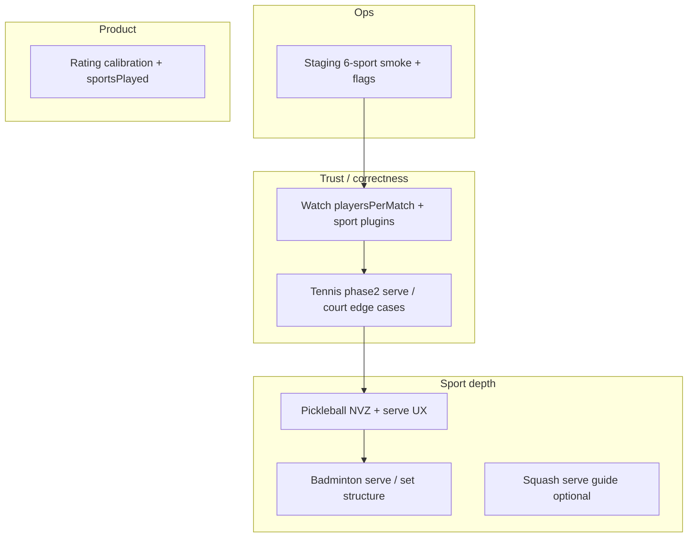

# Multisport — deferred work (post–v1)

Companion to [PLAN_MULTISPORT.md](./PLAN_MULTISPORT.md). Rating display bridges (DUPR, UTR, SquashLevels) → [PLAN_SPORT_RATING_MODELS.md](./PLAN_SPORT_RATING_MODELS.md). The multisport **v1 contract** ships six sports as **creatable, discoverable, rateable metadata** with **good-enough live scoring**, not full tournament-officiating fidelity on every sport. **Unified execution hub** → [PLAN_MULTISPORT_RATINGS_FORMATS_IMPLEMENTATION.md](./PLAN_MULTISPORT_RATINGS_FORMATS_IMPLEMENTATION.md).

Everything below is either named **deferred** in the multisport plan, marked **out of scope v1** (officiating), or listed as open QA/ops work.

---

## 1. Pickleball — largest explicit deferral

The plan calls this out in the capability matrix, Phase 3 bundle, and P3-PB deliverable.

| Deferred item | What v1 does today | What “done” would mean |
|---------------|-------------------|------------------------|
| **Kitchen / NVZ (non-volley zone)** | **Phase 1 done (D-P2-PB-VIS):** NVZ lines on `PickleballCourt.tsx` + honor-system **Kitchen fault** button (toast only) | Strict enforcement / block volleys from kitchen in live UI |
| **Kitchen / NVZ enforcement** | Rally scoring is **tap-to-add-point** only (`rally_points`, no serve guide) | Fault on NVZ violation, side-out semantics |
| **Two-bounce rule** | Not modeled | Track serve bounce + return bounce before volley; educational mode at minimum |
| **Official serve-sequence UI** | **No serve setup** for pickleball | Underhand serve from correct side, alternating serve in doubles, side-out scoring if moving beyond pure “race to N points” |

**Why it matters:** Social points games are fine on v1. Competitive pickleball players will notice missing kitchen logic immediately. The plan ranks **unobtrusive discovery + per-sport rating** above perfect pickleball rules.

**Suggested phasing:**

1. **Visual only** — NVZ lines on `PickleballCourt` + optional “kitchen fault” manual button (honor system).
2. **Coach mode** — non-blocking hints (“receiver must let bounce”) without blocking taps.
3. **Strict mode** — integrate with live state if rally metadata is added (see [live-scoring-rules-expansion-plan.md](./live-scoring-rules-expansion-plan.md)).

**Registry note:** Pickleball allows `TIMED` and `CUSTOM` in `sportRegistry.ts`; live behavior for those is weak (see §7).

---

## 2. Full officiating across sports (plan-wide v1 cut)

From **Suggested v1 scope** in `PLAN_MULTISPORT.md`:

> Ship padel + tennis + (optional) table tennis/badminton on points/classic **without full officiating (kitchen, lets, etc.)**.

| Sport | Officiating gaps in v1 |
|-------|-------------------------|
| **Tennis** | Classic engine + `TennisServeCourtSchema`; engine id `tennis-phase1`. No let/replay, foot faults, changeover timers tied to rules. |
| **Padel** | Strongest: FIP court, doubles serve rotation (`serveGuide.ts`). No lets, wall events as separate scoring, etc. |
| **Badminton** | Plan rated live **medium–high**; shipped as generic **rally board** + `POINTS_21` — no service court rotation, faults, or official best-of-3 games structure. |
| **Table tennis** | Table UI + serve every 2 points — not full ITTF service law (toss, let, etc.). |
| **Squash** | Box court UI, **no serve guide v1** — PAR to 11 via `BEST_OF_5_11` only; no serve-side / let / stroke decisions. |
| **Pickleball** | See §1. |

**Boundary:** Distinguish **scoring engine correctness** (sets, tie-breaks, super TB — largely in [live-scoring-rules-expansion-plan.md](./live-scoring-rules-expansion-plan.md) and [watch-vs-live-scoring-audit.md](./watch-vs-live-scoring-audit.md)) from **officiating UX** (lets, faults, NVZ). Multisport deferred the second.

---

## 3. Live scoring plugin gaps (web)

`Frontend/src/liveScoring/registry.ts`:

| Sport | `liveScoring` | Serve guide | Court UI |
|-------|---------------|-------------|----------|
| Padel | `padel_doubles` | Yes | FIP padel |
| Tennis | `tennis` | Yes (`tennis-phase2`) | Tennis SVG |
| Table tennis | `rally_points` | Yes (2-point rotation) | Table |
| Badminton | `rally_points` | **Yes** (opt-in serve coach, D-P2-BD) | `BadmintonCourt` + service boxes |
| Pickleball | `rally_points` | Coach hints only (kitchen + two-bounce toasts) | NVZ court |
| Squash | `rally_points` | **Yes** (opt-in, D-P2-SQ) | Box court |

Plan UX: rally sports get **“Show serve help” opt-in** — only table tennis fully implements serve help today. Badminton (service courts, doubles rotation) and pickleball (underhand, side-out) remain behind padel/tennis/TT.

**Tennis “phase1”** implies phase2: doubles ad court vs padel boxes, let cord, tie-break serve order, possibly a separate engine id when behavior diverges from padel-shaped classic core.

---

## 4. Apple Watch — Phase 6 “deferred depth”

Plan **G. Watch / native** and **Phase 6**: generic live state + `sport`; **padel first on watch**.

**Shipped (P6-D):**

- `WatchGame` decodes optional `sport` + `playersPerMatch`.
- `WatchSport.swift` enum for all six sports.
- Tennis: `serveGuideUsesClassicSetRules` when sport is tennis.

**Still open:**

- Manual on-device scoring smoke (6 sports) — QA-owned.
- **No sport-specific rally UIs on Watch** — not web’s `pickleball-board`, etc.
- ~~**`WatchSport.defaultPlayersPerMatch`**~~ — fixed (D-P0-WATCH): padel **4**, all other sports **2** when API omits `playersPerMatch`.
- [PLAN_WATCH_SERVE_GUIDE_UX.md](./PLAN_WATCH_SERVE_GUIDE_UX.md) — padel/tennis classic oriented.
- [WATCH_APP_REFACTOR_PLAN.md](./WATCH_APP_REFACTOR_PLAN.md) — session machine; affects how games surface on wrist.

**Finish line:** Per-sport plugin on Watch mirroring web registry (`sport + preset → UI + engine`), fix `playersPerMatch` defaults, 6-sport smoke checklist, rally UI for table tennis at minimum.

---

## 5. Rating system — v1 scale only; depth deferred

Plan **Risks #1:** level **1–7 per sport** for v1; same UX, separate numbers.

**Shipped:**

- `UserSportProfile`: per-sport `level`, `reliability`, `gamesPlayed`, `gamesWon`.
- Outcomes write by `game.sport`; PADEL dual-write to legacy `User.level`.
- Invites / leaderboard use sport context.

**Deferred / planned but not productized:**

| Item | Plan reference | Status |
|------|----------------|--------|
| Per-sport calibration | Onboarding “add other sports in profile” | No sport-specific questionnaire beyond manual level |
| `sportsPlayed: { TENNIS: 3+ }` | Progressive disclosure for Find | **Done** — profile GET `sportsPlayed` map (gamesPlayed ≥ 3); Find filter section if multi-sport or any `sportsPlayed` |
| `lastCreatedSport` | Create defaults | **Done** — `User.lastCreatedSport` on create; CreateGame default order includes it |
| Cross-sport invite copy | Layer 3 explicit UX | **P-W3-INVITE:** push/Telegram invite shows sender level by `game.sport`; dual `Padel X · Tennis Y` when non-padel game + rated padel |
| Different scales per sport | v1 = same 1–7 | No UTR/DUPR/NTRP mapping |

**Why it matters:** Schema supports per-sport trust; discovery/matching do not yet use `sportsPlayed` or calibrated seeds.

---

## 6. Scoring presets: `TIMED` / `CUSTOM`

Plan + [live-scoring-rules-expansion-plan.md](./live-scoring-rules-expansion-plan.md):

- **In v1 scope:** classic ladder, points caps, `BEST_OF_*_11`, etc.
- **Deferred:** `TIMED`, `CUSTOM` — open-ended / weak invariants for live parity.

Pickleball registry includes `TIMED` and `CUSTOM`; validators may allow them; live + watch behavior is best-effort. Watch audit item **#6**: `TIMED` / `CUSTOM` + non-rally outcome cleanup.

**Finish:** Product rules per sport for timed sessions; one validator + live freeze path (timed classic lock exists; timed **points** does not).

---

## 7. Create-flow power paths

| Pattern | Plan | Status |
|---------|------|--------|
| Sport row in Game Format card | Recommended | **Done** (`sportsEnabled.length > 1`) |
| Long-press “Game” in create menu → sport picker | Power users | **Done** (D-P7-CREATE) |
| Infer from court | — | **Done** |
| Duplicate game copies `sport` | P1-CRE-4 | **Done** (`GameDetailsShell` → `initialGameData.sport`) |

`lastCreatedSport` — **implemented** (server + CreateGame defaults).

---

## 8. Club-level sport model

Plan: `Club.sports` or `ClubSport` junction.

**Reality:** No `Club.sports` on `Club`; sports inferred from **`Court.sport`** and Playtomic import. Club UI: court tabs when 2+ sports on courts (P3-C).

**Deferred:** Explicit club sport list for marketing/filters; richer Playtomic unsupported-sport handling.

---

## 9. Marketplace & Watch (Phase 6 depth)

Phase 6 roadmap label: **deferred depth**. On dev: P6-E marketplace categories by sport, P6-D Watch field decode — **done**.

Remaining: sport-native watch scoring UX; marketplace beyond category filter.

---

## 10. Operational / QA deferrals

| Item | Notes |
|------|--------|
| Staging/prod flags | `MULTISPORT_6_SPORTS` — dev green; flag + manual 6-sport smoke EM-owned |
| P4-B-4 | Manual QA: notification copy per locale |
| P1-QA-2 | Manual: padel rating unchanged; tennis isolated |
| P0-INT-1 | Staging seed multi-sport users |
| Watch on-device smoke | P6-D-1 |

---

## 11. Do not undo (plan guardrails)

- **My / chats** — never filter by sport.
- **Header sport switcher** — anti-pattern.
- **Event roster vs match size (P5 / ADR-002)** — done (G7).
- **Six sports creatable** — done (G6).
- **League season single sport** — done.

---

## Priority backlog

| Priority | Workstream | Effort | Win |
|----------|------------|--------|-----|
| P0 | Prod smoke + Watch `playersPerMatch` defaults | Small–medium | No wrong doubles layout on wrist |
| P1 | Watch parity: tennis + table tennis | Large | Scoring trustworthy off-padel |
| P2 | Pickleball NVZ visual + coach hints | Medium | Pickleball credibility |
| P2 | Badminton sets-of-21 vs single cap row | Medium–high | Badminton not “generic rally” |
| P3 | Tennis phase2 + optional lets | Medium | Tennis clubs |
| P3 | `sportsPlayed` / `lastCreatedSport` | Small | Smoother multi-sport create/Find |
| P4 | Full pickleball rule enforcement | Large | Competitive pickleball |

---

## North star

Finishing deferrals is **depth on scoring and native surfaces**, plus **rating/product polish**—without breaking unobtrusive UX (no My filter, no global sport mode). Metadata layer ships first; live and competitive layers catch up per sport.

**Suggested next epics:** “Pickleball phase 2” and “Watch multisport parity.”

---

## Team plan & orchestrator

**Last updated:** 2026-05-21 (orchestrator re-verify)

**Current epic:** Wave 2 **closed** on dev — all D-* gates verified; backlog below is post–Wave 2 depth (strict pickleball, Watch rally UIs, TIMED/CUSTOM, ops smoke).

**Verification (2026-05-21):** `npm run test:automated` **34/34**; `npm run test:live-scoring` green (registry, pickleball, badminton serve, squash serve). Apply migration `20260519140000_scoring_preset_best_of_3_21` on envs that lack `BEST_OF_3_21` enum value.

### Post–Wave 2 (P-W3)

Gates after Wave 2 depth; orchestrator: `Backend/scripts/tests/multisport-post-wave2.ts`.

| Gate | Status | Notes |
|------|--------|-------|
| P-W3-WATCH | [ ] | Watch rally UIs / full multisport scoring surfaces (web parity) |
| P-W3-TIMED | [ ] | `TIMED` / `CUSTOM` preset product rules + live freeze path |
| P-W3-PB-SERVE | [ ] | Pickleball official serve-sequence UI |
| P-W3-INVITE | [x] | Invite push/Telegram: sender level from `game.sport`; dual padel · game line when relevant |

### Orchestrator status

| Gate | Status | Notes |
|------|--------|-------|
| D-P0-WATCH | [x] | `WatchSport.defaultPlayersPerMatch` matches BE/FE registries (padel 4, others 2) |
| D-P3-PRODUCT | [x] | `lastCreatedSport` + `sportsPlayed` on user profile / create default |
| D-P2-PB-VIS | [x] | Pickleball NVZ lines + honor-system kitchen fault |
| D-P2-BD | [x] | Badminton serve opt-in / set structure beyond generic rally |
| D-P3-TENNIS | [x] | `tennis-phase2` engine: tie-break serve slot + court side preserved in serve coach |
| D-P1-WATCH-TT | [x] | Rally presets on Watch; TT change-ends every 5 + badminton court/interval rules in `ServeGuideEngine` (2026-05-21); full rally UIs still web-only |
| D-P2-PB-COACH | [x] | Two-bounce honor hint button (phase 2 coach, non-blocking) |
| D-P7-CREATE | [x] | Long-press **Game** → sport picker when `hasMultipleSportsEnabled` (not six-sport fallback) |
| D-P2-SQ | [x] | Squash opt-in serve guide: PAR change ends 11–9, `sq-` tokens, `squashServe.ts` tests |
| D-QA | [x] | `multisport-deferred*.ts` in `test:automated`; FE `test:live-scoring`; phase 6 `MarketplaceList` category sport |

### Track assignments (closed 2026-05-21)

| Track | Owner | Deliverable |
|-------|-------|-------------|
| D-P0-WATCH | iOS dev | `WatchSport.swift` defaults; mirror `sportRegistry` |
| D-P3-PRODUCT | BE + FE | `User.lastCreatedSport`, profile `sportsPlayed`, CreateGame default |
| D-P2-PB-VIS | FE live | `PickleballCourt` NVZ + live UI kitchen fault button |
| D-P2-BD | FE live | Badminton serve help / games-of-21 structure |
| D-P1-WATCH-TT | iOS dev | Watch TT/badminton serve coach parity with web |
| D-P2-SQ / D-P7-CREATE | FE live + create | Squash serve guide; long-press sport picker guard |
| D-QA | QA automation | Orchestrator tests + `run-all.ts` + live-scoring vitest |

### Completed by team

- **D-P0-WATCH** — `WatchSport.swift` `defaultPlayersPerMatch`: padel 4, tennis/pickleball/badminton/table tennis/squash 2 (mirrors `sportRegistry.ts`).
- **D-P3-PRODUCT** — `touchLastCreatedSport` on create; profile `sportsPlayed` (≥3 games); `resolveCreateGameDefaultSport` on CreateGame (re-verify 2026-05-21, no code change).
- **D-P3-TENNIS** — `tennis-phase2` live plugin; tie-break serve slot in coach strip.
- **D-P1-WATCH-TT** — `ServeGuideEngine.swift` + `ServeCoachStrip.swift`: TT/badminton serve coach matches web (not generic TB `% 6`).
- **D-P7-CREATE** — `CreateMenuModal`: long-press Game → `CreateGameSportPicker` only when `hasMultipleSportsEnabled`.
- **D-P2-PB-COACH** — two-bounce honor hint alongside kitchen fault.
- **D-P2-SQ** — `squashServe.ts` + registry `sq-` motion tokens; PAR change ends at 11–9.
- **D-QA** — `MarketplaceList.tsx`: `getCategories(getMarketplaceCategorySport(user))` for phase 6 audit.
