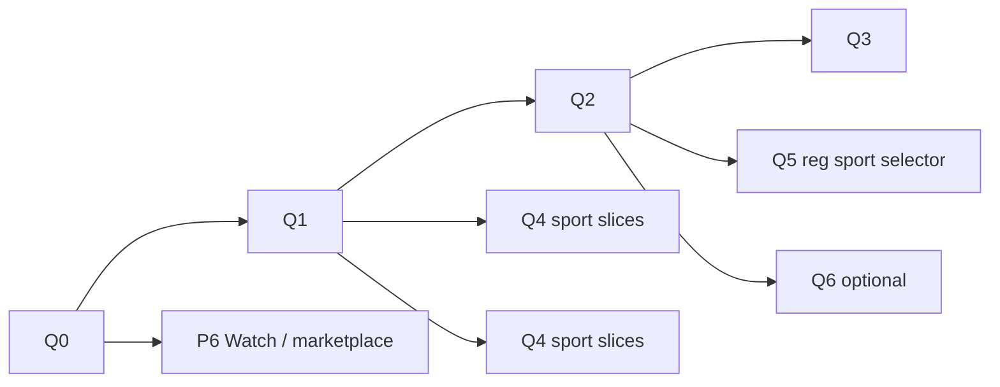

# Multisport — per-sport questionnaires & level model

Companion to [`PLAN_MULTISPORT.md`](./PLAN_MULTISPORT.md). Covers **main sport at registration**, **add-sport** users, **questionnaires per sport**, and hard rules on **social vs competitive level**. Market rating systems (Playtomic, DUPR, UTR, …) → [`PLAN_SPORT_RATING_MODELS.md`](./PLAN_SPORT_RATING_MODELS.md). Avatar level badge (one sport per context) → [same doc § Avatar](./PLAN_SPORT_RATING_MODELS.md#avatar--list-ui-per-sport-level-display). **Unified execution hub** → [`PLAN_MULTISPORT_RATINGS_FORMATS_IMPLEMENTATION.md`](./PLAN_MULTISPORT_RATINGS_FORMATS_IMPLEMENTATION.md).

**Contents:** [Principles](#1-principles-non-negotiable) · [Gaps](#2-current-state-gap-analysis) · [Data](#3-data-model) · [API](#4-api) · [Content v1](#5-questionnaire-content-v1-scope) · [UX](#6-ux-flows) · [Phases Q0–Q6](#8-implementation-phases) · [ADRs §15](#15-open-decisions-adr) · [Reliability §16](#16-reliability--first-match-rating) · [History §17](#17-level-history--public-profile) · [Discovery §18](#18-discovery-invites--hosts) · [Admin §19](#19-admin-merge-versioning) · [Question bank §20](#20-question-bank-appendix) · [Rollout §21](#21-rollout--flags) · [QA extended §22](#22-extended-qa)

---

## 0. Team questions (decide before Q2)

| # | Question | v1 default (if undecided) |
|---|----------|---------------------------|
| 1 | Is **1.0** acceptable for strong players new to Bandeja, or must they Q/manual before hosting 4.0+? | 1.0 allowed; soft warnings only |
| 2 | Sandbagging tolerance: block join outside band vs rating correction only? | Keep today’s join rules; no new hard block from Q |
| 3 | One **1–7 scale** all sports forever, or sport-specific labels (e.g. NTRP hint for tennis)? | Same scale; optional display hint later |
| 4 | Coach/club override of player sport level? | No (deferred) |
| 5 | Show **“Unrated”** when `levelSource === DEFAULT` and level 1.0? | Subtle profile link only, not on every card |
| 6 | Copy hint: padel 4.5 → “typical tennis starter ~2.5–3.5”? | No auto-fill; optional non-numeric copy in invite only (deferred) |

---

## 1. Principles (non-negotiable)

| Rule | Meaning |
|------|--------|
| **Social level is global** | `User.socialLevel` is one number for the person. Sport questionnaires **never** read or write it. Only bar/social outcome pipelines (`SOCIAL_BAR`, `SOCIAL_PARTICIPANT`, etc.) change it. |
| **Competitive level is per sport** | `UserSportProfile.level` (1.0–7.0) is authoritative for `game.sport`. |
| **Fresh sport starts at 1.0** | On `addUserSport`, profile is created with `level = 1.0`, `gamesPlayed = 0` (already true via `DEFAULT_NEW_SPORT_LEVEL`). Questionnaire is **optional refinement**, not registration gate. |
| **Questionnaire is suggested, not blocking** | User can skip, dismiss, or “later.” App remains usable at 1.0 until rated games move the level. |
| **No sport = no mode** | Questionnaires do not switch global UI mode; they only update metadata for one sport. |
| **Padel welcome is one sport’s questionnaire** | Today’s welcome flow becomes **padel’s** questionnaire, implemented through the same engine as tennis/etc. |

**Mirror existing axis split:** `level` / sport profiles ≈ court skill; `socialLevel` ≈ bar/social participation (unchanged).

---

## 2. Current state (gap analysis)

| Area | Today | Gap |
|------|--------|-----|
| Welcome | 5 padel-specific Qs → `User.level` + `welcomeScreenPassed` + padel profile upsert | Not sport-parameterized; no tennis Qs |
| Add sport | `UserSportProfile` at **1.0**, no questionnaire prompt | No `questionnaireCompleted` tracking |
| Manual edit | Allowed only if `gamesPlayed === 0` | Good; questionnaire should respect same gate |
| Social level | Separate field, separate events | Must stay out of sport questionnaire API |
| Level history | `LevelChangeEvent` `QUESTIONNAIRE`, no `sport` | Cannot show per-sport history cleanly |
| Fallback | `resolveUserSportSnapshot` falls back to `user.level` if no profile | Tennis user could show padel level by mistake—tighten for non-padel sports |

---

## 3. Data model

### 3.1 `UserSportProfile` (extend)

```prisma
model UserSportProfile {
  // existing: level, reliability, gamesPlayed, gamesWon …

  questionnaireCompletedAt DateTime?  // set when user finishes sport Q
  questionnaireSkippedAt   DateTime?  // set on explicit skip / dismiss-forever for this sport
  questionnaireVersion     String?    // e.g. 'padel-v1' — which config was used
  levelSource              SportLevelSource @default(DEFAULT) // DEFAULT | QUESTIONNAIRE | MANUAL
}

enum SportLevelSource {
  DEFAULT       // created at 1.0, no Q
  QUESTIONNAIRE
  MANUAL        // profile edit before first rated game
}
```

- **Do not** add `socialLevel` here.
- **Do not** add per-sport welcome flag on `User` long-term; keep `welcomeScreenPassed` as padel-only shim during migration, then deprecate in favor of `UserSportProfile(PADEL).questionnaireCompletedAt`.

### 3.2 `LevelChangeEvent` (extend)

```prisma
model LevelChangeEvent {
  // existing fields …
  sport Sport?  // null = legacy padel/User.level writes; non-null = sport profile
}
```

- New events: `eventType = QUESTIONNAIRE`, `sport = TENNIS`, `levelBefore/After` on **sport profile** level.
- Social events: `sport` always `null`; `levelBefore/After` = `socialLevel`.

### 3.3 Questionnaire content (no DB for v1)

Store definitions in code + i18n (like today’s `welcome.json`):

```
Backend/src/sport/questionnaires/
  padel.ts      // migrate from welcome scoring
  tennis.ts
  pickleball.ts
  badminton.ts
  tableTennis.ts
  squash.ts
  …
Frontend/src/i18n/locales/*/sportQuestionnaire/
  padel.json
  tennis.json
```

Registry entry per sport:

```ts
questionnaire?: {
  id: string;                    // 'padel-v1', 'tennis-v1'
  questionKeys: readonly string[]; // i18n keys
  answerOptions: 'ABCD';
  scoreToLevel: (totalScore: number) => number;
  minQuestions: number;
}
```

`getSportConfig(sport).questionnaire` — `undefined` = no Q for that sport yet (stay at 1.0 until games).

---

## 4. API

### 4.1 New endpoints

| Method | Path | Body | Effect |
|--------|------|------|--------|
| `POST` | `/users/me/sports/:sport/questionnaire` | `{ answers: string[] }` | Score → update **only** `UserSportProfile(sport).level`; `levelSource = QUESTIONNAIRE`; event with `sport` |
| `POST` | `/users/me/sports/:sport/questionnaire/skip` | — | `questionnaireSkippedAt = now()`; level stays 1.0 |
| `GET` | `/users/me/sports/:sport/questionnaire/status` | — | `{ completed, skipped, suggested, level, gamesPlayed }` |

### 4.2 Refactor existing

| Endpoint | Change |
|----------|--------|
| `POST /users/welcome-screen/complete` | Internally `completeSportQuestionnaire(userId, PADEL, answers)` + set `welcomeScreenPassed` + dual-write `User.level` for padel transition |
| `POST /users/welcome-screen/skip` | Sets padel `questionnaireSkippedAt`; does **not** touch social |
| `addUserSport` | Unchanged: always `level: 1.0`, `levelSource: DEFAULT`; return `suggestedQuestionnaire: true` in response |

### 4.3 Validation rules

1. `answers.length === registry.questionCount`.
2. Sport must be implemented and have questionnaire config.
3. Reject if `gamesPlayed > 0` (“level locked by match results”).
4. Reject if already `questionnaireCompletedAt` (allow admin reset only).
5. **Never** update `User.socialLevel` in this service.
6. For `PADEL` only: also update `User.level` + `upsertPadelSportProfileFromUser` until dual-write removed.

### 4.4 `resolveUserSportSnapshot` fix

```ts
// If profile exists → use profile.level
// Else if sport === PADEL → fallback user.level (transition)
// Else → 1.0 (not user.level)
```

Prevents a tennis-only user from inheriting padel `User.level` on invites.

### 4.5 Level source precedence (`gamesPlayed === 0` only)

When multiple paths set level before first **rated** game (`game.affectsRating`):

| Order | Action | Result |
|-------|--------|--------|
| 1 | `addUserSport` | `level = 1.0`, `levelSource = DEFAULT` |
| 2 | Manual profile edit | Overwrites level; `levelSource = MANUAL` |
| 3 | Complete questionnaire | Overwrites level; `levelSource = QUESTIONNAIRE` |
| 4 | Later manual edit | Allowed only if still `gamesPlayed === 0`; `MANUAL` wins until Q or rated game |

- **Skip** does not change level; sets `questionnaireSkippedAt` only.
- **Later** (dismiss sheet) does not set `questionnaireSkippedAt`; home/profile nudges continue.
- **Retake:** rejected if `questionnaireCompletedAt` set (admin reset clears completion + optional level reset to 1.0).
- **Unrated games** do not increment `gamesPlayed`; do not lock questionnaire.

---

## 5. Questionnaire content (v1 scope)

### 5.1 Padel (`padel-v1`)

- **Reuse** existing 5 questions from `welcome.json` (glass, net, positioning).
- Scoring: keep `scoreToLevel` in `welcomeScreen.service.ts` (move to shared module).

### 5.2 Tennis (`tennis-v1`) — ship in first slice

5 questions, same A–D scoring band (5–20 → 1.0–3.5), tuned copy:

| # | Topic | Purpose |
|---|--------|---------|
| 1 | Racket sport background | Transfer from padel/other |
| 2 | Rally consistency from baseline | Groundstrokes |
| 3 | Serve & return confidence | Start of point |
| 4 | Net / transition game | Approach, volley |
| 5 | Match play & rules | Scoring, doubles positioning, tie-break awareness |

**No** padel glass/wall questions. Optional branch later: “mostly doubles” vs “mostly singles” (does not change level in v1; only copy).

### 5.3 Later sports (phased)

| Sport | Questions | Notes |
|-------|-----------|--------|
| Pickleball | 4–5 | Kitchen awareness, dinking, serve rules (self-report, not officiating) |
| Badminton | 4–5 | Clear / lift / net, doubles rotation self-report |
| Table tennis | 4 | Grip, rally, serve receive |
| Squash | 4 | T-position, boast/length self-report |

Same 1–7 scale; curves can differ per sport in registry later.

---

## 6. UX flows

### 6.1 Registration

**Today (pre-Q5):** account created with `primarySport: PADEL`, `sportsEnabled: [PADEL]`, padel profile at 1.0; padel questionnaire suggested on Home after city set.

**After Q5 — every clean registration path** (phone, Apple, Google, Telegram, email, etc.):

1. Show **main sport selector** (implemented sports only). **Default selection: PADEL** (pre-selected, not tennis-first).
2. Persist `primarySport` = choice, `sportsEnabled: [choice]`, create `UserSportProfile` for that sport at 1.0.
3. **Social level:** unchanged from registration default; never set by selector or questionnaire.
4. Onboarding continues (city, etc.); Home suggests **that sport’s** questionnaire — padel welcome for PADEL, sport Q for others when available (e.g. tennis after Q2).

User can add more sports later in profile (§6.2). Changing primary later does not re-run registration selector.

### 6.2 Add sport (Profile → Add tennis)

```
addSport(TENNIS)
  → profile level 1.0, gamesPlayed 0
  → bottom sheet (non-blocking):
      "Estimate your tennis level? (~1 min)"
      [Take questionnaire]  [Skip — stay at 1.0]  [Later]
```

- **Later** = dismiss sheet; show subtle profile/home nudge until completed/skipped-forever.
- Completing Q updates **tennis** profile only; padel level untouched.
- Setting primary to tennis **does not** auto-open Q (user may already want 1.0).

### 6.3 Suggestion triggers (all optional)

| Trigger | Condition | UI |
|---------|-----------|-----|
| After `addSport` | `!completed && !skipped` | Bottom sheet (above) |
| Before first **create** in sport | `level === 1.0`, `gamesPlayed === 0`, primary or selected sport | Inline banner in CreateGame format card |
| Before first **join** invite | invite `game.sport` ≠ viewer profile completed | One-line in invite modal: “Your tennis level is 1.0. [Estimate]” |
| Profile | sport row shows `1.0` + “Estimate level” link | Only if `gamesPlayed === 0` |
| Home nudge | Same as padel welcome card pattern | `SportQuestionnairePrompt` component parameterized by sport |

**Never:** block join/create/My/Find; never modal on live scoring entry.

### 6.4 Display rules (unchanged multisport UX)

- **Profile badge:** `getDisplayLevelForSport(user, primarySport)` + sport label if multi-sport.
- **Game / invite:** level for **game.sport** only.
- **Social:** beer icon + `socialLevel` everywhere it exists today; no sport prefix.
- **Leaderboard:** competitive tab uses sport profile; social tab uses `socialLevel` only.

### 6.5 Tennis-primary user who “doesn’t want padel”

Not a separate app mode—configuration:

1. Add tennis → complete tennis Q (optional).
2. Set **primary = TENNIS**.
3. **Phase 2 product:** `removeSport(PADEL)` or `hideSport(PADEL)` if `gamesPlayed === 0` on padel profile → `sportsEnabled: [TENNIS]` → padel-only UI chrome disappears (no sport row if one sport, Find filter hidden).

Padel history/games in My remain visible (relationship-first).

---

## 7. Relationship to multisport plan

| Multisport rule | This plan |
|-----------------|-----------|
| No global sport switcher | Q is per-sport modal/sheet only |
| Padel-only invisible multisport | Single sport + no second sport → no extra Q prompts after padel welcome |
| `gamesPlayed ≥ 3` → Find affordances | Independent; Q is about level estimate, not discovery |
| Cross-sport invite copy | “You’re 3.8 in padel; this tennis game uses **tennis 1.0**” if tennis Q skipped |
| Rating pipeline | After `gamesPlayed > 0`, only **GAME** events move sport level; Q disabled |

---

## 8. Implementation phases

**Count:** **7 phases (Q0–Q6)** — **4 required** for tennis MVP (Q0–Q3); **Q4** rolling per sport; **Q5–Q6** optional product.

| Phase | Name | Required | Est. |
|-------|------|----------|------|
| **Q0** | Schema & invariants | Yes | ~1 wk |
| **Q1** | Shared engine + padel refactor | Yes | ~1 wk |
| **Q2** | Tennis questionnaire (API + FE + i18n) | Yes | 1–2 wk |
| **Q3** | Create/join nudges | Yes (full UX) | ~0.5 wk |
| **Q4** | Other sports (rolling) | Per sport | open-ended |
| **Q5** | Main sport selector on registration | Optional (product) | ~1 wk |
| **Q6** | `removeSport` / hide padel | Optional | — |

**Not separate phases** (schedule inside Q0–Q3 or polish): §17 level-history sport filter, §23 code audit, reliability fallback (§16).

### Critical path (serial)

```text
Q0 → Q1 → Q2 → Q3
```

**Minimum shippable (tennis Q):** Q0 + Q1 + Q2 (~3–4 weeks one dev). Q3 adds create/invite nudges (+~0.5 wk).

**Calendar (one dev, serial):** ~3.5–4.5 weeks to Q3 done; +~0.5–1 week per additional sport in Q4.

**Calendar (two devs):** ~2–3 weeks to Q3 — BE: Q0→Q1→API; FE: tennis i18n + sheet after Q1; merge for Q2; split Q3 banners.

### Phase definitions

#### Phase Q0 — Schema & invariants (1 week)

- Migration: `UserSportProfile` questionnaire fields + `LevelChangeEvent.sport`.
- `resolveUserSportSnapshot` non-padel fallback → 1.0.
- Tests: add sport → level 1.0; questionnaire never touches `socialLevel`.

#### Phase Q1 — Shared engine + padel refactor (1 week)

- Extract `sportQuestionnaire.service.ts` from `welcomeScreen.service.ts`.
- Wire welcome complete/skip through `PADEL` config.
- Backfill: `questionnaireCompletedAt` for users with `welcomeScreenPassed && level !== 1.0` (or any completed welcome).

#### Phase Q2 — Tennis questionnaire (1–2 weeks)

- `tennis-v1` copy (6 locales).
- API routes + `addSport` response `suggestedQuestionnaire`.
- FE: `SportQuestionnaireSheet`, post–add-sport prompt, profile “Estimate” link.
- Tests: `multisport-questionnaire-tennis.ts`.

#### Phase Q3 — Create/join nudges (0.5 week)

- CreateGame / invite soft banners.
- `GET questionnaire/status` for client gating.

#### Phase Q4 — Other sports (rolling)

- One sport per slice using registry `questionnaire` block.
- **Parallelize internally:** each sport (pickleball, badminton, TT, squash) is an independent slice after Q1.

#### Phase Q5 — Main sport selector on registration (optional product)

- **All clean registration paths** must include the same main sport step (not a tennis-only fork).
- UI: picker of implemented sports; **PADEL pre-selected as default**; user confirms or changes before continuing.
- Server: `primarySport`, `sportsEnabled: [primarySport]`, `UserSportProfile` at 1.0 for chosen sport.
- Post-registration Home nudge: questionnaire for **selected** sport (`WelcomeQuestionnairePrompt` generalized or `SportQuestionnairePrompt`).
- **Not tennis-first:** any sport can be chosen; marketing copy stays “multisport,” default remains padel.
- FE: shared registration shell hook; BE: accept `primarySport` on register / first profile patch (validate implemented + enabled).
- Depends on Q1 engine; tennis Q on Home requires Q2 if user picks TENNIS.

#### Phase Q6 — `removeSport` / hide padel (optional)

- Only if padel `gamesPlayed === 0`.
- Clears padel from enabled list; cannot remove sport with rated history.

### Parallelization

| Track A | Track B | When | Notes |
|---------|---------|------|--------|
| Q0 BE migration + snapshot fix | Q0 tests / §23 audit start | Same sprint | Coordinate on schema |
| Q1 BE `sportQuestionnaire.service` | Q2 tennis i18n (6 locales) | After Q0 | Copy independent of API; scoring keys must match registry |
| Q2 BE routes + service | Q2 FE `SportQuestionnaireSheet` | After Q1 | Freeze contract: `POST …/questionnaire`, `status` |
| Q3 CreateGame banner | Q3 invite banner | After Q2 | Both use `GET questionnaire/status` |
| Q4 sport B | Q4 sport C | After Q1 | Parallel with each other |
| Q5 registration sport selector (FE) | Q5 register API (BE) | After Q1 | Same sprint; PADEL default in UI |
| Q5 | Q6 `removeSport` | After Q2 | Optional; independent |
| §17 level-history `sport` on API | Q3 nudges | After Q0 | Separate owner OK |
| §16 reliability fallback | Q1 | Q0–Q1 | Small BE; don’t block Q2 FE |

**Do not parallel:**

| Risk | Why |
|------|-----|
| Q1 before Q0 | Padel refactor needs questionnaire columns + `LevelChangeEvent.sport` |
| Q2 FE before Q1 | Duplicates welcome logic instead of shared engine |
| Q3 before Q2 | Nudges need tennis flow + `questionnaire/status` |
| Q4 content before Q1 | No `completeSportQuestionnaire` yet |

### Combined schedule (diagram)



Q4 slices and Q5/Q6 branch **after Q1 or Q2**; **P6** (main multisport plan) is a **separate parallel track** on another dev.

### Dependency on [`PLAN_MULTISPORT.md`](./PLAN_MULTISPORT.md) (P0–P6)

Main program has **7 phases P0–P6** (UX layers UX-0…UX-5 are a separate lens). On dev, **P0–P5 are largely complete**; **P6** (Watch + marketplace depth) may still be in progress.

| Questionnaire | Multisport prerequisite |
|---------------|-------------------------|
| Q0–Q2 | **P0** (`UserSportProfile`, `Game.sport`, `primarySport`) |
| Q0–Q2 | **P1** rating-by-sport recommended (done on dev) |
| Q3 | **P1** create + invites (done on dev) |
| Q5 | All register/auth paths + Q1 (Q2 if user may select TENNIS and get tennis Q on Home) |
| Q6 | **P4** profile sports (done on dev) |

Questionnaire work can **run in parallel with remaining P6** — low coupling.

### Suggested two-dev split (weeks 1–3)

| Week | Dev A (BE) | Dev B (FE) |
|------|------------|------------|
| 1 | Q0 schema + snapshot; start Q1 service | §23 audit; tennis copy draft |
| 2 | Finish Q1; Q2 API + tests | `SportQuestionnaireSheet` + padel welcome on shared engine |
| 3 | Q2 integration; `status` endpoint | Q2 add-sport prompt + profile link; Q3 banners |

---

## 9. State machine (per sport profile)

```mermaid
stateDiagram-v2
  [*] --> Default: addUserSport / signup
  Default: level 1.0, gamesPlayed 0
  Default --> QuestionnaireDone: complete Q
  Default --> Skipped: skip / dismiss forever
  Default --> Manual: user edits level (gamesPlayed 0)
  QuestionnaireDone --> Locked: gamesPlayed > 0
  Skipped --> Locked: gamesPlayed > 0
  Manual --> Locked: gamesPlayed > 0
  Locked --> Locked: only GAME rating events
```

Social level: **parallel state machine on `User`**, no transitions from sport Q.

---

## 10. i18n & copy

- Namespace: `sportQuestionnaire.{sport}.q1` …
- Shared strings: `sportQuestionnaire.common.takeTest`, `skip`, `later`, `stayAtOne`, `socialUnaffected` (“This does not change your social rating”).
- Padel welcome strings remain aliases or re-export from `sportQuestionnaire.padel` for one source of truth.

---

## 11. QA matrix

| Case | Expected |
|------|----------|
| New user, complete padel welcome | `User.level` + padel profile updated; social unchanged |
| Add tennis, skip Q | Tennis profile 1.0; padel unchanged |
| Add tennis, complete Q | Tennis 1.5–3.5 per score; padel unchanged |
| Join tennis game at 1.0 | Allowed |
| Complete tennis Q after 1 rated tennis game | 400 rejected |
| Questionnaire API payload tries socialLevel | Ignored / 400 |
| Tennis primary, no padel games | Find defaults tennis; padel games in My still visible |
| Leaderboard tennis | Uses `UserSportProfile(TENNIS).level` |
| Leaderboard social | Uses `User.socialLevel` |
| Q sets 3.0, user edits manual 2.5 before rated game | Manual wins (`levelSource = MANUAL`) until Q resubmitted |
| `skipWelcomeScreen` (padel) | `welcomeScreenPassed` true; padel `questionnaireSkippedAt`; level stays 1.0 |
| Unrated tennis game played | `gamesPlayed` unchanged; Q still allowed |
| Account merge | Sport profiles merged per sport; questionnaire flags OR’d conservatively (see §19) |

---

## 12. Success metrics

- % new tennis profiles with Q completed within 7 days (vs stuck at 1.0).
- Join/create completion rate **unchanged** (Q must not block).
- Zero `LevelChangeEvent` where `eventType = QUESTIONNAIRE` and `socialLevel` changed (audit query).
- Support tickets: “wrong level on tennis invite” down after `resolveUserSportSnapshot` fix.

---

## 13. Explicit non-goals (v1)

- Using padel questionnaire answers to **pre-fill** tennis level (skills don’t transfer automatically).
- Social level questionnaire (doesn’t exist; social stays event-driven).
- Forcing questionnaire before add sport (add always allowed at 1.0).
- Per-sport **social** profiles.
- Full officiating questions (kitchen, lets)—stay in deferred live-scoring work.

---

## 15. Open decisions (ADR)

| ID | Decision | Options | Status | v1 default |
|----|----------|---------|--------|------------|
| ADR-Q1 | Max level from questionnaire | Cap 3.5 (padel today) / cap 4.0 / up to 5.0 for “expert” self-report | **Open** | Cap **3.5** (reuse `scoreToLevel`) |
| ADR-Q2 | Retake policy | Never / admin only / if `gamesPlayed === 0` | **Open** | Admin only + dev reset |
| ADR-Q3 | “Later” vs “Skip forever” | Later = repeat nudges; Skip = no home card | **Decided** | See §4.5 |
| ADR-Q4 | Per-sport **reliability** on new profile | Always 0 / copy padel reliability / questionnaire sets initial | **Open** | **0** on create; global fallback until per-sport reliability project |
| ADR-Q5 | `resolveUserSportSnapshot` reliability fallback | Global `user.reliability` vs 0 for non-padel | **Open** | Global fallback (document debt) |
| ADR-Q6 | Level history UI | Single chart + sport filter / tab per sport / primary only | **Open** | Primary sport + social toggle; filter deferred to Q3 |
| ADR-Q7 | Find level filter | Against `game.sport` profile level | **Decided** | Yes (multisport P2) |
| ADR-Q8 | Host creates game above own level | Warn / block | **Open** | Warn only (toast) |
| ADR-Q9 | Playtomic import before profile | Auto `addSport` + nudge Q | **Partial** | `ensureUserSportProfileForGame` on join → `addUserSport` + suggested Q |
| ADR-Q10 | Registration `sportsEnabled` after selector | `[chosen]` only vs always include hidden PADEL | **Open** | **`[chosen]` only** — single sport until profile add (Q5) |
| ADR-Q11 | Persist raw questionnaire answers | No / analytics table | **Decided** | **No** — score + level only |
| ADR-Q12 | Questionnaire version bump | Re-prompt all / grandfather completed | **Open** | Grandfather; new users get v2 |
| ADR-Q13 | `User.level` dual-write sunset | Date / flag / when padel-only &lt; X% | **Open** | Keep until P4 polish |
| ADR-Q14 | Push nudge for incomplete sport Q | Yes / no | **Open** | No push v1; in-app only |
| ADR-Q15 | Anti-gaming: remove re-add sport | Cooldown / lock `questionnaireCompletedAt` per sport | **Open** | Lock completion record; no removeSport v1 |

---

## 16. Reliability & first-match rating

- Questionnaire updates **`UserSportProfile.level` only** — not `reliability`.
- New sport profile: `reliability = 0`, `gamesPlayed = 0` (matches `addUserSport` today).
- Rating pipeline (`outcomes.service` + `rating.service`) uses sport snapshot level; reliability today may still fall back to **global** `user.reliability` via `resolveUserSportSnapshot` — **fix or document** in Q0.
- **First rated match** after Q at 3.0: normal ELO delta; consider **first-match dampening** if sandbagging spikes (deferred product).
- **Optional later:** questionnaire sets `reliability = 10` for faster convergence — not v1.

---

## 17. Level history & public profile

**Today:** `LevelHistoryView` loads `getUserLevelChanges` — no `sport` on `LevelHistoryItem`; toggle is competitive vs **social** only.

**Target:**

| Surface | Behavior |
|---------|----------|
| Own profile history | Sport picker when `sportProfiles.length > 1`; default **primary sport** |
| Other user’s profile | Show **owner’s primary sport** competitive history; dropdown for other sports if profiles exist |
| Social toggle | Unchanged — global `socialLevel` events, `sport = null` |
| `QUESTIONNAIRE` events | Label with sport + version in list; point on chart |
| API | `GET /level-changes?sport=TENNIS` optional filter; include `sport` on response |

**Player card / stats:** `gamesPlayed` / wins on card should use **sport context** when viewing from a tennis game or tennis filter — audit `projectUserForSportContext` and generation helpers (`rating.ts` `levelOf` still uses `user.level` in places — multisport risk).

---

## 18. Discovery, invites & hosts

### Find

- `filterLevelMin/Max` applies to **Find sport context** (primary or explicit filter sport), not legacy `User.level`.
- Empty state copy uses sport name when filter narrow (multisport P2).

### Create

- Default level band on create uses creator’s **selected sport** profile.
- Creator at 1.0 (`levelSource = DEFAULT`) opening 3.0–4.5 band: **soft warning** (“Your tennis level is estimated at 1.0”) — not blocking (ADR-Q8).

### Invites

| Case | Display |
|------|---------|
| Same sport | Game sport level only |
| Cross-sport invite | Game sport level primary; optional expand: “Padel 3.8” |
| Invitee `levelSource = DEFAULT` at 1.0 | Host may see “Estimated” badge on roster (ADR-Q5) |

### Leagues

- `LeagueSeason.sport` level bands use **that sport’s** `UserSportProfile`.
- Tennis-primary user in padel league: padel profile level applies (encourage Q or manual padel level).

### BAR / TRAINING / unrated

- `affectsRating = false` → no `gamesPlayed` increment; questionnaire still suggested if level 1.0 + incomplete Q.
- Social events never sport-scoped.

---

## 19. Admin, merge & versioning

Full Admin dashboard plan: [`PLAN_ADMIN_MULTISPORT.md`](./PLAN_ADMIN_MULTISPORT.md).

### Support / admin

- Reset sport questionnaire: clear `questionnaireCompletedAt`, optional reset level to 1.0 if `gamesPlayed === 0`.
- Generalize `resetWelcomeScreen` → padel-only wrapper around sport reset.
- Manual level edit: audit log (existing patterns).

### Account merge (`userMerge.service`)

- Merge `UserSportProfile` by `sport` key: max `gamesPlayed`; v1 level = `max(survivor, source)` (weighted merge deferred).
- `questionnaireCompletedAt`: if either completed, keep completed; store higher `questionnaireVersion`.
- Do not merge social level from questionnaire (N/A).

### Versioning

- Registry `questionnaire.id` = `tennis-v1`.
- On `tennis-v2`: new users get v2; completed v1 users **not** re-prompted unless admin (ADR-Q12).
- Store `questionnaireVersion` on profile at completion.

### Privacy

- Self-assessment disclaimer in UI footer.
- Do not store raw `answers[]` in DB v1 (ADR-Q11).
- Re-add sport to replay Q: blocked by completion lock per sport (ADR-Q15).

---

## 20. Question bank appendix

### v1 (ship)

See §5.1–5.2. Tennis five questions; padel reuses welcome copy.

### Optional cross-sport Q0 (segmentation only — v2)

- Play frequency for **{sport}** (never → 2+/week) — analytics, optional score weight 0 in v1.
- Organized league play (yes/no).
- Return from 6+ month break (yes/no) — optional score cap −0.5.

### Tennis v2 candidates

- Singles vs doubles frequency (copy/weight, not separate level).
- Second-serve confidence.
- Optional **NTRP/ITN** self-report (clamp to band; never auto-trust above 4.0).
- Padel transfer question — **UX hint only**, not score input (non-goal: cross-sport pre-fill).

### Padel v2

- Underhand serve comfort; competition vs social split (not social **level**).

### Pickleball v2

- Kitchen/NVZ awareness; third-shot drop; doubles stacking familiarity.

### Badminton v2

- Backhand clear; doubles rotation; grip quality (beginner signal).

### Table tennis v2

- Forehand loop; short serve receive; grip style (UI label only).

### Squash v2

- Boast/lob tools; competitive vs friendly match count.

### Scoring curves (analytics)

- Same 5–20 → 1.0–3.5 all sports vs tennis stricter curve for transfer athletes.
- Branch: “never played” vs “played 20+ times” with different floor (v2).

---

## 21. Rollout & flags

| Flag | Scope |
|------|--------|
| `MULTISPORT_QUESTIONNAIRE_ENGINE` | Q0–Q4 shared service + all sport questionnaires (default on) |
| `MULTISPORT_QUESTIONNAIRE_TENNIS` | Deprecated; use engine flag |
| `MULTISPORT_QUESTIONNAIRE_NUDGES` | Q3 create/invite banners |

**Rollout:** internal → tennis add-sport beta → all multi-sport users.

**Dependencies:** `welcomeScreen.service` → `sportQuestionnaire.service` → `outcomes.service` / `LevelChangeEvent`. Must not break padel-only `WelcomeQuestionnairePrompt` or `test:automated` multisport suites.

**Watch:** Questionnaire **phone-only**; Watch reads level from game payload after sync.

**Deep link (later):** `…/profile/sports/tennis/questionnaire`.

---

## 22. Extended QA

| Scenario | Expected |
|----------|----------|
| Padel welcome complete, add tennis, skip tennis Q | Join 4.0 tennis game allowed; host sees 1.0 + optional estimate link |
| Set primary TENNIS before `addSport` | 400 unless tennis enabled |
| Q → 3.0 → unrated friendly match | Q still editable if `gamesPlayed === 0` |
| Q → 3.0 → one **rated** match | Q locked; only GAME events |
| `gamesPlayed` from padel does not block tennis Q | Per-sport counters |
| League season PADEL, user tennis-primary | Uses padel profile for league band |
| Generation `levelOf` in round robin | Uses sport-projected level for `game.sport` |
| Marketplace / bets still on `user.level` | Audit list; fix or document |
| i18n all 6 locales for tennis Q | Parity with welcome |
| `completeSportQuestionnaire` twice | Second call 400 |
| Cooldown: delete user / recreate | New user fresh profiles |

---

## 23. Code audit checklist (pre-ship)

- [x] `resolveUserSportSnapshot` — level + reliability fallback per §4.4, §16
- [x] `outcomes.service` — rated games increment **sport** `gamesPlayed` only
- [x] `levelChange.controller` — expose `sport` on API + `?sport=` filter; GAME events store `sport`
- [x] `LevelHistoryView` — sport picker + `getDisplayLevelForSport`; API `?sport=`
- [x] `results/generation/rating.ts` — via `mapPrismaForGeneration` sport-projected participant levels
- [x] Invite / `PlayerListItem` — `projectUserForSportContext(game.sport)`
- [x] Find “my level” filter — `getDisplayLevelForSport(user, game.sport)` client-side; join uses sport profile (BE)
- [x] `resetWelcomeScreen` / `POST …/questionnaire/reset` — per-sport via `resetSportQuestionnaire`

---

## 24. Summary

- **Social level** → stays on `User`, event-driven only, documented in API guards and QA.
- **Per-sport level** → always **1.0** on fresh `UserSportProfile`; questionnaires are **suggested** refinements before rated play.
- **Questionnaires per sport** → registry-driven content + shared scorer + `POST .../sports/:sport/questionnaire`, with padel welcome as the first consumer.
- **Resolve ADRs in §15** before tennis copy freeze; **§16–19** cover reliability, history UI, invites, admin.
- **§20** is the backlog of question topics; **§21–23** cover rollout, QA, and code audit.

**Engineering priority:** Q0 → Q1 → Q2 (critical path) → Q3; see [§8](#8-implementation-phases) for parallel tracks and P0–P6 dependencies.

---

## 25. Orchestration tracker (live)

**Orchestrator:** AI team lead · **Started:** 2026-05-19

### Global phases

| Phase | Status | Owner | Notes |
|-------|--------|-------|-------|
| **Q0** Schema & invariants | ✅ Done | BE-Q0 | Migration: `db push` (dev); `migrate dev` blocked by shadow DB on `20260519014327_user_last_created_sport`. Fields + `LevelChangeEvent.sport` applied; `multisport-questionnaire-q0.ts` green |
| **Q1** Shared engine + padel refactor | ✅ Done | BE-Q1 | `sportQuestionnaire.service`, padel/tennis registry, welcome refactor, `backfillPadelQuestionnaireFromWelcome.ts`, `multisport-questionnaire-q1.ts` green |
| **Q2** Tennis questionnaire | ✅ Done | BE-Q2 + FE-Q2 | BE routes + `tennis-v1`; FE `SportQuestionnaireSheet`, add-sport prompt, profile estimate link, padel welcome on shared engine |
| **Q3** Create/join nudges | ✅ Done | FE-Q3 | CreateGame banner, invite nudge, `SportQuestionnairePrompt`; `GET …/questionnaire/status` + 404 no-op |
| **Q4** Other sports | ✅ Done 2026-05-19 | BE-Q4 + FE-Q4 | BE: `pickleball-v1`, `badminton-v1`, `table-tennis-v1`, `squash-v1`; `multisport-questionnaire-q4.ts`. FE: i18n 6 locales + `sportQuestionnaireRegistry` (see FE-Q4 note below) |
| **Q5** Reg sport selector | ✅ Done 2026-05-19 | FE-Q5 + BE-Q5 | `RegistrationSportSelector` + `primarySport` on register/OAuth/Telegram; `registrationSport.service.ts` |
| **Q6** removeSport | ✅ Done 2026-05-19 | BE-Q6 | `DELETE /me/sports/:sport`, profile Remove + confirm, `multisport-questionnaire-q6.ts` |

### Wave 1 (parallel agents launched 2026-05-19)

| Agent | Role | Task | Status |
|-------|------|------|--------|
| BE-Q0 | Backend dev | Q0 migration, tests, flags stub | ✅ |
| BE-Q1 | Backend dev | Q1 `sportQuestionnaire.service` + welcome refactor (after Q0) | ✅ |
| BE-Q2 | Backend dev | Q2 tennis routes, `tennis-v1`, `suggestedQuestionnaire`, tests | ✅ |
| FE-i18n | Frontend dev | Tennis `sportQuestionnaire` 6 locales | ✅ |
| FE-Q2 | Frontend dev | Q2 sheet + profile/add-sport UX + API client | ✅ |
| QA-audit | QA | §23 audit + `multisport-questionnaire-audit.ts` | ✅ |

**FE-i18n wave (2026-05-19):** `Frontend/src/i18n/locales/{en,cs,es,ru,sr}/sportQuestionnaire/{common,padel,tennis}.json` — wired in each locale `index.ts` as `sportQuestionnaire.{common,padel,tennis}.*`. Padel q1–q5 mirrors `welcome.json` (legacy welcome unchanged until Q1). Keys: `sportQuestionnaire.tennis.q1` … `q5d`, `sportQuestionnaire.common.takeTest|skip|later|stayAtOne|socialUnaffected`.

**FE-Q4 (2026-05-19):** `Frontend/src/i18n/locales/{en,cs,es,ru,sr}/sportQuestionnaire/{pickleball,badminton,tableTennis,squash}.json` — wired in each locale `index.ts`. Topics per §5.3 (kitchen/dinking/serve/doubles for pickleball; clear/lift/net/rotation for badminton; grip/rally/serve/match for TT; T-position/length-boast/match for squash). `sportQuestionnaireRegistry.ts`: `PICKLEBALL`/`BADMINTON` q1–q5 (`pickleball-v1`, `badminton-v1`); `TABLE_TENNIS`/`SQUASH` q1–q4 (`table-tennis-v1`, `squash-v1`) — aligned with BE `questionnaires/*.ts`. Existing `SportQuestionnaireSheet`, `AddSportQuestionnairePrompt`, `SportQuestionnaireEstimateLink` work via `sportHasQuestionnaire` (no component changes).

### §23 Code audit

| Item | Status | Finding (2026-05-19 QA-audit) |
|------|--------|------------------------------|
| `resolveUserSportSnapshot` | ✅ | Non-padel missing profile → level 1.0, gamesPlayed 0; padel falls back to `User.level` (`userSportProfile.service.ts` L160–185). |
| `outcomes.service` sport `gamesPlayed` | ✅ | Rated outcomes increment `userSportProfile` for `game.sport` only; padel dual-writes `User.gamesPlayed` (L420–456). Unrated games do not increment. |
| `levelChange.controller` sport filter | ✅ | `sport` on responses; `GET …/level-changes/:userId?sport=`; GAME events write `sport` in `outcomes.service`. |
| `LevelHistoryView` sport filter | ✅ | Multi-sport picker; chart uses `getDisplayLevelForSport`; fetches with `?sport=`. |
| `rating.ts` levelOf sport context | ✅ | `prismaGameToGenGame` projects levels via `projectUserForSportContext` + `sport` on `GenGame`. |
| Invite `projectUserForSportContext` | ✅ | `invite.controller`, `read.service` `projectGameUsersForSportContext`, `create.service`, `social.controller` use sport projection. |
| Find level filter vs profile | ✅ | Find/calendar “my level” uses per-game sport profile; `validatePlayerCanJoinGame` uses `resolveUserSportSnapshot`. |
| Admin reset per sport | ✅ | `resetSportQuestionnaire` + `POST /users/me/sports/:sport/questionnaire/reset`; padel welcome wraps it. |

### Test scripts (target)

- `Backend/scripts/tests/multisport-questionnaire-q0.ts` — wired, green
- `Backend/scripts/tests/multisport-questionnaire-q1.ts` — wired, green
- `Backend/scripts/tests/multisport-questionnaire-tennis.ts` — wired, green (§11 tennis API + guards)
- `Backend/scripts/tests/multisport-questionnaire-q4.ts` — wired, green (pickleball, badminton, table tennis, squash)
- `Backend/scripts/tests/multisport-questionnaire-q5.ts` — wired, green (registration `primarySport` + profile bootstrap)
- `Backend/scripts/tests/multisport-questionnaire-audit.ts` — wired, green (§23 join/history/round-gen/reset)
- `Backend/scripts/tests/multisport-questionnaire-q6.ts` — wired, green (`removeSport` guards)

**Integrator-QA (2026-05-19):** `run-all.ts` includes q4/q5/q6 + `multisport-trust-patches.ts`. Trust patches: outcome explanation, league group sort, telegram results, account merge sport profiles, join-time `ensureUserSportProfileForGame` (ADR-Q9).
