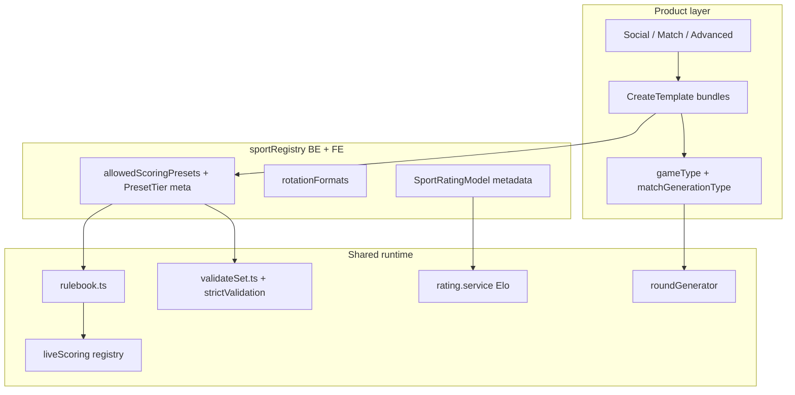

# Multisport implementation plan — ratings, formats & casual UX

**Synthesis doc** — unified execution hub for ratings, formats, casual UX, and rotation. Does **not** replace child plans; use them for full product copy, question banks, and bracket Prisma detail.

**Last updated:** 2026-05-28

**Related plans:**

| Document | Scope |
|----------|--------|
| [PLAN_MULTISPORT.md](./PLAN_MULTISPORT.md) | North star UX, schema, phases P0–P6, sport registry, gates, flags |
| [PLAN_SPORT_RATING_MODELS.md](./PLAN_SPORT_RATING_MODELS.md) | Canonical 1–7 Elo, external bridges (DUPR, UTR, SquashLevels), avatar rules |
| [PLAN_SPORT_SCORING_FORMATS.md](./PLAN_SPORT_SCORING_FORMATS.md) | New presets, rotation, leagues, preset checklist, engagement research |
| [PLAN_CASUAL_MULTISPORT_UX.md](./PLAN_CASUAL_MULTISPORT_UX.md) | Social vs match, templates, `PresetTier`, phases D0–C8 |
| [PLAN_MULTISPORT_QUESTIONNAIRES.md](./PLAN_MULTISPORT_QUESTIONNAIRES.md) | Per-sport questionnaires, level model, phases Q0–Q6 |
| [PLAN_MULTISPORT_DEFERRED.md](./PLAN_MULTISPORT_DEFERRED.md) | Officiating, kitchen, TIMED/CUSTOM, Watch depth |
| [PLAN_USER_LEVEL_RELIABILITY_MIGRATION.md](./PLAN_USER_LEVEL_RELIABILITY_MIGRATION.md) | `User.level` sunset, projection audit (R2a) |
| [PLAN_WATCH_SERVE_GUIDE_UX.md](./PLAN_WATCH_SERVE_GUIDE_UX.md) | Watch serve coach, first-server flow |
| [PLAN_LEAGUE_BRACKET_PLAYOFF.md](./PLAN_LEAGUE_BRACKET_PLAYOFF.md) | Bracket playoffs (CLASSIC head-to-head) |
| [PLAN_LEAGUE_BRACKET_UX_UPDATE.md](./PLAN_LEAGUE_BRACKET_UX_UPDATE.md) | Bracket UI follow-ups |
| [live-scoring-rules-expansion-plan.md](./live-scoring-rules-expansion-plan.md) | Classic/TB scoring correctness (not officiating) |
| [watch-vs-live-scoring-audit.md](./watch-vs-live-scoring-audit.md) | Watch/live parity, `TIMED`/`CUSTOM` |
| [WATCH_APP_REFACTOR_PLAN.md](./WATCH_APP_REFACTOR_PLAN.md) | Watch session machine |

---

## North star

**One app, one rulebook, one Elo engine (1.0–7.0 per sport):** sport is metadata on games; users choose **Social / Match / Advanced** at create; presets + templates + rotation policy live in `sportRegistry`; famous scales (DUPR, UTR, SquashLevels) are display bridges only — not stored ratings in v1.

Aligns with [PLAN_MULTISPORT.md](./PLAN_MULTISPORT.md): no global sport switcher; relationship-first My/chats.

---

## Current baseline (dev)

| Area | Status |
|------|--------|
| **Multisport foundation (P0–P6)** | Largely **done on dev**: `Game.sport`, `UserSportProfile`, `playersPerMatch`, 6 sports creatable, Find sport filter, `LeagueSeason.sport`, live registry, Watch `sport` + `playersPerMatch` |
| **Questionnaires (Q0–Q4)** | **Done**: all 6 sports in `sportRegistry.ts`; `sportQuestionnaire.service.ts` + automated tests |
| **Per-sport rating engine** | **Done**: `rating.service.ts` → `UserSportProfile` by `game.sport`; `projectUserForSportContext` |
| **`SportRatingModel` / `levelBands` / `PresetTier` / `createTemplates` / `rotationFormats`** | **Not in code** (plan-only) |
| **New presets** `BEST_OF_3_15`, pickleball `BEST_OF_3_11`, squash `BEST_OF_3_11`, FAST4 | **Not in Prisma enum** |
| **Casual create flow** (Social / Match / Advanced + templates) | **Not built** |
| **Singles-safe Americano** | **Not fixed** (`random.ts` pairs two IDs per team) |
| **Strict validation** (BWF 30-cap, pickleball rally-11) | **Not wired** |
| **Avatar per-sport display** | **In progress** (`profileSports`, `PlayerAvatar`, Watch level color) |

---

## Architecture (three layers — do not conflate)



| Layer | What | Social default | Match default |
|-------|------|----------------|---------------|
| **A. Score math** | `scoringPreset` | `POINTS_*`, timed | `CLASSIC_*`, `BEST_OF_*` |
| **B. Event shape** | `gameType` + `matchGenerationType` | Americano, Mexicano, WC | CLASSIC, fixed teams |
| **C. Officiating** | kitchen, lets, BWF faults | hints / honor buttons | strict later ([deferred](./PLAN_MULTISPORT_DEFERRED.md)) |
| **Rating** | `affectsRating` + `UserSportProfile` | `false` | `true` |

See [PLAN_CASUAL_MULTISPORT_UX.md](./PLAN_CASUAL_MULTISPORT_UX.md) and [PLAN_SPORT_SCORING_FORMATS.md](./PLAN_SPORT_SCORING_FORMATS.md).

---

## Unified phase map

Phases are **tracks** that can overlap after dependencies are met.

| Phase | Track | Work | Depends on |
|-------|-------|------|------------|
| **R0** | Ratings | Document + stub `SportRatingModel` on registry (padel reference) | P0 ✓ |
| **R2a** | Ratings / UX | Avatar audit: `levelSport`, `SportLevelProvider`, API projection on sport-sensitive trees | R0 |
| **D0** | Casual UX | `PresetTier`, `SportPresetMeta[]`, `createTemplates[]` on `SportConfig` (BE+FE parity) | — |
| **D1** | Casual UX | Create: Social \| Match \| Advanced branches; filter presets by tier | D0 |
| **C0** | Casual UX | Ship create templates (knob bundles) | D0, D1 |
| **C1** | Formats | New presets enum + rulebooks | — |
| **C2** | Formats | `strictValidation` in preset meta → `validateSet.ts` (+ BE mirror) | C1 |
| **R1** | Ratings | Wire questionnaire `levelBands` / i18n in profile accordion | Q4 ✓ |
| **R2** | Ratings | Profile “Other sports” copy; `levelSource` display | R1 |
| **R3** | Ratings | Per-sport `engine` coeffs in registry → `rating.service` | C1 |
| **R4** | Ratings | `formatRatingHint(sport, level)` — profile/card only, not avatar | R2 |
| **C3** | Rotation | Singles-safe `random.ts` / `rating.ts` / `winnersCourt.ts` for `playersPerMatch === 2` | P5 ✓ |
| **C3b** | Rotation | `rotationFormats` on registry; `validateGameForSport` gates | C3 |
| **C4** | Discovery | Find tier filter, no-rating filter; card badges | D0, C0 |
| **C5** | Social time | Round timer, duration on card, rally freeze at buzzer | — |
| **L2** | Leagues | Playoff templates sport-aware; gate AMERICANO by `rotationFormats` | C3b |
| **C6** | Scheduling | KOTC / challenger pool | C3b |
| **C7** | Tennis | `CLASSIC_FAST4` preset + classic live branch | C1 |
| **C8** | Retention | Share card, play again, light social stats | — |
| **R5** | Ratings | Playtomic level import per sport | P4 ✓ |
| **R6** | Ratings | DUPR / UTR / SquashLevels OAuth or manual field | Legal/API |
| **W*** | Watch | Per-sport rally UI; serve guide parity; 6-sport smoke | C1, R2a |

**Critical path (casual + official):** `D0 → D1 → C0` ∥ `C1 → C2` ∥ `R2a`.

**Critical path (club nights on pickleball/badminton):** `C1` + `C3 → C3b` before rotation marketing.

Phases D0–C8: [PLAN_CASUAL_MULTISPORT_UX.md](./PLAN_CASUAL_MULTISPORT_UX.md). Phases R0–R6: [PLAN_SPORT_RATING_MODELS.md](./PLAN_SPORT_RATING_MODELS.md).

### Implementation order (D0–C8 + formats)

From [PLAN_CASUAL_MULTISPORT_UX.md](./PLAN_CASUAL_MULTISPORT_UX.md#implementation-order-unified); scoring preset sequence in [PLAN_SPORT_SCORING_FORMATS.md § Suggested rollout](./PLAN_SPORT_SCORING_FORMATS.md#suggested-rollout-order).

| Phase | Work | Track |
|-------|------|-------|
| **D0** | `PresetTier` + `createTemplates` on registry; i18n BySport labels | Both |
| **D1** | Create: Social / Match / Advanced branches | Both |
| **C0** | Templates ship with knob bundles | Both |
| **C1** | New presets (`BEST_OF_3_15`, pickleball 11, squash Bo3) | Match (+ both tier) |
| **C2** | `strictValidation` hooks in `validateSet` | Match |
| **C3** | Singles rotation + `rotationFormats` | Social |
| **C4** | Find/card tier badges; no-rating filter | Both |
| **C5** | Timer / round timer / rally freeze | Social |
| **C6** | KOTC, challenger pool | Social |
| **C7** | FAST4; ROUND_ROBIN or Americano fallback | Match / social |
| **C8** | Share, play again, stats | Both |

**Formats rollout (after D0):** (1) `BEST_OF_3_15` badminton → (2) `POINTS_15` badminton → (3) `BEST_OF_3_11` squash → (4) pickleball `BEST_OF_3_11` match tier.

**Scoring plan tracks:** Track 1 presets → Track 2 singles rotation → Track 3 `rotationFormats` → Track 4 leagues → Track 5 KOTC/RR/FAST4 → Track 6 copy/templates ([formats roadmap](./PLAN_SPORT_SCORING_FORMATS.md#implementation-roadmap-ordered)).

---

## Track 1 — Per-sport ratings (`SportRatingModel`)

### Design (ADR-R1–R7)

See [PLAN_SPORT_RATING_MODELS.md](./PLAN_SPORT_RATING_MODELS.md#adrs).

- **One stored number:** `UserSportProfile.level` 1.0–7.0 + `reliability`.
- **One algorithm:** `Backend/src/services/results/rating.service.ts` — sport differences = registry config + copy.
- **Social level:** global `User.socialLevel` only — never per sport ([questionnaires](./PLAN_MULTISPORT_QUESTIONNAIRES.md)).
- **External systems:** DUPR, UTR, NTRP, SquashLevels = **hints** (profile accordion), not on 24px avatar badge.

### Registry shape (add to `SportConfig` BE + FE)

```ts
type SportRatingModel = {
  id: 'bandeja_elo_v1';
  canonical: { min: 1.0; max: 7.0 };
  questionnaireId?: string;
  levelBands: Array<{ min: number; max: number; labelKey: string; hintKey?: string }>;
  engine: {
    maxDeltaPerEvent?: number;
    useScoreMargin: boolean;
    ballsInGamesMargin?: boolean;
  };
  ratesWhen: { affectsRatingTrue: boolean };
  display?: {
    system: 'PLAYTOMIC' | 'NTRP' | 'DUPR' | 'UTR' | 'USATT' | 'SQUASHLEVELS' | 'NONE';
    mapLevelToHint?: (level: number) => string;
  };
  external?: { provider?: string; profileField?: string };
};
```

### Per-sport v1 config

| Sport | `levelBands` copy target | `display.system` | `engine` notes |
|-------|--------------------------|------------------|----------------|
| Padel | Playtomic-aligned | PLAYTOMIC | `ballsInGamesMargin: true` |
| Tennis | NTRP-shaped | NTRP | set-score margin (R3) |
| Pickleball | DUPR tiers | DUPR (US) / PLAYTOMIC hint (EU) | rally Bo3 margin (R3) |
| Badminton | club skill + 3×15/3×21 | NONE | — |
| Table tennis | optional USATT hint | USATT | — |
| Squash | SquashLevels mapped hint | SQUASHLEVELS | — |

### Rating policy vs casual track

| Template tier | `affectsRating` default | Level updates |
|---------------|-------------------------|---------------|
| Social | `false` | None |
| Match | `true` | Full Elo |
| Padel Americano (typical) | `false` | Unchanged |

### Canonical storage

| Field | Storage | Notes |
|-------|---------|-------|
| Competitive level | `UserSportProfile.level` | 1.0–7.0 per sport |
| Confidence | `UserSportProfile.reliability` | 0–100; larger deltas when low |
| Social level | `User.socialLevel` | **Global only** — never per sport |
| Legacy | `User.level` | PADEL dual-write during migration → [reliability migration](./PLAN_USER_LEVEL_RELIABILITY_MIGRATION.md) |

External band tables (NTRP, UTR, DUPR, SquashLevels): [PLAN_SPORT_RATING_MODELS.md](./PLAN_SPORT_RATING_MODELS.md#per-sport-famous-models).

### Avatar & API contract (R2a)

| Surface | Level source |
|---------|--------------|
| Game / invite / league / live | `projectUserForSportContext(user, game.sport)` |
| Find / leaderboard | active filter sport |
| DM / city lists | `projectUserByPrimarySport` |
| Player card | `?levelSport=` + `SportLevelProvider` |
| `inlineFace` / `superTiny` | **No badge** (face only) |

**Visual (ADR-R1, ADR-R7):** one decimal on badge; shared `getLevelColor` / `WatchLevelColor` for all sports; external scales profile-only.

**Failure modes:**

| Risk | Mitigation |
|------|------------|
| `PlayerAvatar` without `levelSport` outside provider | `SportLevelProvider` or `levelSport={game.sport}` |
| Full user + wrong sport prop | Prefer sport-scoped API projection |
| Tennis game, padel-primary user | Game tree uses `shellLevelSport` / invite provider |
| External scale on badge | Defer to R4 hints off-avatar |

**QA matrix:** same user padel **3.0**, tennis **5.0** → tennis roster **5.0**, padel roster **3.0**, DM (primary padel) **3.0**, `formatSportLevelBadgeDisplay(user, TENNIS)` with `sportsEnabled: [PADEL]` → **`−`**.

**Code:**

| Area | Path |
|------|------|
| Rating update | `Backend/src/services/results/rating.service.ts` |
| Outcomes / snapshot | `Backend/src/services/results/outcomes.service.ts`, `resolveUserSportSnapshot` |
| Projection | `Backend/src/services/user/userSportProfile.service.ts` |
| Playtomic sport map | `Backend/src/integrations/playtomicSport.ts` |
| Avatar | `Frontend/src/components/PlayerAvatar.tsx` |
| Level helpers | `Frontend/src/utils/profileSports.ts` |
| Context | `Frontend/src/contexts/SportLevelContext.tsx` |
| Invitable merge | `Frontend/src/utils/mergeInvitablePlayer.ts` |
| Level colors | `Frontend/src/utils/levelColor.ts`, Watch `WatchLevelColor.swift` |
| Badge visibility | `Frontend/src/components/PlayerAvatarView.tsx` (`shouldShowSportLevelBadge`) |

**Deferred:** second stored rating; cross-sport conversion; pro tour points; badge showing DUPR/UTR ([PLAN_SPORT_RATING_MODELS.md](./PLAN_SPORT_RATING_MODELS.md) R5–R6).

---

## Track 2 — New scoring presets & validation

Full checklist: [PLAN_SPORT_SCORING_FORMATS.md](./PLAN_SPORT_SCORING_FORMATS.md#implementation-checklist-per-new-enum-preset).

### Presets to add

| Preset | Sport(s) | Tier | Engine |
|--------|----------|------|--------|
| **`BEST_OF_3_15`** | Badminton | match (+ both) | `rallyBestOf(3, 15)` |
| **`POINTS_15`** | Badminton | social | `pointsRule(15)` ball budget |
| **`BEST_OF_3_11`** | Squash, Pickleball | match | `rallyBestOf(3, 11)` |
| **`BEST_OF_5_15`** / **`BEST_OF_3_15`** | Squash | match (optional) | PAR 15 |
| **`CLASSIC_FAST4`** | Tennis | social/match | classic: 4-game sets, no-ad, TB@3–3 to 5 |
| **`POINTS_12`** | Padel | social | optional lightning Americano |

### Per-preset touch list

1. Prisma `ScoringPreset` — `npx prisma migrate dev`
2. `Backend/src/utils/validators/gameFormat.ts`
3. `Frontend/src/utils/scoring/rulebook.ts` + `Backend/src/services/results/liveScoringEngine/rulebook.ts`
4. `Frontend/src/config/scoringPresets.json`
5. `Backend/src/sport/sportRegistry.ts`, `Frontend/src/sport/sportRegistry.ts`
6. `Frontend/src/types/index.ts`
7. Wizard / i18n `gameFormat.scoring*BySport`
8. `Frontend/src/utils/gameFormat/detectPreset.ts`
9. Watch `WatchScoringPreset` if mirrored
10. Tests: `multisport-phase3-presets.ts`, `validateSet`

### Strict validation (C2)

| ID | Behavior | Applies to |
|----|----------|------------|
| `NONE` | current validators | social `POINTS_*` |
| `BWF_21` | game capped at 30 when 29–29 | `BEST_OF_3_21` match |
| `PICKLEBALL_RALLY_11` | rally to 11 win-by-2 | `BEST_OF_3_11`, not ball-budget `POINTS_*` |
| `CLASSIC_TIMED_RELAXED` | incomplete games at buzzer | timed classic |

Wire via `SportPresetMeta.strictValidation` → `Frontend/src/utils/scoring/validateSet.ts`.

### Two preset families

| Family | Presets | Engine | Use case |
|--------|---------|--------|----------|
| **Structured match** | `BEST_OF_*_*`, `CLASSIC_*` | `rallyBestOf` / classic | Best-of-N to M, win-by-2 |
| **Social / rotation** | `POINTS_*` | `pointsRule(cap)` | Fixed **ball budget** (Americano-style) |

### Wording for hosts

| User says | Preset type | Example |
|-----------|-------------|---------|
| “3×15”, “best of 3 to 15” | Structured | `BEST_OF_3_15` |
| “3×21” | Structured | `BEST_OF_3_21` |
| “15 balls”, “play to 15 points total” | Social cap | `POINTS_15` |
| “21 balls” on badminton | Social cap | `POINTS_21` (not three games to 21) |

### Copy rule

- `gameFormat.scoring.{preset}.sport.{SPORT}`
- `gameFormat.scoringShort.{preset}BySport.{SPORT}`

Never label badminton `POINTS_21` as “3×21”; never expose ball-budget pickleball as official “game to 11” without tier ([PLAN_CASUAL_MULTISPORT_UX.md](./PLAN_CASUAL_MULTISPORT_UX.md)).

### Preset tier examples (planned metadata)

| Preset | Tier | Social label | Match label |
|--------|------|--------------|-------------|
| `POINTS_24` | social | Padel: Americano (24 balls) | — |
| `CLASSIC_BEST_OF_3` | match | — | Padel / tennis: Best of 3 sets |
| `BEST_OF_3_21` | match | — | Badminton: Official 3×21 |
| `BEST_OF_3_15` | both | Badminton: Club 3×15 | Badminton: Official 3×15 (BWF 2027) |
| `POINTS_21` (badminton) | social | 21 balls total (rotation) | — |
| `BEST_OF_3_11` (pickleball) | match | — | Game to 11, best of 3 |
| `POINTS_21` (pickleball) | social | Ball budget (open play) | — |

---

## Track 3 — Casual / dual-track UX

Spec: [PLAN_CASUAL_MULTISPORT_UX.md](./PLAN_CASUAL_MULTISPORT_UX.md).

### Registry extensions (D0)

```ts
type PresetTier = 'social' | 'match' | 'both';

type SportPresetMeta = {
  preset: ScoringPreset;
  tier: PresetTier;
  labelKey: string;
  defaultFor?: 'social' | 'match';
  strictValidation?: StrictValidationId;
};

type CreateTemplateId =
  | 'PADEL_AMERICANO_24' | 'PADEL_MEXICANO_24'
  | 'PICKLEBALL_SOCIAL_21' | 'PICKLEBALL_MATCH_BO3_11'
  | 'BADMINTON_CLUB_3X15' | 'BADMINTON_MATCH_3X21'
  | 'TT_BOX_BO3_11'
  | 'TENNIS_FAST4_SOCIAL' | 'TENNIS_CLASSIC_BO3'
  | 'SQUASH_QUICK_BO3_11';

type CreateTemplate = {
  id: CreateTemplateId;
  sport: Sport;
  tier: 'social' | 'match';
  scoringPreset: ScoringPreset;
  gameType: GameType;
  matchGenerationType: MatchGenerationType;
  playersPerMatch: 2 | 4;
  suggestedMaxParticipants: number;
  suggestedCourts: number;
  affectsRating: boolean;
  matchTimerEnabled?: boolean;
  matchTimedCapMinutes?: number;
  expectedDurationLabelKey?: string;
};

type RotationPolicy = {
  americano: boolean;
  mexicano: boolean;
  winnersCourt: boolean;
  ladder: boolean;
  minRotationRoster?: number;
  defaultAmericanoPreset?: ScoringPreset;
};

// SportConfig additions:
presetMeta: SportPresetMeta[];
createTemplates: CreateTemplateId[];
rotationFormats: RotationPolicy;
```

### Create flow (D1 + C0)

1. **Intent:** Social / club night \| Match (standard rules) \| Advanced (existing wizard).
2. **Sport-filtered templates** (not raw preset lists for casual users).
3. **Overrides:** `affectsRating`, timer, level band, public/join.

**Step 2 — branch filtering:**

| Branch | Show | Hide or demote |
|--------|------|----------------|
| **Social** | Templates + `PresetTier: social` | Full classic ladder unless padel host expands |
| **Match** | Templates + `PresetTier: match` | Raw `POINTS_*` unless labeled “social only” |
| **Advanced** | All `allowedScoringPresets` for sport | — |

### Orthogonal knobs (any tier)

| Knob | Social default | Match default | Code |
|------|----------------|---------------|------|
| `affectsRating` | `false` | `true` | `Game.affectsRating` |
| `matchGenerationType` | `RANDOM` / `RATING` | `AUTOMATIC` / `HANDMADE` / `FIXED` | `roundGenerator.ts` |
| `gameType` | `AMERICANO`, `MEXICANO`, … | `CLASSIC` | `deriveGameType()` |
| `matchTimerEnabled` | often `true` | optional | `matchTimer.service` |
| `hasGoldenPoint` | padel social classic | padel competitive | `getRules()` |
| Level band on create | wide (2–5) | narrow | `minLevel` / `maxLevel` |
| Find filter | “Social”, no rating | “Match”, sport level | Find (proposed) |

### Live scoring & Watch (by track)

| | Social | Match |
|--|--------|--------|
| Tap / engine | Same `liveScoring` plugins | Same |
| Serve coach | Off for pure `POINTS_*` Americano; opt-in for rally | On by default for classic / `BEST_OF_*` |
| Officiating | Hints + honor (pickleball kitchen button) | Same + future `officiatingLevel: strict` |

### Seven product pillars

| Pillar | Phase | Focus |
|--------|-------|--------|
| 1. Templates + tier labels | C0 | Dual track in UI without new engines |
| 2. Time promise | C5 | Round timer, duration on card, rally freeze |
| 3. Psychological safety | social | `affectsRating` off, wide levels, no-rating Find |
| 4. In-play guidance | both | Hints; strict enforcement deferred |
| 5. Discovery | C4 | Tier badges, filters (note: casual doc also uses “C4” for time — different emphasis) |
| 6. Scheduling formats | C6 | KOTC, challenger pool, Swiss |
| 7. After game | C8 | Share, play again, light stats |

**Files:** `Frontend/src/pages/CreateGame.tsx`, `GameFormatWizard.tsx`, `Frontend/src/utils/gameFormat/scoringCompatibility.ts`.

### Discovery (C4)

- Find: tier (social / match), `gameType`, no-rating, spots open.
- Card: **“Social · Americano · ~2h”** vs **“Match · 3×21”**.

### Future flag

```ts
officiatingLevel?: 'none' | 'hints' | 'strict';
```

See [PLAN_WATCH_SERVE_GUIDE_UX.md](./PLAN_WATCH_SERVE_GUIDE_UX.md).

---

## Track 4 — Rotation formats & round generation

Detail: [PLAN_SPORT_SCORING_FORMATS.md](./PLAN_SPORT_SCORING_FORMATS.md#will-americano-random-work-for-other-sports).

### `rotationFormats` matrix

| Sport | Americano | Mexicano | Winner Court | Ladder |
|-------|-----------|----------|--------------|--------|
| Padel | ✓ | ✓ | ✓ | ✓ |
| Tennis | ✗ | ✗ | ✗ | ✗ |
| Pickleball | ✓ (4p) | ✓ | ✓ | opt |
| Badminton | ✓ (4p) | ✓ | ✓ | opt |
| Table tennis | ✓ (4p) | ✓ | opt | opt |
| Squash | ✗ | ✗ | opt* | ✓ |

\*WC as ladder metaphor, not padel 4-player WC.

### Americano on other sports (verdict)

| Question | Answer |
|----------|--------|
| Pairing algorithm sport-aware? | **No** — roster, courts, `playersPerMatch`, gender only |
| Allowed on non-padel today? | **No** — `validateGameForSport` + `allowedGameTypes` |
| Scoring OK if enabled? | Only with allowed `POINTS_*` (or rally cap) for that sport |
| Singles (`playersPerMatch === 2`)? | **Broken today** — fix in C3 before marketing |

Detail: [PLAN_SPORT_SCORING_FORMATS.md § Will Americano work](./PLAN_SPORT_SCORING_FORMATS.md#will-americano-random-work-for-other-sports).

### Implementation (C3 + C3b)

1. `playersPerMatch === 2` branch in `random.ts`, `rating.ts`, `winnersCourt.ts`.
2. `validateGameForSport` gates `gameType` ↔ `matchGenerationType`.
3. `GameFormatWizard` filters generation types.
4. League: `PlayoffConfigurationModal` hides AMERICANO when `!rotationFormats.americano`.

**Code:**

| File | Role |
|------|------|
| `Backend/src/services/results/generation/roundGenerator.ts` | Dispatch by `matchGenerationType` |
| `Backend/src/services/results/generation/random.ts` | Americano |
| `Backend/src/services/results/generation/rating.ts` | Mexicano |
| `Backend/src/services/results/generation/winnersCourt.ts` | Winner Court |
| `Backend/src/services/results/generation/escalera.ts` | Ladder |
| `Backend/src/utils/validators/validateGameForSport.ts` | Sport gate |
| `Frontend/src/utils/gameFormat/scoringCompatibility.ts` | gameType ↔ generation |
| `Frontend/src/utils/liveScoring/badmintonServe.ts` | Interval at 8 when `pointsPerGame >= 15` |

### `matchGenerationType` ↔ `gameType` ↔ generator

| `matchGenerationType` | `gameType` (derived) | Generator |
|----------------------|----------------------|-----------|
| `RANDOM` | `AMERICANO` | `generateRandomRound` |
| `RATING` | `MEXICANO` | `generateRatingRound` |
| `ESCALERA` | `LADDER` | `generateEscaleraRound` |
| `WINNERS_COURT` | `WINNER_COURT` | `generateWinnersCourtRound` |
| `ROUND_ROBIN` | `ROUND_ROBIN` | **Throws** — not implemented; use Americano for social or implement later |
| `AUTOMATIC` / `HANDMADE` / `FIXED` | `CLASSIC` or `CUSTOM` | Auto pairing / league fixtures |

**Product:** KOTC ≠ Winner Court — KOTC is multi-court ladder scheduling (C6); WC is in-game type today.

---

## Track 5 — Leagues & tournaments

### League phases (scoring plan)

| Phase | Work | Status |
|-------|------|--------|
| **L1** | Classic-only leagues per sport; `LeagueSeason.sport` | **Done on dev** |
| **L2** | Session playoffs sport-aware; gate AMERICANO by `rotationFormats` | This plan |
| **L3** | Bracket multi-sport; filter presets by season sport | [PLAN_LEAGUE_BRACKET_PLAYOFF.md](./PLAN_LEAGUE_BRACKET_PLAYOFF.md) (separate workstream) |

| Mode | Social track | Match track |
|------|--------------|-------------|
| Ad-hoc | Template `tier=social` | Template `tier=match` |
| Regular league | wide levels, rating optional | CLASSIC fixtures, rating on |
| Session playoff | Americano / WC if `rotationFormats` | match presets for finals |
| Bracket | rare | CLASSIC — [PLAN_LEAGUE_BRACKET_PLAYOFF.md](./PLAN_LEAGUE_BRACKET_PLAYOFF.md) |

### League default presets (L2)

| Sport | Regular season | Session playoff | Bracket |
|-------|----------------|-----------------|---------|
| Padel | `CLASSIC_BEST_OF_3` | AMERICANO `POINTS_24` / WC | CLASSIC |
| Tennis | `CLASSIC_BEST_OF_3` | — or FAST4 later | CLASSIC |
| Pickleball | `BEST_OF_3_11` or `POINTS_21` | AMERICANO `POINTS_21` | CLASSIC |
| Badminton | `BEST_OF_3_15` / `BEST_OF_3_21` | AMERICANO `POINTS_21` | CLASSIC |
| Table tennis | `BEST_OF_3_11` | AMERICANO `POINTS_11` | CLASSIC |
| Squash | `BEST_OF_5_11` | Ladder / WC | CLASSIC |

**League rules:**

1. `LeagueSeason.sport` drives allowlists (wired).
2. Playoff `AMERICANO` only if `rotationFormats.americano` for that sport.
3. Bracket always **CLASSIC** — [PLAN_LEAGUE_BRACKET_PLAYOFF.md](./PLAN_LEAGUE_BRACKET_PLAYOFF.md).
4. “Casual league” = season template with social defaults, not a new engine.

**Code:** `Backend/src/services/league/gameCreation.util.ts`, `Frontend/src/components/GameDetails/PlayoffConfigurationModal.tsx`.

---

## Track 6 — Questionnaires

Plan: [PLAN_MULTISPORT_QUESTIONNAIRES.md](./PLAN_MULTISPORT_QUESTIONNAIRES.md).

| Phase | Status | Remaining |
|-------|--------|-----------|
| Q0–Q4 | **Done** | — |
| Q3 nudges | Partial | CreateGame / invite banners |
| Q5 | Optional | Main sport selector on registration; PADEL default |
| Q6 | Optional | `removeSport(PADEL)` when `gamesPlayed === 0` |

**Code:** `Backend/src/sport/questionnaires/`, `Backend/src/services/user/sportQuestionnaire.service.ts`.

**API (summary):**

| Method | Path | Effect |
|--------|------|--------|
| `POST` | `/users/me/sports/:sport/questionnaire` | Score → `UserSportProfile(sport).level`; `levelSource = QUESTIONNAIRE` |
| `POST` | `/users/me/sports/:sport/questionnaire/skip` | `questionnaireSkippedAt`; level stays 1.0 |
| `GET` | `/users/me/sports/:sport/questionnaire/status` | `{ completed, skipped, suggested, level, gamesPlayed }` |

**Schema:** `questionnaireCompletedAt`, `questionnaireSkippedAt`, `questionnaireVersion`, `levelSource` (`DEFAULT` \| `QUESTIONNAIRE` \| `MANUAL`); `LevelChangeEvent.sport` for per-sport history.

**Invariant:** `resolveUserSportSnapshot` — if no profile and sport ≠ PADEL → **1.0**, not `User.level` ([questionnaires §4.4](./PLAN_MULTISPORT_QUESTIONNAIRES.md#44-resolveusersportsnapshot-fix)).

**Q0 team questions** (decide before Q2 nudges): see [PLAN_MULTISPORT_QUESTIONNAIRES.md §0](./PLAN_MULTISPORT_QUESTIONNAIRES.md#0-team-questions-decide-before-q2).

**Depends on multisport:** Q0–Q2 need P0 + P1 rating-by-sport (done on dev).

Link to ratings: questionnaire sets initial level before first rated game; `levelBands` in `SportRatingModel` align with questionnaire bands (R1).

---

## Track 7 — Watch & deferred officiating

### Watch

- [PLAN_WATCH_SERVE_GUIDE_UX.md](./PLAN_WATCH_SERVE_GUIDE_UX.md) — serve coach, first-server pick.
- [PLAN_MULTISPORT.md](./PLAN_MULTISPORT.md) Phase 6 — `WatchGame.swift` `sport` + `playersPerMatch`.
- Per-sport rally UI mirroring `Frontend/src/liveScoring/registry.ts`.

### Deferred (do not block social launch)

[PLAN_MULTISPORT_DEFERRED.md](./PLAN_MULTISPORT_DEFERRED.md):

- Pickleball: visual NVZ → coach hints → strict enforcement
- Full lets/faults all sports
- `TIMED` / `CUSTOM` live parity ([watch-vs-live-scoring-audit](./watch-vs-live-scoring-audit.md))
- KOTC multi-court state machine (C6)
- `ROUND_ROBIN` generator (throws today) — prefer Americano for social until implemented
- DUPR/UTR OAuth (R6)
- Explicit `Club.sports` list (today: infer from `Court.sport`)

**Live plugin gaps today:** padel/tennis/TT serve guide strongest; badminton/squash serve coach opt-in; pickleball hints only — see deferred §3.

---

## Jobs-to-be-done (product)

### Social track

| Job | Success feels like |
|-----|-------------------|
| Show up | Find game at my level |
| Belong | Rotate partners; not stuck with one weak link |
| Finish on time | ~2h, timer trusted |
| Low stakes | Rating off / social badge |
| Low admin | Template, not wizard |
| Come back | Play again / series |

### Match track

| Job | Success feels like |
|-----|-------------------|
| Fair result | Score lines validate like real sport |
| Rating trust | `affectsRating` + per-sport level |
| League integrity | Fixed teams, classic fixtures |
| Clear rules | “3×21 badminton” not “21 balls” |

---

## Per-sport playbook (social vs match)

From [PLAN_CASUAL_MULTISPORT_UX.md](./PLAN_CASUAL_MULTISPORT_UX.md#per-sport-playbook).

| Sport | Social | Match |
|-------|--------|-------|
| **Padel** | Americano 24, Mexicano, WC, KOTC | Classic Bo3, golden point, league |
| **Tennis** | FAST4, timed hit, rating off | `CLASSIC_BEST_OF_3`, league |
| **Pickleball** | `POINTS_21` (ball budget), Americano 4p | `BEST_OF_3_11`, rally to 11 |
| **Badminton** | `POINTS_15`/`POINTS_21`, Americano after singles fix | `BEST_OF_3_15`/`BEST_OF_3_21` + `BWF_21` |
| **Table tennis** | Americano, Bo3 social | `BEST_OF_3_11`, `BEST_OF_5_11` |
| **Squash** | Box ladder | `BEST_OF_3_11`, `BEST_OF_5_11`, PAR 15 opt |

---

## Testing & gates

| Gate | Criterion |
|------|-----------|
| **G-RATING** | Tennis roster shows tennis level, not padel primary |
| **G-PRESET** | Each new preset: create → live → finalize → legal `validateSet` |
| **G-ROTATION** | Pickleball Americano 4p + badminton 2p singles smoke |
| **G-CASUAL** | Social template `affectsRating: false`; match `true` |
| **G-STRICT** | BWF cap on `BEST_OF_3_21`; social `POINTS_21` not capped |
| **G-PADEL-REG** | Padel-only user: create unchanged |

Extend `Backend/scripts/tests/run-all.ts` and `npm run test:live-scoring`.

Existing suites: `multisport-phase0.ts` … `multisport-phase6.ts`, `multisport-questionnaire-*.ts`.

---

## What not to build

From [PLAN_CASUAL_MULTISPORT_UX.md](./PLAN_CASUAL_MULTISPORT_UX.md#do-not-build) and [PLAN_SPORT_SCORING_FORMATS.md](./PLAN_SPORT_SCORING_FORMATS.md#do-not):

- Second scoring engine or “casual app” fork
- Global sport switcher in header
- Same `GAME_TYPES` on every sport
- Full officiating blocking social launch
- `CUSTOM` on social create without templates
- DUPR/UTR/NTRP on avatar before internal 1–7 bands work
- Cross-sport level auto-fill
- Claiming USAPA/BWF/ITTF equivalence

---

## Squad split (2–3 devs, ~8–12 weeks core gap)

| Dev | Weeks 1–3 | Weeks 4–8 |
|-----|-----------|-----------|
| **A** | D0, D1, C0 | C4, C5 |
| **B** | C1, C2 | C7 FAST4 |
| **C** | R0, R2a, R1–R2 | C3, C3b, L2 |

---

## Priority if scope must shrink

**Tier 1:** `D0–D1–C0` + `C1` (`BEST_OF_3_15`, pickleball `BEST_OF_3_11`) + `R2a` + sport-specific i18n labels.

**Tier 2:** `C3–C3b` + `C2` + `R1–R2` level bands.

**Tier 3:** `C4–C8`, FAST4, KOTC, `R4–R6` external bridges.

---

## Decision log

| Question | Answer | Source |
|----------|--------|--------|
| Casual + official together? | Yes — tier + templates + strict flags, one rulebook | [casual UX](./PLAN_CASUAL_MULTISPORT_UX.md) |
| How user picks? | Social / Match / Advanced at create | [casual UX](./PLAN_CASUAL_MULTISPORT_UX.md) |
| One rating engine? | Yes — `SportRatingModel` config only | [ratings](./PLAN_SPORT_RATING_MODELS.md) |
| Americano on all sports? | Social track only via `rotationFormats`; fix singles first | [formats](./PLAN_SPORT_SCORING_FORMATS.md) |
| `POINTS_21` badminton? | Social only in UI; match uses `BEST_OF_3_*` | [casual UX](./PLAN_CASUAL_MULTISPORT_UX.md) |
| Event roster vs match size? | `maxParticipants` vs `playersPerMatch` (ADR-002) | [multisport](./PLAN_MULTISPORT.md) |
| `ROUND_ROBIN` vs Americano? | Americano for social; RR for match schedules later | [formats](./PLAN_SPORT_SCORING_FORMATS.md) |
| KOTC vs Winner Court? | KOTC = scheduling (C6); WC = in-game type | [formats](./PLAN_SPORT_SCORING_FORMATS.md) |

---

## Multisport UX invariants

From [PLAN_MULTISPORT.md](./PLAN_MULTISPORT.md) — implementers must not violate:

| Tab / surface | Filter by sport? |
|---------------|------------------|
| **My** | **Never** |
| **Chats / invites** | **Never** |
| **Find** | Optional (default primary) |
| **Leaderboard** | Per sport (inside Top) |

**Anti-patterns:** header sport switcher; sport chip on every card; six levels on avatar; onboarding sport wall; filtering My by sport.

**Progressive disclosure:** `sportsEnabled` → sport row on create; `sportsPlayed` (≥3 games) → Find affordances; `lastCreatedSport` → create defaults.

**ADR-001:** sport is per-game metadata, not app mode. **ADR-002:** `maxParticipants` = event roster; `playersPerMatch` = match size (2 or 4).

**Sport capability matrix** (defaults, live effort): [PLAN_MULTISPORT.md § Sport capability matrix](./PLAN_MULTISPORT.md#sport-capability-matrix-engineering-phasing).

---

## What Bandeja ships vs gaps

| Area | Social | Match | Gap |
|------|--------|-------|-----|
| Formats | Americano, Mexicano, WC, Ladder | CLASSIC, league, bracket | Templates, `PresetTier`, KOTC |
| Scoring | `POINTS_*`, `TIMED` | `CLASSIC_*`, partial `BEST_OF_*` | `BEST_OF_3_15`, pickleball Bo3, FAST4 |
| Rating | `affectsRating: false` | `affectsRating: true` | `SportRatingModel`, level bands UI |
| Discovery | Find + level | Same + league | Tier / no-rating filters |
| Rotation | Padel only (de facto) | — | `rotationFormats` + singles fix |

---

## Architect gates & feature flags

| Gate | When | Status (dev) |
|------|------|----------------|
| G0 | ADR + API | Pass |
| G1 | P0 schema; My unfiltered | Pass |
| G2 | Before rated tennis prod | Pass |
| G3 | Padel rating isolation | Pass |
| G4 | Find vs My asymmetry | Pass |
| G5 | Live registry frozen (6 sports) | Pass |
| G6 | Six sports creatable | Pass |
| G7 | Roster vs `playersPerMatch` | Pass |

| Flag | Phases | User-visible |
|------|--------|----------------|
| `MULTISPORT_DATA` | P0 | No |
| `MULTISPORT_TENNIS` | P0+P1 | Multi-sport creators |
| `MULTISPORT_FIND` | +P2 | Find filter + glyphs |
| `MULTISPORT_6_SPORTS` | +P3 | All six creatable |
| `MULTISPORT_POLISH` | +P4 | Profile, notifications |
| `MULTISPORT_MATCH_SIZE` | +P5 | Padel 6+ roster, 1v1/2v2 switch |

**Success metrics:** padel-only create completion unchanged; no cross-sport level writes; Find sport filter used without empty My tab.

---

## Appendix — current scoring allowlists (today)

Before C1 new enums. Source: `sportRegistry.ts`.

| Sport | Allowed presets today | Default |
|-------|----------------------|---------|
| **Padel** | Full classic + points + rally + `TIMED` / `CUSTOM` | `CLASSIC_BEST_OF_3` |
| **Tennis** | Classic ladder + `TIMED` / `CUSTOM` | `CLASSIC_BEST_OF_3` |
| **Table tennis** | `POINTS_11`, `BEST_OF_3_11`, `BEST_OF_5_11`, `CUSTOM` | `BEST_OF_3_11` |
| **Badminton** | `BEST_OF_3_21`, `POINTS_21`, `CUSTOM` | `BEST_OF_3_21` |
| **Pickleball** | `POINTS_16/21/24/32`, `CUSTOM` | `POINTS_21` |
| **Squash** | `BEST_OF_5_11`, `CUSTOM` (singles only) | `BEST_OF_5_11` |

**Note:** `POINTS_21` on badminton = one match, **21-ball budget** — not 3×21.

---

## Appendix — engagement backlog (optional)

Tier A/B/C from [PLAN_SPORT_SCORING_FORMATS.md](./PLAN_SPORT_SCORING_FORMATS.md#recommended-additions-engagement-first) — not blocking Tier 1 execution:

- **Tier A:** presets only (`BEST_OF_3_15`, `POINTS_15`, squash/pickleball Bo3, `POINTS_12` padel).
- **Tier B:** strict caps, pickleball rally-to-11 vs ball budget, FAST4 subset.
- **Tier C:** KOTC, timed Americano templates, create templates (overlaps C0/C6).

---

## Related code index

| Area | Path |
|------|------|
| Sport registry | `Backend/src/sport/sportRegistry.ts`, `Frontend/src/sport/sportRegistry.ts` |
| Sport validation | `Backend/src/utils/validators/validateGameForSport.ts` |
| Rulebook | `Frontend/src/utils/scoring/rulebook.ts`, BE `liveScoringEngine/rulebook.ts` |
| Validation | `Frontend/src/utils/scoring/validateSet.ts` |
| Live plugins | `Frontend/src/liveScoring/registry.ts` |
| Scoring mode split | `Frontend/src/utils/gameFormat/scoringCompatibility.ts` |
| i18n formats | `Frontend/src/utils/gameFormat/gameFormatI18n.ts` |
| Create | `Frontend/src/pages/CreateGame.tsx`, `GameFormatWizard.tsx` |
| Round gen | `Backend/src/services/results/generation/` |
| Leagues | `Backend/src/services/league/gameCreation.util.ts` |
| Match timer | `Backend/src/services/matchTimer.service` (or equivalent) |
| Strict validation | `Frontend/src/utils/scoring/validateSet.ts` |
