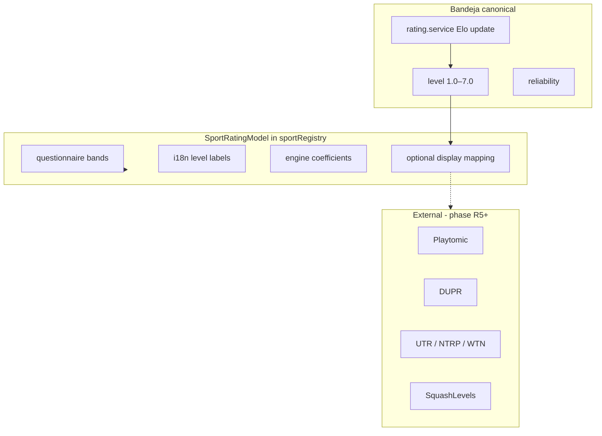

# Per-sport rating models

Companion to [`PLAN_MULTISPORT.md`](./PLAN_MULTISPORT.md), [`PLAN_MULTISPORT_QUESTIONNAIRES.md`](./PLAN_MULTISPORT_QUESTIONNAIRES.md), [`PLAN_CASUAL_MULTISPORT_UX.md`](./PLAN_CASUAL_MULTISPORT_UX.md), and [`PLAN_SPORT_SCORING_FORMATS.md`](./PLAN_SPORT_SCORING_FORMATS.md). **Unified execution hub** → [`PLAN_MULTISPORT_RATINGS_FORMATS_IMPLEMENTATION.md`](./PLAN_MULTISPORT_RATINGS_FORMATS_IMPLEMENTATION.md).

**North star:** One **Bandeja skill number** per sport (1.0–7.0 + reliability). Padel stays Playtomic-aligned. Other sports use the **same engine** with sport-specific **questionnaires, labels, and optional display bridges** to famous external systems (DUPR, UTR, SquashLevels, etc.) — not six separate calculators in v1.

---

## Canonical model (all sports)

| Field | Storage | Notes |
|-------|---------|-------|
| Competitive level | `UserSportProfile.level` | 1.0–7.0, clamped on write |
| Confidence | `UserSportProfile.reliability` | 0–100; larger deltas when low (Playtomic-style) |
| Social level | `User.socialLevel` | **Global only** — never per sport ([questionnaires plan](./PLAN_MULTISPORT_QUESTIONNAIRES.md)) |
| Updates | `Backend/src/services/results/rating.service.ts` | Elo-style expected win vs team averages; K-factor; score-margin multiplier; max Δ 0.2 per event |

**Padel reference:** Playtomic / Padel Mates **0.0–7.0** dynamic level + reliability after competitive matches. Bandeja uses **1.0–7.0** (same bands; floor at 1.0 for new profiles).

---

## Architecture: one engine, sport-specific “faces”



| Layer | v1 | Later |
|-------|-----|-------|
| **Canonical** | Single algorithm → `UserSportProfile` by `game.sport` | Sport-tuned coefficients in registry |
| **Face** | Questionnaires + `levelBands` copy | Profile hint: “~4.2 DUPR” |
| **External sync** | Playtomic import where already integrated | DUPR / UTR / SquashLevels OAuth or manual field |

**Do not:** second stored rating per sport; cross-sport auto-conversion (“tennis 4.0 → padel 4.0”); pro tour rankings (FIP, PSA, BWF points) as club level.

---

## Per-sport: famous models

### Padel — keep as-is

| System | Type | Scale | Bandeja |
|--------|------|-------|---------|
| **Playtomic / Padel Mates** | Dynamic Elo + reliability | 0.0–7.0 | **Primary alignment** (import + copy) |
| LTA club | Self / sanctioned | 1.0–7.0 | Questionnaire bands only |
| MATCHi | Self-declared filter | 1–10 integer | Not for rated play |
| FIP / WPT | Tournament points | World rank | Out of scope |

Refs: [Playtomic levels](https://playerhelp.playtomic.com/hc/en-gb/articles/19831827459345-The-Playtomic-Levels-ups-downs), [padel level comparison](https://www.playskan.com/blog/padel-levels-explained-uk).

---

### Tennis

| System | Type | Scale | Role |
|--------|------|-------|------|
| **UTR** | Performance rating | 1.00–16.50 | Global; daily; any match |
| **WTN** (ITF) | Federation rating | 40 (weak) → 1 (strong) | Weekly; separate S/D |
| **NTRP** (USTA) | League class | 1.5–7.0 in 0.5 steps | US leagues; slow-moving |
| **Playtomic tennis** | Elo + reliability | 0–7 | Per-sport pool; not = UTR |

**v1:** Internal 1–7; questionnaire bands **NTRP-shaped** (team Q3 in questionnaires plan: same scale, optional hint later).

**Display hints (approximate, not official):**

| Bandeja | Rough NTRP | Rough UTR (adult rec) |
|---------|------------|------------------------|
| 1.0–2.0 | 1.5–2.5 | 1–4 |
| 2.5–3.5 | 3.0–3.5 | 5–7.5 |
| 4.0–4.5 | 4.0–4.5 | 8–10 |
| 5.0–5.5 | 5.0+ | 10.5–12 |
| 6.0–7.0 | 5.5–7.0 | 12+ |

Refs: [UTR vs WTN vs NTRP](https://tennisacademy.app/blog/utr-vs-wtn-vs-ntrp-in-2026-a-clear-guide-to-your-pathway), [USTA NTRP FAQs](https://www.usta.com/en/home/play/adult-tennis/programs/national/usta-ntrp-ratings-faqs.html).

---

### Pickleball

| System | Type | Scale | Role |
|--------|------|-------|------|
| **DUPR** | Modified Elo | 2.000–8.000 + reliability % | **US standard**; USA Pickleball events |
| **Playtomic** | 0–7 Elo | Separate from DUPR | EU; US integrates DUPR for open matches |

**v1:** Internal 1–7; UI band copy aligned to **DUPR tiers** (2.0 beginner → 5.0+ competitive).

**v2:** Optional `duprRating` display / sync; never auto-equate Playtomic 3.5 = DUPR 3.5 without calibration.

Refs: [DUPR](https://www.dupr.com/what-is-dupr), [Playtomic × DUPR](https://insider.fitt.co/press-release/playtomic-partners-with-dupr-to-power-the-next-era-of-community-driven-pickleball/).

---

### Badminton

| System | Type | Scale | Role |
|--------|------|-------|------|
| **BWF world ranking** | Tournament points | Rank / points | Pro only |
| **County / club grading** (e.g. UK) | Match results | A1–E2 or 1–9 | Local leagues |

**v1:** Internal 1–7; questionnaire tied to **club skill** and formats **3×15 / 3×21** ([scoring plan](./PLAN_SPORT_SCORING_FORMATS.md)), not BWF points.

Ref: [BWF world ranking system (PDF)](https://system.bwfbadminton.com/documents/folder_1_81/Regulations/GCR/Part%20III%20-%20Section%201A%20-%20GCR%20Appendix%206%20-%20World%20Ranking%20System.pdf).

---

### Table tennis

| System | Type | Scale | Role |
|--------|------|-------|------|
| **USATT** | Elo (multi-pass) | ~200–2800+ | US sanctioned events |
| **Ratings Central** | Elo | Similar | Global clubs |
| **ITTF** | Points | Pro | Out of scope |

**v1:** Internal 1–7; profile hint optional (“~1200 USATT-style”) in accordion only.

Ref: [USATT ratings guide](https://usatt.simplycompete.com/info/ratings).

---

### Squash

| System | Type | Scale | Role |
|--------|------|-------|------|
| **SquashLevels** | Performance level | ~50 → 50,000+ | WSF/PSA endorsed; updates every match |
| **PSA ranking** | Points average | Pro | Out of scope |
| **Box ladder** | Position | Box # | Social; not universal numeric |

**v1:** Internal 1–7; **strongest case for mapped display hint** (squash culture expects SquashLevels-style numbers, not 1–7).

**UI-only anchors (monotonic, not stored):**

| Bandeja | Illustrative SquashLevels |
|---------|---------------------------|
| 2.0 | ~200 |
| 4.0 | ~800 |
| 6.0 | ~3000 |

Refs: [SquashLevels FAQ](https://squashlevels.com/doc.php?doc=faq_levels.htm), [algorithm](https://blog.squashlevels.com/the-squashlevels-algorithm/).

---

## Cross-sport summary

| Sport | Club “famous” dynamic | League / static | Pro | Bandeja v1 canonical | Best user-facing bridge |
|-------|----------------------|-----------------|-----|----------------------|-------------------------|
| Padel | Playtomic 0–7 | LTA 1–7 | FIP points | **1–7 Elo** (current) | Playtomic |
| Tennis | UTR | NTRP | ATP/WTA | 1–7 Elo | NTRP hint + optional UTR |
| Pickleball | DUPR | 2.0–5.5 labels | PPA | 1–7 Elo | DUPR (US) |
| Badminton | County A–E | — | BWF | 1–7 Elo | Skill + 3×15/3×21 |
| Table tennis | USATT Elo | — | ITTF | 1–7 Elo | USATT hint |
| Squash | SquashLevels | Box | PSA | 1–7 Elo | Mapped SL hint |

---

## Registry: `SportRatingModel`

Extend `SportConfig` (BE + FE `sportRegistry.ts`) — metadata only in v1; engine stays shared.

```ts
type SportRatingModel = {
  id: 'bandeja_elo_v1';
  canonical: { min: 1.0; max: 7.0 };

  questionnaireId?: string; // padel-v1, tennis-v1, …
  levelBands: Array<{
    min: number;
    max: number;
    labelKey: string;
    hintKey?: string; // optional external-style copy
  }>;

  engine: {
    maxDeltaPerEvent?: number;      // default 0.2
    useScoreMargin: boolean;
    ballsInGamesMargin?: boolean;   // padel POINTS_* / americano
  };

  ratesWhen: {
    affectsRatingTrue: boolean;
    // social POINTS_* with affectsRating false → no update (casual UX)
  };

  display?: {
    system: 'PLAYTOMIC' | 'NTRP' | 'DUPR' | 'UTR' | 'USATT' | 'SQUASHLEVELS' | 'NONE';
    mapLevelToHint?: (level: number) => string; // read-only UI
  };

  external?: {
    provider?: 'playtomic' | 'dupr' | 'utr' | 'squashlevels';
    profileField?: string; // future
  };
};
```

---

## Social vs match (rating policy)

Align with [`PLAN_CASUAL_MULTISPORT_UX.md`](./PLAN_CASUAL_MULTISPORT_UX.md):

| Track | `affectsRating` | Level updates |
|-------|-----------------|---------------|
| Social templates | `false` default | None |
| Match templates | `true` default | Full Elo path |
| Padel Americano (typical) | `false` | Unchanged product behavior |

Tennis: treat **FAST4 / classic** with `affectsRating: true` as match track; timed social off.

---

## Avatar & list UI (per-sport level display)

**Rule:** One badge per avatar, one sport per UI context — never stack padel + tennis + … on the same chip ([multisport UX](./PLAN_MULTISPORT.md): “one level; context on game”).

### Which level to show

| Surface | Sport for badge | Level source |
|---------|-----------------|--------------|
| Game / invite / league / results / live roster | `game.sport` or `LeagueSeason.sport` | `UserSportProfile(sport)` or API-projected `user.level` |
| Find / trainers (sport filter) | Active find sport | Same |
| Leaderboard tab | Tab sport | Same |
| Player card opened from game | `?levelSport=` + `SportLevelProvider` stack | Stats API for that sport |
| Own profile header | `resolveActivePrimarySport(user)` | Primary sport profile |
| Other sports | Profile accordion only — not on list avatars | `sportProfiles[]` |
| DM / city / generic chat | Viewer or sender **primary sport** (documented fallback) | `projectUserByPrimarySport` |
| `inlineFace` / `superTiny` avatars | — | **No badge** (face only) |

### Resolution order (frontend)

`PlayerAvatar` resolves sport as:

1. Prop `levelSport`
2. `SportLevelProvider` context (`useSportLevelContext`)
3. `player.primarySport`

Then `formatSportLevelBadgeDisplay(player, sport)` → `getDisplayLevelForSport`; gray **`−`** when `sportsEnabled` is known and sport not enabled.

### Backend contract

| API shape | Requirement |
|-----------|-------------|
| Game / invite / invitable / league planner | `projectUserForSportContext(user, sport)` on nested users **or** full `sportProfiles` + `sportsEnabled` |
| Global lists (followers, city) | `projectUserByPrimarySport` — badge = primary only |
| Game chat senders | `resolveChatMessageSport` → project per message context |

Client: `mergeInvitablePlayer` keeps cached `sportProfiles` when search returns only projected `level`.

### Visual design (v1)

| Element | Decision |
|---------|----------|
| Badge text | One decimal (`4.2`) — canonical 1–7 |
| Badge color | Shared `getLevelColor` / Watch `WatchLevelColor` gradient for **all sports** (ADR-R1) |
| DUPR / UTR / SquashLevels | Profile accordion / hints only — **not** on 24px avatar badge |
| Sport glyph on avatar | **No** — sport implied by screen; optional card meta when `game.sport !== primary` |
| Fresh 1.0 / unrated | Profile uses `shouldShowSportLevelBadge`; avatars may still show `1.0` or `−` — align in R2 |

### Failure modes & fixes

| Risk | Mitigation |
|------|------------|
| `PlayerAvatar` without `levelSport` outside provider | Wrap section in `SportLevelProvider` or pass `levelSport={game.sport}`; audit grep |
| Full user + wrong sport prop | Prefer projection on sport-scoped APIs |
| Wrong level on tennis game for padel-primary user | Game tree must use `shellLevelSport` / invite provider |
| Showing external scale on badge | Defer to R4 hints off-avatar |

### QA matrix

Same user: padel **3.0**, tennis **5.0**.

- Tennis game roster → badge **5.0**
- Padel game roster → **3.0**
- DM (primary padel) → **3.0**
- `formatSportLevelBadgeDisplay(user, TENNIS)` with `sportsEnabled: [PADEL]` → **`−`**

### Related code

| Area | Path |
|------|------|
| Avatar badge | `Frontend/src/components/PlayerAvatar.tsx` |
| Level helpers | `Frontend/src/utils/profileSports.ts` |
| Context | `Frontend/src/contexts/SportLevelContext.tsx` |
| Projection | `Backend/src/services/user/userSportProfile.service.ts` (`projectUserForSportContext`) |
| Invitable merge | `Frontend/src/utils/mergeInvitablePlayer.ts` |
| Level colors | `Frontend/src/utils/levelColor.ts`, Watch `WatchLevelColor.swift` |

---

## Phased rollout

| Phase | Work | Depends on |
|-------|------|------------|
| **R0** | Document `SportRatingModel`; padel = reference config | Multisport P0 ✓ |
| **R1** | Questionnaire bands per sport (NTRP-ish, DUPR-ish, SL-ish copy) | [Q-plan](./PLAN_MULTISPORT_QUESTIONNAIRES.md) |
| **R2** | `levelBands` i18n in profile “Other sports” accordion | P4 profile ✓ |
| **R2a** | Avatar audit: `SportLevelProvider` / `levelSport` on sport-sensitive trees; optional `shouldShowSportLevelBadge` on `PlayerAvatar` | R2 |
| **R3** | Per-sport `engine` coefficients (margin weights for Bo3 sports) | Scoring presets |
| **R4** | `formatRatingHint(sport, level)` — display only (profile/card, not badge) | R2 |
| **R5** | Playtomic level import per sport | Playtomic P4 ✓ |
| **R6** | DUPR / UTR / SquashLevels link or manual external field | Legal / API |

**Deferred (explicit):** claiming USAPA/BWF/ITTF equivalence; cross-sport level fill; six separate rating engines ([casual plan](./PLAN_CASUAL_MULTISPORT_UX.md) — DUPR/UTR/NTRP after internal bands work).

---

## ADRs

| ID | Decision |
|----|----------|
| **ADR-R1** | One **Bandeja Elo 1–7** engine; sport differences = registry config + copy |
| **ADR-R2** | Famous systems are **display/bridge** unless external sync (R5+) |
| **ADR-R3** | **Padel** unchanged scale and Playtomic alignment for existing users |
| **ADR-R4** | **Pickleball US:** DUPR as primary display target; **EU:** Playtomic 0–7 hint |
| **ADR-R5** | **Squash:** optional SquashLevels-style mapped hint (1–7 weak culturally) |
| **ADR-R6** | No multi-sport level string on list rows ([multisport UX](./PLAN_MULTISPORT.md)) |
| **ADR-R7** | Avatar shows **one** context sport level on canonical 1–7 + shared colors; external scales off-badge |

---

## Related code

| Area | Path |
|------|------|
| Rating update | `Backend/src/services/results/rating.service.ts` |
| Outcomes / profiles | `Backend/src/services/results/outcomes.service.ts`, `resolveUserSportSnapshot` |
| Sport gate | `Backend/src/sport/sportRegistry.ts` |
| Questionnaires | `Backend/src/sport/questionnaires/` (planned) |
| Profile sports UI | `Frontend/src/utils/profileSports.ts` |
| Playtomic sport map | `Backend/src/integrations/playtomicSport.ts` |
| Avatars | `PlayerAvatar.tsx`, `profileSports.ts`, `SportLevelContext.tsx` — see [Avatar & list UI](#avatar--list-ui-per-sport-level-display) |

---

## References

- Playtomic: [How levels work](https://playerhelp.playtomic.com/hc/en-gb/articles/43310980754193-How-the-Playtomic-level-system-works)
- Tennis: [UTR vs NTRP vs WTN](https://www.utrsports.net/blogs/news/tennis-ratings-utr-rating-vs-ntrp-vs-wtn)
- Pickleball: [dupr.com](https://www.dupr.com/)
- Badminton: [BWF ranking appendix (PDF)](https://system.bwfbadminton.com/documents/folder_1_81/Regulations/GCR/Part%20III%20-%20Section%201A%20-%20GCR%20Appendix%206%20-%20World%20Ranking%20System.pdf)
- Table tennis: [USATT ratings](https://usatt.simplycompete.com/info/ratings)
- Squash: [squashlevels.com](https://squashlevels.com/)
