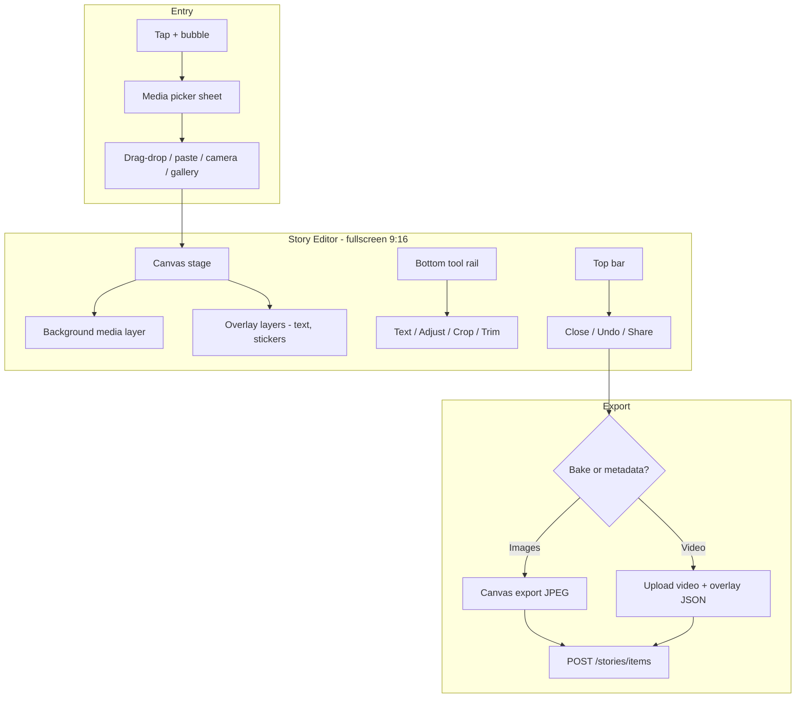

# Plan: Modern Story Editor (Create Flow)

Modern, Instagram/CapCut-style story creation: drag/drop media, gesture-based editing (pan, pinch, rotate), interactive text overlays, and clean fullscreen UI.

**Related:** [PLAN_STORIES.md](./PLAN_STORIES.md) (feed, viewer, backend) · [PLAN_STORY_EDITOR_CANVAS_COMPOSITOR.md](./PLAN_STORY_EDITOR_CANVAS_COMPOSITOR.md) (canvas stage / WYSIWYG perf)

---

## Current state

| Step | What exists | Gap |
|------|-------------|-----|
| **Pick media** | `StoryCreateSheet` — hidden file inputs for photo/video | No drag-drop, paste, multi-select, or camera shortcut |
| **Edit** | `StoryEditor` — fullscreen canvas, gestures, layers | — |
| **Overlay** | `StoryTextLayers` + `StoryTextStyleSheet` on canvas | — |
| **Publish** | Upload raw file + `{ position, theme }` JSON | Media transforms not saved; viewer can't replay edits |

**Existing building blocks:**

| Area | Location |
|------|----------|
| Crop UI | `AvatarCropModal.tsx` + `react-easy-crop` |
| Pinch/zoom viewer | `FullscreenImageViewer.tsx` + `react-zoom-pan-pinch` |
| Drag-drop | `AvatarUpload.tsx`, `MessageInput.tsx` |
| Canvas export | `html2canvas`, `dom-to-image`, `utils/cropUtils.ts` |
| Overlay JSON | `UserStoryItem.overlayStyle` (Prisma `Json`) |
| Video pipeline | `prepareChatVideoForSend` |
| Viewer | `MediaStorySlide.tsx` |

---

## Target UX



### Layout (mobile-first)

- Fullscreen black canvas, **9:16 safe area** centered (blur letterbox outside on desktop)
- **Top:** X (discard), undo/redo, "Your story" title
- **Center:** interactive stage only — gestures live here
- **Bottom:** horizontal tool icons (no form panels blocking preview)
- **Contextual sub-bar** slides up when a tool is active (text styles, filters, trim scrubber)
- **Primary CTA:** floating "Share" pill bottom-right (CapCut/IG pattern), not two big Cancel/Publish buttons

---

## Gesture spec (editor stage)

Single gesture controller (`@use-gesture/react` recommended, or extend `react-zoom-pan-pinch` for media-only).

| Gesture | Target | Behavior |
|---------|--------|----------|
| **1-finger drag** | Selected layer / media | Move |
| **1-finger drag** | Background (no selection) | Pan media |
| **Pinch** | Media or selected layer | Scale |
| **Two-finger rotate** | Media or selected layer | Rotate |
| **Double-tap** | Media | Reset transform (fit cover) |
| **Double-tap** | Text layer | Edit inline |
| **Tap empty area** | — | Deselect all |
| **Tap layer** | Text/sticker | Select + show handles |
| **Long-press** | Layer | Context menu (delete, duplicate) |
| **Pinch on corner handle** | Selected layer | Scale (alternative to free pinch) |

**Conflict rules:**

- Keyboard open for text edit → disable stage gestures
- `activeTool === 'draw'` → single-finger draws, not pan
- Pinch always wins over pan when 2+ pointers

---

## Tool rail (phased)

### Phase 1 — Core (ship first)

| Tool | Behavior |
|------|----------|
| **Media fit** | Pan / pinch / rotate background to fill 9:16 |
| **Text** | Tap "Aa" → inline editor → draggable text with scale/rotate handles |
| **Text styles** | 4–6 presets (classic white, black box, gradient, outline, neon) + alignment |
| **Undo / redo** | Stack of editor actions (max ~20) |
| **Discard / Share** | Confirm on discard if dirty |

### Phase 2 — Polish

| Tool | Behavior |
|------|----------|
| **Crop** | Toggle crop mode: fixed 9:16, reuse `react-easy-crop` |
| **Adjust** | Brightness, contrast, saturation sliders (CSS filters on preview; bake on export) |
| **Filters** | 6 preset LUT-style CSS filters |
| **Multi-segment queue** | "+ Add" → stack slides, swipe between before publish |
| **Video trim** | Scrub start/end (reuse `prepareChatVideoForSend` pipeline) |

### Phase 3 — Social extras (optional)

| Tool | Behavior |
|------|----------|
| **Stickers** | Emoji + padel icons (ball, racket, trophy) |
| **Mention / link** | @user or game link chip (Padel-specific) |
| **Draw** | Freehand on canvas layer |
| **Music** | Video audio track picker (heavy; defer) |

---

## Architecture

### Folder layout

```
Frontend/src/components/stories/create/
  StoryCreateSheet.tsx          # addendum: drop zone + camera
  StoryEditor.tsx               # replaces StoryComposer shell
  StoryEditorialCanvas.tsx      # 9:16 stage + gesture host
  StoryMediaLayer.tsx           # image/video background transforms
  StoryTextLayer.tsx            # draggable text overlays
  StoryToolRail.tsx             # bottom icons
  StoryTextStyleSheet.tsx       # contextual style picker
  StoryAdjustPanel.tsx
  StoryCropMode.tsx
  StoryVideoTrimPanel.tsx
  StoryExportBar.tsx            # Share / Add to story
  hooks/
    useStoryEditorState.ts      # layers, selection, dirty, undo
    useStoryGestures.ts         # unified pointer logic
    useStoryExport.ts           # canvas bake + upload
  types/
    storyEditor.types.ts
  utils/
    storyCanvasExport.ts        # draw media + overlays → Blob
    storyTransform.ts           # matrix ↔ CSS
```

### Editor state model

```ts
type StorySlide = {
  id: string;
  media: { file: File; type: 'IMAGE' | 'VIDEO'; previewUrl: string };
  mediaTransform: { x: number; y: number; scale: number; rotation: number };
  mediaAdjust: { brightness: number; contrast: number; saturation: number; filterId?: string };
  layers: StoryLayer[];  // ordered bottom → top
};

type StoryLayer =
  | { id: string; type: 'text'; text: string; transform: Transform2D; style: TextStylePreset }
  | { id: string; type: 'sticker'; emoji: string; transform: Transform2D };

type Transform2D = { x: number; y: number; scale: number; rotation: number };
```

`useStoryEditorState` holds `slides[]`, `activeSlideIndex`, `selectedLayerId`, undo/redo stacks.

### Overlay persistence (hybrid)

| Media type | Uploaded | Stored in `overlayStyle` |
|------------|----------|--------------------------|
| **Image** | **Baked JPEG** (media + overlays rasterized at 1080×1920) | Optional `{ version: 2, baked: true }` |
| **Video** | Original transcoded video | Full layer JSON for viewer rendering |

**Why:** baking text into images guarantees WYSIWYG (thumbnails, push previews). Video can't be cheaply rebaked client-side — keep JSON overlays.

**Schema (backward compatible):**

```ts
type OverlayStyleV2 = {
  version: 2;
  canvas: { width: 1080; height: 1920 };
  mediaTransform?: Transform2D;
  layers?: StoryLayer[];  // video only
};
```

Viewer: `MediaStorySlide` checks `version` — v1 uses current position/theme; v2 renders layers with absolute transforms.

---

## Implementation phases

### Phase 0 — Entry & drop (1–2 days)

**`StoryCreateSheet`**

- Full-width **drop zone** (reuse `AvatarUpload` / `MessageInput` drag handlers)
- Support **paste** (Ctrl+V / clipboard images)
- **Multi-image select** (`multiple` on input) → open editor with slide queue
- Desktop: dashed border + "Drop photos here"
- Mobile: keep camera/gallery buttons; optional `@capacitor/camera` shortcut
- Validate: images ≤10 MB, video ≤60s / existing transcode limits

**Files:** `StoryCreateSheet.tsx`, shared `useMediaDropZone.ts`

---

### Phase 1 — Editor shell & media gestures (3–4 days)

**Replace `StoryComposer` with `StoryEditor`**

- Fullscreen `FullScreenDialog`, black background
- Fixed **9:16 viewport** (`aspect-[9/16] max-h-[100dvh]`)
- **`StoryMediaLayer`:** image or muted video preview
- Gestures via `useStoryGestures`: pan, pinch scale, 2-finger rotate, double-tap reset
- **`StoryToolRail`:** minimal icons (Text, Adjust*, Crop*, Share)
- **`StoryExportBar`:** Share pill + close

**Export v1:** apply **media transform bake** for 9:16 JPEG (no text yet).

**Files:** new editor components; deprecate form layout in `StoryComposer.tsx`.

---

### Phase 2 — Text overlays (2–3 days)

**Replace `StoryOverlayTextEditor` form with canvas text**

- Tap "Aa" → create text layer centered, focus inline editor
- On blur → layer draggable with selection handles (corner scale, top rotate handle)
- **`StoryTextStyleSheet`:** horizontal scroll of style presets
- Publish: bake text into image; store v2 metadata for video

**Viewer:** update `MediaStorySlide` for v2 layers + transforms

**Backend:** no schema change (`overlayStyle` is already `Json`)

---

### Phase 3 — Undo, adjust, crop (2–3 days)

- **Undo/redo** in `useStoryEditorState` (immutable patches)
- **Adjust panel:** sliders → CSS `filter` on preview; apply in `storyCanvasExport.ts`
- **Crop mode:** embed `react-easy-crop`; on confirm, replace media blob with cropped result
- **Video trim panel:** range slider; pass trim range into `prepareChatVideoForSend`

---

### Phase 4 — Multi-slide queue (2 days)

- Thumbnail strip at bottom (above tool rail)
- Swipe horizontally between slides in editor
- Publish all slides sequentially with shared `clientUploadId` prefix
- "+ Add" opens picker again, appends slide

---

### Phase 5 — Stickers & draw (optional)

- Sticker picker (`emoji-mart` already in deps)
- Draw layer: offscreen canvas, export as PNG layer in bake

---

## Key utilities

### `storyCanvasExport.ts`

```ts
async function exportStoryImage(slide: StorySlide, size = { w: 1080, h: 1920 }): Promise<Blob> {
  const canvas = document.createElement('canvas');
  // 1. Draw background (black)
  // 2. Draw media with transform + filters
  // 3. Draw text layers (measure, wrap, rotation)
  // 4. canvas.toBlob('image/jpeg', 0.92)
}
```

Use canvas API directly (more reliable than `html2canvas` for transforms).

### `useStoryGestures.ts`

- Track pointer IDs in a `Map`
- 1 pointer → drag selected layer OR pan media
- 2 pointers → centroid distance delta (scale) + angle delta (rotate)
- Snap rotation to 0°/90° when within 3°

---

## Backend changes

| Change | Needed? |
|--------|---------|
| Prisma schema | No |
| `overlayStyle` validation | Optional: accept v2 JSON |
| Image upload | No — receives baked JPEG |
| Video upload | No — receives overlay JSON |
| Feed service | No — passes through `overlayStyle` |

Optional: per-layer text limit instead of single `MAX_OVERLAY_TEXT_LENGTH`.

---

## Dependencies

| Package | Purpose | In project? |
|---------|---------|-------------|
| `@use-gesture/react` | Unified gestures | Add (~3kb) |
| `react-easy-crop` | Crop sub-mode | Yes |
| Canvas export | Bake images | Native + `cropUtils` |

Avoid heavy editor SDKs — scope fits a custom canvas editor.

---

## Testing

**Gestures (touch + mouse):**

- Pan media without drift after release
- Pinch zoom centers on pinch centroid
- Two-finger rotate on iOS Safari + Android Chrome
- Text layer gestures don't move media when selected

**Export:**

- Baked image matches preview
- Thumbnail in rail matches story content
- Video story: overlay position stable on different screen sizes

**Edge cases:**

- Very tall/wide photos → default "cover" fit
- EXIF orientation (backend `sharp.rotate()`; client preview via `createImageBitmap` or canvas)
- Low memory: revoke object URLs on slide delete
- Offline: disable Share

**Automated:**

- Unit tests for `storyTransform.ts`, `storyCanvasExport.ts`
- Snapshot tests for overlayStyle v1/v2 in `MediaStorySlide`

---

## Sprint order

| Sprint | Deliverable |
|--------|-------------|
| **S1** | Drop zone + paste + `StoryEditor` shell + media pan/pinch/rotate + image bake export |
| **S2** | Interactive text layers + style presets + viewer v2 rendering |
| **S3** | Undo/redo + adjust/filters + crop mode |
| **S4** | Multi-slide queue + video trim + video overlay JSON |
| **S5** | Stickers, polish, haptics, reduced-motion |

---

## Reuse vs build

| Reuse | Build new |
|-------|-----------|
| `AvatarUpload` drag-drop | `StoryEditor` canvas + layer system |
| `AvatarCropModal` / `react-easy-crop` | `useStoryGestures` |
| `prepareChatVideoForSend` | `storyCanvasExport.ts` |
| `FullScreenDialog`, tool rail UI | v2 schema + viewer rendering |
| `overlayStyle` JSON field | `StoryTextLayer`, `StoryToolRail` |

---

## Out of scope (this plan)

- Replies, reactions, highlights
- Music library / licensed tracks
- AR filters / face tracking
- Server-side video compositing
- Post game gallery photo to story directly (separate feature)

---

## Orchestrator status

**Started:** 2026-05-24  
**Completed:** 2026-05-24  
**Team:** 4 parallel dev agents + 1 QA agent

| Agent | Role | Scope | Status |
|-------|------|-------|--------|
| **A1** | Frontend Lead | Phase 0 + S1: types, drop zone, editor shell, gestures, media layer, canvas export | ✅ complete |
| **A2** | Frontend Dev | S2: text layers, style presets, viewer v2 | ✅ complete |
| **A3** | Frontend Dev | S3 + S4: undo/redo, adjust/crop/filters, multi-slide queue, video trim | ✅ complete |
| **A4** | Frontend Dev | S5: stickers, haptics, reduced-motion polish | ✅ complete |
| **QA** | QA Engineer | Unit tests (`storyTransform`, `storyCanvasExport`), viewer v2 snapshots, lint | ✅ complete |

### Global sprint checklist

| Sprint | Deliverable | Status |
|--------|-------------|--------|
| **S1** | Drop zone + paste + `StoryEditor` shell + media pan/pinch/rotate + image bake export | ✅ |
| **S2** | Interactive text layers + style presets + viewer v2 rendering | ✅ |
| **S3** | Undo/redo + adjust/filters + crop mode | ✅ |
| **S4** | Multi-slide queue + video trim + video overlay JSON | ✅ |
| **S5** | Stickers, polish, haptics, reduced-motion | ✅ |

### Phase checklist

| Phase | Description | Owner | Status |
|-------|-------------|-------|--------|
| 0 | Entry & drop (`StoryCreateSheet`, `useMediaDropZone`) | A1 | ✅ |
| 1 | Editor shell & media gestures | A1 | ✅ |
| 2 | Text overlays + viewer v2 | A2 | ✅ |
| 3 | Undo, adjust, crop | A3 | ✅ |
| 4 | Multi-slide queue + video trim | A3 | ✅ |
| 5 | Stickers & draw | A4 | ✅ |
| QA | Automated tests + lint | QA | ✅ |
