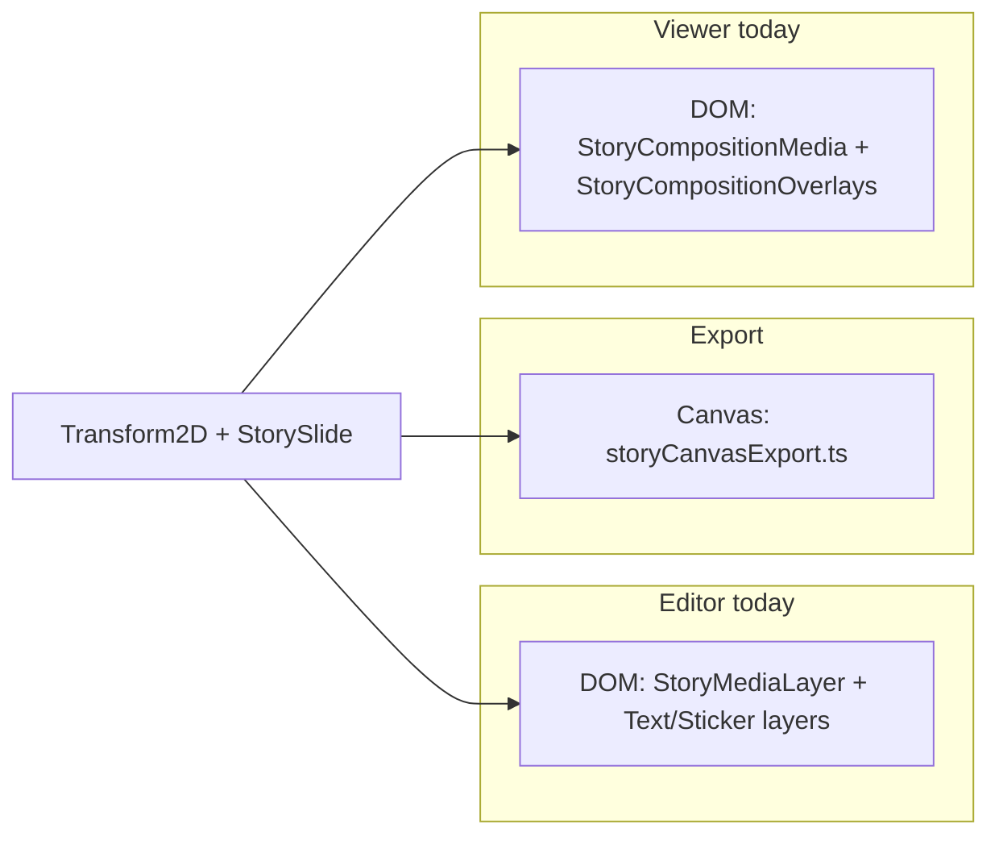
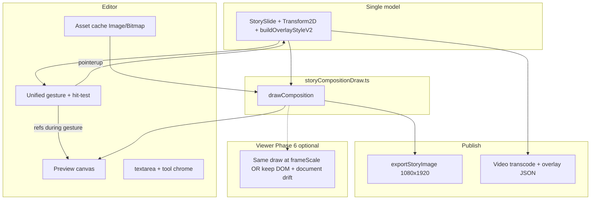

# Story Editor — Canvas Compositor (Best-Win Architecture)

## Orchestrator status

| Step | Owner | Status |
|------|-------|--------|
| Phase 0 — Draw module + text layout | Dev-A | ✅ complete |
| Phase 1 — Canvas preview + media | Dev-B | ✅ complete (default; `?canvasStage=0` legacy) |
| Phase 2 — Layers on canvas | Dev-C | ✅ complete |
| Phase 3 — Video hybrid | Dev-D | ✅ complete (underlay + layer canvas) |
| Phase 4 — Remove legacy DOM | Dev-D | ✅ default canvas (`?canvasStage=0` for legacy) |
| Phase 5 — Polish | Dev-E | ✅ selection chrome on canvas |
| Phase 6 — Viewer parity | Dev-E | ✅ StoryCompositionCanvasOverlays |
| Integration + QA | QA | ✅ 44 tests pass; TS clean on canvas modules |

**Started:** 2026-05-25 · **Subagents:** usage-limited; orchestrator implemented Phases 0–1, 3 directly

---

Replace the DOM/CSS **editor stage** with a **canvas compositor** as the single source of truth for preview and export. DOM stays only where canvas is weak (text keyboard, tool chrome, optional video decode).

**Related:** [`PLAN_STORY_EDITOR.md`](PLAN_STORY_EDITOR.md), [`PLAN_STORY_EDITOR_UIUX.md`](PLAN_STORY_EDITOR_UIUX.md), [`STORY_EDITOR_QA_CHECKLIST.md`](STORY_EDITOR_QA_CHECKLIST.md).

**Scope note:** Undo batching and interaction modes are already shipped ([`UNDO_SCOPE.md`](../Frontend/src/components/stories/create/hooks/UNDO_SCOPE.md), UIUX Phases 1–4). This plan targets **render/gesture hot path** and **WYSIWYG parity**, not redoing undo or bottom sheet layout.

---

## Current architecture (three renderers)



| Surface | Media | Overlays | Notes |
|---------|-------|----------|-------|
| **Editor** | DOM + `transformToCss` / `mediaWrapperStyle` | DOM + `transformToCss` | Re-renders on every gesture frame |
| **Export (image)** | Canvas `drawMediaLayer` | Canvas `drawTextLayer` / `drawStickerOnCanvas` | Baked JPEG; `buildOverlayStyleV2(..., baked: true)` |
| **Export (video)** | Transcoded file (trim in `prepareChatVideoForSend`) | JSON in `overlayStyle` only | Export frame via `loadVideoFrame` at t=0, not trim range |
| **Viewer (baked image)** | Flat JPEG | N/A | Layers rasterized at publish |
| **Viewer (video + v2)** | `StoryCompositionMedia` + CSS filters | `StoryCompositionOverlays` + `getTextStyleRender` (DOM) | `shouldUseStoryComposition()` when non-baked video |

Canvas compositor primarily fixes **editor ↔ export**. **Viewer parity** is a separate phase (see below).

---

## Problem today

### Hot path (main pain)

Gesture frames still reconcile much of `StoryEditor`:

| Target | API during drag | History |
|--------|-----------------|---------|
| Media | `setMediaTransform` → **`setSlides` every frame** | `beginTransaction` / `commitTransaction` |
| Stickers | `updateLayerTransform` → **`mutateLive`** | Same |
| Text transform | `setTextLayer` → **`setSlides` every frame** (not `mutateLive`) | Same |

Undo is batched correctly; **React + DOM/CSS repaint** is not.

Additional UX issues:

- Stickers: `transition-[transform] duration-150` on `StoryStickerLayer` fights live drag
- `snapRotation` during move (pinch + rotate handle)
- Tiny DOM handles; media uses `@use-gesture/react`, layers use `useLayerTransformHandles`
- Split gesture implementations

### WYSIWYG gaps (must fix in draw module)

| Gap | Editor / viewer | Export canvas |
|-----|-----------------|---------------|
| **Text wrap** | `max-w` ~280px, `whitespace-pre-wrap`, `\n` in textarea | `drawCanvasTextWithPreset` → single-line `fillText`, no wrap |
| **Text presets** | Tailwind via `getTextStyleRender` (viewer) | Canvas presets in `storyTextStyles.ts` |
| **Position math** | `transformToCss` (canvas px × stageScale) | Canvas translate in 1080×1920 space |
| **Viewer overlays** | `layerTransformToPercentStyle` (percent + scale) | Same `Transform2D`, different CSS |

Filter CSS vs canvas: covered by `storyCanvasExport.test.ts` (`mediaAdjustToCanvasFilter` === CSS).

---

## Goal

**One composition model (1080×1920), one draw pipeline, multiple outputs:**

| Output | Resolution | When |
|--------|------------|------|
| Editor preview | `stageWidth × stageHeight × devicePixelRatio` | During edit |
| Share (image) | 1080×1920 JPEG | Publish |
| Share (video) | MP4 + `overlayStyle` JSON | Publish |
| Viewer (optional Phase 6) | `frameScale` in `StoryCompositionFrame` | Playback |

Gestures mutate **`liveSlideRef`**; **one `requestAnimationFrame` redraw**; React **`setSlides` on pointer up** (keep `useEditorTransaction`).

Also align **`setTextLayer` / `setMediaTransform`** with `mutateLive` + ref pattern (or skip React entirely during gesture once canvas owns preview).

---

## Target architecture



---

## `StoryCompositionEngine`

### 1. Shared draw module (foundation)

Extract from `Frontend/src/components/stories/create/utils/storyCanvasExport.ts` → **`storyCompositionDraw.ts`**:

- **`drawComposition(ctx, slide, assets, options)`** — black fill, media, layers bottom → top
- Export (today, some private): `drawMediaLayer`, `drawTextLayer`, `drawStickerOnCanvas`
- Keep **`getMediaLayerDrawParams`**, **`getTextLayerDrawParams`**, **`getStickerLayerDrawParams`** as the only transform → matrix mapping
- **`exportStoryImage`** remains a thin facade: load assets → `drawComposition` → `toBlob`

**Publish metadata:** use **`buildOverlayStyleV2(slide)`** (not a separate helper name). Persists `sourceWidth` / `sourceHeight` when known — required for viewer composition.

**Retire from editor stage only:** `transformToCss` on layers. **Keep** for textarea positioning, hybrid video underlay, and viewer until Phase 6.

### 2. Text layout subsystem (Phase 0 blocker)

Before canvas UI, add shared layout used by draw + hit-test + tests:

- Wrap at **`STORY_TEXT_MAX_WIDTH_CANVAS_PX` (280)** — match `storyCompositionLayout.ts` / viewer `textMaxWidthPx`
- Support **`\n`** and multi-line metrics (line height, per-line width)
- **`layoutCanvasText(...)`** → lines + bounding box for `drawTextLayer` and hit-test
- Golden tests: multi-line string editor fixture vs export bitmap (or draw params bbox)

Do not use single-line `measureText` on full string for hit-test.

### 3. Asset cache

Per slide / `previewUrl`:

- Decode **`HTMLImageElement`** or **`ImageBitmap`** once
- Invalidate on **crop replace**, media swap, blob URL change
- **Never** `loadVideoFrame` per rAF in editor; video uses hybrid underlay
- Call **`ensureSlideNaturalDimensions`** before export (existing `storySlideNaturalSize.ts`)

### 4. Preview canvas sizing

```text
previewScale = stageWidth / STORY_CANVAS_WIDTH
// Prefer: set canvas bitmap to stageW×stageH×DPR, then:
ctx.setTransform(previewScale * dpr, 0, 0, previewScale * dpr, 0, 0)
// Draw in logical 1080×1920 space (matches get*DrawParams)
```

`StoryEditorialCanvas` hosts the canvas; `onStageMeasure` still drives `stageScale`.

### 5. Unified gesture + hit-test

Extend **`@use-gesture/react`** (already on media) to one controller:

| Pointer state | Action |
|---------------|--------|
| Hit selected layer | Drag / pinch scale / pinch rotate |
| Hit unselected layer | Select + drag |
| Hit media (no layer) | Pan / pinch / rotate `mediaTransform` |
| Hit empty | Deselect |

**Editor mode gating** (`resolveEditorMode.ts`):

| Mode | Stage gestures |
|------|----------------|
| `IDLE` | Media + tap-to-select layer |
| `LAYER_SELECTED` | Selected layer only; media off (today) |
| `TOOL_ACTIVE` (adjust, etc.) | Off |
| `EDITING_TEXT` | Off; DOM textarea only |
| `CROP` / `TRIM` | Off; sub-screen (`StoryCropMode`, trim panel) |

**Slide swipe** (`StoryEditor` touch handlers): disabled while pinching/dragging (reuse gesture-active signal).

**Rotation:** `snapRotation` on **pointer up / pinch end only**, not during drag.

Corner handles: optional canvas-drawn chrome; pinch is primary.

### 6. DOM only where canvas loses

| Feature | Approach |
|---------|----------|
| **Text typing** | Floating `<textarea>` at screen coords from canvas transform; blur → commit + redraw |
| **Video preview** | Hybrid underlay (recommended) |
| **Crop** | `react-easy-crop` on file; clears asset cache + `defaultTransforms` |
| **Trim / adjust / stickers** | Existing `StoryEditorBottomSheet` |

### 7. Video strategy

| Option | Description | Tradeoff |
|--------|-------------|----------|
| **A — Hybrid (ship first)** | `<video>` under canvas; canvas draws **layers only** (or full comp skipping video blit) | Smooth playback; sync `mediaTransform` from `liveSlideRef` to `mediaWrapperStyle` on underlay |
| **B — Full compositor** | `drawImage(video)` every rAF | Perfect WYSIWYG; CPU/battery cost |
| **C — Static frame** | Poster/frame while composing | Simple; no motion in editor |

**Recommended:** A in editor; B only at image export via existing **`loadVideoFrame`**; trim applied in **`prepareChatVideoForSend`**, not in export frame grab.

**Adjust on hybrid:** document whether filters stay CSS on `<video>` only, or layers also see filter — avoid drift vs export `ctx.filter`.

### 8. Text presets

Stay **`drawCanvasTextWithPreset`** (outline, gradient, neon, black box). No **`Konva.Text`**. Optional: `Konva.Shape` + `sceneFunc` wrapping same draw.

### 9. State & undo

Keep **`useStoryEditorState`** + **`useEditorTransaction`**:

- `pointerdown` → `beginTransaction`
- gesture → `liveSlideRef` + schedule rAF → `drawComposition`
- `pointerup` → `setSlides` + `commitTransaction`

Fix **`setTextLayer`** / **`setMediaTransform`** to avoid per-frame `setSlides` if any DOM path remains during migration.

### 10. Export & publish

| Media | Pipeline |
|-------|----------|
| **Image** | `exportStoryImage` → upload JPEG; `overlayStyle: { ...buildOverlayStyleV2(slide), baked: true }` |
| **Video** | `prepareChatVideoForSend` + upload; `overlayStyle: buildOverlayStyleV2(slide)` (layers not baked) |

---

## Viewer parity strategy (pick one in Phase 6)

| Option | Effort | Notes |
|--------|--------|-------|
| **1 — DOM viewer only** | None | Accept video overlay drift; criteria = image bake + editor |
| **2 — Shared draw in `StoryCompositionFrame`** | ~1 week | `drawComposition` at `frameScale`; replace `StoryCompositionOverlays` DOM text |
| **3 — Raster overlay at publish** | Schema | Extra PNG layer for video — out of scope unless product asks |

**Recommendation:** **2** if video stories must match editor; otherwise **1** for initial ship.

Relevant today: `MediaStorySlide.tsx`, `StoryCompositionOverlays.tsx`, `mediaStoryOverlay.ts` (`shouldUseStoryComposition`, `layerTransformToPercentStyle`).

---

## Performance model

| Current | Canvas compositor |
|---------|-------------------|
| React reconcile @ 60–120 Hz during drag | React idle during gesture |
| Sticker CSS `transition` on transform | No transition on bitmap |
| DOM `filter` + canvas export | One `ctx.filter` in draw |
| Reload assets implicitly | Cached decode per slide |
| 6px handles | Canvas hit-test + pinch |

Preview at **stage size**, not 1080×1920; full res on Share only.

**Mobile:** `touch-action: none` on stage (already); consider `desynchronized: true` on context; watch iOS WebView canvas memory.

---

## Optional Phase 0.5 — DOM imperative (de-risk)

~2–3 days before full canvas:

- During gesture: update layer/media **`style.transform`** from ref; no `setSlides`
- Commit on pointer up
- Remove sticker `transition-[transform]` while dragging

Proves perf win without compositor; throw away when Phase 1 lands.

---

## Implementation phases

### Phase 0 — Draw module + text layout (2–3 days)

- [x] Extract **`storyCompositionDraw.ts`**; export `drawComposition` + layer draw fns
- [x] Implement **`layoutCanvasText`** (wrap 280px, `\n`, metrics)
- [x] Wire **`drawTextLayer`** through layout
- [x] Extend **`storyCanvasExport.test.ts`** — layout bbox, draw params, filter parity
- [x] **`ensureSlideNaturalDimensions`** covered in export tests
- [x] No UI change

### Phase 1 — Canvas preview + media (3–5 days)

- [x] **`StoryCanvasStage`** + rAF + asset cache
- [x] Image slides: unified gestures on refs; commit on pointer up
- [x] Dev flag: e.g. query `?canvasStage=1` or env toggle
- [x] Align **`setMediaTransform`** with live ref

### Phase 2 — Layers on canvas (3–4 days)

- [x] Text/stickers via `drawComposition`
- [x] Hit-test using layout metrics
- [x] DOM textarea for `EDITING_TEXT`
- [x] Unified pinch on selected layer
- [x] Align **`setTextLayer`** with live ref

### Phase 3 — Video hybrid (2–3 days)

- [x] Video underlay + layer canvas (or full comp with A policy)
- [x] Transform/filter sync documented and tested
- [x] Trim panel unchanged

### Phase 4 — Remove legacy editor DOM (1–2 days)

- [x] Canvas compositor default; legacy via `?canvasStage=0`
- [x] Keep **`storyTransform.ts`**, **`storyCompositionLayout.ts`** for viewer/hybrid video

### Phase 5 — Polish (optional)

- [x] Selection handles on canvas
- [ ] Dev “export preview at 1080×1920” (UIUX Phase 6 idea)
- [x] Accessibility: textarea remains primary input

### Phase 6 — Viewer parity (optional, +1 week)

- [x] **`StoryCompositionCanvasOverlays`** via shared draw
- [ ] Video v2 composition matches editor in QA checklist

**Estimate:**

- Editor + export only: **~2–3 weeks**
- + Text layout in Phase 0: included above
- + Viewer Phase 6: **+~1 week**

---

## What not to do

1. **Konva for all pixels** — fights preset canvas text
2. **1080×1920 preview redraw every frame on phone**
3. **Pure canvas live video** without accepting battery cost
4. **DOM editor layers “for speed”** without shared draw
5. **`react-zoom-pan-pinch` for whole editor** — viewers only
6. **Delete `transformToCss` / `storyCompositionLayout` globally** — viewer still needs them until Phase 6

---

## Comparison to lighter fixes

| Approach | Effort | Ceiling |
|----------|--------|---------|
| Phase 0.5 DOM imperative | 2–3 days | Snappier; still dual renderer |
| DOM + `React.memo` | Days | Less lag; dual renderer |
| Unified `@use-gesture` on DOM | ~1 week | IG-like; dual renderer |
| **Canvas compositor (this plan)** | 2–3 weeks (+ viewer optional) | Best editor/export; viewer Phase 6 |
| Konva scene graph | 2–4 weeks | OK if shapes wrap existing draw |

**Why best-win here:** export already canvas at 1080×1920 — **promote export draw to editor**, don’t add a fourth renderer.

---

## Acceptance criteria

### Editor + image publish (required)

- [x] No React `setSlides` during gesture; canvas updates at rAF
- [x] `snapRotation` only on release
- [x] No `transition-[transform]` on draggable layers during gesture (canvas path)
- [x] Single-line and **multi-line `\n` text** within tolerance vs export (after Phase 0 layout)
- [x] Stickers and media transforms match export
- [x] Adjust presets match export (`storyCanvasExport.test.ts` parity)
- [x] Crop replace invalidates cache; cover scale recomputed
- [x] Undo: one step per gesture ([`UNDO_SCOPE.md`](../Frontend/src/components/stories/create/hooks/UNDO_SCOPE.md))
- [ ] QA checklist: canvas, text, stickers, adjust, publish image rows

### Video (required for Phase 3)

- [x] Smooth underlay **or** documented static-frame mode
- [x] `buildOverlayStyleV2` includes layers + `mediaTransform` / `sourceWidth` / `sourceHeight` when known

### Viewer (Phase 6 only)

- [x] Video story overlays via shared canvas draw (`StoryCompositionCanvasOverlays`)
- [ ] Manual QA: overlay parity vs editor within tolerance

~~Layer centers ≤ ~1 px~~ — use only after multi-line text layout ships.

---

## Key files

| File | Role |
|------|------|
| `create/utils/storyCanvasExport.ts` | Export today → split into compositor |
| `create/utils/storyCompositionDraw.ts` | **New** shared draw |
| `create/utils/storyTextStyles.ts` | `drawCanvasTextWithPreset`; extend with layout |
| `create/utils/storyCompositionLayout.ts` | Viewer frame scale, `mediaWrapperStyle`; keep for viewer |
| `create/utils/storyAdjustFilters.ts` | CSS + canvas filter strings |
| `create/utils/storySlideNaturalSize.ts` | `ensureSlideNaturalDimensions` before export |
| `create/types/storyEditor.types.ts` | `buildOverlayStyleV2`, `OverlayStyleV2` |
| `create/StoryEditorialCanvas.tsx` | Stage shell → hosts canvas |
| `create/StoryEditor.tsx` | Orchestrator, swipe, modes |
| `create/utils/resolveEditorMode.ts` | Gesture gating |
| `create/hooks/useStoryGestures.ts` | Merge into unified controller |
| `create/hooks/useLayerTransformHandles.ts` | **Retire** Phase 4 |
| `create/hooks/useStoryEditorState.ts` | `setTextLayer`, `setMediaTransform`, transactions |
| `create/hooks/useStoryExport.ts` | Image bake vs video JSON |
| `slides/MediaStorySlide.tsx` | Viewer composition entry |
| `StoryCompositionOverlays.tsx` | Viewer overlay DOM → Phase 6 |
| `StoryCompositionMedia.tsx` | Viewer media |
| `slides/mediaStoryOverlay.ts` | `shouldUseStoryComposition`, percent styles |

---

## Suggested first PR

**Phase 0 only:** `storyCompositionDraw.ts` + `layoutCanvasText` + tests, zero UI change.

Then Phase 1 behind flag until [`STORY_EDITOR_QA_CHECKLIST.md`](STORY_EDITOR_QA_CHECKLIST.md) passes for image slides.
