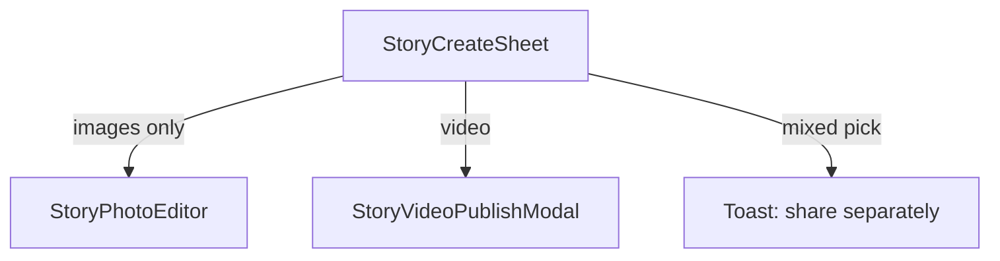

# Story create: photo editor rebuild + video publish (as-is)

Plan for stories in `Frontend/src/components/stories/create/`. **Videos** upload unchanged with preview + optional description only. **Photos** get a full UX-friendly editor (crop, filters, text, stickers, collage).

**Policy: no backward compatibility.** Delete old editor, overlay v1/v2, dual canvas paths, and composition viewer. Build new flows only. Do not ship v2→v3 readers, feature flags for legacy canvas, or “legacy items still compose.”

---

## 0. Product split (primary decision)

| | **Video story** | **Photo story** |
|---|-----------------|-----------------|
| **Intent** | Share a clip as captured | Compose: crop, filters, text, stickers, collage |
| **After pick** | Preview modal → optional description → Share | Full-screen **photo editor** |
| **Upload** | File as captured (chat prep, no user edits) | **Baked** 1080×1920 JPEG (pixels final) |
| **Server** | `messageType: VIDEO`, `caption?`, media URLs only | `messageType: IMAGE`, `caption?` — **no `overlayStyle`** |
| **Viewer** | `<video>` + poster only | `` only — **no recomposition** |

**Description** = story **caption** (`StoryCaptionField`, `STORY_CAPTION_MAX_CHARS`) — not overlay text from layers.

**Engineering focus:** photo manipulation (Konva, `drawScene`, collage). Video is a thin publish flow.

---

## 1. No backward compatibility

### What we do not do

| Do not | Why |
|--------|-----|
| `OverlayStyleV2` → v3 migration reader | Old JSON is dead |
| `isOverlayStyleV1` / `isOverlayStyleV2` in viewer | No runtime branches |
| `VITE_STORY_CANVAS_STAGE` dual path | One photo pipeline |
| “Legacy video with overlay still composes” | Viewer ignores `overlayStyle` |
| `baked` flag on overlay | Publish = pixels in `mediaUrl` only |
| Keep `StoryEditor` for gradual rollout | Replace with `StoryPhotoEditor` + `StoryVideoPublishModal` |

### Viewer contract (read path)

- **IMAGE:** full-bleed image from `mediaUrl`. Ignore `overlayStyle`, `overlayText` for layout (caption UI may still show `caption` field).
- **VIDEO:** `mediaUrl` + poster. Ignore `overlayStyle` entirely.

Existing DB rows may still contain `overlayStyle` JSON — **new code does not read it**. No client-side upgrade.

### Data / product note

Old image stories that relied on **dynamic** overlays (not baked into `mediaUrl`) will look **flat** after deploy. Old video stories lose on-screen text/stickers. Accept breakage or run a **one-time server bake job** (out of scope for frontend rewrite; not in-app compat).

---

## 2. Where we are today (to delete)

**Routing:** `StoryCreateSheet` → `StoryEditor` for all types — **replace**.

**Legacy stack to erase:**

- `OverlayStyleV1`, `OverlayStyleV2`, `buildOverlayStyleV2`, type guards
- `StoryMediaLayer`, `StoryCanvasStage`, `StoryCanvasStageEditor`, `useCanvasStageGestures`, `canvasStageFlag.ts`
- `mediaStoryOverlay.ts`, `MediaStoryOverlayV2`, `StoryCompositionCanvasOverlays`, v1 branches in `MediaStorySlide`
- Video editor: `StoryVideoTrimPanel`, `useStoryVideoDuration`, video branches in `useStoryExport` / `StoryEditor`
- Tests: `MediaStorySlide.v2.test.ts` — rewrite for new viewer or delete

**Reuse / port (not keep as-is):** `storyTransform`, text layout/styles, `StoryEditorialCanvas`, `StoryCaptionField`, `StoryCreateSheet`, chat `prepareChatVideoForSend`.

---

## 3. Video flow (no manipulation)

### 3.1 UX

1. User taps **Video** in `StoryCreateSheet`.
2. **`StoryVideoPublishModal`:** preview + optional description + Cancel / Share.
3. Share: `prepareChatVideoForSend` (no trim) → `uploadVideo` → `createItem` without `overlayStyle` / `overlayText`.

### 3.2 Upload as-is

Same as chat: `prepareChatVideoForSend` for codec/size + poster — no user-facing trim or overlays.

### 3.3 Reuse from GameChat

| Module | Use |
|--------|-----|
| [`ChatVideoBubble.tsx`](Frontend/src/components/MessageItem/ChatVideoBubble.tsx) | Extract **`StoryVideoPreview`** |
| [`FullscreenVideoViewer.tsx`](Frontend/src/components/FullscreenVideoViewer.tsx) | Optional expand preview |
| [`prepareChatVideoForSend`](Frontend/src/services/chat/chatVideoTranscode.ts) | Pre-upload |
| [`useStoryExport`](Frontend/src/components/stories/create/hooks/useStoryExport.ts) | Replace with **`useStoryVideoPublish`** |

### 3.4 Entry routing



### 3.5 `useStoryVideoPublish`

`File` + optional `caption` → prep → upload → `createItem({ messageType: 'VIDEO', … })` — no overlay fields.

### 3.6 Edge cases

- Mixed photo+video pick: block.
- One video per publish.
- Multiple photos: multi-slide / collage in photo editor only.

---

## 4. Photo flow (`StoryPhotoEditor`)

Rebuild from scratch; do not extend `StoryEditor`.

### 4.1 In scope

- Multi-slide carousel.
- Pan, zoom, rotate, crop, adjust, LUT presets.
- Text, stickers, collage (`StoryDocument` v3).
- Konva preview + **`drawScene`** export → single JPEG per slide.
- Optional batch **caption** at publish.

### 4.2 Out of scope

- Any video path, trim mode, `layersOnly`, overlay JSON on upload.

### 4.3 UX

```
┌─────────────────────────────┐
│  ✕          ●○○○○      Share │
├─────────────────────────────┤
│      9:16 STAGE (full)      │
├─────────────────────────────┤
│  [Aa] [😀] [✨] [✂] …       │
└─────────────────────────────┘
```

Modes: navigate, transform (Konva `Transformer`), text edit, crop, adjust/filter. Collage in later phase.

---

## 5. Architecture (photo only)

### Stack

| Concern | Library |
|---------|---------|
| Stage | `react-konva` |
| Crop | `react-easy-crop` |
| Export | `drawScene` → OffscreenCanvas JPEG |
| State | Zustand or new `useStoryPhotoEditorState` |

No mediabunny story bake. No overlay payload on create.

### `StoryDocument` v3 (editor-internal only)

Used **only** inside `StoryPhotoEditor` until export. **Not** persisted to API (baked JPEG is the source of truth).

```ts
type StoryDocument = {
  version: 3;
  canvas: { width: 1080; height: 1920 };
  nodes: StoryNode[];
  backgroundId: string;
};

type StoryNode = MediaNode | TextNode | StickerNode | GroupNode;
// MediaNode.mediaType: 'IMAGE' only
```

`StorySession = { segments: StoryDocument[]; caption?: string }` for multi-slide edit session.

### Pipeline


Viewer never calls `drawScene` — only displays uploaded bitmap.

### Filters

LUT + adjust in `drawScene` / Konva only. Delete `FILTER_ID_CSS` dual path in `storyAdjustFilters.ts`.

---

## 6. Export & backend

| Media | Client sends | `overlayStyle` |
|-------|----------------|----------------|
| **Image** | Baked JPEG 1080×1920 | **omit / null** |
| **Video** | MP4 + poster | **omit / null** |

`caption` optional for both. Prisma `overlayStyle Json?` can remain on model; **new clients do not write it**.

No backend migration required to ship; old JSON is ignored.

---

## 7. Phased delivery

### Phase 1 — Video + viewer slash

- [ ] `StoryVideoPublishModal`, `StoryVideoPreview`, `useStoryVideoPublish`
- [ ] Route in `StoriesRail` / `StoryCreateSheet`; block mixed picks
- [ ] **Delete** composition viewer code; simplify `MediaStorySlide` to media + caption
- [ ] **Delete** `StoryEditor` video paths, trim UI, video export overlay payload

### Phase 2 — Photo editor (new)

- [ ] **`StoryPhotoEditor`** (new tree under `create/photo/`)
- [ ] **`useStoryPhotoPublish`** — bake JPEG only, no `overlayStyle`
- [ ] **Delete** `StoryEditor`, `StoryMediaLayer`, canvas stage files, `canvasStageFlag`
- [ ] **Delete** overlay types v1/v2 and all composition overlay components

### Phase 3 — Konva + quality

- [ ] Konva stage + `Transformer`, undo/redo
- [ ] LUT presets, collage layers, haptics

No `VITE_STORY_EDITOR_V3` flag — old path is removed in Phase 2, not toggled.

---

## 8. Delete checklist (single cutover per phase)

**Types:** `OverlayStyleV1`, `OverlayStyleV2`, `buildOverlayStyleV2`, `isOverlayStyleV*`, `baked`

**Editor:** `StoryEditor.tsx`, `StoryMediaLayer`, `StoryCanvasStage*`, `useCanvasStageGestures`, `canvasStageFlag`, `StoryVideoTrimPanel`, `useStoryVideoDuration`, `useStoryExport` (split into photo/video hooks)

**Viewer:** `mediaStoryOverlay.ts`, `MediaStoryOverlayV2`, `StoryCompositionCanvasOverlays`, `StoryCompositionOverlays` (if only used for dynamic overlays), composition branches in `MediaStorySlide`

**Tests:** rewrite `MediaStorySlide.v2.test.ts` → viewer shows plain media; photo editor tests only

**Keep:** `StoryCreateSheet`, `StoryCaptionField`, `StoryEditorialCanvas` (photo), `prepareChatVideoForSend`, transform/text utils ported into new modules

---

## 9. Testing

| Area | Assert |
|------|--------|
| `useStoryVideoPublish` | Payload has no `overlayStyle` |
| `useStoryPhotoPublish` | Payload has no `overlayStyle`; file is image/jpeg |
| `MediaStorySlide` | Renders `mediaUrl` only; no composition components mounted |
| `drawScene` / export | Output matches Konva preview dimensions |

---

## 10. Risks

| Risk | Mitigation |
|------|------------|
| Old stories look wrong | Product accepts; optional server bake later |
| User expects video editing | Copy in video modal |
| Large photos | Downscale before edit (~2160 long edge) |

---

## 11. Bottom line

- **Erase** overlay v1/v2, dual editor, composition viewer, and unified `StoryEditor`.
- **Video:** preview modal + caption + upload; viewer plays file as-is.
- **Photo:** new `StoryPhotoEditor` → baked JPEG; viewer shows `mediaUrl` only.
- **No** migration readers, **no** feature flags for legacy canvas, **no** `overlayStyle` on new creates.
