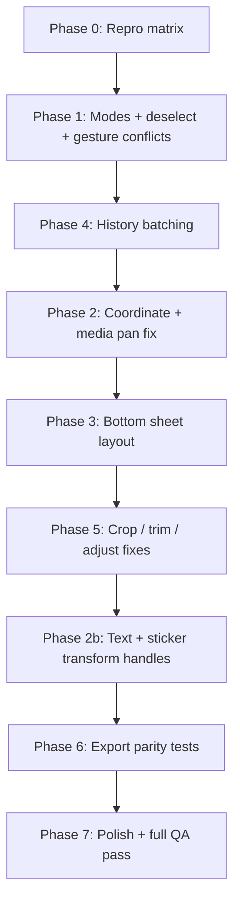

# StoryEditor UI/UX Fix Plan

## Orchestrator Progress

| Phase | Status | Owner |
|-------|--------|-------|
| 0 — Repro matrix | **Done** | Delta |
| 1 — Interaction model | **Done** | Alpha |
| 2 — Gesture & coordinates | **Done** | Beta |
| 3 — Bottom chrome & layout | **Done** | Gamma |
| 4 — State & undo | **Done** | Alpha |
| 5 — Tool-specific fixes | **Done** | Gamma |
| 6 — Export / preview parity | **Done** | Delta |
| 7 — Polish & accessibility | **Done** | Delta |

**Verification (orchestrator):** lint clean · unit tests pass · device QA manual ([`STORY_EDITOR_QA_CHECKLIST.md`](STORY_EDITOR_QA_CHECKLIST.md))

**Undo scope:** [`Frontend/src/components/stories/create/hooks/UNDO_SCOPE.md`](../Frontend/src/components/stories/create/hooks/UNDO_SCOPE.md)

The editor has the right feature set but the **interaction model is inconsistent** — gestures fight each other, layers are hard to deselect, undo is broken for some actions, and bottom panels eat the canvas on mobile.

---

## Phase 0 — Repro matrix (do this first) [x]

Build a short checklist and run it on **iPhone Safari**, **Android Chrome**, and **desktop**. Every fix should map to a row here.

See [`STORY_EDITOR_QA_CHECKLIST.md`](STORY_EDITOR_QA_CHECKLIST.md).

---

## Phase 1 — Interaction model (highest impact)

The editor mixes three modes without clear rules: **canvas**, **layer selected**, **tool active** (crop/trim/adjust/text/sticker).

- [x] **1.1** Define explicit modes
- [x] **1.2** Fix deselect (transparent hit layer)
- [x] **1.3** Resolve gesture conflicts (slide swipe, media pinch, double-tap)
- [x] **1.4** Text tool behavior (toggle, empty layer cleanup)

### 1.1 Define explicit modes

```
IDLE           → pinch/pan media, swipe slides, tap layer to select
LAYER_SELECTED → drag/transform selected layer; media gestures OFF
TOOL_ACTIVE    → only that tool's UI; canvas gestures OFF (already partial)
EDITING_TEXT   → textarea focused; everything else OFF
CROP/TRIM      → full-screen sub-mode (already started)
```

Wire this in `StoryEditor.tsx` instead of scattered booleans (`gesturesDisabled`, `selectedLayerId`, `editingLayerId`, `activeTool`).

### 1.2 Fix deselect (currently broken)

Background tap in `StoryEditorialCanvas` only fires when `e.target === e.currentTarget`, but `StoryMediaLayer` is `absolute inset-0` and covers the whole stage — **deselect never works**.

**Fix:** Add a dedicated transparent hit layer (or handle `onPointerDown` on the media wrapper when no layer hit). Tap empty canvas → clear selection + close text style sheet.

**File:** `Frontend/src/components/stories/create/StoryEditorialCanvas.tsx`

### 1.3 Resolve gesture conflicts

Current conflicts:

- Slide swipe (`onTouchStart`/`onTouchEnd` on parent in `StoryEditor.tsx`) vs media pinch/pan (`useStoryGestures`)
- Media double-tap reset vs text double-tap edit
- Layer drag vs slide swipe

**Fix:**

- Swipe slides only when: 2+ slides, **no layer selected**, **no active tool**, touch started near left/right edge OR horizontal intent detected after threshold
- Disable slide swipe while pinching/dragging media (track gesture state from `@use-gesture/react`)
- Remove double-tap reset on media when a layer is selected; use explicit "Reset" in adjust tool or long-press menu

### 1.4 Text tool behavior

Today the text button **always adds a new empty layer** (`handleTextTool` → `addTextLayer`). That differs from Instagram/WhatsApp-style editors.

**Fix:**

- First tap on text tool: if a text layer is selected → open style sheet; else add one centered layer and focus it
- Second tap (or tap elsewhere): toggle tool off
- Auto-delete empty text layers on blur/deselect

---

## Phase 2 — Gesture & coordinate system

- [x] 2.1 Unify coordinate space
- [x] 2.2 Fix media pan sensitivity
- [x] 2.3 Fix text rotate/scale handles
- [x] 2.4 Sticker manipulation parity

### 2.1 Unify coordinate space

Text uses `transformToCss` (canvas 1080×1920 space). Stickers use `left/top * stageScale`. Both work at center but diverge under rotation/resize.

**Fix:** One helper — `canvasToStagePx(x, y, stageScale)` / `stagePxToCanvas` — used by text, stickers, and export preview.

**Files:** `Frontend/src/components/stories/create/utils/storyTransform.ts`, layer components

### 2.2 Fix media pan sensitivity bug

`useStoryGestures` normalizes drag with `STORY_CANVAS_WIDTH / 2` for **both** axes:

```ts
// hooks/useStoryGestures.ts — current (wrong)
x: dx / stageScale / (STORY_CANVAS_WIDTH / 2),
y: dy / stageScale / (STORY_CANVAS_WIDTH / 2),
```

This makes vertical pan wrong and overall feel sluggish.

**Fix:** `x: dx / stageScale`, `y: dy / stageScale` in canvas pixel space (or normalize by full canvas width/height consistently with export in `storyCanvasExport.ts`).

### 2.3 Fix text rotate/scale handles

`StoryTextLayer` computes pivot from `layer.transform.x * stageScale + stageRect.left` but ignores the element's own CSS transform chain (rotation, translate -50%). Handles drift when rotated.

**Fix:** Use `getBoundingClientRect()` on the text node for pivot, or keep transform math entirely in canvas space via a shared `useLayerTransform` hook (same pattern as stickers' `canvasPointFromClient`).

**File:** `Frontend/src/components/stories/create/StoryTextLayer.tsx`

### 2.4 Sticker manipulation parity

Stickers: drag only, no scale/rotate/delete, always above text (`z-20/30` vs text `z-10`).

**Fix:**

- Reuse the same transform handles as text (or `@use-gesture/react` pinch on selected sticker)
- Add delete: tap selected + trash icon, or drag off-canvas, or long-press menu
- Layer order: selected layer on top; optional "bring forward" later

**File:** `Frontend/src/components/stories/create/StoryStickerLayer.tsx`

---

## Phase 3 — Bottom chrome & layout

On small phones, canvas shrinks because too many panels stack:

- `StoryToolRail`
- `StoryAdjustPanel` / `StoryTextStyleSheet` / `StoryVideoTrimPanel` / `StoryStickerPicker`
- `StorySlideThumbnails`

### 3.1 Single bottom sheet pattern

When a tool is active, **replace** the tool rail content with that tool's panel (Instagram-style), not stack rail + panel + style sheet.

Suggested structure:

```
[ Header: close | title | undo/redo ]
[ Canvas — fixed flex-1, min-height guaranteed ]
[ Thumbnails — if 2+ slides ]
[ BottomSheet — ONE of: tools | adjust | text styles | trim | sticker picker ]
[ Share CTA — always visible or inside sheet header ]
```

- [x] `StoryEditorBottomSheet.tsx` — single bottom sheet; tool active replaces rail with panel
- [x] Wired in `StoryEditor.tsx`

### 3.2 Crop / trim as true sub-screens

`StoryCropMode` uses `absolute inset-0` inside a non-`relative` flex child — it may not clip to the canvas.

**Fix:** Make the canvas wrapper `relative`, crop/trim as `absolute inset-0` **on the stage only**, not the whole dialog.

**File:** `Frontend/src/components/stories/create/StoryCropMode.tsx`

- [x] Canvas wrapper `relative`; crop/trim `absolute inset-0` on stage only

### 3.3 Keyboard + text edit

Textarea has no viewport/keyboard handling — on iOS the keyboard likely covers the text or style sheet.

**Fix:** Listen to `visualViewport` resize, scroll/focus layer into view, optionally shrink canvas while editing.

- [x] `visualViewport` resize handling via `useVisualViewportInset`
- [x] Scroll text layer into view on keyboard open
- [x] Shrink canvas while editing (`keyboardBottomInset` on `StoryEditorialCanvas`)

---

## Phase 4 — State & undo (major glitch source)

- [x] **4.1** Batch history transactions (`useEditorTransaction`, pointer/slider commit)
- [x] **4.2** Stabilize `StoryEditor` effects (`useStoryVideoDuration`, destructured callbacks)
- [x] **4.3** Undo scope clarity — see [`hooks/UNDO_SCOPE.md`](../Frontend/src/components/stories/create/hooks/UNDO_SCOPE.md)

### 4.1 Batch history transactions

These push undo on **every pointer move / slider tick**:

- `updateLayerTransform` → `withHistory` (sticker drag)
- `setMediaAdjust` → `withHistory` (adjust sliders)

Meanwhile:

- `setMediaTransform` → **no history**
- `setTextLayer` during drag → **no history**

**Fix:** Introduce `beginTransaction` / `commitTransaction`:

- `pointerdown` → begin (don't push history)
- `pointermove` → mutate live state only
- `pointerup` → commit one snapshot

Same for slider: commit on `onChangeComplete` (rc-slider supports this).

**File:** `Frontend/src/components/stories/create/hooks/useStoryEditorState.ts` (+ new `useEditorTransaction.ts`)

### 4.2 Stabilize `useStoryEditorState` API

The whole `editor` object is in a `useEffect` dep in `StoryEditor.tsx` (video metadata) — it re-runs on every keystroke/drag.

**Fix:** Destructure stable callbacks (`setVideoDurationMs`) or split video probing into a small dedicated hook.

**File:** `Frontend/src/components/stories/create/StoryEditor.tsx`

### 4.3 Undo scope clarity

Decide and document:

- Undo restores slides + active index + selection?
- Crop replace media = one undo step?
- Switching slides preserves per-slide state (already does)

---

## Phase 5 — Tool-specific fixes

### Adjust

- [x] Slider commit on `onChangeComplete` (`setMediaAdjust` live + `setMediaAdjustWithHistory` on commit)
- Presets reset manual sliders — OK, but show active preset clearly
- Live preview uses CSS `filter`; export uses canvas `filter` — verify WYSIWYG for preset `filterId` (sepia etc.) in `storyAdjustFilters.ts` vs `storyCanvasExport.ts` (export may miss preset filters)

### Crop

- [x] Reset crop state when re-entering (`crop`, `zoom`, `croppedAreaPixels`)
- [x] After crop, re-run `registerMediaDimensions` (clear `defaultTransforms` + `naturalWidth` on replace)

### Trim

- Video slides start with `endMs: 0`; trim panel hidden until `videoDurationMs > 0`
- [x] Show loading skeleton in trim tool until metadata ready
- [x] Hidden preview video — explicit `play()` on range change

**File:** `Frontend/src/components/stories/create/StoryVideoTrimPanel.tsx`

### Stickers

- [x] Prefetch emoji picker on editor open (`import('./StoryStickerPickerInner')`)
- Lazy-loaded picker (`StoryStickerPickerInner`) causes delay — show quick stickers immediately (already done)

---

## Phase 6 — Export / preview parity [x]

Users perceive glitches when published story ≠ editor.

Verify and fix mismatches:

| Editor | Export (`storyCanvasExport.ts`) |
|--------|----------------------------------|
| Media transform + cover scale | `drawMediaLayer` uses center + scale |
| Text scale via handles | `getCanvasFontSize(t.scale)` |
| Sticker size | `STORY_STICKER_BASE_FONT_PX * t.scale` |
| Adjust filters | CSS vs canvas filter presets |

Add a **preview export** dev toggle (or unit test snapshots) comparing canvas output dimensions and layer positions.

---

## Phase 7 — Polish & accessibility [x]

- **Haptics:** already on some actions; add on select/deselect, delete layer, crop confirm
- **Delete affordance:** visible trash when layer selected (not only Backspace on empty text)
- **Focus trap:** crop/trim sub-modes should trap focus; Escape cancels
- **Publishing UX:** progress overlay is `pointer-events-none` — disable all controls while publishing (partially done via `isPublishing` on share only)
- **Error toasts:** publish failure is generic — surface transcode/upload step
- **i18n:** confirm all `stories.editor.*` keys exist

---

## Suggested implementation order



**Week 1 (make it usable):** Phases 1, 4, 2.1–2.2, 3.1  
**Week 2 (make it good):** Phases 2.3–2.4, 3.2–3.3, 5, 6  
**Week 3 (ship quality):** Phase 7 + device QA

---

## Files to touch (by priority)

| Priority | Files |
|----------|-------|
| P0 | `StoryEditor.tsx`, `StoryEditorialCanvas.tsx`, `StoryMediaLayer.tsx`, `hooks/useStoryGestures.ts` |
| P0 | `hooks/useStoryEditorState.ts` (+ new `useEditorTransaction.ts`) |
| P1 | `StoryTextLayer.tsx`, `StoryStickerLayer.tsx`, `StoryToolRail.tsx` |
| P1 | New `StoryEditorBottomSheet.tsx` (consolidate panels) |
| P2 | `StoryCropMode.tsx`, `StoryVideoTrimPanel.tsx`, `StoryAdjustPanel.tsx` |
| P2 | `utils/storyCanvasExport.ts`, `utils/storyTransform.ts` |

All paths relative to `Frontend/src/components/stories/create/`.

---

## Definition of done

- Can add/edit/delete text and stickers without getting stuck in selection
- Pinch/pan media feels 1:1 with finger; no accidental slide changes
- Undo/redo works predictably for every edit type (one gesture = one undo)
- Bottom UI never shrinks canvas below ~55% viewport on iPhone SE
- Published image/video matches editor within acceptable tolerance
- Full repro matrix passes on iOS + Android
