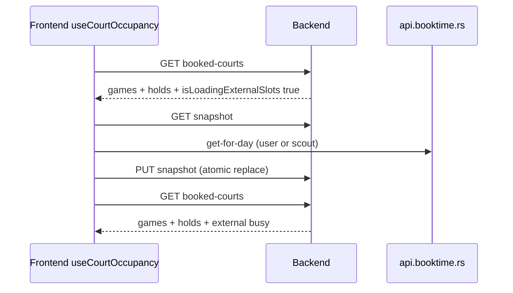

# ADR-005: Court occupancy — A+C hybrid (FE refresh, BE OccupancyBlock[])

**Status:** Accepted  
**Date:** 2026-06-13  
**Deciders:** Grill session (issue #122)  
**Unblocks:** #123 (implementation)  
**Parent epic:** #117 (Booking system architecture deepening)  
**Related:** #118 (single `@shared` `BOOKTIME_SNAPSHOT_FRESH_MS`)

## Context

Court occupancy data is assembled from three sources:

1. **App games** — planned/confirmed matches with optional `hasBookedCourt`
2. **Admin holds** — hard blocks on the club schedule
3. **External busy** — Booktime snapshot rows merged server-side for integrated clubs

Today:

- **Frontend:** `useBookedCourts` orchestrates Booktime snapshot refresh (browser → `api.booktime.rs` + `PUT /clubs/:id/booktime/snapshot`), then fetches `GET /games/booked-courts` and builds slot maps / overlap helpers for `GameStartSection`.
- **Backend:** `bookedCourts.service.ts` and `clubAdminSchedule.service.ts` each query games, holds, and snapshot externals independently with overlapping logic.
- **Freshness:** Shipped code uses **60 seconds** (`BOOKTIME_SNAPSHOT_FRESH_MS = 60_000`) for snapshot staleness and PUT dedupe. `docs/PLAN_BOOKTIME_INTEGRATION.md` still described **5 minutes** — corrected in this slice.

Grill session 2026-06-13 evaluated three options for deepening the occupancy module.

## Options considered

| Option | Shape | Verdict |
| ------ | ----- | ------- |
| **A** | Frontend hook owns refresh; backend returns merged occupancy | **Accepted (FE half of hybrid)** |
| **B** | Backend owns Booktime refresh (server fetches provider, writes snapshot) | **Rejected** — reopens browser-direct Booktime architecture; adds server token plumbing without benefit over existing PUT rate-limit |
| **C** | Backend `CourtOccupancyService` → normalized `OccupancyBlock[]`; consumers map to surface types | **Accepted (BE half of hybrid)** |
| **B+C only** | Backend refresh + blocks | Rejected (see B) |
| **Unify admin schedule row** into one mega-module | Single row type for player grid + admin schedule | **Rejected** — admin keeps enrichments (host, participants, multi-court expansion, conflict detection) on top of game blocks |

## Decision: **A+C hybrid**

### Frontend — `useCourtOccupancy` replaces `useBookedCourts`

**Replace in place** with the **same public interface** (slot map, overlap checks, banners, `refetch`, `refreshSnapshot`).

Pipeline (integrated Booktime clubs + authenticated user):

1. If snapshot missing or stale → run snapshot refresh (`useBooktimeSnapshotRefresh` logic inlined or composed): browser → Booktime `get-for-day` (user or scout token) → `PUT` atomic snapshot.
2. Fetch `GET /games/booked-courts`.
3. If response has `isLoadingExternalSlots: true` and refresh enabled → force refresh → refetch (existing retry loop).
4. Expose slot-map helpers and loading banners to consumers.

**Non-integrated clubs** (`integrationType = null`): skip snapshot refresh; games + holds only via `GET /games/booked-courts`.

**Refresh traffic stays on Frontend** — preserves the plan decision: player → Booktime in browser; scout/user token via existing live-API gate. No client-side merge of externals into the grid; grid reads backend only after refresh.

**Consumer migration:** rename hook file; update `GameStartSection` import; remove `useBookedCourts.ts` when done. Book/cancel force-refresh continues via exported `refreshSnapshot({ force: true })`.

### Backend — `CourtOccupancyService`

Single module for `(clubId, rangeStart, rangeEnd, courtId?)`:

- Query games + holds + externals (snapshot merge for `integrationType = BOOKTIME`).
- Return normalized **`OccupancyBlock[]`**.
- **`includeUnmapped`** flag: admin schedule yes (external/unassigned lane); player per-court grid no (`courtId: null` rows omitted).

**Merge traffic on Backend.** Consumers map blocks to their surface — do **not** unify admin schedule row shape into the service:

| Consumer | Maps to | Notes |
| -------- | ------- | ----- |
| `BookedCourtsService` | `BookedCourtSlot[]` | Existing `GET /games/booked-courts` contract unchanged |
| `ClubAdminScheduleService` | schedule slots | Admin-only enrichments on game blocks; externals/holds → `ScheduleSlot` |

`isLoadingExternalSlots`: single freshness computation using shared constant (below).

### Freshness: **60 seconds, single `@shared` constant**

- Canonical: `BOOKTIME_SNAPSHOT_FRESH_MS = 60_000` in `@shared` (see #118).
- Until #118 lands: BE `Backend/src/shared/booktimeBusySnapshot.ts` and FE `Frontend/src/integrations/booktime/slots.ts` both use 60s; implementation must not reintroduce 5-minute policy.
- Applies to: FE staleness check before refresh, BE PUT dedupe, `isLoadingExternalSlots` cutoff.

## Target layout (#123)

| Module | Location | Role |
| ------ | -------- | ---- |
| Occupancy service | `Backend/src/services/game/courtOccupancy.service.ts` | games + holds + externals → `OccupancyBlock[]` |
| Booked courts adapter | `Backend/src/services/game/bookedCourts.service.ts` | blocks → `BookedCourtSlot[]`; route unchanged |
| Admin schedule adapter | `Backend/src/services/clubAdmin/clubAdminSchedule.service.ts` | blocks + admin enrichments → schedule rows |
| Occupancy hook | `Frontend/src/hooks/useCourtOccupancy.ts` | refresh → GET booked-courts → slot helpers |
| Snapshot refresh | `Frontend/src/hooks/useBooktimeSnapshotRefresh.ts` | composed or inlined by hook |
| Shared freshness | `Frontend/shared/booktimeSnapshot.ts` (target, #118) | `BOOKTIME_SNAPSHOT_FRESH_MS` |

## Sequence (integrated club, cold start)

## Consequences

- **Positive:** One backend query path eliminates drift between player grid and club-admin schedule externals.
- **Positive:** FE refresh ownership unchanged — no server Booktime token pool for occupancy.
- **Positive:** Normalized blocks let each surface map without forcing one row type.
- **Negative:** Short-term rename (`useBookedCourts` → `useCourtOccupancy`) touches create-game; interface stays stable.
- **Follow-up:** #118 consolidates `BOOKTIME_SNAPSHOT_FRESH_MS` to `@shared`; #123 implements service + hook.

## Implementation checklist (#123)

1. Add `CourtOccupancyService` + `OccupancyBlock` type.
2. Refactor `BookedCourtsService` and `ClubAdminScheduleService` to consume it.
3. Add `useCourtOccupancy`; swap `GameStartSection`; delete `useBookedCourts.ts`.
4. Tests: hold hard-block, unconfirmed game soft-block, snapshot `clubBooked`, unmapped external admin lane.
5. Manual QA: integrated + non-integrated create-game grid; club-admin external busy matches player grid.

## Code anchors (current → target)

| Area | Current | Target (#123) |
| ---- | ------- | ------------- |
| Grid hook | `Frontend/src/hooks/useBookedCourts.ts` | `Frontend/src/hooks/useCourtOccupancy.ts` |
| Booked courts | `Backend/src/services/game/bookedCourts.service.ts` | uses `CourtOccupancyService` |
| Admin schedule | `Backend/src/services/clubAdmin/clubAdminSchedule.service.ts` | uses `CourtOccupancyService` |
| Freshness | `booktimeBusySnapshot.ts`, `integrations/booktime/slots.ts` | `@shared` (#118) |
