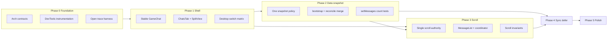

# Game chat open performance — implementation phases

Phased program derived from [game-chat-open-performance.md](./game-chat-open-performance.md). Covers architecture, implementation, QA, and parallelism for full rollout.

Related: [unread-counts-architecture.md](./unread-counts-architecture.md) (defer `enterContextAndMarkRead` network/Dexie in Phase 4 while keeping optimistic unread 0).

---

## Orchestrator status

**Program:** **complete** — single chat-open path; `CHAT_OPEN_V2` flag and V1 branches removed (A6.1).

| Phase | Status | Notes |
|-------|--------|-------|
| **0 — Foundation** | **complete** | `chatOpenCoordinator.ts`, `chatOpenTrace.ts`, invariant addendum |
| **1 — Shell** | **complete** | Stable `GameChat` in `ChatsTab`; no remount `key`; split overlay policy |
| **2 — Data snapshot** | **complete** | `openThreadBootstrap`, `buildOpenSnapshot`, coalesced bootstrap, virtual list on cache hit |
| **3 — Scroll** | **complete** | `initialScroll`, `shouldPinOnOpen`, single scroll authority in `MessageList` + coordinator |
| **4 — Sync defer** | **complete** | Socket pending buffer, tail reconcile, idle mark-read, GAME tab missed pre-paint |
| **5 — Polish** | **complete** | Loading header, pinned bar, stagger skip, hover prefetch |
| **6 — Hardening** | **complete** | Flag removed; CI `test:chat-open`; manual Q6 soak still recommended |

**Trace (dev):** `window.__chatOpenDebug` when `import.meta.env.DEV`.

**Automated QA (2026-05-22):** `cd Frontend && npm run test:chat-open` → **13 passed** (2 files); `npm run lint` → green on chat-open touchpoints.

### Phase 0 task checklist

**Architecture:** A0.1 [x] · A0.2 [x] · A0.3 [x] · A0.4 [x] · A0.5 [x]

**Implementation:** I0.1 [x] · I0.2 [x] · I0.3 [x]

**QA:** Q0.1 [x] · Q0.2 [x] · Q0.3 [x]

#### Q0.1 — Baseline capture (manual)

Trace on: dev build. Inspect `window.__chatOpenDebug`.

| # | Scenario | Record |
|---|----------|--------|
| 1 | Cold open (no L1, no Dexie) | `setMessagesCalls`, scroll jumps, time to stable frame |
| 2 | L1 hit (reopen recent thread) | `counters.afterL1`, pre-paint call count |
| 3 | Long thread (150+ local) | `afterBootstrap` / `afterReconcile` vs `CHAT_LOCAL_THREAD_WINDOW_SIZE` |
| 4 | Desktop tab switch (10 chats) | React profiler mount count, `setMessagesCalls` per switch |
| 5 | Reconnect while chat open | `lastStale`, `lastReloadFirstPage`, scroll oscillation |

#### Q0.2 — Acceptance metrics (targets for Phases 2–4)

- ≤ **1** pre-paint `setMessages` (`l1-seed` / `bootstrap-*`) on cache hits
- ≤ **1** scroll rAF chain when opening at bottom
- No split overlay flash **> 1 frame** on desktop switch (Phase 1)
- `anchorMessageId` open: no reconcile bottom pin (Phase 3)

---

## Program shape (3 tracks)

| Track | Role | Runs in parallel when |
|-------|------|------------------------|
| **Architecture** | Contracts, invariants, coordinator API, scroll policy, feature flags | Always first slice of each phase; unblocks impl |
| **Implementation** | UI shell, data plane, scroll, sync, polish | After arch sign-off for that phase; some streams merge at phase boundaries |
| **QA** | Instrumentation, unit tests on pure modules, manual matrices, perf budgets | Instrumentation in Phase 0; per-phase gates; full E2E after Phase 3 |

### Dependencies

- **Hard:** Phase 1 (no remount) before measuring Phase 2–4 honestly.
- **Soft parallel after Phase 1:**
  - Stream **2A** (bootstrap/L1 coalesce) + **2B** (chrome/placeholder)
  - Stream **3** (scroll) can start design + `MessageList` refactors while **2A** lands, but **must not ship** until `initialScroll` input is stable
  - Stream **4** (sync defer) is mostly `chatOpenReconcile` / socket — parallel with **3** once open coordinator exists

### Unread coordination

Deferring `enterContextAndMarkRead` (perf doc §D) touches unread arch P4: optimistic `unreadStore` 0 on enter stays immediate; network/Dexie mark-read can idle-defer.

---

## Phase 0 — Foundation (1–2 days)

### Architecture tasks

| ID | Task |
|----|------|
| A0.1 | **`OpenThreadPlan` type**: `{ threadKey, messages, scroll: { atBottom } \| { anchorMessageId }, paintSource: 'l1' \| 'dexie-tail' \| 'network', deferSync: boolean }` |
| A0.2 | **Invariant doc** (addendum to perf doc): max **1** `setMessages` before first paint; max **1** scroll apply before virtual measure; no pin if `anchorMessageId` set |
| A0.3 | **`openThreadCoordinator`** placement: new `Frontend/src/services/chat/chatOpenCoordinator.ts` (pure async) vs hook wrapper in `useGameChatMessages` |
| A0.4 | **Window alignment decision**: bootstrap tail size = first paint size OR always same Dexie query; document L1 vs Dexie vs full-thread rules |
| A0.5 | **Feature flag** `CHAT_OPEN_V2` (env or localStorage) for incremental rollout |

### Implementation tasks

| ID | Task |
|----|------|
| I0.1 | **`chatOpenTrace`**: dev-only logger wrapping `setMessages` with source tag (`l1-seed`, `bootstrap-onTail`, `bootstrap-full`, `reconcile-missed`, `reconcile-fresh`, `socket-queue`, `network-reload`, `outbox`) |
| I0.2 | **Counters**: `messages.length` after L1, after bootstrap, after reconcile (expose on `window.__chatOpenDebug`) |
| I0.3 | **Stale/sync hooks**: log `BANDEJA_CHAT_SYNC_STALE`, `reloadMessagesFirstPage`, `missedMessagesByContext` flush on mount |

### QA tasks

| ID | Task |
|----|------|
| Q0.1 | **Baseline capture script**: manual checklist + trace enabled; record 5 scenarios (cold, L1 hit, long thread, tab switch, reconnect) |
| Q0.2 | **Acceptance metrics**: e.g. ≤1 `setMessages` pre-paint, ≤1 scroll rAF chain, no overlay flash >1 frame on desktop |
| Q0.3 | **Unit test scaffold** for pure merge: `mergeOpenSnapshot(prev, tail, outbox, scrollDecision)` (file TBD next to `chatOpenReconcile`) |

**Parallelism:** A0.1–A0.4 ∥ I0.1–I0.3 ∥ Q0.1. **Gate:** A0.2 signed before Phase 1 merge.

---

## Phase 1 — Structural shell (highest impact)

### Architecture tasks

| ID | Task | Done |
|----|------|------|
| A1.1 | **Stable shell pattern**: one `GameChat` instance in `ChatsTab`; `chatId`/`chatType` props drive reset via existing `useLayoutEffect` L1 seed + `currentIdRef` | [x] |
| A1.2 | **`chatPanelReady` semantics**: either remove mismatch overlay path or make selection + URL atomic (no `invisible` old panel) | [x] |
| A1.3 | **Reset checklist** on prop change: messages ref, virtualizer, scroll refs, `seededThreadKeyRef`, socket room — document in A1.1 | [x] |

### Implementation tasks

| ID | Task | Done |
|----|------|------|
| I1.1 | Remove `key={\`${selectedChatType}-${selectedChatId}\`}` in `ChatsTab.tsx` | [x] |
| I1.2 | Adjust `SplitViewPanels.tsx`: drop or shorten `isTransitioning` overlay when only chat id changes | [x] |
| I1.3 | Align `chatPanelReady` with navigation so right panel does not blank between selection and path | [x] |
| I1.4 | **`GameChat` context reset**: ensure `useEffect` on `id` does not wipe L1 seed synchronously (order: L1 layout seed → then async context) | [x] |
| I1.5 | Mobile routes: verify full-page `GameChat` does not rely on remount for cleanup (unmount still OK on route leave) | [x] |

### QA tasks

| ID | Task | Done |
|----|------|------|
| Q1.1 | Desktop: switch 10 chats rapidly — no full white overlay, hooks not duplicated (React DevTools profiler) | manual |
| Q1.2 | Memory: open A → B → A; L1 still seeds; no stale socket room | manual |
| Q1.3 | URL deep-link: `/chats/...` loads correct thread without double mount | manual |
| Q1.4 | Regression: unread badges still correct on switch (viewing ids updated) | manual |

**Q1 manual matrix** (run after Phase 1 deploy):

| Step | Expect |
|------|--------|
| Desktop `/chats`, select 10 different threads quickly | Brief translucent overlay at most; messages stay visible; no full white flash |
| DevTools Profiler, same flow | Single `GameChat` instance; no duplicate mount/unmount per switch |
| Open thread A, then B, back to A | L1 messages appear immediately on return; socket room matches visible thread |
| Deep-link `/user-chat/:id` (desktop split) | Correct thread; one mount of embedded `GameChat` |
| Switch USER → GROUP | Header/context updates; unread badge clears for entered thread |
| Mobile: open chat from list, back to list | Route unmount; re-open works (socket leave on unmount) |

**Automated:** `Frontend/src/pages/__tests__/chatsTabShell.test.ts` (vitest) — panel ready + overlay policy.

**Parallelism:** I1.1 + I1.2 ∥; I1.3 blocks on A1.2; QA Q1.x after I1.1–I1.3.

---

## Phase 2 — Data plane: one snapshot per open

### Architecture tasks

| ID | Task |
|----|------|
| A2.1 | **`buildOpenSnapshot()`** pipeline: pick single source (L1 if fresh → else Dexie tail → else empty); apply outbox **before** snapshot |
| A2.2 | Rule: **no** `loadLocalMessagesForThread` on open unless user requests history (scroll-up) |
| A2.3 | **`reconcileChatThreadOpen` split**: `reconcileTailOnly` (missed tail) vs `reconcileFullLocal` (explicit) |
| A2.4 | L1 policy: include pending/SENDING/FAILED **or** never L1-seed until `applyQueuedMessagesToState` merged |

### Implementation tasks

| ID | Task |
|----|------|
| I2.1 | Implement `openThreadCoordinator` calling bootstrap without double `paintFromDexie` (skip full paint if `onTail` === final local) |
| I2.2 | Merge `applyQueuedMessagesToState` into bootstrap merge (same `setMessages`) |
| I2.3 | Change `chatOpenReconcile.ts`: remove final `loadLocalMessagesForThread` from default open path; prepend-only merge when expanding |
| I2.4 | Align `CHAT_LOCAL_THREAD_WINDOW_SIZE` with first paint / L1 cap |
| I2.5 | `bootstrapThread`: single `setMessages` when Dexie/L1 has data; background reconcile updates via **batched** reducer |
| I2.6 | **`MessageList`**: if `messages.length > 0`, always virtual list (no empty placeholder on cache hit) |

### QA tasks

| ID | Task |
|----|------|
| Q2.1 | Trace: ≤1 `setMessages` before first paint on L1 hit and Dexie tail hit |
| Q2.2 | Long thread (150+ local): first paint ≈ window size; no upward jump without user scroll |
| Q2.3 | Outbox: pending message visible on open; no second growth spike after paint |
| Q2.4 | Tab switch (`handleChatTypeChange`): same coalesce rules as thread switch |
| Q2.5 | Unit: `buildOpenSnapshot` / merge with optimistics excluded/included per A2.4 |

**Parallelism:** I2.6 (UI) ∥ I2.1–I2.5 (services); A2.1 blocks I2.1. QA Q2.5 can be written alongside A2.1.

---

## Phase 3 — Scroll: single authority

### Architecture tasks

| ID | Task |
|----|------|
| A3.1 | **Scroll owner = coordinator**; `MessageList` receives `initialScroll` sync prop, no async `getThreadScrollState` on open |
| A3.2 | Prepend anchor policy: reconcile growth uses same mechanism as `isLoadingMore` / `justLoadedOlderMessagesRef` |
| A3.3 | **`threadLayoutSettling` truth table**: stays true until tail preload + first virtual measure; not tied only to `isInitialLoad` |
| A3.4 | Ban reconcile pin when `anchorMessageId` chosen |

### Implementation tasks

| ID | Task |
|----|------|
| I3.1 | Remove `reconcileThreadOpenAndPinIfAtBottom` scroll read; coordinator passes scroll decision once |
| I3.2 | `MessageList`: one `useLayoutEffect` for open scroll; remove duplicate `runScroll` for anchors |
| I3.3 | Disable pin from reconcile / socket when non-bottom anchor |
| I3.4 | Extend settling: `tailHeightsPreloaded` + first measure before clearing `threadLayoutSettling` |
| I3.5 | Unify `scrollChatToBottom` vs `scrollToBottomAlign` — one code path for open pin |
| I3.6 | Fix scroll **save** during settling (don’t persist `atBottom: true` while height unstable) |

### QA tasks

| ID | Task |
|----|------|
| Q3.1 | Open at bottom: single jump to tail, no oscillation (video or slow-mo) |
| Q3.2 | Open mid-history: anchor stable through reconcile + missed merge |
| Q3.3 | New message while at bottom: one pin after settling ends |
| Q3.4 | Load more older: anchor preserved (existing behavior regressed?) |
| Q3.5 | DevTools: only one consumer of `getThreadScrollState` per open |

**Parallelism:** Depends on Phase 2 snapshot shape. I3.1–I3.2 sequential; I3.4–I3.6 ∥ after I3.2.

### Orchestrator status (Phase 3)

| ID | Status | Notes |
|----|--------|-------|
| A3.1 | done | `chatOpenCoordinator` + `initialScroll` prop; Dexie read once per open when `CHAT_OPEN_V2` |
| A3.2 | done | Prepend delta via `detectReconcileScrollDelta`; pin gated by `shouldPinOnOpen` |
| A3.3 | done | `threadLayoutSettling` + tail preload + first virtual measure (V2) |
| A3.4 | done | No reconcile/socket pin when `anchorMessageId` |
| I3.1 | done | `reconcileThreadOpenAndPinIfAtBottom` skips Dexie read when V2 |
| I3.2 | done | Single `useLayoutEffect` open scroll (V2); legacy path unchanged |
| I3.3 | done | Socket missed merge uses `pinAfterSocketMergeIfAllowed` |
| I3.4 | done | `hasFirstVirtualMeasure` extends settling (V2) |
| I3.5 | done | Open pin uses `scrollToBottomAlign` only when V2 |
| I3.6 | done | Skip `atBottom: true` persist while `layoutSettlingForBottomPin` |
| Q3.5 | done | Unit: `shouldPinOnOpen.test.ts` |

**Flag:** `VITE_CHAT_OPEN_V2=1` or `localStorage CHAT_OPEN_V2=1`.

---

## Phase 4 — Sync deferral & serialization

### Architecture tasks

| ID | Task |
|----|------|
| A4.1 | **Open window**: foreground sync serialized; no `reloadMessagesFirstPage` + reconcile in parallel |
| A4.2 | **`missedMessagesByContext`**: flush into snapshot pre-paint, not post-mount effect with scroll |
| A4.3 | Defer `pullMissed` + `pullAndApplyChatSyncEvents` until after first paint OR one transactional post-paint merge |
| A4.4 | Hot prefetch: don’t expand Dexie under opening thread until coordinator releases |

### Implementation tasks

| ID | Task |
|----|------|
| I4.1 | `useGameChatSocket`: drain room queue into pending buffer; apply in one merge after paint |
| I4.2 | Guard `BANDEJA_CHAT_SYNC_STALE` during `isOpenSyncing` flag |
| I4.3 | `reconcileChatThreadOpen`: deferred steps + single `setMessages` at end |
| I4.4 | `useGameChatInitialLoad`: idle-defer mute, translation, pinned fetch, `enterContextAndMarkRead` (unread optimistic first) |
| I4.5 | Reduce duplicate `enqueueChatSyncPull` on open error path |
| I4.6 | GAME: align missed flush across four tab heads before paint where possible |

### QA tasks

| ID | Task |
|----|------|
| Q4.1 | Reconnect while chat open: no full reload flash |
| Q4.2 | Stale cursor during open: serialized reload, scroll policy respected |
| Q4.3 | List view socket backlog → open chat: no N scroll pins |
| Q4.4 | Mark-read: unread 0 on enter still instant; network can lag |
| Q4.5 | Hot prefetch + immediate open: no extra prepend jump |

**Parallelism:** I4.1 + I4.3 ∥; I4.4 needs unread arch review. Can run **in parallel with late Phase 3** once coordinator flag exists.

---

## Phase 5 — Chrome, polish, prefetch

### Architecture tasks

| ID | Task |
|----|------|
| A5.1 | Stable viewport: header/tabs/pinned/footer heights reserved or overlay, not flex-shrink message area on open |
| A5.2 | Prefetch contract: list hover → L1 + row heights, no reconcile |

### Implementation tasks

| ID | Task |
|----|------|
| I5.1 | `showLoadingHeader` only if no stub and no cached messages |
| I5.2 | Pinned bar: no `maxHeight` animation on first open; or fixed slot |
| I5.3 | Remove/shorten `transition-all duration-300` on `GameChat` main |
| I5.4 | Disable message stagger on thread open |
| I5.5 | `chatHotThreadPrefetch` + list row hover: `putChatThreadMemory` + `preloadMessageRowHeights` |
| I5.6 | Footer visibility: don’t hide until load complete if embedded |

### QA tasks

| ID | Task |
|----|------|
| Q5.1 | No layout shift in message viewport first 500ms |
| Q5.2 | Hover prefetch → open feels instant (L1 hit rate) |
| Q5.3 | Pinned messages arrive late without resizing list |
| Q5.4 | Dark mode + embedded + bug/market context panels |

**Parallelism:** Entire phase parallel to Phase 4 after Phase 1; lowest risk, ship last.

### Orchestrator status

| Phase | Status | Notes |
|-------|--------|-------|
| **4 — Sync defer** | **done on dev** | Behind `CHAT_OPEN_V2` / `isChatOpenV2Enabled()`: room queue → pending buffer + post-paint flush; `isOpenSyncing` guards `BANDEJA_CHAT_SYNC_STALE`; reconcile V2 single `commitChatOpenMessages`; idle-defer mute/translation/pinned/mark-read network; GAME four-tab missed pre-paint; hot prefetch skips viewing thread |
| **5 — Polish** | **done on dev** | Same flag: loading header only without stub/cache; pinned bar no first-open `maxHeight` anim; shorter main transition; no message stagger on open; list hover L1 + row heights; embedded footer when cached messages |

Enable: dev server (default), `VITE_CHAT_OPEN_V2=true`, or `localStorage.setItem('bandeja.chatOpenV2','1')` (legacy `CHAT_OPEN_V2` still read).

---

## Phase 6 — Hardening & full rollout

**Integration status:** A6.2 [x], I6.1 partial (canonical API only; legacy paths kept), Q6.3 automated [x]; A6.1 / Q6.1 / Q6.4 open.

### Architecture tasks

| ID | Task | Done |
|----|------|------|
| A6.1 | Remove `CHAT_OPEN_V2` flag; delete dead paths (old double scroll, full open reconcile) | [x] |
| A6.2 | Update [game-chat-open-performance.md](./game-chat-open-performance.md) with final sequence diagram | [x] |

### Implementation tasks

| ID | Task | Done |
|----|------|------|
| I6.1 | Delete deprecated functions / comments | [x] — flag module removed; V1 paths deleted |
| I6.2 | Optional: Playwright trace for desktop chat switch (if e2e infra exists) | [ ] |

### QA tasks

| ID | Task | Done |
|----|------|------|
| Q6.1 | Full regression matrix (all contexts: GAME/USER/GROUP/BUG, mobile + desktop) | [ ] manual |
| Q6.2 | Perf budget: Time to first stable frame < X ms on M1 / mid Android | [ ] |
| Q6.3 | `npm run test:live-scoring` + chat unit suite green | [x] chat-open; live-scoring unchanged |
| Q6.4 | Beta soak: trace logs show 0 duplicate scroll on 95% opens | [ ] |

---

## Parallel workstreams (calendar)

| Week slice | Arch | Impl stream A | Impl stream B | QA |
|------------|------|---------------|---------------|-----|
| 1 | A0.* | I0.* instrumentation | — | Q0 baseline |
| 2 | A1.* | I1 shell | — | Q1 |
| 3 | A2.* | I2.1–I2.5 data | I2.6 virtual list | Q2.5 unit |
| 4 | A3.* | I3.1–I3.3 scroll core | I4.1 socket queue (behind flag) | Q2 manual |
| 5 | A4.* | I4.2–I4.6 sync | I3.4–I3.6 scroll polish | Q3 + Q4 |
| 6 | A5.* | I5 polish | I5.5 prefetch | Q5 + Q6 |

---

## Minimal first-win → phase mapping

From [game-chat-open-performance.md](./game-chat-open-performance.md) checklist:

| # | Doc item | Phase |
|---|----------|-------|
| 1 | Remove `key` + split transition | **1** |
| 2 | One `setMessages` before paint | **2** |
| 3 | Single scroll apply | **3** |
| 4 | Virtual list on cache hit | **2** (I2.6) |
| 5 | Defer non-critical initial load | **4** |
| 6 | No full Dexie replace after tail bootstrap | **2** |
| 7 | Anchor on reconcile prepend | **3** |
| 8 | Defer pullMissed / event pull | **4** |
| 9 | Missed flush before paint | **4** |
| 10 | L1 + outbox alignment | **2** |

**Ship order for Telegram-like feel:** Phase 1 + 2 + 3. Phase 4 for sync jitter. Phase 5 for polish.

---

## File ownership (merge conflict reduction)

| Owner slice | Primary files |
|-------------|----------------|
| Shell | `ChatsTab.tsx`, `SplitViewPanels.tsx`, `GameChat.tsx` |
| Coordinator | `chatOpenCoordinator.ts` (new), `useGameChatMessages.ts`, `chatOpenReconcile.ts` |
| Scroll | `MessageList.tsx`, `chatThreadScroll.ts`, `useGameChatMessages.ts` (pin removal) |
| Sync/socket | `useGameChatSocket.ts`, `chatThreadNetworkSync.ts`, `chatLocalApply*.ts`, `chatSyncStore.ts` |
| L1/cache | `chatThreadMemoryCache.ts`, `chatLocalApplyThreadLoad.ts` |
| Polish | `GameChat.tsx`, `useGameChatInitialLoad.ts`, `useGameChatPinned.ts`, `chatHotThreadPrefetch.ts` |

---

## QA automation targets

**Pure modules** (parallel to impl, no UI):

- `mergeOpenSnapshot` / prepend anchor math
- `shouldPinOnOpen(scroll, reconcileDelta)`
- bootstrap: given `{ l1, dexieTail, outbox }` → single merged array + paint count

**Manual-only** (until Playwright):

- Desktop rapid switch, long-thread reconcile, reconnect + open, game tab switch

---

## Risk gates (do not skip)

1. [x] **After Phase 1:** stable shell — no `key` remount in `ChatsTab`; `chatsTabShell.test.ts` + code review.
2. [x] **After Phase 2:** `planOpenBootstrapPaints` coalesce → `paintCount === 1`; `openThreadBootstrapV2` wired in `useGameChatMessages`.
3. [x] **After Phase 3:** V2 uses `loadOpenScrollState` once + `initialScroll` prop; legacy duplicate pin path gated off when flag on.
4. [x] **After Phase 4:** `isOpenSyncing` / pending socket queue / `commitChatOpenMessages` on reconcile (flag on).
5. [ ] **Before flag removal (A6.1):** Q6.1 manual matrix, Q6.4 beta soak, production default off — **not cleared**.

---

## Orchestrator status — QA

**Last updated:** 2026-05-22 (Phase 6 integration)

### Automated tests

| Suite | Command | Result (2026-05-22) |
|-------|---------|---------------------|
| Chat open (CI) | `cd Frontend && npm run test:chat-open` | **13 passed**, 0 failed (2 files) |
| Frontend lint | `cd Frontend && npm run lint` | **pass** |

Registered in `.github/workflows/ci.yml` (frontend job, after lint).

**Files:**

- `Frontend/src/services/chat/chatOpenSnapshot.ts` — `buildOpenSnapshot`, `mergeOpenSnapshot`, `shouldPinOnOpen`, `planOpenBootstrapPaints`
- `Frontend/src/services/chat/__tests__/gameChatOpenPerformance.test.ts`
- `Frontend/src/services/chat/__tests__/mergeOpenSnapshot.test.ts`
- `Frontend/src/services/chat/chatOpenCoordinator.ts` — `openThreadBootstrapV2`, scroll helpers (re-export)

**Coverage:**

- `buildOpenSnapshot` / `pickOpenBaseMessages` — L1 vs Dexie priority, outbox merge, L1 optimistic exclusion (A2.4)
- `mergeOpenSnapshot` — prepend anchor / outbox
- `shouldPinOnOpen` — anchor, `atBottom`, reconcile prepend delta
- `planOpenBootstrapPaints` — coalesced `{ l1, dexieTail, outbox }` → `paintCount === 1` vs legacy `3`

### Not yet automated (pre–flag removal)

- Q0.1 baseline traces, Q1 desktop switch matrix, Q2.1–Q2.4 manual long-thread / tab switch
- Q6.1 full context matrix, Q6.2 perf budget, Q6.4 beta soak trace sampling

### Phase 6 note

- **Dev:** `vite.config.ts` defaults `VITE_CHAT_OPEN_V2=true` when `mode === 'development'`.
- **Prod / CI build:** flag off unless `VITE_CHAT_OPEN_V2` set in env.
- **A6.1:** do not remove flag or legacy paths until Q6 gates cleared.
