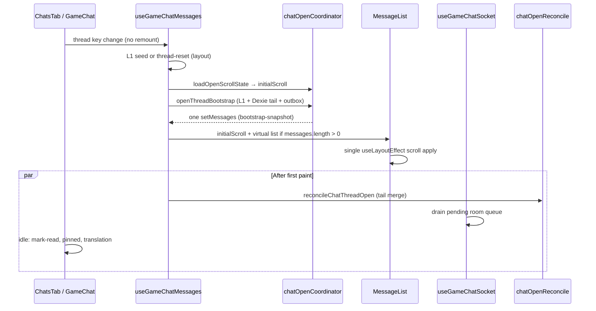

# GameChat open performance — jitter and scroll analysis

Why opening a chat feels slow and jumpy compared to Telegram-style instant opens, and how to fix it.

**Implementation plan:** [game-chat-open-performance-phases.md](./game-chat-open-performance-phases.md) (phased arch / impl / QA tasks, parallelism, risk gates).

## Open invariants (Phase 0 addendum)

Target behavior for chat open. Enforced via `chatOpenTrace` (dev) + coordinator.

| Invariant | Rule |
|-----------|------|
| Pre-paint `setMessages` | **At most one** React state update to `messages` before the first user-visible paint of the thread |
| Pre-measure scroll | **At most one** scroll apply (pin or anchor restore) before the virtualizer’s first stable measure |
| Anchor vs pin | If `scroll` uses `{ anchorMessageId }`, **no** bottom pin from reconcile, socket backlog, or `layoutSettlingForBottomPin` until the user scrolls to bottom |
| Window size | First paint row count = Dexie bootstrap tail window (`CHAT_LOCAL_THREAD_WINDOW_SIZE`), not full IndexedDB thread |

## Open sequence (coordinator-driven)



**Numbered path:**

1. **Shell** — same `GameChat` instance; `useLayoutEffect` seeds L1 or clears (`l1-seed` / `thread-reset`).
2. **Scroll plan** — `loadOpenScrollState` → `initialScroll` prop (no second Dexie read in `MessageList`).
3. **Bootstrap** — `openThreadBootstrap`: `planOpenBootstrapPaints` → ≤1 pre-paint `setMessages` (`bootstrap-snapshot`).
4. **Paint** — `MessageList` mounts virtualizer immediately; `skipStaggerOnOpen`; one scroll apply from `initialScroll`.
5. **Reconcile** — background `reconcileChatThreadOpen`; pin only if `shouldPinOnOpen(savedScroll, delta)`.
6. **Socket** — room events buffered until open paint; flush without `reloadMessagesFirstPage` in first 300ms.
7. **Unread** — optimistic 0 on enter; network/Dexie mark-read deferred via idle scheduler.


## What happens when you open a chat (legacy / flag off)

### 1. Full remount on desktop (biggest structural issue)

> **Phase 1 fixed:** `ChatsTab` no longer uses `key={type-id}` remount. Section kept for legacy/flag-off context.

In `ChatsTab`, each selection mounts a **new** `GameChat` instance:

```tsx
// Frontend/src/pages/ChatsTab.tsx
{chatPanelReady && selectedChatId && selectedChatType ? (
  <GameChat
    key={`${selectedChatType}-${selectedChatId}`}
    isEmbedded={true}
    chatId={selectedChatId}
    chatType={selectedChatType}
  />
) : null}
```

Telegram keeps one chat surface and swaps data. This tears down hooks, virtualizer, scroll refs, and runs the whole open pipeline from zero.

There is also a brief **URL vs selection mismatch**: `chatPanelReady` waits until `pathSelection` matches `selectedChatId`. Until then, `SplitViewRightPanel` shows an overlay and marks children `invisible`:

```tsx
// Frontend/src/components/SplitViewPanels.tsx
{isTransitioning && (
  <div className="absolute inset-0 z-10 bg-gray-50 dark:bg-gray-900" />
)}
<div className={`absolute inset-0 ${isTransitioning ? 'invisible pointer-events-none' : '...'}`}>
```

Sequence: overlay → invisible old chat → unmount → mount new chat → visible.

### 2. Many state updates in sequence (not one paint)

| Step | Where | Effect |
|------|--------|--------|
| L1 seed | `useGameChatMessages` `useLayoutEffect` | `setMessages` from `peekChatThreadMemory` **or** empty + loading |
| Context reset | `GameChat` `useEffect` on `id` | `setGame(null)`, `setIsLoadingContext(true)`, tabs/type reset |
| Initial load | `useGameChatInitialLoad` | `loadContext`, mute, translation, maybe `setCurrentChatType` |
| Bootstrap | `bootstrapThread` | Dexie `onTail` → `paintFromDexie`, then full `paintFromDexie` again, then `reconcileThreadOpen` |
| Reconcile pin | `reconcileThreadOpenAndPinIfAtBottom` | `setMessages` again + `scrollToBottom` in rAF |
| Outbox | `applyQueuedMessagesToState` | another `setMessages` |
| Pinned / socket / translation | other hooks | more updates |

`bootstrapThread` alone can update messages **3+ times** before network finishes (`useGameChatMessages.ts`: `onTail` callback + full `paintFromDexie` + `runBackgroundReconcile`).

Each `setMessages` re-runs the virtualizer and scroll logic.

### 3. Competing scroll controllers in `MessageList`

Scroll is not owned by one place:

1. **`reconcileThreadOpenAndPinIfAtBottom`** (`useGameChatMessages.ts`) — reads Dexie scroll, reconciles, then pins if `atBottom` via `requestAnimationFrame` → `scrollToBottom()`.

2. **Scroll restore `useLayoutEffect`** (`MessageList.tsx`) — reads the **same** Dexie key again and pins or restores anchor (with **double** `runScroll` for anchors).

3. **`layoutSettlingForBottomPin`** — while `threadLayoutSettling || !tailHeightsPreloaded`, a `ResizeObserver` keeps pinning to bottom.

   Parent passes:

   ```tsx
   threadLayoutSettling={isInitialLoad || isLoadingMessages || isSwitchingChatType}
   ```

   Flow: pin on open → heights preload → estimates change → total height changes → pin again → `isInitialLoad` false → settling ends → different grow-handler → another pin.

4. **New-message effect** — pins when count grows and user was at bottom (disabled while settling).

This easily feels like scroll jumping back and forth multiple times.

### 4. Empty shell → virtual list swap

While `messages.length === 0` and loading flags are true, `MessageList` renders a **non-virtual** placeholder. Then messages arrive → TanStack virtual list mounts → scroll container behavior changes.

Even with L1 cache, `isInitialLoad` / `isLoadingMessages` can still be true briefly if initial load runs before layout seed is visible to `messagesRef`.

### 5. Chrome height changes (layout shift above the list)

- Embedded header: `showLoadingHeader = isEmbedded && isLoadingContext`
- `GameChatTabs` when game + `derived` resolve
- `ChatContextPanel` (bug / market)
- `PinnedMessagesBar` with Framer `maxHeight` animation
- Footer hidden until `!isInitialLoad` (non-embedded)
- `main` / message wrapper: `transition-all duration-300`

Each changes `flex-1` message area height → scroll position moves even if `scrollTop` is unchanged.

### 6. Virtualizer remeasure

Tail height preload flips `tailHeightsPreloaded`, bumps estimates, and `virtualizer.getTotalSize()` changes — classic bottom-pin drift. `AnimatedMessageItem` stagger on “recent” messages adds motion on first paint.

---

## Caching and sync (data-plane causes)

Beyond UI remount and duplicate scroll logic, **cache layers disagree** and **sync completes after first paint**, so the list keeps getting new instructions to scroll.

### Three cache layers that disagree

| Layer | What it holds | Open behavior |
|--------|----------------|---------------|
| **L1** `peekChatThreadMemory` | Last ≤400 rows; **excludes** optimistics / SENDING / FAILED; 5‑min TTL | Sync seed in `useLayoutEffect` |
| **Dexie bootstrap** `loadLocalThreadBootstrap` | Tail window ≈ **50** (`CHAT_LOCAL_THREAD_WINDOW_SIZE`) | `paintFromDexie` (often twice: `onTail` + full) |
| **Dexie reconcile** `loadLocalMessagesForThread` | **Entire** thread from IndexedDB | Full merge in `reconcileChatThreadOpen` |

`reconcileChatThreadOpen` ends with:

```ts
// Frontend/src/services/chat/chatOpenReconcile.ts
const fresh = await loadLocalMessagesForThread(contextType, contextId, gameChatType);
setMessages((prev) => mergeLocalRefresh(prev, fresh));
```

If Dexie has 150 messages but L1/bootstrap only showed ~50, reconcile **grows the list upward**. `scrollTop` stays fixed while content above grows → visible jump without scroll anchoring. A saved `anchorMessageId` may point at a row that **was not in the first paint**, so restore runs on the wrong virtual range.

L1 **drops** pending/outbox rows (`isExcludedFromL1` in `chatThreadMemoryCache.ts`). Typical flow: L1 paints a clean tail → `applyQueuedMessagesToState` adds optimistics → list grows + scroll → row heights differ from cached estimates.

### Sync pipeline: more `setMessages` after first paint

**`reconcileChatThreadOpen`** (runs on bootstrap background reconcile) order:

1. `hydrateLastMessageIdFromDexieIfMissing` — Zustand head may change.
2. **`pullMissedAndPersistToDexie`** (network `getMissedMessages` from `lastMessageId`) → optional `setMessages` merge.
3. **`pullAndApplyChatSyncEvents`** — Dexie patches, cursor repair, `THREAD_LOCAL_INVALIDATE`.
4. **`loadLocalMessagesForThread`** → another `setMessages`.

Each step can change count, order, or fields (reactions, translations, deletes).

**Stale cursor → full reload mid-open:** if the event cursor is behind server retention, sync dispatches `BANDEJA_CHAT_SYNC_STALE`; `useGameChatSocket` calls **`reloadMessagesFirstPage()`** (network page + reconcile + pin again). `persistLatestTailPagesAfterStaleCursor` can pull **80** messages per game tab into Dexie before UI reload finishes.

**Scheduler + duplicate pulls:** reconcile awaits `pullAndApplyChatSyncEvents` but also `enqueueChatSyncPull(..., FOREGROUND)` on error. Additionally:

- Socket missed merge → `enqueueChatSyncPull` + `setMessages`
- Hot prefetch (`runHotThreadPrefetchNow`) → `pullMissed` for top‑K threads
- Pinned handler → `enqueueChatSyncPull` on `syncSeq`
- `chatSyncService.syncContext` for **all four** game chat types → `addMissedMessages` per tab

Background work on other threads still updates Dexie; opening a thread reads fresher Dexie than L1 had → another expansion/replace.

### `lastMessageId` / missed-message races

Head is split between **Zustand** (`chatSyncStore`) and **Dexie** (`messageContextHead`). Heads locate “after which id” for `getMissedMessages`; ordering uses `syncSeq` / `serverSyncSeq`.

Failure modes on open:

- **Stale Zustand head** → missed burst → merge + `scrollChatToBottomIfNearBottom` in socket effect.
- **Head updated mid-open** by `syncLastMessageIdsToStoreFromLocalHeadsForContext` after event pull.
- **GAME tabs:** four heads; missed for one tab can sit in `missedMessagesByContext` until that tab opens; opening PUBLIC still runs reconcile against shared Dexie state.

On mount, `useGameChatSocket` flushes `missedMessagesByContext` when `missedForContext.length` changes — often right after first paint (e.g. reconnect / global sync).

### Socket / room queue on mount

On open, `useGameChatSocket`:

1. `joinChatRoom`
2. Drains **`takeChatRoomQueue(roomKey)`** — batched events from the list view → `handleNewMessage`, reactions, transcriptions, poll votes (`setMessages` each)
3. **`syncRequiredEpoch` effect** — may fire multiple `socketService.syncMessages` when epoch advances
4. Sets viewing ids (`setViewingGameChat`, etc.) — unread / list updates in parallel

“Open chat” can process **backlogged** socket work, not only static cache.

### Network vs Dexie paint order

| Bootstrap result | What runs next |
|------------------|----------------|
| Local tail found | Paint Dexie → **`runBackgroundReconcile()`** (heavy) → `applyQueuedMessagesToState` |
| No local, has `lastMessageId` | Reconcile → `loadLocalMessagesForThread` |
| Empty | `loadMessages` (network page 50) → reconcile + pin; `setLastThreadPaint('network')` |

`mergeServerPageWithPendingOptimistics` is ascending merge by id — it does **not** preserve “window start” if server page and full Dexie thread disagree on which older ids exist.

### Outbox / queue / optimistic sync

After bootstrap, `useGameChatInitialLoad` runs `applyQueuedMessagesToState` and `reconcileOutboxForContext`. Optimistic add scrolls explicitly (`requestAnimationFrame` → `scrollToBottom` in `useGameChatOptimistic.ts`). Replacing optimistic with server message **re-sorts** the array — indices shift while scroll restore may already be marked done.

### Translation / media / pins (cache → height)

- **`useGameChatTranslationLive`:** Dexie patch + `setMessages` on `chat:message-translation` — text height changes without scroll policy.
- **`preloadMessageRowHeights`:** wrong estimates until preload → `getTotalSize()` jumps (settling pin helps, then translation/media invalidates after settling ends).
- **Images/video:** thumb prefetch from sync hooks → `measureElement` → ResizeObserver pin loop.
- **`fetchPinnedMessages` on mount** (`useGameChatPinned`): pinned bar `AnimatePresence` → viewport height change.

### List / index / unread side effects

- **`enterContextAndMarkRead`** at end of initial load — unread store + thread index.
- **`reconcileThreadIndexOutboxForContext` on unmount** when switching chats.
- **`bumpChatListDexieBump`** from Dexie lifecycle / outbox — list refetch; concurrent Dexie writes during open.
- **`forceReload` + `deleteChatThreadMemory`** — cold path, L1 dropped.

### Game chat type switching

`handleChatTypeChange` repeats bootstrap + `reconcileChatThreadOpen` + `isSwitchingChatType` / `isLoadingMessages` — same multi-paint pattern; new `threadScrollKey` per tab.

### Hot prefetch vs open

`runHotThreadPrefetchNow` pulls missed for **other** hot threads (updates Dexie + enqueues pulls). Opening a thread right after prefetch means reconcile sees data that was not in L1 when the list rendered.

### Scroll persistence vs virtualizer (sync-related)

While `threadLayoutSettling` is true, pins run continuously. Scroll **save** (`scheduleThreadScrollSave`) waits for `restoredScrollThreadRef`, but restore is async. During reconcile merges, saves may record **`atBottom: true`** while height is still changing → next open forces bottom when user had been reading history.

`scrollChatToBottom` (double rAF on `.overflow-y-auto` inside `chatContainerRef`) vs `MessageList` pin / `scrollToBottomAlign` — same intent, different timing.

### DevTools checks

1. Log `setMessages` sources per open (L1 / bootstrap / reconcile / missed / socket queue / network reload).
2. Compare `messages.length` after L1 seed vs after `reconcileChatThreadOpen`.
3. Watch `BANDEJA_CHAT_SYNC_STALE` + `reloadMessagesFirstPage` during open.
4. Check `missedMessagesByContext` + socket missed effect on mount.
5. For a long thread: Dexie row count vs first paint count (~50 vs full).

### Cache/sync-first fixes (conceptual)

1. **One snapshot per open:** L1 *or* Dexie tail *or* full local — do not chain full `loadLocalMessagesForThread` after tail paint unless user scrolls for history.
2. **Scroll anchor when prepending:** treat reconcile growth like `isLoadingMore` (preserve anchor; do not pin).
3. **Defer** `pullMissed` + event pull until after first paint, or one transactional `setMessages`.
4. **Include optimistics in L1** (or do not L1-seed until outbox applied).
5. **Do not pin** from reconcile if restore chose a non-bottom anchor.
6. **Serialize** foreground sync during open — avoid parallel `reloadMessagesFirstPage` + reconcile.
7. **Align windows:** bootstrap size ≈ first render, or always use the same Dexie query.

---

## Telegram-like mental model

Telegram roughly does:

1. **Synchronous** local messages + scroll offset before first paint
2. **One** scroll application per open (bottom or saved anchor)
3. **No full tree remount** when switching chats
4. **Stable chrome** height on open; details fill in without resizing the message viewport
5. Network reconcile **merges** without resetting scroll unless you were at bottom and new tail arrived

This codebase already has pieces (L1 `peekChatThreadMemory`, Dexie bootstrap, `threadScroll` in IndexedDB) but they run **after mount**, **in parallel**, and **with remount + animated chrome**.

---

## Fix direction (prioritized)

### A. Structural (highest impact)

1. **Stop remounting `GameChat` on every click**
   - Remove `key={...}` or use a stable shell + pass `chatId` / `chatType` and reset via refs (like `useLayoutEffect` seed in `useGameChatMessages`).
   - Align `chatPanelReady` / `isTransitioning` so the right panel does not blank/invisible-then-mount.

2. **Single open coordinator**
   - One function: `openThread({ id, type })` → sync L1/Dexie messages → sync scroll decision → **one** `setMessages` → mark ready.
   - Defer mute, translation, pinned fetch, `enterContextAndMarkRead` until after first paint (`requestIdleCallback` / idle).

### B. Scroll (stop fighting yourself)

3. **One scroll authority**
   - Either parent (`reconcileThreadOpenAndPinIfAtBottom`) **or** `MessageList` restore — not both reading `getThreadScrollState`.
   - Pass `initialScroll: { atBottom } | { anchorId }` from bootstrap synchronously, apply in **one** `useLayoutEffect` before children measure.

4. **Freeze pin policy until stable**
   - Don’t call `scrollToBottom` from reconcile **and** `schedulePinToBottom` from restore.
   - Keep `layoutSettlingForBottomPin` until heights are ready, but **don’t** toggle `threadLayoutSettling` off until tail preload + first virtual measure pass complete.
   - Avoid double `runScroll()` for anchors unless first pass failed.

5. **Don’t swap empty div ↔ virtual list**
   - If L1/Dexie has messages, render virtual list immediately. Use a lightweight top spinner, not a different DOM tree.

### C. Fewer renders

6. **Coalesce message paints on open**
   - `bootstrapThread`: use `onTail` **or** final `paintFromDexie`, not both when identical.
   - Batch `reconcileChatThreadOpen` into the same `setMessages` as bootstrap when possible.
   - Run `applyQueuedMessagesToState` before first paint or merge into bootstrap merge.

7. **Embedded: don’t flash loading header if list data exists**
   - `showLoadingHeader` only when no title stub **and** no cached messages (`initialUserChat` / `groupChannel` in nav state help for some paths).

### D. Polish

8. Disable or shorten open animations: pinned bar `maxHeight`, `transition-all duration-300` on main, message stagger for thread open.
9. Prefetch on list hover / visible row: `putChatThreadMemory` + `preloadMessageRowHeights` (see `chatHotThreadPrefetch`).

---

## Minimal first-win checklist

**UI / scroll**

1. Remove `key` remount + fix split transition so chat stays mounted.
2. Merge bootstrap paints to **one** `setMessages` before paint when Dexie/L1 has data.
3. Single scroll apply; remove duplicate `getThreadScrollState` + duplicate pin paths.
4. Keep virtual list mounted whenever `messages.length > 0`; never show empty placeholder on cache hit.
5. Defer non-critical API in `useGameChatInitialLoad` until after `isInitialLoad === false`.

**Cache / sync**

6. Stop full `loadLocalMessagesForThread` replace after tail-only bootstrap; load older on scroll only.
7. Anchor scroll when reconcile prepends rows (same idea as load-more preservation).
8. Defer `pullMissed` + event pull until after first paint, or batch into one merge.
9. Flush / merge `missedMessagesByContext` before first paint, not in a post-mount effect that scrolls.
10. Align L1 contents with outbox (include pending or apply queue before L1 seed).

---

## Key files

| File | Role |
|------|------|
| `Frontend/src/pages/GameChat.tsx` | Orchestration, `threadLayoutSettling`, chrome |
| `Frontend/src/pages/ChatsTab.tsx` | Remount `key`, `chatPanelReady`, navigation |
| `Frontend/src/pages/GameChat/useGameChatMessages.ts` | L1 seed, bootstrap, reconcile pin |
| `Frontend/src/pages/GameChat/useGameChatInitialLoad.ts` | Async load pipeline |
| `Frontend/src/pages/GameChat/useGameChatSocket.ts` | Room queue, missed flush, stale reload |
| `Frontend/src/components/MessageList.tsx` | Virtualizer, scroll restore, pin-on-settle |
| `Frontend/src/services/chat/chatThreadMemoryCache.ts` | L1 thread snapshots (TTL, optimistic exclusion) |
| `Frontend/src/services/chat/chatLocalApplyThreadLoad.ts` | Dexie tail bootstrap window |
| `Frontend/src/services/chat/chatThreadScroll.ts` | Persisted scroll state (Dexie) |
| `Frontend/src/services/chat/chatOpenReconcile.ts` | Missed pull, events, full local reload |
| `Frontend/src/services/chat/chatOpenCoordinator.ts` | `OpenThreadPlan`, bootstrap v2, scroll load |
| `Frontend/src/services/chat/chatOpenTrace.ts` | Dev trace, `window.__chatOpenDebug` |
| `Frontend/src/services/chat/chatOpenCoordinator.ts` | `openThreadBootstrap`, scroll plan |
| `Frontend/src/services/chat/chatOpenSnapshot.ts` | `buildOpenSnapshot`, `mergeOpenSnapshot` |
| `Frontend/src/services/chat/chatThreadNetworkSync.ts` | `pullMissedAndPersistToDexie` |
| `Frontend/src/services/chat/chatLocalApplyPull.ts` | Event pull loop, stale cursor |
| `Frontend/src/services/chat/chatHotThreadPrefetch.ts` | Background missed pull for hot threads |
| `Frontend/src/services/chat/messageContextHead.ts` | Dexie ↔ Zustand tail pointers |
| `Frontend/src/store/chatSyncStore.ts` | `lastMessageId`, `missedMessagesByContext` |
| `Frontend/src/services/chatSyncService.ts` | Global missed → store (incl. all game tabs) |
| `Frontend/src/components/SplitViewPanels.tsx` | Transition overlay / invisible |
