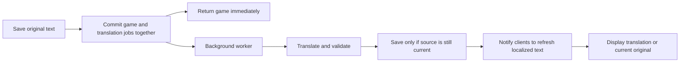

# Automatic game name and description translation

Status: proposed implementation plan, not shipped. 2026-09-16.

## Recommendation

Automatically translate saved, authored `Game.name` and `Game.description` into every supported app language. Publish the game immediately; translation happens in a durable background worker. Players read their app language by default, can always inspect the original, and never wait for translation to use the game. Organizers may correct individual translations but never need to manage languages to publish.

### Product defaults

- Automatic for new games and text edits, including private games under their existing access rules.
- Target all 11 current app languages: English, Russian, Serbian, Spanish, Czech, Arabic, Chinese, Indonesian, Hindi, Thai, Japanese. Adding an app language schedules missing translations automatically.
- Use the current app UI language, including for guests. Chat's separate incoming-translation preference does not affect game details.
- Preserve the original as the editable source of truth. Translating never rewrites `Game.name` or `Game.description`.
- Show a current translation when available; otherwise show the current original. Never show an old translation of a changed field.
- Names, clubs, brands, URLs, amounts, dates, levels, and format terms must retain their meaning. This is translation, not promotional rewriting.

## What exists today

| Finding | Verified location | Consequence |
|---|---|---|
| Original name and description are nullable game columns | `Backend/prisma/schema.prisma`, `model Game` | Add related translation storage; retain existing fields and API compatibility |
| UI supports 11 languages; chat supports a broader set | `Frontend/src/i18n/config.ts`, `Backend/src/services/chat/resolveTranslationTargetLanguage.ts` | Introduce a shared app-locale registry rather than copying the chat list |
| Serbian UI uses Latin script; Chinese uses Simplified characters | `Frontend/src/i18n/locales/{sr,zh}/gameDetails.json` | Make these explicit translation targets |
| Chat has persisted jobs, retry scheduling, polling and optional Redis wakeups | `Backend/src/services/chat/translationQueue.service.ts` | Reuse infrastructure conventions, with a separate game-text queue and capacity |
| Existing translation service is coupled to messages and chat sync | `Backend/src/services/chat/translation.service.ts` | Reuse the AI adapter and suitable language helpers, not message records or chat events |
| AI provider configuration and usage logging already exist | `Backend/src/services/ai/{ai.service,llmReasons,llmUsageLog.service}.ts` | Add a game-text usage reason; no new provider required for the first version |
| Game create/update have database transactions | `Backend/src/services/game/{create,update}.service.ts` | Save translation work inside the same transaction as the text change |
| Find deliberately omits description from its card projection | `Backend/src/services/game/availableGamesCard.projection.ts` | Include only the requested localized title in card responses |
| Editors initialize directly from game fields | `Frontend/src/components/GameDetails/EditGameInfoModal.tsx`, `Frontend/src/components/eventDetails/EventEditListingModal.tsx` | Keep originals separate from display text to avoid accidental source replacement |
| League brand name/description live on `League`; season name is on `Game`; some fixture names are generated English strings | `Backend/src/services/league/{create.service,gameCreation.util}.ts` | Game translation alone does not localize every league label |

## Player experience

### Cards, lists and headers

- Show the localized name using the existing typography and truncation. No per-card spinners, status badges, language picker, or extra taps required.
- Apply consistently to Find, My, upcoming/past lists, game-related chat titles, details headers and Event posters. Resolve nested parent-season game names too.
- Missing/empty authored names retain existing localized entity/format fallbacks. Do not ask AI to invent a title.
- Localized text must not reorder or remount the list. Keep stable game IDs and the user's scroll position.

### Details

Place one quiet text action by the description heading, or below the title when there is no description:

```text
Sunday social doubles

Description                 Translated · Show original
Friendly games for intermediate players.
Bring a tube of balls.
```

`Show original` switches the authored title and description together. The control becomes `Original · Show translation`. Remember this choice for the game during the session; do not let a background update undo it. With a mixture of organizer corrections and machine text, use the neutral label `Translated`; provenance is available in the organizer panel. If the displayed fields are unchanged from the source, omit the translation label.

| State | Player sees | Organizer sees |
|---|---|---|
| Current translation available | Translated text + original toggle | Same, plus access to translations |
| Translation pending | Current original immediately; subtle `Translation in progress` on details | Progress in translations panel |
| Same language / no linguistic change needed | Original; no badge | `Original` or `No translation needed` |
| Temporary failure | Current original; no blocking error or toast | `Will retry automatically` |
| Retries exhausted | Current original; optional `Showing original` | Failed language with Retry action |
| Text changed | Current original for changed fields until new translations arrive | Updating status; old corrections retained for review |
| Offline | Cached display; original toggle works from cached data | Editing follows existing offline rules |

Update ready text in place without an overlay. Preserve expanded descriptions, focus and scroll. Use a polite, short accessibility announcement on details, not one per card. Do not replace text while the user has selected it; apply that update after selection ends. Render text with appropriate `lang` and `dir="auto"`, including when an Arabic UI displays an original in another script.

### Create and edit

Keep one name input and one description input. Add helper text: **“Automatically translated for players in other languages.”** Saving returns to the normal flow immediately after database commit. No translation setup, approval step, or completion notification.

Inputs always contain the original, even when the surrounding app and game display use another language. Label this `Original text` when needed. Never initialize them from resolved display text.

### Optional organizer controls

Add a secondary **Translations** action to the existing text editor; for Event listings, use their own edit surface rather than adding forbidden Game Settings.

Open a bottom sheet on mobile and a dialog on desktop:

1. Compact language list: `Ready`, `Edited`, `Updating`, `Needs review`, or `Retry`.
2. Select a language to see original and translation, stacked on mobile and side by side on wide screens.
3. Edit name and description independently. Save a correction immediately; no AI call required.
4. Offer `Use automatic translation` per edited field, with a clear explanation that it removes the correction. Keep revision history for recovery.
5. Offer `Keep original name in every language` for branded tournament/session names. Description remains automatic. This is optional and off by default.
6. Advanced source-language control defaults to `Detect automatically`, per field if necessary. Never force a creator to identify the language. A source-language correction schedules a new translation generation.

Use existing game-edit permissions, including archived-game restrictions. Regular players can inspect originals but cannot change translations. Keep all 11 language labels and status/action copy localized; use language names rather than national flags.

## Source edits and manual corrections

Each field has its own source revision. Saving an unchanged value, or changing only time/court/price, does not create translation work. Clearing a field immediately clears its public localized display and invalidates pending work for it.

- A correction is authoritative for its field, language and source revision. Automatic retries cannot overwrite it.
- If only the description changes, existing name corrections remain active.
- When a corrected source field changes, retain the previous correction in history, mark it `Needs review`, and stop serving it. Generate and serve a fresh automatic translation; use the current original until it is ready.
- The organizer can update the old correction or explicitly confirm it still applies to the new original. No review is required for the game to remain usable or for automation to continue.
- Translation editing sends the expected source and correction revisions. Return a conflict if someone changed either meanwhile; preserve the local draft and show the new source for review.

This deliberately avoids showing obsolete joining instructions, prices or times from old translated prose.

## Background architecture



### Storage

Use focused game-text models, not a generic translation platform in this change:

- **Source metadata:** independent name/description revisions, optional source-language overrides, and name-preservation policy. Detected language may be unknown or mixed; do not force a false answer for a short name.
- **`GameTextTranslation`:** unique `(gameId, field, locale)` current record, source revision, automatic text, generation state, detected language/provenance, manual override and its source revision, editor/timestamps, and record revision for conflict detection. Separate text from statuses; do not store a pending marker as user-visible text.
- **Correction history:** retain prior organizer changes and the original source snapshot needed to understand them. Only authorized editors can retrieve history.
- **`GameTextTranslationJob`:** unique work identity covering game, target locale, source revisions and translation-policy version; field mask, status, attempts, next run time, lease owner/expiry, claim token and error category. Game deletion cascades to translation data and queued work.

Capture source revision changes and job insertion in the game transaction. No external calls or Redis dependency inside it. The database job row itself is the durable work record; a separate outbox table is unnecessary for this feature. Wake a worker after commit as an optimization; periodic database polling recovers missed wakeups.

### Scheduling and concurrency

- One target-language job receives both source fields for context, translating only fields that need work. This reduces independent calls and inconsistent title/description terminology while keeping per-field manual protection.
- Schedule every app locale on save, with a short proposed 2-second debounce for repeated edits. Skip blank fields and preserved names. Skip same-language translation only when confidently established; unknown/mixed text still needs evaluation for each target.
- Deduplicate identical work and supersede pending older revisions. Before calling AI, check the source is still current. After the call, validate revisions again atomically before publishing. If either contextual source changed during the call, discard the result and let current work run.
- Claim jobs atomically across processes using a lease and fencing token. Expired leases are recoverable; a late worker cannot publish after another worker has reclaimed its job.
- In the publication transaction, lock/recheck the game source and translation row. Save machine output without modifying a manual override; resolution still prefers a current manual correction.
- Use bounded worker concurrency, provider timeouts, exponential retry backoff with jitter, and a finite retry budget. Retry transient failures; surface persistent validation/configuration failures to operations.
- Keep game translation capacity separate from chat. Coordinate a total provider budget so a backfill cannot consume all available AI capacity. Prioritize new/edited games above historical backfill; all target languages must eventually run.
- Register worker start/stop in `Backend/src/workers/startQueueWorkers.ts`. Redis stays an optional wakeup/coordination aid; database durability must work without it.
- Add reconciliation for missing jobs/current translations, newly supported locales and restart recovery. Reconciliation must not reset terminal failures into an infinite retry loop.

### Translation contract and quality

Use the existing configurable AI adapter through a game-text translator. Add `GAME_TEXT_TRANSLATION` usage attribution and a versioned prompt/policy. Evaluate the configured provider before rollout; do not choose a new model merely for this feature.

Input: original fields, target locale/script, sport/entity type, relevant public club/brand names, and explicit source-language overrides if any. Send only data needed to translate the text. Private notes and chat history are not inputs. Existing AI logging stores prompt/output, so review retention and access for game text before enabling the feature; do not duplicate raw content into queue errors or metrics.

Require structured output keyed by field, with translated text and a no-change signal. Treat all authored text as content, never as instructions. Validate structure, requested fields, output completeness, length bounds and preserved URLs/numeric facts before publishing. Invalid/truncated output is retried within the same budget, then falls back to the original. Do not silently truncate descriptions to fit a model response.

Prompt rules: retain tone, line breaks, lists, links, handles and emojis; preserve proper names and sports format terms; do not invent details, convert currency/time zones, or “improve” the original. Use Serbian Latin and Simplified Chinese to match the app. Short names and mixed-language inputs require contextual judgement; language detection alone is not a quality guarantee.

Budget estimate: up to 11 target evaluations per new source version, fewer when source-language/no-change shortcuts apply; title and description share each target request. Measure actual tokens/cost instead of assuming a price. Deduplication, unchanged-field skipping, debounce and gradual backfill are the first cost controls. Avoid cross-game private-text caching in v1.

## API and client integration

- Keep existing `name` and `description` as originals for old clients and edit forms.
- Add an explicit normalized app `locale` to relevant read requests, and an additive `localizedText` projection containing effective text, source revision, state and provenance. Include only the requested language; editor endpoints fetch all-language status separately.
- Resolve each field: current manual correction → current automatic result → current original. A preserved name resolves directly to original. Unsupported locale requests normalize to the app fallback.
- Batch-load translation rows for lists, including relevant parent-season game IDs, rather than querying per card. Find responses continue to omit descriptions.
- Add one frontend resolver/hook used by all display surfaces. Locale belongs in request/cache keys wherever a response contains resolved text; cover Query caches and any other store/local cache carrying the projection. Language changes trigger a fresh projection, not retranslations.
- Mutations update original fields immediately and invalidate changed localized projections, including cached translations for other locales. Older clients remain functional with originals.
- Add a small game-text invalidation event carrying game ID, locale and revisions, not translated content. Use existing authorized game/user routing; do not broadcast private or pending Event text. Clients refetch through permission-checked HTTP. Do not piggyback on chat translation events or send a localized full game to everyone.
- Socket delivery is an optimization. Reconnect/focus refetch and capped polling on an open pending details panel recover missed events. Stop polling once ready/failed, hidden or offline. Find lists need no new global socket subscription or per-card polling.
- Copy/share and calendar export use the currently displayed text and game link. They never wait for AI. Server notifications use the recipient's app language from already stored results, falling back to original without delaying delivery.

Proposed editor routes: `GET /games/:id/translations`, `PATCH /games/:id/translations/:locale`, `POST /games/:id/translations/:locale/retry`. The patch distinguishes setting a correction from clearing it; validate locale, field, permissions and expected revisions. Retry returns queued status immediately and is rate-limited/deduplicated. Policy/source-language controls can live in the existing authorized game update contract.

## Coverage and boundaries

Translate authored game fields across GAME, TOURNAMENT, TRAINING, BAR, EVENT, LEAGUE and LEAGUE_SEASON wherever they exist. Translation adds no visibility or editing privileges and does not approve an Event listing.

Audit every game text writer, including league creation, duplicate/import/admin paths and generated fixture helpers. Route authored changes through the shared transaction helper. Duplicating a game copies originals and name policy, then schedules fresh work; do not silently copy editor history.

Generated fixture labels such as `Round … - Game` should be represented by structured metadata and existing UI translation keys. Record explicit provenance for newly generated names; never classify a user's authored title by string matching. Existing ambiguous legacy names can use normal translation until a reliable migration is defined.

`League.name` and `League.description` are separate entities and remain original in the first scope, while season game text is translated. Localizing them requires a follow-up using the same translation rules with separate storage/permissions. Club/user/team names, private notes, chat, FAQ, venue text, and text embedded in poster images are outside this scope. Dedicated native Watch/widget projections need explicit integration; shipping the shared web/Capacitor UI alone does not cover those consumers.

## Delivery slices

1. **Persistence and worker:** shared locale registry, named Prisma migration, source revision/job transaction helper, worker lifecycle, provider adapter, guarded publication, metrics and reconciliation. Start with feature flags disabled.
2. **Automatic read experience:** additive locale projections, common resolver, create/edit helper copy, cards and details, original toggle, Event surfaces, realtime recovery and cache isolation. Complete the writer audit before enabling automation.
3. **Organizer corrections:** translation sheet, per-field overrides/history, conflict handling, source-change review, original-name policy and explicit retry.
4. **Rollout and coverage:** enable for new/edited games; backfill existing non-archived games in bounded batches, prioritizing upcoming games. Historical games follow at lower priority. Add share/calendar and notification projections; track native consumers and separate League localization explicitly.

Update `docs/domains/games.md`, `docs/domains/create.md`, `docs/architecture/realtime.md` and `docs/UI_TEST_PLAN.md` alongside the implementation. This proposal intentionally does not describe unshipped behavior in those contracts.

## Acceptance and rollout checks

- Provider unavailable or slow: save succeeds after the normal database work; the worker eventually retries. No AI request runs inside game save/read handlers.
- Database rollback leaves neither the game text change nor orphan jobs; worker restart/missed wakeup recovers committed work.
- Repeated delivery, two workers, expired leases, rapid edits and a late completion cannot publish obsolete text or overwrite a correction.
- Changing/clearing one field, editing only scheduling fields, unknown language and empty names/descriptions produce correct jobs and fallbacks.
- Manual correction while AI is running wins. Source change retains correction history, removes stale public text and generates a current replacement without organizer action.
- Language switches, guests, old clients, nested season titles, private games, pending Events and unauthorized translation-history requests retain correct language/access behavior.
- Every app language has UI strings and quality samples. Human-check representative sports text, short branded names, mixed Russian/Serbian/English, URLs, pricing and dates; validate Arabic direction and long-title layouts on mobile.
- Simulate disconnected sockets, offline details, provider rate limits, partial-language completion and backfill load. Measure original-save overhead, queue age, translation readiness latency, failures, stale-result discards, correction rate and cost per game/locale.
- Proposed service target under normal load: the viewer's language usually ready within 15 seconds and all targets within 60 seconds. Validate with the configured provider and realistic concurrency before promising this in product copy.
- Rollback disables generation and/or localized display independently while preserving originals and corrections. Translation must never become a dependency of creating, opening, joining or editing a game.

Run implementation tests using the repository's serialized scripts or `scripts/run-heavy`; follow the separate frontend/backend heavy-task locks. No runtime code or tests change as part of this planning document.
