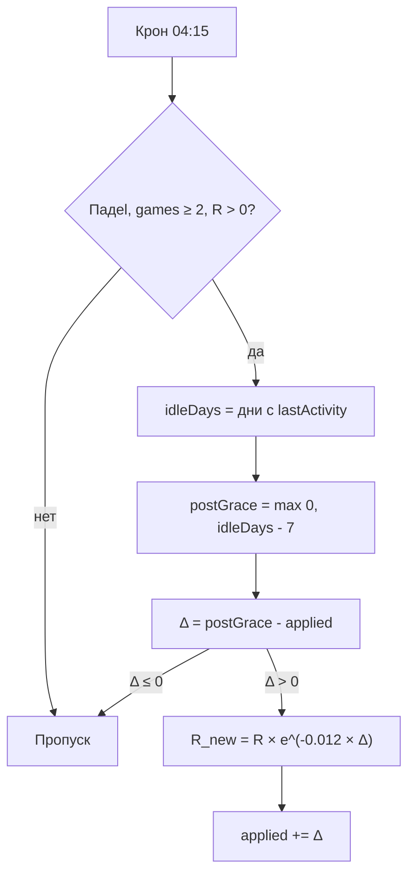

# Снижение надёжности со временем (PadelPulse)

> **Как красиво посмотреть этот файл**
>
> | Способ | Как открыть |
> |--------|-------------|
> | **GitHub** | Залей файл в репозиторий → открой в браузере. Формулы `$$...$$` рендерятся автоматически. |
> | **Obsidian** | File → Open → выбери этот `.md`. Или перетащи файл в окно Obsidian. |
> | **VS Code / Cursor** | Открой файл → `Cmd+Shift+V` (Mac) / `Ctrl+Shift+V` (Win) — preview markdown. *Формулы могут не рендериться — тогда GitHub или Obsidian.* |
> | **Notion** | Import → Markdown → выбери файл. |
> | **Typora** | File → Open → файл откроется с рендером формул. |
> | **Онлайн (без установки)** | [StackEdit](https://stackedit.io/) → ☰ → Import from disk → выбери файл. Или [HackMD](https://hackmd.io/) → Import. |
>
> Файл: `docs/reliability-decay-ru.md`

---

## Коротко

Если игрок **долго не играет в падел**, его **надёжность** (`reliability`, 0–100) **постепенно падает**.

- Проверка: **раз в сутки**, в **04:15**
- Код: `Backend/src/services/reliabilityDecay.service.ts`
- Константы: `Backend/src/config/reliabilityDecay.ts`

---

## Когда срабатывает

Только **падel**, если:

- пользователь активен
- сыграно **≥ 2** игр
- надёжность **> 0**

---

## Константы

| Обозначение | Значение | Смысл |
|-------------|----------|-------|
| $G$ | 7 | льготные дни без штрафа |
| $\lambda$ | 0.012 | скорость падения |
| $D_{\max}$ | 366 | максимум дней за один запуск |
| $N_{\min}$ | 2 | минимум игр для decay |

---

## Что считается «активностью»

Берётся **более поздняя** дата из двух:

1. последний **результат матча** (`GameOutcome.createdAt`)
2. последняя **завершённая игра**, где человек играл (`Game.finishedDate`, статус `PLAYING`, результаты `FINAL`)

Исключаются: BAR, LEAGUE_SEASON.

---

## Формулы

### 1. Дни простоя

$$
\text{idleDays} = \left\lfloor \frac{\text{now} - t_{\text{last}}}{86\,400\,000} \right\rfloor
$$

### 2. Дни после льготного периода

Первые **7 дней** без игры — надёжность **не падает**.

$$
\text{postGrace} = \max(0,\ \text{idleDays} - G)
$$

### 3. Новые дни для списания

`applied` = поле `User.reliabilityDecayPostGraceDaysApplied` (сколько «штрафных» дней уже учтено).

$$
\Delta = \text{postGrace} - \text{applied}
$$

- если $\Delta \le 0$ → ничего не меняем
- иначе: $\Delta \leftarrow \min(\Delta,\ D_{\max})$

### 4. Новая надёжность

$$
R_{\text{new}} = \mathrm{clamp}_{[0,\,100]}\!\left(R \cdot e^{-\lambda \Delta}\right)
$$

### 5. Обновление счётчика

$$
\text{applied}_{\text{new}} = \text{applied} + \Delta
$$

---

## Простыми словами

| | |
|---|---|
| **Не линейно** | Надёжность не минусуется на фиксированное число каждый день — она **умножается** на коэффициент $< 1$. |
| **Льгота** | 7 дней без игры — штрафа нет. |
| **Снова играет** | Дата активности обновляется → простой обнуляется → падение **останавливается**. |
| **Без двойного списания** | `applied` хранит уже учтённые дни — повторно за тот же период не списываем. |
| **Сброс applied** | Только при **padel-тренировке** (training). Обычная игра сбрасывает простой, но не `applied`. |

---

## Пример

**Было:** $R = 80$, не играл **37 дней**, `applied = 0`

$$
\text{postGrace} = 37 - 7 = 30
$$

$$
\Delta = 30
$$

$$
R_{\text{new}} = 80 \cdot e^{-0.012 \cdot 30} \approx 55.8
$$

---

## Период полураспада

После льготных 7 дней надёжность падает **примерно в 2 раза** за:

$$
t_{1/2} = \frac{\ln 2}{\lambda} = \frac{0.693}{0.012} \approx 58 \text{ «штрафных» дней}
$$

Полный простой: **≈ 65 дней** (7 льготных + 58 штрафных).

---

## Таблица: падение с $R = 100$ (после льготы)

| Дней без игры (всего) | Штрафных дней | $R$ после |
|----------------------|---------------|-----------|
| 7 | 0 | 100.0 |
| 14 | 7 | 91.9 |
| 30 | 23 | 75.9 |
| 37 | 30 | 69.8 |
| 65 | 58 | 50.0 |
| 100 | 93 | 32.7 |
| 180 | 173 | 12.5 |

Формула строки: $R = 100 \cdot e^{-0.012 \cdot (\text{idleDays} - 7)}$ при $\text{idleDays} \ge 7$.

---

## Отдельно: рост за матч

За сыгранные матчи надёжность **растёт** (не связано с простоем):

$$
\Delta R_{\text{match}} = \frac{1}{150} \sum_{\text{sets}} \begin{cases} 5 \cdot (s_A + s_B) & \text{balls-in-games} \\ s_A + s_B & \text{иначе} \end{cases}
$$

Код: `Backend/src/services/results/rating.service.ts` → `calculateReliabilityChange`.

---

## Схема

