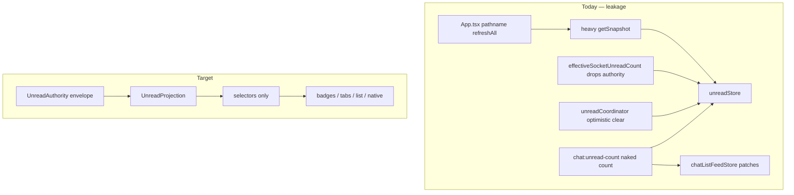

# Unread Count Plan

Canonical execution plan for unread count reliability (codebase audit 2026-07-01). **Single source of truth** — update this file as phases ship; do not add parallel proposal docs.

**Goal:** unread that is **reliable, stable, fast, modern** — frontend optimistic for UX, backend authoritative for correctness.

**One-line strategy:** ordered per-viewer-context authority envelope + single frontend projection with base/display split; slim repair paths; measured performance work after the contract exists.

**Non-negotiable invariant:** unread ordering is per viewer. Any field that orders a context delta must mean `(userId, contextKey)`, not just the thread. Do not use `ChatMessage.serverSyncSeq` as the unread merge guard.

---

## Table of contents

1. [Target behavior](#target-behavior)
2. [Current system](#current-system)
3. [Known leaks](#known-leaks)
4. [Architecture overview](#architecture-overview)
5. [Contract types](#contract-types)
6. [Ordering and merge rules](#ordering-and-merge-rules)
7. [Backend design](#backend-design)
8. [Frontend design](#frontend-design)
9. [API surface](#api-surface)
10. [Implementation phases](#implementation-phases)
11. [Tests](#tests)
12. [Success criteria](#success-criteria)
13. [Key files](#key-files)
14. [Document maintenance](#document-maintenance)

---

## Target behavior

| Moment | User sees | Backend truth |
|--------|-----------|---------------|
| Open unread chat | Badge clears immediately | Mark-read + envelope with `unreadCount: 0` |
| Message arrives elsewhere | Badge appears immediately | Envelope replaces optimistic bump with absolute count |
| Message arrives while thread open | No badge; message visible | Base revision advances; display stays 0; mark-read runs |
| Stale socket after read | Badge stays cleared | Lower `userContextUnreadRevision` ignored |
| Reconnect / revision gap | One slim repair, no flicker | Snapshot at higher `userUnreadRevision` |
| Muted group | Row may show count; tab totals exclude | Same classification rules FE/BE |

Refresh is for **repair**, not navigation. Normal path is socket envelopes + optimistic projection.

---

## Current system

### Definition of unread (backend)

A message is unread for a viewer when it is **not** covered by either:

- a `MessageReadReceipt` row for `(messageId, userId)`, or
- a `ChatReadCursor` row for `(userId, chatContextType, contextId, chatType)` via sync-seq / createdAt / id ordering

Shared SQL: `Backend/src/services/chat/chatReadUnreadSql.ts`.

### What works today (~70%)

- Backend emits **absolute** counts on `chat:unread-count` (not relative +1/-1).
- Frontend sparse `byContext` map (`GAME|USER|GROUP:id`); bugs fold to GROUP channel id.
- `unreadCoordinator`: optimistic clear on enter/activity, rollback, offline resync, dedup.
- Batch USER/GROUP recipient recount after send.
- Read cursors make mark-read ranges cheap.

### What's broken

The socket payload is too weak:

```ts
// today
{ contextType, contextId, unreadCount, lastMessage? }
```

No ordering token, no `clientOpId`, no canonical key. The frontend cannot answer: *"Is this count newer than my optimistic clear?"*

Additionally, unread state is written in **multiple places** (store, list rows, Dexie, viewing guard discards authority). Full snapshot repair runs on **every route change** and can overwrite optimistic state.



---

## Known leaks

| Leak | Symptom | Location |
|------|---------|----------|
| No ordering on payloads | Stale count wins over optimistic clear | `socket.service.ts` → `unreadStore.applySocketDelta` |
| Multiple FE writers | Badge / list / Dexie diverge | `unreadStore`, `useChatInboxSocketEffects`, `chatThreadIndex`, `unreadViewingGuard` |
| Route-change `refreshAll()` | Flicker, reverts optimism, overloads API | `Frontend/src/App.tsx` |
| No optimistic receive | Badge waits for BE recount + socket | Message ingress |
| Viewing guard drops authority | Base state drift after leaving chat | `unreadViewingGuard.ts` → `applySocketDelta` |
| Game unread N+1 | Snapshot P95 slow; 15s timeout | `unreadObjects.service.ts` |
| BUG → GROUP late map | Dropped deltas before meta | `unreadBugSocketDelta.ts` |
| Duplicate `computeTotals` FE/BE | Tab bucket drift | `unreadSnapshot.ts` both tiers |
| Auto-read silent | Overnight stale badges | `unreadAutoReadScheduler.service.ts` |
| `/chat/unread-count` | Full snapshot for one scalar | `UnreadSnapshotService.getTotalsAll` |
| `version: Date.now()` | Not monotonic; blind replace | `unreadSnapshot.service.ts` |
| Double reconnect fetch | Duplicate snapshot requests | `chatSyncService.refreshUnreadAndList` |
| Post-mark-read `refreshContext` | Extra race when envelope already 0 | `unreadCoordinator.ts` |

---

## Architecture overview

### Principles

1. **Backend authoritative** — receipt/cursor SQL is correctness source; counts are absolute.
2. **Frontend optimistic** — clear on enter, bump on receive (when not viewing); backend replaces pending state.
3. **Ordered reconciliation** — two-level clocks; stale packets lose.
4. **One projection owner** — selectors are the only UI read path; adapters for side effects.
5. **Slim repair** — snapshots cheap enough for reconnect/gap, not every navigation.
6. **No third truth early** — materialized counts only after measured P95 failure.

### Two-level clocks (critical)

Unread ordering is **`userId + contextKey`**, not thread-only and **not** `ChatMessage.serverSyncSeq`.

`serverSyncSeq` belongs in **read cursor / watermark metadata**. Unread revision must advance on every unread-changing write:

- message created (for recipients)
- mark-read / mark-all-read
- auto-read
- mute/unmute (totals classification)
- visibility / participant changes
- message delete (if excluded from count)

| Clock | Scope | Used for |
|-------|-------|----------|
| `userUnreadRevision` | per user | full snapshot ordering, whole-user repair |
| `userContextUnreadRevision` | per user + `contextKey` | socket delta ordering |

`userContextUnreadRevision` is not a thread sequence. Two users in the same chat can have different unread counts and different revisions. A mark-read by user A must not advance user B's unread revision unless user B's unread state also changed.

**Why both:** global revision 11 can arrive before USER delta at global 10 but with a **newer** `userContextUnreadRevision` for that USER key. Rejecting all deltas below global 11 would drop a valid unseen delta.

### Backend modules

| Module | Role |
|--------|------|
| `UnreadAuthority` | **Writes only** — bump clocks, compute count, build envelope, emit socket, return HTTP payload |
| `UnreadCountQuery` | **Reads only** — visibility adapter, read-position SQL, batch counts for snapshots |

Controllers must not hand-assemble envelope fields.

### Frontend modules

| Module | Role |
|--------|------|
| `UnreadProjection` | Pure reducer — base state, optimistic ops, displayed state, totals |
| `unreadStore` (adapter) | Zustand wrapper around projection; stable selectors |
| Adapters | Network mark-read, Dexie thread index, native badge, inbox preview |

Mirror: `threadLiveProjection.ts` + `ChatThreadController`.

---

## Contract types

Shared package target: `@bandeja/unread-contract` (types + `computeTotals` + merge helpers).

**Monorepo wiring** (mirror `@bandeja/chat-contract`):

- Package lives at `packages/unread-contract/`.
- Root: `npm run build:unread-contract` (add alongside `build:contract`).
- Backend prebuild and Frontend deps import `@bandeja/unread-contract`.
- Contract tests in `npm run test:unread-contract` for merge rules and `computeTotals` parity.

### Context key

```ts
type ContextKey = `GAME:${string}` | `USER:${string}` | `GROUP:${string}`;
```

Server always emits canonical `contextKey`. Bugs use `GROUP:{channelId}`. Client must not async-resolve BUG ids on hot path.

**GAME contexts:** one `ContextKey` per game (`GAME:{gameId}`), not per `chatType`. The badge count is the **sum** of unread across accessible chat types (PUBLIC / PRIVATE / ADMINS per participant role). Mark-read may pass `gameChatTypes` to scope the write, but envelope revision and `contextKey` stay at game level. Do not introduce per-`chatType` revision keys unless product requirements change.

### Unread authority envelope

Socket event (evolve `chat:unread-count`), mark-read response, and per-recipient message notify:

```ts
type UnreadAuthorityEnvelope = {
  contextKey: ContextKey;
  contextType: 'GAME' | 'USER' | 'GROUP';
  contextId: string;

  unreadCount: number; // absolute for this user + context

  clock: {
    userUnreadRevision: number;
    userContextUnreadRevision: number;
  };

  reason:
    | 'message_created'
    | 'mark_context_read'
    | 'mark_all_read'
    | 'auto_read'
    | 'message_deleted'
    | 'mute_changed'
    | 'snapshot_repair'
    | 'repair';

  clientOpId?: string; // same idempotency role as chat `clientMutationId`; reuse normalize pattern from `@bandeja/chat-contract`

  readWatermark?: {
    chatContextType: 'GAME' | 'USER' | 'GROUP';
    contextId: string;
    chatType?: string;
    readMaxServerSyncSeq: number;
    readMaxCreatedAt: string;
    readMaxMessageId: string;
  };

  lastMessage?: ListPreview; // optional; not required for count correctness
  groupChannelMeta?: Partial<GroupChannelMeta>;
};
```

Phase 1 hot path: `contextKey`, `unreadCount`, `clock`, `reason`, optional `clientOpId`, optional `lastMessage` where already available. Defer `readWatermark` on every socket unless mark-read debugging or repair needs it.

### Unread snapshot

```ts
type UnreadSnapshot = {
  clock: {
    userUnreadRevision: number;
  };
  byContext: Record<ContextKey, number>;
  contextRevisions: Record<ContextKey, number>;
  totals: UnreadTotals;
  mutedGroupIds: string[];
  groupChannelMeta: Record<string, GroupChannelMeta>;
};
```

Rich inbox rows (games, chats, groups with full objects) are **optional** — separate shape or query param, not required for badge repair.

### User invalidation (auto-read at scale)

When affected set is large:

```ts
{ userUnreadRevision: number; reason: 'auto_read' | 'repair' }
```

Client fetches one **slim** snapshot. Small batches may emit individual envelopes.

---

## Ordering and merge rules

### Snapshots

Let `repairFloor = max(local.lastAppliedSnapshotRevision, local.maxSeenUserUnreadRevision)`.

| Condition | Action |
|-----------|--------|
| `snapshot.userUnreadRevision < local.lastAppliedSnapshotRevision` | **Ignore** |
| `snapshot.userUnreadRevision < local.maxSeenUserUnreadRevision` and not an [explicit targeted repair](#explicit-targeted-repair) | **Ignore** (stale full snapshot would overwrite newer delta state) |
| `snapshot.userUnreadRevision >= repairFloor` | Replace base `byContext`, `contextRevisions`, server totals, meta; set `lastAppliedSnapshotRevision = snapshot.userUnreadRevision`; set `maxSeenUserUnreadRevision = max(local, snapshot.userUnreadRevision)`; **reapply optimistic ops**; recompute display |

Never wipe keys in `markInFlight` without revision check.

**Why `repairFloor` uses both counters:** deltas only update one context. A client may have seen a delta at user revision 11 (`maxSeenUserUnreadRevision = 11`) while `lastAppliedSnapshotRevision` is still 10. A repair snapshot at revision 11 must apply to fill missed contexts (`11 >= max(10, 11)`). A stale snapshot at revision 10 must not apply after that delta (`10 < maxSeen`).

#### Explicit targeted repair

Client-initiated slim snapshot whose request was issued **before** a newer delta advanced `maxSeenUserUnreadRevision`. Typical cases: login bootstrap, reconnect, `userInvalidated`, revision-gap repair, drift repair.

Implementation sketch:

- When starting a repair fetch, record `repairRequestedAtMaxSeen = maxSeenUserUnreadRevision` (and optional in-flight token).
- On response: if `snapshot.userUnreadRevision >= repairRequestedAtMaxSeen`, treat as targeted repair and apply even when `snapshot.userUnreadRevision < current maxSeenUserUnreadRevision` **only if** no delta with `userUnreadRevision > snapshot.userUnreadRevision` arrived after the request started.
- If a newer delta arrived after the request started, discard the stale response and optionally re-fetch.

Normal path (no in-flight race): `snapshot.userUnreadRevision >= repairFloor` is sufficient.

### Socket / HTTP envelopes (deltas)

| Condition | Action |
|-----------|--------|
| `envelope.clock.userContextUnreadRevision <= local.contextRevisions[contextKey]` | **Ignore** (stale or duplicate) |
| Higher `userContextUnreadRevision` | Update **base** count for context; set `contextRevisions[key]` |
| Same step | Set `maxSeenUserUnreadRevision = max(local, envelope.clock.userUnreadRevision)` |
| `clientOpId` matches pending optimistic clear | Remove pending clear |
| Context currently open (viewing) | **Display** stays 0; **base** still updates |

**Do not** discard envelope in `applySocketDelta` when viewing — that is today's bug.

Per-context revision gates **whether this delta applies**. Global `userUnreadRevision` on the envelope advances `maxSeenUserUnreadRevision` when accepted, so reconnect and invalidation can detect gaps without waiting for a full snapshot. It does **not** advance `lastAppliedSnapshotRevision`; only snapshots do that.

### Revision gap detection

Client treats a **revision gap** when any of:

- `userInvalidated` received with `userUnreadRevision > local.lastAppliedSnapshotRevision`
- Accepted envelope or snapshot carries `userUnreadRevision` more than `local.maxSeenUserUnreadRevision + 1` (optional heuristic; full snapshot repair is safe)
- Mark-read or offline flush succeeded but no envelope with matching `clientOpId` within timeout
- Drift metric (Phase 6): `|displayedTotal - serverTotal| > 0` after snapshot apply

On gap: fetch **slim** snapshot once (deduped in-flight); reapply optimistic ops; do not navigation-refresh.

### Optimistic mark read

1. Generate `clientOpId`.
2. Optimistic clear → display 0.
3. `POST /chat/mark-context-read` with `clientOpId`.
4. Accept envelope with matching `clientOpId` or higher revision.
5. On failure: restore previous count; schedule repair if revision gap detected.

Skip redundant `refreshContext()` when response includes envelope.

### Optimistic receive (Phase 4)

1. Inbound message while **not** viewing (and not self-sent): optimistic bump → display +1 (or pending model).
2. Envelope with absolute count replaces base; clear matching pending message ids.
3. While **viewing**: no display bump; mark-read on activity; base revision still advances.

### Totals

- **Shared** `computeTotals(byContext, meta)` in contract package.
- Server totals authoritative on accepted snapshot base.
- Frontend totals authoritative for **display** while optimistic ops pending.
- Muted groups: count may show on row; excluded from tab totals (existing behavior).

---

## Backend design

### Data model

```prisma
model UserUnreadState {
  userId         String   @id
  unreadRevision Int      @default(0)
  updatedAt      DateTime @updatedAt
  user           User     @relation(fields: [userId], references: [id], onDelete: Cascade)
}

model UserContextUnreadState {
  userId              String
  contextKey          String
  contextType         ChatContextType
  contextId           String
  unreadRevision      Int      @default(0)
  unreadCountSnapshot Int?     // CACHE ONLY — null until materialization; not authority
  updatedAt           DateTime @updatedAt

  @@id([userId, contextKey])
  @@index([userId, unreadRevision])
  @@index([contextType, contextId])
}
```

Persist revisions in Postgres (multi-instance safe). Do not use in-memory-only counters in production.

Add the inverse relation on `User` in the real Prisma migration. The sketch above is conceptual; the migration must include the required relation fields and indexes in `Backend/prisma/schema.prisma`.

**Lazy revision init (no backfill required):** missing `UserContextUnreadState` rows default to revision `0`. Rows are created on first `recordContextChanged` for that `(userId, contextKey)`. Snapshots include `contextRevisions` only for rows that exist; counts for other contexts still come from receipt/cursor SQL. Optional backfill job only if QA needs every unread context to have a row on day one.

### UnreadAuthority (write path)

Single entry for all unread-changing actions:

```ts
UnreadAuthority.recordContextChanged({
  userId,
  contextKey,
  contextType,
  contextId,
  reason,
  clientOpId,
  performReadWrite,   // optional: mark-read transaction
  countAdapter,       // calls receipt/cursor SQL initially
  preview,
  meta,
}): Promise<UnreadAuthorityEnvelope>;
```

Steps inside transaction where applicable:

1. Perform read-state write (if mark-read).
2. Increment `UserUnreadState.unreadRevision`.
3. Increment `UserContextUnreadState.unreadRevision` for `(userId, contextKey)`.
4. Compute authoritative `unreadCount`.
5. Build envelope with canonical `contextKey` + clocks.
6. Return envelope to caller.
7. Emit socket or queue invalidation after the transaction commits.

Avoid emitting a socket from inside a transaction that may roll back. If an outbox is needed later, `UnreadAuthority` is where it belongs.

**Call sites to migrate:** `message.service.ts` (recipients), `chat.controller.ts` (mark-read), `unreadAutoRead.service.ts`, mark-all-read, mute changes.

### Mark-all-read (logical atomicity)

**User-visible contract:** all-or-nothing — after mark-all completes, every context shows `unreadCount: 0` and one slim snapshot reflects empty `byContext`. The client never observes a half-cleared mark-all.

**Implementation target** (may use one transaction when small):

1. Load current unread contexts for user (or iterate snapshot rows).
2. For each affected `contextKey`: perform mark-read write, bump `UserContextUnreadState.unreadRevision`, compute count (expect 0).
3. Bump `UserUnreadState.unreadRevision` **once** when the whole operation completes.
4. After full completion: emit one envelope per cleared context (or batch invalidation if count > threshold — same rule as auto-read).
5. Return slim `UnreadSnapshot` at the new `userUnreadRevision` with empty `byContext`.

If the operation fails before completion, roll back or compensate so the user-visible state remains unchanged (no partial mark-all visible to client).

**Operational caution:** do not hold an unbounded single database transaction. If production data makes one transaction too large, use **chunked writes** plus **outbox/invalidation**, still with logical atomicity: do not bump user revision or emit envelopes until the entire mark-all finishes.

### UnreadCountQuery (read path)

```
getSnapshot(userId, shape)
getTotals(userId)           // cheap scalar for push/native badge
getContextCount(userId, contextKey)
batchGameCounts(userId, gameIds)
```

Consolidate:

- `chatReadUnreadSql.ts` — one read-position adapter
- `unreadCountBatch.service.ts` — set-based USER/GROUP/GAME batching
- Game chat-type visibility — same rules as mark-read

Replace `getGamesWithUnread` N+1 loop with batched `getGameUnreadCountsByContextAndType` + app-layer filter.

### Auto-read notification

- **Small** affected set: emit envelopes per user-context.
- **Large** batch: bump `userUnreadRevision`, emit `unread:invalidate` per user → client slim snapshot.

Never silent writes.

---

## Frontend design

### Projection state

```ts
type OptimisticUnreadState =
  | { type: 'clear'; previousCount: number; clientOpId: string }
  | { type: 'bump'; pendingCount: number; messageIds: string[] };

type UnreadProjectionState = {
  /** Last full/slim snapshot applied to base state. Snapshot replacement gates on this. */
  lastAppliedSnapshotRevision: number;
  /** Highest user unread revision seen from any envelope/invalidation. Gap detection gates on this. */
  maxSeenUserUnreadRevision: number;
  baseByContext: Record<ContextKey, number>;
  contextRevisions: Record<ContextKey, number>;

  optimistic: Record<ContextKey, OptimisticUnreadState>;

  displayedByContext: Record<ContextKey, number>;
  totals: UnreadTotals;

  groupChannelMeta: Record<string, GroupChannelMeta>;
  mutedGroupIds: Set<string>;
  myGameIds: Set<string>;
  pastGameIds: Set<string>;
};
```

### Events

```ts
type UnreadEvent =
  | { type: 'snapshotReceived'; snapshot: UnreadSnapshot }
  | { type: 'authorityEnvelopeReceived'; envelope: UnreadAuthorityEnvelope }
  | { type: 'enterContext'; contextKey: ContextKey; params: EnterContextParams }
  | { type: 'markReadRequested'; contextKey: ContextKey; clientOpId: string }
  | { type: 'markReadAcked'; envelope: UnreadAuthorityEnvelope }
  | { type: 'markReadFailed'; contextKey: ContextKey }
  | { type: 'inboundMessageSeen'; contextKey: ContextKey; messageId: string; senderId: string }
  | { type: 'userInvalidated'; userUnreadRevision: number; reason: string }
  | { type: 'logout' };
```

### Reducer + effects

```ts
UnreadProjection.reduce(state, event) => { state: UnreadProjectionState; effects: UnreadEffect[] }
```

Effects (after paint): network mark-read, native badge, Dexie sync, inbox preview refresh (when `lastMessage` absent).

### Viewing: base vs display

| State | While viewing open context |
|-------|----------------------------|
| `baseByContext` | Accepts newer envelopes |
| `displayedByContext` | Forced to 0 |
| Mark-read | Still scheduled on enter/activity |

Replace `effectiveSocketUnreadCount` dropping authority in `applySocketDelta`.

### UI read path

**Only** selectors from projection/store:

- `useUnreadBridge` / `unreadStoreSelectors`
- `useChatListItemUnread`

**Stop:** patching `unreadCount` in `useChatInboxSocketEffects`, independent Dexie bumps (thread index follows store subscriber only).

### When to refresh snapshot

| Trigger | Action |
|---------|--------|
| Login / session bootstrap | Slim snapshot |
| Reconnect / foreground | Slim snapshot if invalidation or revision gap |
| Explicit repair / revision gap | Slim snapshot |
| Ordinary navigation | **Nothing** |
| Push reply (native badge) | Cheap totals or slim snapshot — not full objects |

Dedupe: one in-flight snapshot per session (`refreshInFlight` + shared promise for `getUnreadObjects`).

### Offline mark-read (`OfflineIntent`)

Today: `mark_read_batch` in `offlineIntent/mutationAdapter.ts`; flush via `chatMarkReadResync.ts` on failure.

Phase 1–2 requirements:

- Generate `clientOpId` at optimistic clear time; store on offline intent row payload.
- `POST /chat/mark-context-read` includes same `clientOpId` on flush.
- On flush success: apply returned envelope (or match `clientOpId` on later socket).
- On flush failure: `onMarkReadBatchFlushFailure` restores count; schedule slim snapshot if revision unknown.

Do not treat offline flush success as confirmed without envelope or matching `clientOpId` ack.

### `chat:unread-invalidate` handler

```ts
{ userUnreadRevision: number; reason: 'auto_read' | 'repair' | 'mark_all_read' }
```

Client behavior:

1. If `userUnreadRevision <= local.lastAppliedSnapshotRevision`: **ignore** (already repaired).
2. If higher: dispatch `userInvalidated` → single slim snapshot fetch (respect dedupe).
3. Do not patch individual context counts from invalidation alone — snapshot is source for bulk repair.

Individual `chat:unread-count` envelopes remain the normal path for live updates.

---

## API surface

### Endpoints (target)

| Endpoint | Purpose |
|----------|---------|
| `GET /chat/unread-objects?shape=counts` | Default slim `UnreadSnapshot` |
| `GET /chat/unread-objects?shape=objects` | Rich inbox cold start (current payload) |
| `GET /chat/unread-totals` | Cheap `{ total, userUnreadRevision }` for push/badge |
| `POST /chat/mark-context-read` | Body includes `clientOpId`; returns envelope |
| Socket `chat:unread-count` | Payload becomes `UnreadAuthorityEnvelope` |
| Socket `chat:unread-invalidate` | `{ userUnreadRevision, reason }` (new, batch jobs) |

### Legacy endpoints (migration)

Keep during soak as **repair/debug only** (not normal path):

- `/chat/unread-count`
- Per-game / per-user-chat / per-group unread-count(s)

### Legacy endpoint retirement (Phase 6 gate)

Remove per-context and `/chat/unread-count` legacy paths only when **all** are true for ≥ 14 days in production:

- ≥ 99% of mark-read responses include authority envelope with clocks
- Zero P0/P1 unread badge regressions filed
- Drift sample (if enabled): P95 `|clientTotal - serverTotal| === 0` after snapshot
- Mobile store builds in the wild parse new socket shape (or backward-compat shim still acceptable)

Until then: legacy endpoints remain for QA, targeted repair, and old clients.

### Slim snapshot interim (Phase 1 → 5)

| Phase | Repair payload |
|-------|----------------|
| Phase 0–4 | Full `getUnreadObjects` acceptable for reconnect if Phase 0 stopped navigation refresh |
| Phase 1 | Document `?shape=counts`; optional early implementation returning counts + revisions only (no game graph hydration) |
| Phase 5 | Default `?shape=counts`; `?shape=objects` for inbox cold start only |

Phase 0 push badge: interim use batched context counts or minimal totals query — not `getTotalsAll()` full snapshot.

---

## Implementation phases

### Phase 0 — Stop active harm (1–2 days, no schema)

- [x] **App.tsx bootstrap:** split the unread effect — keep `refreshAll()` on auth bootstrap (`isAuthenticated` transition from false → true), **remove `location.pathname` from deps** so ordinary navigation does not refetch.
- [x] **Decouple `invalidateUnreadCache`:** today `Frontend/src/api/chat.ts` clears caches *and* triggers `refreshAll()` on every call. Change it to cache invalidation only; callers that need repair (`refreshUnreadAndList`, reconnect, explicit bootstrap) fetch intentionally.
- [x] **Dedupe reconnect fetch:** after decoupling, ensure `refreshUnreadAndList` / `syncAllContexts` post-wave path does not double-fetch (one in-flight snapshot per session; reuse `refreshInFlight`).
- [x] Remove post-success `refreshContext()` once mark-read returns an envelope. Interim: skip `refreshContext` when local count is already 0 and the mark-read request succeeded (`unreadCoordinator.onMarkReadBatchFlushSuccess`).
- [x] Push badge: stop using `getTotalsAll()` full snapshot (`pushReply.controller.ts`, `syncAppBadgeAfterPushReply`); interim cheap path until Phase 5 endpoint.
- [x] **Auto-read notify (interim, no schema):** after `UnreadAutoReadService.markOldUnreadAsRead`, notify online users — **chosen approach:** recompute affected `(userId, contextKey)` counts and emit existing `emitUnreadCountUpdate` per context (same naked payload as today). Small batches only; large batches defer full `chat:unread-invalidate` + revision clocks to Phase 1. Do **not** use `Date.now()` as a revision stand-in.
- [x] **Phase 0 replay tests only** (full merge rules land in Phase 2): coordinator optimistic clear + current `applySocketDelta` documents today's stale-socket-after-read bug; navigation no longer triggers `refreshAll`; mark-read success does not call redundant `refreshContext`. Do not assert `repairFloor` / `contextRevisions` gates yet.

**Exit:** fewer flickers; no navigation-triggered snapshot storms. No schema-dependent behavior is required for this phase.

**Interim API note:** `?shape=counts` may still return full payload until Phase 1 optional slim path or Phase 5 default — navigation refresh removal is independent.

### Phase 1 — Backend authority + clocks (3–5 days)

- [ ] Migration: `UserUnreadState`, `UserContextUnreadState`.
- [ ] Implement `UnreadAuthority.recordContextChanged`.
- [ ] Wire message create, mark-context-read, mark-all-read.
- [ ] Add `clientOpId` to mark-read request/response.
- [ ] Socket + HTTP return full envelope (canonical `contextKey`, clocks, meta).
- [ ] Document `?shape=counts|objects`; optionally ship slim counts response early (no game graph hydration).
- [ ] FE: add `contextRevisions`, `lastAppliedSnapshotRevision`, `maxSeenUserUnreadRevision` to store; gate merge via shared helpers.
- [ ] Wire `clientOpId` through `OfflineIntent` `mark_read_batch` payload and flush path.
- [ ] Keep socket payload backward-compatible during rollout (`chat:unread-count` may carry both legacy top-level fields and the new envelope fields until all clients are migrated).
- [ ] Implement `chat:unread-invalidate` socket event + client handler (slim snapshot on gap).

**Exit:** every unread-changing write bumps clocks and emits ordered authority.

### Phase 2 — Gated merge in existing store (2–3 days)

- [ ] Implement snapshot + delta merge rules in `unreadStore` (thin wrappers → shared merge module).
- [ ] Reapply optimistic clears after accepted snapshots.
- [ ] Fix viewing: update base on envelope; display via selector layer.
- [ ] Start `@bandeja/unread-contract`: types, `computeTotals`, merge helpers; root `build:unread-contract` script.
- [ ] Update `docs/UI_TEST_PLAN.md`: stale-socket-after-read regression, navigation does not refresh badges.

**Exit:** stale packets cannot win; selectors stable for UI.

### Phase 3 — Single projection (3–5 days)

- [ ] Extract `UnreadProjection` reducer + effects.
- [ ] Move coordinator optimistic state into projection.
- [ ] `unreadStore` becomes adapter.
- [ ] List rows: selectors only; remove feed-store unread patches.
- [ ] Dexie thread index: cache adapter from store subscriber only.
- [ ] Native badge effect from `selectTotalAll(displayed)`.
- [ ] Update `docs/UI_TEST_PLAN.md`: enter-thread immediate clear, muted group totals, tab badge sources.

**Exit:** one module owns unread invariants.

### Phase 4 — Optimistic receive (2–3 days)

- [ ] `inboundMessageSeen` event from socket/sync ingress.
- [ ] Optimistic bump when not viewing.
- [ ] Reconcile with envelopes; message-id matching for pending bumps.
- [ ] Replay tests: delayed socket, mark-read overlap, viewing thread.
- [ ] Update `docs/UI_TEST_PLAN.md`: inbound DM badge latency (optimistic receive), viewing thread no badge.

**Exit:** badges feel instant; backend still corrects.

### Phase 5 — Backend performance (3–5 days, can partially overlap)

- [ ] `UnreadCountQuery` module; batch game counts.
- [ ] Default slim snapshot (`?shape=counts`).
- [ ] `GET /chat/unread-totals`.
- [ ] EXPLAIN-driven indexes on hot unread predicates.
- [ ] Optional: populate `unreadCountSnapshot` only if P95 still above target.

**Exit:** repair path < 500ms P95; push badge O(cheap).

### Phase 6 — Cleanup

- [ ] Delete duplicate FE/BE `computeTotals` (contract only).
- [ ] Remove BUG→GROUP client mapping hot path.
- [ ] Retire legacy endpoints only when [legacy retirement gate](#legacy-endpoint-retirement-phase-6-gate) met.
- [ ] Optional prod drift metric: `|clientTotal - serverTotal|` after snapshot.
- [ ] Check off phase items in [Implementation phases](#implementation-phases); note ship date in [Document maintenance](#document-maintenance).

---

## Tests

### Backend

- Cursor-covered message not counted unread.
- Receipt-covered message not counted unread.
- Cursor and receipt fixtures produce identical counts.
- Game chat-type visibility matches count and mark-read scope.
- Mark-read bumps user + context revisions.
- Message create bumps recipient context revision only (not other users).
- Auto-read bumps revision + invalidation/envelopes.
- Mark-all-read **logical atomicity**: single user revision bump at completion; all contexts cleared in user-visible outcome (implementation may chunk/outbox).
- Envelope always includes canonical `contextKey`.
- Accepted delta updates local `maxSeenUserUnreadRevision` monotonically, but not `lastAppliedSnapshotRevision`.

### Phase 0 (coordinator + store, pre-merge-rules)

- Auth bootstrap calls `refreshAll()` once; pathname change does not.
- `invalidateUnreadCache` clears API caches only; does not trigger `refreshAll`.
- Optimistic clear → stale socket with higher count: documents current bug (badge may flicker back); regression guard until Phase 2 fix lands.
- Mark-read success: no redundant `refreshContext` when count already 0.

### Frontend reducer / replay (Phase 2+)

- Optimistic clear → stale socket non-zero with lower context revision: **display stays 0**.
- Optimistic clear → ack with same `clientOpId`: pending clear removed.
- Mark-read failure: previous count restored.
- Inbound message not viewing: display increments immediately.
- Inbound message viewing: display 0; base revision advances.
- Snapshot older than `lastAppliedSnapshotRevision`: ignored.
- Snapshot below `maxSeenUserUnreadRevision` (stale): ignored unless explicit targeted repair in flight without intervening newer delta.
- Snapshot at revision 11 with `lastAppliedSnapshotRevision = 10` and `maxSeenUserUnreadRevision = 11`: applies full repair (`>= repairFloor`).
- Snapshot at revision 10 with `maxSeenUserUnreadRevision = 11`: ignored (would overwrite newer delta).
- Context delta with lower global revision but higher context revision: **applied**.
- Duplicate delta (`<=` context revision): ignored, no churn.
- Muted group: row count visible; totals exclude.
- BUG envelope with GROUP `contextKey`: no async metadata fetch.
- Offline flush success with matching `clientOpId` clears pending optimistic clear.
- Offline flush failure restores count; gap triggers slim snapshot.
- `userInvalidated` with higher revision triggers one deduped snapshot fetch.
- GAME mark-read with subset `gameChatTypes` still uses `GAME:{gameId}` revision key.

### E2E

- G-11: tab badges without navigation refresh.
- DM on another screen: badge fast, then stable after reconcile.
- DM while thread open: no badge; read state catches up.
- Enter unread thread: immediate clear; delayed stale socket does not restore badge.
- Reconnect after offline mark-read: no flicker to stale count.
- Offline mark-read flush after reconnect: badge stays cleared with envelope ack.

---

## Success criteria

| Dimension | Target |
|-----------|--------|
| **Reliable** | Stale socket never raises badge after user read; offline mark-read recovers |
| **Stable** | No badge flicker on navigation; muted groups correct in totals |
| **Fast** | Slim snapshot P95 < 500ms; badge update < 100ms after message (optimistic) |
| **Modern** | One projection, ordered envelope, authoritative BE, optimistic FE |

---

## Key files

### Backend

| File | Role |
|------|------|
| `chatReadUnreadSql.ts` | Read-position SQL |
| `chatReadCursor.service.ts` | Cursor merge |
| `readReceipt.service.ts` | Mark-read, counts |
| `unreadSnapshot.service.ts` | Snapshot orchestration |
| `unreadObjects.service.ts` | Rich objects (to slim) |
| `unreadCountBatch.service.ts` | Batch counts |
| `message.service.ts` | Post-send recipient notify |
| `socket.service.ts` | Socket emit |
| `unreadAutoRead.service.ts` | Scheduled auto-read |
| `chat.controller.ts` | HTTP handlers |

### Frontend

| File | Role |
|------|------|
| `unreadStore.ts` | Store (→ projection adapter) |
| `unreadCoordinator.ts` | Optimistic mark-read (→ projection) |
| `unreadSnapshot.ts` | Types, computeTotals (→ contract) |
| `unreadStoreSocketBridge.ts` | Socket ingress |
| `unreadViewingGuard.ts` | Viewing (→ display rules) |
| `useChatInboxSocketEffects.ts` | List patches (→ preview only) |
| `unreadThreadIndexSync.ts` | Dexie adapter |
| `useUnreadBridge.ts` | UI selectors |
| `App.tsx` | Bootstrap refresh only |
| `chatSyncService.ts` | Reconnect refresh |

### New (planned)

| Module | Location |
|--------|----------|
| `UnreadAuthority` | `Backend/src/services/chat/unreadAuthority/` |
| `UnreadCountQuery` | `Backend/src/services/chat/unreadCountQuery/` |
| `UnreadProjection` | `Frontend/src/services/chat/unreadProjection/` |
| `@bandeja/unread-contract` | `packages/unread-contract/` |

---

## Document maintenance

| When | Action |
|------|--------|
| Phase ships | Check off boxes in [Implementation phases](#implementation-phases); add one-line note below |
| Behavior change | Update affected sections + `docs/UI_TEST_PLAN.md` |
| API/socket change | Update [Contract types](#contract-types) and [API surface](#api-surface) |
| New decision | Append [Decision log](#decision-log) |

**Ship log** (append as phases complete):

| Phase | Status | Notes |
|-------|--------|-------|
| 0 | shipped | #233–#235: navigation/cache storms, mark-read skip refresh, cheap push badge + auto-read notify |
| 1 | | |
| 2 | | |
| 3 | | |
| 4 | | |
| 5 | | |
| 6 | | |

---

## Decision log

| Decision | Rationale |
|----------|-----------|
| Two-level clocks | Global orders snapshots; per-context orders independent socket streams |
| `userContextUnreadRevision`, not `contextSeq` or `serverSyncSeq` | Per viewer-context; advances on all unread writes |
| Base vs displayed while viewing | Fix authority discard bug in current viewing guard |
| Merge in store before full projection | Lower-risk rollout (answer2 sequencing) |
| Shared `computeTotals`, keep FE computation | Optimistic window needs local totals |
| Materialized count deferred | Receipt/cursor remains truth; measure first |
| `lastMessage` optional on envelope | Count correctness independent of inbox preview |
| Legacy endpoints kept during soak | Repair/QA fallback until boring |
| Auto-read batch invalidation | Avoid socket flood |
| Postgres revision tables | Multi-instance safe (no Redis dependency today) |
| Split snapshot/delta user revisions | Deltas advance `maxSeenUserUnreadRevision`; only snapshots advance `lastAppliedSnapshotRevision`; apply when `snapshot >= max(lastApplied, maxSeen)` so equal-revision repair fills missed contexts without stale snapshots regressing delta state |
| Mark-all logical atomicity | User-visible all-or-nothing; implementation may chunk/outbox; one user revision bump and emit only after full completion |
| GAME one `contextKey` | Badge is aggregated across chat types; same as today |
| Socket emit after commit | Avoid ghost unread events on rollback |
| Legacy retirement gated | 14d + metrics, not arbitrary cleanup |
| `@bandeja/unread-contract` | Same build pattern as chat-contract; parity tests |
| UI test plan updates | Phases 2–4 touch user-visible badges and flows |
| Phase 0 `invalidateUnreadCache` decouple | Stops hidden `refreshAll` on every cache bust; bigger win than deduping reconnect alone |
| Phase 0 auto-read interim | Recompute + existing `emitUnreadCountUpdate`; no revision stand-in until Phase 1 clocks |
| Lazy revision rows | No backfill; first write creates row at revision 0 → 1 |
| `clientOpId` aligns with chat `clientMutationId` | One idempotency vocabulary across chat + unread |
