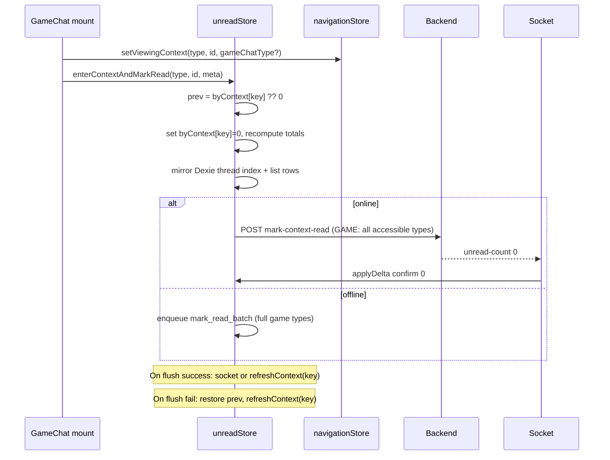
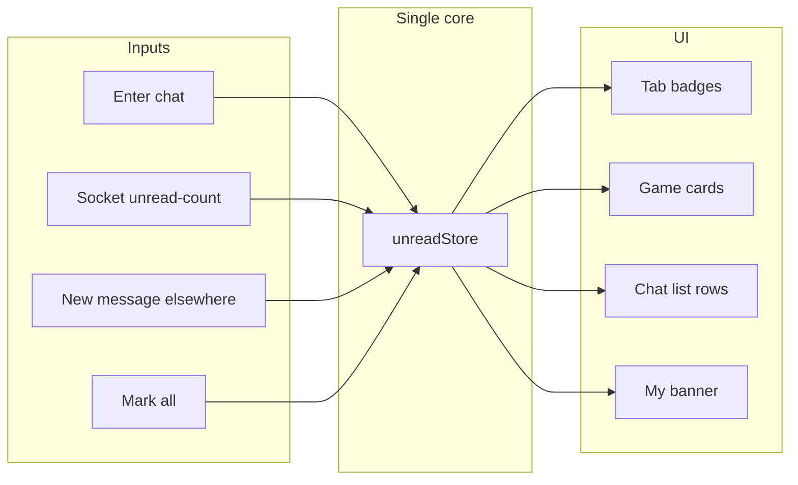
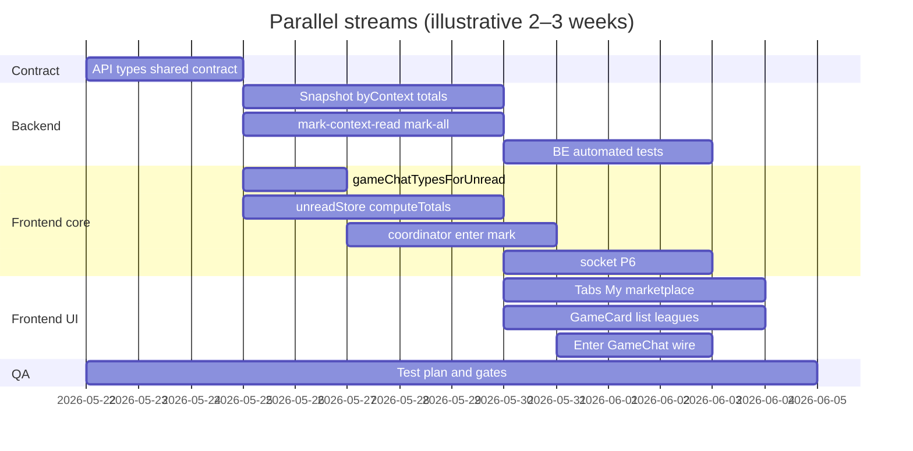

# Unread counts & mark-as-read — single-system plan

One mechanics spec for **unread badges** and **mark-as-read**. Product rule:

> **Entering a chat** (any surface: mobile route, desktop split, game/user/group/channel/bug/market) **always marks the whole context read** — for games, **all chat types the user can access**, not only the tab that loaded first. Unread for that context drops to **0 immediately** in UI and is subtracted from all tab/card totals.

---

## 1. Principles

| # | Rule |
|---|------|
| P1 | **One source of truth** on the client: `unreadStore` snapshot (`byContext` + `totals`). No `headerStore.unreadMessages`, no per-hook `gamesUnreadCounts`, no `playersStore.unreadCounts` for badges. |
| P2 | **One counting rule** on the server: same SQL / filters for snapshot, per-context count, mark-read, and socket payload. |
| P3 | **Enter chat = full context mark-read** (see §4). Switching game **chat type tab** does **not** run a second partial mark-read. |
| P4 | **Optimistic first**: UI shows 0 for that context before network finishes; totals recomputed from store, not manual `header - n`. |
| P5 | **Socket confirms** `chat:unread-count` with `unreadCount: 0` (or resync on failure). No full `unread-objects` refetch per socket event. |
| P6 | **Viewing suppresses bump**: messages received while user is in that context do not increase unread; for GAME, **any** chat type while `viewingGameChatId` is set (§4.8). |

---

## 2. Context model

### 2.1 Context key

```ts
type ContextKey = `${ChatContextType}:${contextId}`;
// GAME:<gameId> | USER:<chatId> | GROUP:<channelId>
// BUG is stored as GROUP channel; bug id maps to groupChannelId for mark/count
```

### 2.2 What “one chat” means per type

| Context | `contextId` | Unread count scope | Mark-read scope on enter |
|---------|-------------|--------------------|---------------------------|
| **GAME** | `gameId` | Sum of unread across **all accessible `ChatType`s** (PUBLIC, PRIVATE, ADMINS per participant + game status) | Mark **all accessible types** in one operation |
| **USER** | `userChatId` | All messages in DM | Entire DM |
| **GROUP** | `groupChannelId` | All messages in channel (bugs, market, social groups) | Entire channel |
| **BUG** | `groupChannelId` (not bug id) | Same as GROUP | Same as GROUP |

Canonical game types for **count + mark-read** are **not** `getAvailableGameChatTypes` (UI tabs). See §2.4.

### 2.3 Invariant after enter

```
byContext[contextKey] === 0
totals.* recomputed from sum(byContext)
```

Until a new message arrives (and P6 does not apply).

### 2.4 Canonical game chat types (`getGameChatTypesForUnreadAndMarkRead`)

**Do not use** `getAvailableGameChatTypes` for mark-read or unread totals. It differs from the backend today:

| ChatType | `getAvailableGameChatTypes` (UI) | `UnreadCountBatchService.buildGameChatTypeFilter` (server) |
|----------|----------------------------------|----------------------------------------------------------|
| PUBLIC | yes | yes |
| PRIVATE | PLAYING, **NON_PLAYING**, admin/parent | **PLAYING** only (+ admin/parent paths via role) |
| ADMINS | admin/parent | admin/parent |

Game gallery photos use `GamePhoto` / `/games/:id/photos` — **not** a `ChatType` and not included in unread totals (see `PLAN_GAME_PHOTOS_SEPARATE_TABLE.md`).

Add one shared helper (frontend + document backend mirror):

```ts
// Frontend: utils/gameChatTypesForUnread.ts (name TBD)
// Backend: already buildGameChatTypeFilter — server should derive types on mark-context-read and ignore client list except validation
function getGameChatTypesForUnreadAndMarkRead(
  game: { status: string },
  participant?: { status: string; role: string } | null,
  parentParticipant?: { role: string } | null,
  isParentGameAdminOrOwner?: boolean
): ChatType[] {
  // Mirror Backend/src/services/chat/unreadCountBatch.service.ts buildGameChatTypeFilter
}
```

`enterContextAndMarkRead` (GAME) and offline `mark_read_batch` **must** pass this list, not `getVisibleGameChatTypes` / tab activity filter.

---

## 3. Backend contract

### 3.1 Canonical snapshot — extend `GET /chat/unread-objects`

Response shape (additive migration):

```ts
type UnreadSnapshotDto = {
  version: number; // monotonic or timestamp
  totals: {
    all: number;
    games: number;
    userChats: number;
    bugs: number;
    groups: number;      // non-channel groups
    channels: number;    // isChannel === true
    marketplace: number;
    myGames: number;     // games user sees on My tab (optional pre-agg)
    pastGames: number;   // optional pre-agg
  };
  byContext: Record<ContextKey, number>; // sparse: only keys with count > 0, or full map for my games
  // keep existing arrays for list warm-up:
  games: Array<{ game; unreadCount }>;
  userChats: Array<{ chat; unreadCount }>;
  bugs: Array<{ bug; unreadCount }>;
  groupChannels: Array<{ groupChannel; unreadCount }>;
  marketItems: Array<{ marketItem; groupChannelId; unreadCount }>;
};
```

Implementation notes:

- Build `byContext` with the **same** batch queries as today (`UnreadCountBatchService`, game filter per participant).
- `totals.*` = sum of relevant `byContext` entries (categories defined once in code).
- Deprecate **`GET /chat/unread-count`** or implement as `totals.all` from same service (no separate query rules).
- Muted GROUP channels: excluded from counts **and** mark-all (already in `getGroupChannelsWithUnread`).

### 3.2 Mark-read on enter — `POST /chat/mark-context-read`

Single endpoint used by client coordinator (can wrap existing handlers):

```ts
// Request
{
  contextType: 'GAME' | 'USER' | 'GROUP';
  contextId: string;
  // GAME only — server may ignore client list and derive accessible types from participant
  gameChatTypes?: ChatType[]; // optional; server validates ⊆ accessible
}

// Response
{
  markedCount: number;
  unreadCount: 0; // always 0 after success
  syncSeq?: number;
}
```

Server behavior:

| Type | Action |
|------|--------|
| GAME | `ReadReceiptService.markAllMessagesAsRead(gameId, userId, accessibleChatTypes)` — **never** a single-type mark on enter |
| USER | `markUserChatAsRead` |
| GROUP | `markAllMessagesAsReadForContext('GROUP', …)` or `markGroupChannelAsRead` |

After commit: **`emitUnreadCountUpdate(contextType, contextId, userId, 0)`** (already done in `markAllMessagesAsReadForContext`).

### 3.3 Mark all — `POST /chat/mark-all-read`

- Marks every context in current snapshot (including **marketItems**).
- Returns **full new snapshot** `{ totals, byContext: {} }` (or version bump).
- Client replaces store in one `setSnapshot`.

### 3.4 Realtime

Keep `chat:unread-count` `{ contextType, contextId, unreadCount, lastMessage? }`.

- After mark-read: `unreadCount: 0`.
- After incoming message (recipient): recompute per context with same `getUnreadCountForContext` rules.

Optional: `chat:unread-snapshot` with `{ version, totals }` after mark-all for cheap global sync.

### 3.5 Per-ID batch endpoints

Keep `POST .../unread-counts` temporarily for migration; **new code must not call them** for badges. List pagination reads `byContext` from store; if key missing, `0` until next `refreshAll()` (see §8.0 list hydration).

### 3.6 `POST /chat/mark-all-read` (server outline)

Single service method, e.g. `UnreadSnapshotService.markAllAndSnapshot(userId)`:

1. Load same context sets as `UnreadObjectsService.getUnreadObjects` (games, userChats, bugs, groupChannels, marketItems) **before** mark.
2. For each game with unread: `markAllMessagesAsRead(gameId, userId, buildGameChatTypeFilter(...))`.
3. For each user chat: `markUserChatAsRead`.
4. For each group channel (bugs, social, market): `markAllMessagesAsReadForContext('GROUP', channelId, userId)` or existing `markGroupChannelAsRead`.
5. Skip muted channels (same rules as unread-objects).
6. Emit `chat:unread-count` with `0` per affected context (or batch).
7. Return `{ version, totals: all zeros, byContext: {}, games: [], ... }` (empty arrays or omit).

Admin bug global unread: use same rules as `ReadReceiptService.getUnreadCount` for bugs.

Wrap existing `POST /chat/mark-all-read` body handler if present; My tab should call only this endpoint.

### 3.7 Socket / BUG normalization

- Persisted messages use `chatContextType` `GAME` | `USER` | `GROUP`; bugs are **GROUP** rows with `bugId`.
- Socket `chat:unread-count` may use `BUG` + bug id — client coordinator maps to `GROUP:<groupChannelId>` via list metadata or bug payload before `applySocketDelta`.
- Count/mark always use `GROUP:channelId` in `byContext`.

---

## 4. Enter-chat flow (core product behavior)

### 4.1 When “enter” fires

Trigger **`enterContextAndMarkRead`** once per context when:

1. `GameChat` mounts with stable `contextType` + `contextId` (embedded desktop or full page).
2. User navigates to a different `chatId` / `chatType` route (new context).
3. **Not** when only **game chat type tab** changes (`PUBLIC` → `PRIVATE`) — same `gameId`, mark-read already done.

Dedupe: store `lastMarkedContextKey` or in-flight promise per key to avoid double mark on strict-mode remount.

### 4.2 Client sequence (always)



### 4.3 GAME: all chat types on enter

```ts
// Pseudocode — unreadCoordinator.ts
async function enterContextAndMarkRead(ctx: EnterContextParams) {
  const key = contextKey(ctx.contextType, ctx.contextId);
  const prev = getUnread(key);

  // 1. Optimistic
  setContextUnread(key, 0);
  recomputeTotals();

  // 2. Persist mark
  if (ctx.contextType === 'GAME') {
    const types = getGameChatTypesForUnreadAndMarkRead(ctx.game, ctx.participant, ctx.parentParticipant, ctx.isParentGameAdminOrOwner);
    await markContextRead({ contextType: 'GAME', contextId: ctx.gameId, gameChatTypes: types });
  } else if (ctx.contextType === 'USER') {
    await markContextRead({ contextType: 'USER', contextId: ctx.chatId });
  } else if (ctx.contextType === 'GROUP') {
    await markContextRead({ contextType: 'GROUP', contextId: ctx.channelId });
  }
}
```

**Remove** `useGameChatActions.handleChatTypeChange` mark-read block (lines that call `markAllMessagesAsRead(id, [normalizedChatType])`). Tab change only loads messages + updates `viewingGameChatChatType`.

### 4.4 USER / GROUP / BUG

- **USER**: one key `USER:chatId`; enter marks entire DM.
- **GROUP** (channel, bug, market): one key `GROUP:channelId`; enter marks entire channel.
- Desktop list “viewing” while messages arrive: **do not** only `markChatAsRead` locally — enter path on `GameChat` mount handles server; socket handler may set 0 in store if already viewing (P6), not replace enter mark.

### 4.5 While inside chat (new messages)

| Situation | Unread behavior |
|-----------|-----------------|
| Message in **open** context, GAME type matches `viewingGameChatChatType` (or any type if we mark all on enter and user is “in game”) | **No increment** (P6). For GAME, treat “in game chat” as whole `gameId` for unread purposes once entered. |
| Message in open USER/GROUP context | No increment |
| Message in **other** context | `byContext[key]++`, totals++ |
| User leaves chat | Clear `viewing*` nav; new messages increment again |

**Clarification for GAME after enter-all-read:** New unread in **any** game chat type while user still on that game screen should either (a) not increment until leave, or (b) increment `byContext[GAME:id]` and show badge on game list — product choice:

- **Recommended:** While `viewingGameChatId === id`, do **not** bump unread for **any** chat type in that game (user is in the game chat UI). Switching to PRIVATE tab still same game → still no bump. Leave game → bump again on new messages.

### 4.6 Subtract from totals

On optimistic clear:

```ts
function setContextUnread(key: ContextKey, next: number) {
  const prev = byContext[key] ?? 0;
  byContext[key] = next;
  // recompute category totals from byContext + metadata maps (game ids, channel ids)
  totals = computeTotals(byContext, categoryIndex);
}
```

No separate `setUnreadMessages`, no `OPTIMISTIC_CLEAR_GAME_UNREAD_EVENT` fan-out — **one store**, subscribers (tabs, cards, list) react via selectors.

### 4.7 Enter guards and ordering

1. **Access gate** — Do not call mark-read if user cannot access context (same checks as today in `useGameChatInitialLoad`: participant, invite, guest, public game rules).
2. **Order** — Set `navigationStore.viewingGameChatId` / `viewingUserChatId` / `viewingGroupChannelId` (and `viewingGameChatChatType` for UI) **before** optimistic `setContextUnread(..., 0)` so P6 applies to messages arriving during load.
3. **Dedupe** — `markInFlight` / `lastEnteredContextKey` per session to avoid double mark on React Strict Mode remount or rapid route replace.
4. **Messages still loading** — Mark-read is independent of message list fetch; server marks all eligible unread rows.

### 4.8 P6 — code sites to update (whole game, not per tab)

Plan rule: while `viewingGameChatId === gameId`, **never** increment `byContext[GAME:gameId]` for any incoming message.

Today the opposite exists in places (bump when `chatType !== viewingGameChatChatType`). Change:

| File | Change |
|------|--------|
| `Frontend/src/services/chat/chatThreadIndex.ts` | `shouldIncrementThreadUnread`: if `viewingGameChatId === contextId` → return false (drop per-tab check) |
| `Frontend/src/store/playersStore.ts` | USER socket +1 unchanged; no GAME path here |
| `Frontend/src/components/chat/useChatListSocketEffects.ts` | GAME/USER unread from socket: if viewing whole context → force `nextCount = 0` |
| `unreadStore.applySocketDelta` | If `contextType === 'GAME'` and `viewingGameChatId === contextId` → ignore bump (or set 0) |
| `Frontend/src/services/chat/chatThreadIndex.ts` `patchThreadIndexFromMessage` | Respect same guard when `applyUnread: true` |

Do **not** reintroduce per-tab mark-read in `useGameChatActions.handleChatTypeChange`.

---

## 5. Client `unreadStore` (Zustand)

```ts
type UnreadState = {
  version: number;
  fetchedAt: number;
  byContext: Record<ContextKey, number>;
  totals: UnreadTotals;
  // optional: categoryIndex for fast recompute
  markInFlight: Set<ContextKey>;
};

// Actions
refreshAll(): Promise<void>;           // GET unread-objects (snapshot)
setSnapshot(dto: UnreadSnapshotDto): void;
applySocketDelta(d: { contextType; contextId; unreadCount }): void;
enterContextAndMarkRead(params: EnterContextParams): Promise<void>;
markAllRead(): Promise<void>;
restoreContext(key: ContextKey, count: number): void; // failure rollback
```

### 5.1 Selectors (only way UI reads counts)

| Selector | Used by |
|----------|---------|
| `selectTotalAll()` | My “mark all” banner visibility |
| `selectBottomTabChatsBadge()` | Bottom tab Chats |
| `selectBottomTabMyGamesBadge()` | Bottom tab My |
| `selectBottomTabMarketplaceBadge()` | Bottom tab Market |
| `selectChatsSubtabBadge(filter)` | `ChatsTabController` |
| `selectContextUnread(type, id)` | `GameCard`, `ChatListItem`, carousel |
| `selectMyGamesUnread()` | My games subtab |
| `selectPastGamesUnread(gameIds)` | Past subtab — sum `byContext[GAME:id]` for ids in list |
| `selectMarketBuyerUnread()` / `selectMarketSellerUnread()` | `ChatListView` market role tabs |
| `selectUnreadByUserId(userId)` | `PlayersCarousel` — resolve `userId → USER:chatId` via `playersStore.userIdToChatId` or index in store |
| `selectContextUnreadForListItem(item)` | `ChatListItem` / cards — map item type → context key |

`totals.myGames` / `totals.pastGames`: prefer **client** sum over known game id sets from My tab hooks unless server pre-aggregates in snapshot.

### 5.5 `computeTotals` and GROUP classification

On every `byContext` change:

```ts
function computeTotals(
  byContext: Record<ContextKey, number>,
  meta: {
    groupChannelMeta: Record<string, { isChannel?: boolean; marketItemId?: string | null; bugId?: string | null }>;
    mutedGroupIds: Set<string>;
  }
): UnreadTotals
```

Rules:

- **games** — sum `GAME:*` (optionally filter to non-archived participant games for My-tab subtotals).
- **userChats** — sum `USER:*`.
- **bugs** — sum `GROUP:*` where `meta[id].bugId` set (and not archived).
- **channels** — sum `GROUP:*` where `isChannel === true` and no `marketItemId`.
- **marketplace** — sum `GROUP:*` where `marketItemId` set.
- **groups** — remaining `GROUP:*` (social groups).
- **all** — sum of categories used for bottom “Chats” tab (define once; exclude muted from totals).

Hydrate `groupChannelMeta` from unread-objects arrays on `setSnapshot`; patch on list fetch for unknown ids.

**Market buyer/seller sub-badges:** sum marketplace channel ids where `buyerId === me` vs `sellerId === me` (same as today `marketBuyerSellerUnread` logic, but from `byContext`).

### 5.6 Logout and cache

- On logout: `unreadStore.reset()` (empty snapshot).
- `chatApi.invalidateUnreadCache()` → calls `unreadStore.refreshAll()` (remove parallel caches in `useChatUnreadCounts` module).
- Foreground: debounce `refreshAll` (e.g. 2–5s) to respect `unreadObjectsLimiter` on backend.

### 5.2 Socket wiring (replace current refetch storm)

In `socketEventsStore` handler for `chat:unread-count`:

```ts
unreadStore.getState().applySocketDelta(data);
// NO debounced getUnreadObjects()
```

Batch list queue can still patch **preview** text; unread number comes from store selector in row component.

### 5.3 Offline queue

`mark_read_batch` payload for GAME must always include **full `accessibleChatTypes`**, same as online enter.

On flush **success** for `mark_read_batch`:

- `applySocketDelta({ ..., unreadCount: 0 })` if socket missed, else no-op.
- Do **not** leave optimistic 0 without confirmation: call `refreshContext(key)` once.

On flush **failure**:

- `restoreContext(key, prevCount)` from coordinator memory or `GET` single-context count.
- `refreshAll()` if unsure.

### 5.4 Dexie / chat list

`patchThreadIndexSetUnreadCount` called **from unreadStore** when `byContext` changes (subscriber), not from scattered events.

---

## 6. Mark-all-read (My tab)

1. `POST /chat/mark-all-read` → empty snapshot.
2. `unreadStore.setSnapshot(response)`.
3. Refresh game lists (data only, not unread maps).
4. Remove `setUnreadMessages(0)` + `getUnreadCount()` mismatch.

Includes marketplace channels today missing in `MyTab.handleMarkAllAsRead`.

---

## 7. What to delete / stop doing

| Remove | Reason |
|--------|--------|
| `headerStore.unreadMessages` manual subtract | Derive from `totals.all` or `totals.myGames` |
| `applyOptimisticMarkContextRead` / `applyOptimisticMarkGameRead` as public API | Replaced by `enterContextAndMarkRead` |
| `OPTIMISTIC_CLEAR_GAME_UNREAD_EVENT` / `RESTORE_*` window events | Store subscription |
| `useGroupChannelUnreadCounts` local state | Selectors from store |
| `useChatUnreadCounts` internal fetch + `playersStore` sum for users tab | `refreshAll` + selectors |
| `playersStore.unreadCounts` for badges | Keep only chat list metadata if needed; counts from store |
| Per-page `getGroupChannelsUnreadCounts` in list fetch | Store |
| `useGameChatActions` mark on tab change | Enter marks all types once |
| `useChatUnreadCounts` refetch on every `lastChatUnreadCount` | `applySocketDelta` only |
| Desktop-only `markChatAsRead` without server on message | P6 + enter handles |
| `getAvailableGameChatTypes` for mark/count | Use §2.4 `getGameChatTypesForUnreadAndMarkRead` |

**Add**

| File | Purpose |
|------|---------|
| `Frontend/src/utils/gameChatTypesForUnread.ts` | §2.4 canonical types |
| `Frontend/src/store/unreadStore.ts` | §5 |
| `Frontend/src/services/chat/unreadCoordinator.ts` | `enterContextAndMarkRead`, BUG normalize |
| `Backend/src/services/chat/unreadSnapshot.service.ts` (TBD) | Snapshot + mark-all |

---

## 8. Implementation phases

### 8.0 Migration bridge (dual-write)

Until Phase 4 completes:

| Consumer | Bridge |
|----------|--------|
| Tab badges | Prefer store; if `fetchedAt === 0`, fall back to `useChatUnreadCounts` once |
| `GameCard` | `selectContextUnread('GAME', id)` ?? prop from `getMyGamesWithUnread` for first paint |
| Chat list rows | Selector ?? `ChatItem.unreadCount` from fetch; on chats tab focus call `refreshAll()` |
| `playersStore.unreadCounts` | Keep for `userIdToChatId`; stop using for badge sums |
| List pagination | **Hydration policy:** on Chats tab mount / focus → `refreshAll()`; optional merge page batch into `byContext` temporarily |

After Phase 5: remove bridges and batch unread fetches from list loaders.

### Phase 1 — Backend alignment

1. Add `byContext` + `totals` to unread-objects response (§3.1, §5.5 classification).
2. Add `POST /chat/mark-context-read` (GAME = server-derived `buildGameChatTypeFilter`, §2.4).
3. Align `getUnreadCount` with `totals.all` or deprecate.
4. Implement `POST /chat/mark-all-read` (§3.6, include market + muted rules).
5. Ensure every mark path emits `chat:unread-count` with 0.
6. Add automated test script (e.g. extend `Backend/scripts/tests/`) for: game multi-type unread → mark-context-read → count 0.

### Phase 2 — `unreadStore` + coordinator

1. Create `unreadStore.ts` + `unreadCoordinator.ts` (`enterContextAndMarkRead`, `computeTotals`).
2. Wire socket `applySocketDelta`.
3. `refreshAll` on auth + foreground.

### Phase 3 — Enter chat

**Blocked until:** §2.4 game types helper exists; §4.8 P6 guards agreed.

1. `useGameChatInitialLoad`: call `enterContextAndMarkRead` once; remove duplicate mark logic.
2. Remove mark-read from `useGameChatActions.handleChatTypeChange`.
3. Apply §4.7 ordering (viewing* before optimistic clear).
4. Implement §4.8 P6 in listed files + `applySocketDelta`.

### Phase 4 — UI consumers

1. `BottomTabBar`, `ChatsTabController`, `MyGamesTabController`, `GameCard`, chat list rows.
2. `MyTab` mark-all + banner from `selectTotalAll`; call §3.6 endpoint only.
3. `YourLeaguesHomeLeagueGameRow`, `MarketplaceList`, `MarketItemCard`, market buyer/seller badges.
4. `PlayersCarousel` → `selectUnreadByUserId`.
5. Remove hook-local unread state from `useMyGames` / `useHomeGames` / `usePastGames` (§8.0 bridge until store warm).

### Phase 5 — Cleanup

1. Delete dead events and optimistic helpers.
2. Remove redundant API calls from list pagination.
3. QA matrix (below).

---

## 9. QA matrix

| Scenario | Expected |
|----------|----------|
| Open game on PUBLIC tab with unread in PRIVATE | Enter → game badge 0 immediately; both types marked on server |
| Switch PUBLIC → ADMINS | No second mark API; stays 0 |
| New message in PRIVATE while still in game UI | No badge on game card until leave game |
| Open USER DM | DM row 0, users tab badge −N |
| Open market GROUP | Marketplace + chats badges update |
| Offline open game | Optimistic 0; queue full types; on reconnect flush → confirmed 0 |
| Mark all on My tab | All tabs 0 including market |
| Mark-read API fails | Badge restores to server count |
| Muted channel | Never in totals; enter still marks if opened |
| Open game on PUBLIC tab with unread in PRIVATE | Enter marks all §2.4 types; badge 0 |
| NON_PLAYING participant PRIVATE | Count/mark match server (PLAYING-only PRIVATE) |
| Socket `BUG` unread event | Maps to `GROUP:channelId`; totals correct |
| Chats tab focus after cold start | `refreshAll`; list rows match tab badge |
| Logout / login as other user | Store cleared; no stale badges |
| League home game row | Same `selectContextUnread('GAME', id)` |
| Mark-all with only market unread | Marketplace tab 0 |

---

## 10. Current system (problems summary)

Multiple pipelines today: `useChatUnreadCounts` + `playersStore` + `headerStore` + per-hook maps + list batch APIs. Mark-read uses different scopes (single game chat type on tab change vs all types on initial load). See git history of this file for detailed “before” notes.

**Key files today**

| Area | Path |
|------|------|
| Enter mark (to replace) | `Frontend/src/pages/GameChat/useGameChatInitialLoad.ts` |
| Wrong partial mark | `Frontend/src/pages/GameChat/useGameChatActions.ts` |
| Optimistic (to replace) | `Frontend/src/services/chat/applyOptimisticMarkContextRead.ts` |
| Tab badges | `Frontend/src/hooks/useChatUnreadCounts.ts` |
| Backend counts | `Backend/src/services/chat/unreadCountBatch.service.ts` |
| Backend mark | `Backend/src/services/chat/readReceipt.service.ts` |
| Unread objects | `Backend/src/services/chat/unreadObjects.service.ts` |

---

## 11. Diagram — target data flow



**Enter chat** is the only user action that triggers mark-read for a context; it always clears **`byContext[key]`** and recomputes **`totals`**, with server marking **all game chat types** when `contextType === 'GAME'`.

---

## 12. Implementation readiness checklist

| Item | Status in doc |
|------|----------------|
| Single client store + coordinator | §5 |
| Enter = full context, game = all types (§2.4) | §2.4, §4.3 |
| Game type alignment FE/BE | §2.4 (implement helper) |
| P6 whole-game viewing | §4.5, §4.8 |
| `computeTotals` + GROUP/market/bugs split | §5.5 |
| BUG socket normalization | §3.7 |
| Mark-all backend algorithm | §3.6 |
| Migration bridge + logout | §8.0, §5.6 |
| Extended selectors + QA | §5.1, §9 |

**Start order:** Phase 1 → Phase 2 (+ §2.4 helper on FE) → Phase 3 (requires §4.8) → Phase 4 with §8.0 bridge → Phase 5.

**Parallel execution (team, PRs, gates):** §13.

**Out of scope (unless product asks):** iOS Watch, Telegram notification badges, per-message mark-read UI (only context-level enter + mark-all).

---

## 13. Parallel delivery plan (project lead)

How to implement this spec with parallel workstreams. Source: technical spec §1–§12 above.

### 13.1 Team shape

| Role | Count | Owns |
|------|-------|------|
| Architect / tech lead | 1 | Contracts, PR merge order, §2.4 / §5.5 sign-off |
| Backend dev (senior) | 1 | Snapshot service, mark-context-read, mark-all, BE tests |
| Frontend dev (senior) | 1 | `unreadStore`, coordinator, socket, enter-chat |
| Frontend dev (mid) | 1 | UI migration (tabs, cards, list, My tab) |
| QA | 1 | §9 matrix, automation checklist, chat/offline regression |
| Backend dev (mid, optional) | 0–1 | Test script + mark-all SQL perf |

### 13.2 Timeline overview



**Suggested calendar**

| Week | Backend | FE senior | FE mid | QA |
|------|---------|-----------|--------|-----|
| 1 | A1, A2, A3 | B0, B1, B3, B4 | D1, D2 (§8.0 bridge) | Cases + contract tests |
| 2 | A4, A5, fixes | B2, C1–C3 | D3–D6 | Gate 1–2 |
| 3 | Support | Phase 5 cleanup, B5 | Remove bridges | Gate 3, sign-off |

Add ~1 week if game unread SQL optimization or new E2E is required.

### 13.3 Week 0 — Kickoff (1–2 days, align all)

**Architect + senior BE + senior FE**

1. Freeze API contract (additive): `UnreadSnapshotDto` (§3.1), `POST /chat/mark-context-read` (§3.2), `POST /chat/mark-all-read` (§3.6).
2. Publish shared types (`packages/shared/unread.ts`, OpenAPI, or FE copy from BE — pick one).
3. Sign off §2.4: `getGameChatTypesForUnreadAndMarkRead` mirrors `buildGameChatTypeFilter`.
4. Sign off §5.5 GROUP → bugs / channels / marketplace / groups rules.
5. PR strategy: long-lived `feat/unread-single-system`; optional `UNREAD_STORE_V1` flag only if Gate 1 fails.

**QA (parallel):** Spreadsheet from §9; seed users/games with multi-tab unread.

**Deliverable:** Contract note or PR 0; no feature code required.

### 13.4 Stream A — Backend (parallel after contract)

| PR | Content | Depends on |
|----|---------|------------|
| **A1** | `UnreadSnapshotBuilder`: extend `getUnreadObjects` → `byContext`, `totals`, `version` | Contract |
| **A2** | `POST /chat/mark-context-read` — GAME uses server `buildGameChatTypeFilter`; emit `chat:unread-count` 0 | A1 |
| **A3** | `POST /chat/mark-all-read` — §3.6 including market; return empty snapshot | A1 |
| **A4** | `GET /chat/unread-count` → `totals.all` from same builder or deprecate | A1 |
| **A5** | `Backend/scripts/tests/unread-snapshot-mark-read.ts` — multi-type game → mark → 0 | A2, A3 |

**Architect gates:** A1 totals = sum of `byContext`; A3 market + muted; A2 never single-type game on this route.

**No FE dependency** until A1 on shared branch.

### 13.5 Stream B — Frontend core (parallel to A)

| PR | Content | Depends on |
|----|---------|------------|
| **B0** | `utils/gameChatTypesForUnread.ts` (§2.4) + unit tests | Contract |
| **B1** | `unreadStore.ts`: `setSnapshot`, `computeTotals`, `applySocketDelta`, BUG→GROUP (§3.7), logout reset | Contract; mock DTO |
| **B2** | `unreadCoordinator.ts`: `enterContextAndMarkRead`, dedupe, offline hooks (§4.7, §5.3) | B0, B1 |
| **B3** | Socket → `applySocketDelta` only; gut `useChatUnreadCounts` refetch-on-socket | B1 |
| **B4** | P6 §4.8: `chatThreadIndex`, list socket effects, store guard | B1 |
| **B5** | Dexie subscriber from store (§5.4) | B1 |

**API client (mid FE or senior):** `getUnreadSnapshot`, `markContextRead`, `markAllRead`; `invalidateUnreadCache` → `refreshAll`.

**Integration PR** after A1 + B1 land on staging.

### 13.6 Stream C — Enter chat (after B2 + B4)

| PR | Content |
|----|---------|
| **C1** | `useGameChatInitialLoad` → single `enterContextAndMarkRead`; §4.7 ordering |
| **C2** | Remove mark-read from `useGameChatActions.handleChatTypeChange` |
| **C3** | Offline `mark_read_batch`: full §2.4 types; flush confirm / restore |
| **C4** | Remove public `applyOptimisticMarkContextRead` usage |

**Gate 1 (QA):** §9 rows — game enter, tab switch, offline.

### 13.7 Stream D — UI migration (mid FE, after B1; §8.0 bridge)

| PR | Surfaces |
|----|----------|
| **D1** | `BottomTabBar`, `ChatsTabController` |
| **D2** | `MyTab` mark-all + banner; `MyGamesTabController` |
| **D3** | `GameCard`, `useMyGames` / `useHomeGames` / `usePastGames` |
| **D4** | Chat list cards; Chats tab focus → `refreshAll` |
| **D5** | `MarketplaceList`, `MarketItemCard`, market buyer/seller badges |
| **D6** | `YourLeaguesHome*`, `PlayersCarousel` |

Do not delete `useGroupChannelUnreadCounts` / per-page batch until D4 + hydration verified.

### 13.8 Stream E — QA (whole sprint)

| When | Activity |
|------|----------|
| Week 0 | §9 → spreadsheet; environments; seed data |
| During A | Contract / API tests |
| After A5 | BE script green in CI |
| After C1 | **Gate 1** — enter-chat manual |
| After D1–D2 | **Gate 2** — tabs vs list |
| After Phase 5 | **Gate 3** — full §9 + regression |
| Final | Sign-off; remove §8.0 bridges |

### 13.9 Dependency graph

```text
Contract (W0)
    ├── A1 ──► A2, A3, A4, A5
    ├── B0 ──► B2, C1
    └── B1 ──► B2, B3, B4, B5, D*

A1 merged ──► FE integration (real refreshAll)
B2 + B4 ──► C1
C1 ──► Gate 1
D* + C ──► Gate 2
Phase 5 ──► Gate 3
```

**Max parallelism:** BE A2 ‖ A3 after A1; FE B1 ‖ B4; FE mid D1 ‖ D2 ‖ D3; QA continuous.

### 13.10 PR merge order (architect)

`B0` → `B1` → `A1` → (`A2` ‖ `A3`) → `B2`, `B3`, `B4` → `C1` → `D*` → Phase 5 cleanup.

Branch: `feat/unread-single-system`. Target PR size &lt; ~400 LOC where possible.

### 13.11 RACI

| Decision | Architect | BE | FE senior | FE mid | QA |
|----------|-----------|-----|-----------|--------|-----|
| §2.4 parity | A | C | R | I | I |
| Snapshot shape | A | R | C | I | I |
| P6 whole-game | A | I | R | C | V |
| UI bridge removal | C | I | A | R | V |
| Ship | A | R | R | R | V (sign-off) |

R = responsible, A = accountable, C = consulted, V = verifies.

### 13.12 Risks

| Risk | Mitigation |
|------|------------|
| A1 slow (per-game counts) | Ship sparse `byContext` first; SQL optimization in A1.1 |
| FE/BE drift | Shared types PR 0; weekly sync |
| Tab 0, list row N | §8.0 `refreshAll` on Chats focus until D4 |
| Tab-change partial mark regression | C2 + QA PRIVATE rows |
| Big-bang merge | §8.0 bridge max ~1 week; flag only if Gate 1 fails |

### 13.13 Epic definition of done

- [ ] All §9 QA rows pass on staging
- [x] No badges from `headerStore.unreadMessages`, `useChatUnreadCounts` refetch storm, or hook-local `gamesUnreadCounts` — removed; cold path uses `refreshAll` + prop fallbacks only
- [x] Enter game marks all §2.4 types; tab switch does not call mark API — **static Gate 1 (2026-05-21):** `useGameChatInitialLoad` → `enterContextAndMarkRead`; `handleChatTypeChange` has no mark APIs
- [x] `POST /chat/mark-all-read` clears market and returns snapshot — **BE script (2026-05-21):** `markAllAndSnapshot` in `unread-snapshot-mark-read.ts`
- [x] BE test script in CI (`unread-snapshot-mark-read` or equivalent) — green in `run-all.ts` [33/34]
- [x] §12 checklist implemented (manual §9 staging sign-off remains)

### 13.14 First actions

1. **Architect:** Epic + contract PR; 30m §2.4 review with seniors.
2. **BE:** Spike A1 — `byContext` from `UnreadObjectsService`.
3. **FE senior:** B0 + B1 with fixture JSON.
4. **FE mid:** Map grep consumers to D* PRs (§10 table).
5. **QA:** §9 spreadsheet.

### 13.15 Orchestration status (project lead)

**Started:** 2026-05-21 · Branch: `feat/unread-single-system` (work in workspace)

| Stream | PR / task | Owner | Status |
|--------|-----------|-------|--------|
| W0 | Contract / §2.4 sign-off | Architect | ✅ done (FE helper + BE `resolveGameChatTypeFilterForUser`) |
| A1 | Snapshot `byContext` + `totals` | BE senior | ✅ done |
| A2 | `POST /chat/mark-context-read` | BE senior | ✅ done |
| A3 | `POST /chat/mark-all-read` | BE senior | ✅ done |
| A4 | Deprecate / align `GET unread-count` | BE senior | ✅ done |
| A5 | `unread-snapshot-mark-read.ts` test | QA + BE | ✅ done (in `run-all.ts`) |
| B0 | `gameChatTypesForUnread.ts` | FE senior | ✅ done |
| B1 | `unreadStore.ts` | FE senior | ✅ done |
| B2 | `unreadCoordinator.ts` | FE senior | ✅ done |
| C1–C4 | Enter chat wire | FE senior | ✅ done (C4 partial: legacy helpers remain) |
| D1–D6 | UI wiring | FE mid | ✅ done |
| B5 | Dexie subscriber | FE senior | ✅ done |
| B3 | Socket → `applySocketDelta` | FE senior | ✅ done (prep) |
| B4 | P6 §4.8 guards | FE senior | ✅ done |
| D prep | Consumer map + `useUnreadBridge` §8.0 | FE mid | ✅ done |
| Phase 5 | Cleanup §7 dead code | FE senior | ✅ done |
| Hardening | BE filter parity, no `useChatUnreadCounts`, market meta | Lead | ✅ done |
| E | QA §9 + run-all tests | QA | 🔄 automated green; manual §9 staging ⏳ |

**Global phases**

| Phase | Status |
|-------|--------|
| Phase 1 — Backend alignment | ✅ done |
| Phase 2 — unreadStore + coordinator | ✅ done |
| Phase 3 — Enter chat | ✅ done |
| Phase 4 — UI consumers | ✅ done (§8.0 bridge retained) |
| Phase 5 — Cleanup | ✅ done (§8.0 cold bridge retained) |

**Gates (2026-05-21 QA run)**

| Gate | Automated / static | Manual §9 | Status |
|------|-------------------|-------------|--------|
| **Gate 1** — enter-chat, tab switch, offline | ✅ `unread-snapshot-mark-read.ts`; ✅ C1/C2 grep (`enterContextAndMarkRead` in initial load; no mark in `handleChatTypeChange`); ✅ `gameChatTypesForUnread.test.ts` (4/4) | ⏳ staging rows: enter PUBLIC + PRIVATE unread, tab switch, offline queue | **partial** |
| **Gate 2** — tabs vs list | ✅ `BottomTabBar` → `useBottomTabUnreadBadges` / `useUnreadBridge` (not `headerStore.unreadMessages`) | ⏳ Chats focus `refreshAll`, list row = tab badge | **partial** |
| **Gate 3** — full §9 + regression | ✅ `npm run test:automated` all suites (incl. unread [33/34]); ✅ Frontend `npm run lint` | ⏳ full §9 matrix on staging | **partial** |

**E stream — 2026-05-21**

| Step | Result |
|------|--------|
| `unread-snapshot-mark-read.ts` | ✅ pass |
| `test:automated` / `run-all` unread suite | ✅ pass ([33/34] `ok: unread-snapshot-mark-read`) |
| Frontend `gameChatTypesForUnread.test.ts` | ✅ 4/4 |
| Frontend lint | ✅ pass |
| Static code gates (C1/C2, BottomTabBar) | ✅ pass |
| §9 manual spreadsheet | ⏳ not run this session |

**Gates:** Gate 1 **partial** · Gate 2 **partial** · Gate 3 **partial** · Epic DoD (§13.13) **partial** (3/6 checkboxes; see §13.13)
